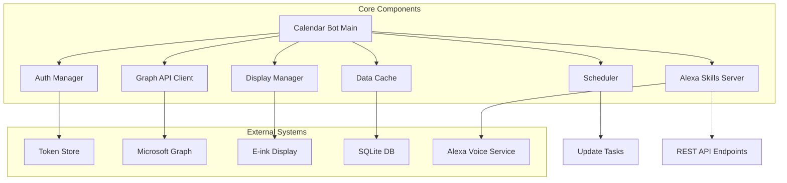
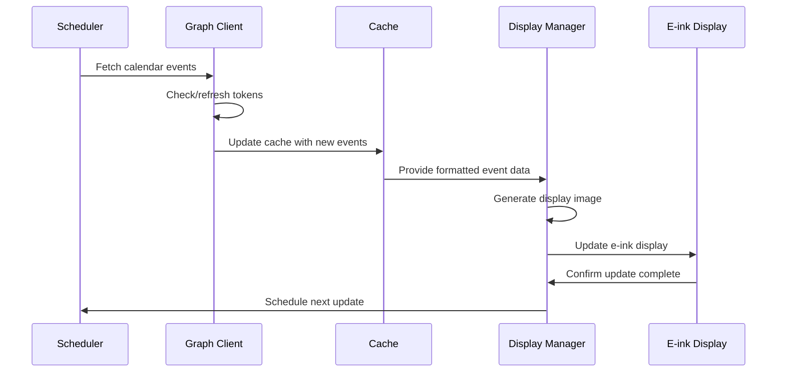
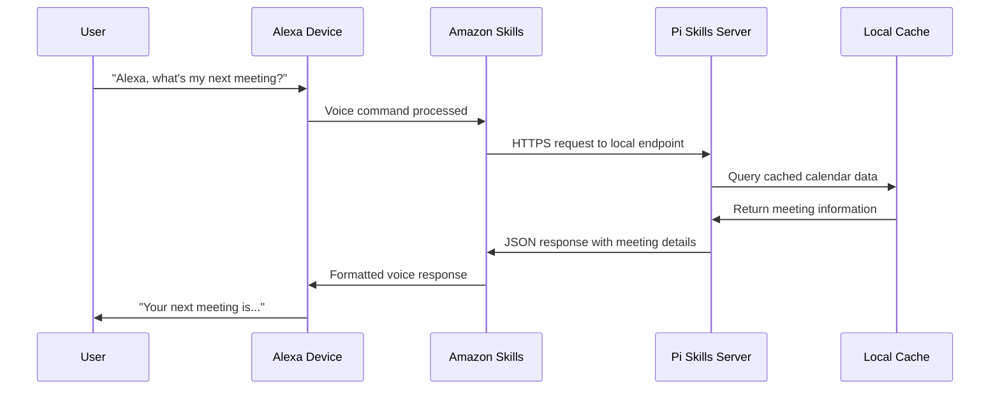

# Microsoft 365 Calendar Display - System Architecture

## Executive Summary

This document outlines the complete system architecture for a portable Microsoft 365 calendar display application running on Raspberry Pi with an e-ink display. The system is designed for ultra-low power consumption, persistent Microsoft Graph connectivity, and essential meeting information display.

## 1. Technology Stack Selection

### Core Platform
- **Hardware**: Raspberry Pi Zero 2 W (optimal for portability and power efficiency)
- **OS**: Raspberry Pi OS Lite (headless, minimal footprint)
- **Programming Language**: Python 3.11+
- **Display**: 4.2" Waveshare e-Paper HAT (400x300 resolution, optimal for desk accessory)

### Key Libraries & Frameworks
- **Microsoft Graph**: `msal` (Microsoft Authentication Library)
- **HTTP Client**: `aiohttp` (async support for efficient API calls)
- **E-ink Driver**: `waveshare-epaper` or custom SPI interface
- **Image Processing**: `Pillow` (PIL) for display rendering
- **Configuration**: `pydantic` for settings management
- **Scheduling**: `asyncio` + `apscheduler` for refresh cycles
- **Logging**: Built-in `logging` with file rotation
- **Alexa Integration**: `flask` + `ask-sdk-core` for Alexa Skills Kit
- **HTTP Server**: `flask` for REST API endpoints

### Why Python?
- Excellent Microsoft Graph SDK support
- Rich ecosystem for Raspberry Pi hardware interaction
- PIL library perfect for e-ink display image generation
- Mature async libraries for efficient background operations
- Lower memory footprint compared to Node.js alternatives

## 2. Display Hardware Strategy

### Dynamic Display Support
The system will automatically detect and adapt to different e-ink display sizes:

**Supported Display Sizes:**
- **2.9"** (296x128) - Minimal layout, essential info only
- **4.2"** (400x300) - Compact layout, current + next 2-3 meetings
- **7.5"** (800x480) - Full layout, detailed daily schedule
- **9.7"** (1200x825) - Extended layout, multi-day view

**Auto-Detection Strategy:**
- SPI device identification at startup
- Display size stored in device configuration
- Layout templates selected based on detected resolution
- Fallback to manual configuration if auto-detection fails

### Primary Recommendation: Waveshare 4.2" e-Paper HAT
- **Resolution**: 400x300 pixels
- **Size**: Compact (103.5 × 78.5mm display area)
- **Power**: Ultra-low consumption (only during refresh)
- **Interface**: SPI connection to Pi GPIO
- **Refresh**: 2-second full refresh capability
- **Colors**: Black/White (sufficient for calendar text)

## 3. Microsoft Graph API Integration Strategy

### Authentication Flow
```
Initial Setup (One-time)
├── Device Code Flow (OAuth 2.0)
├── User approves via web browser
├── Store refresh token securely
└── Generate access tokens automatically

Runtime Operation
├── Check token expiration
├── Refresh access token if needed
├── Make Graph API calls
└── Handle rate limiting gracefully
```

### API Endpoints Used
- **Primary**: `/me/calendar/calendarView` (events for date range)
- **Fallback**: `/me/events` (with date filters)
- **User Info**: `/me` (for display personalization)

### Data Fetching Strategy
- **Interval**: Every 5 minutes (configurable)
- **Scope**: Current day + next 2 days lookahead
- **Filtering**: Only show events marked as "Busy" or "Tentative"
- **Caching**: Local SQLite cache for offline resilience

## 4. Authentication & Token Management

### Security Architecture
```
Token Storage (Encrypted)
├── ~/.config/calendarbot/
│   ├── tokens.enc (AES-256 encrypted)
│   ├── device_key.bin (unique device key)
│   └── config.yaml (non-sensitive settings)
```

### Token Lifecycle Management
1. **Initial Registration**: Device code flow with manual approval
2. **Token Refresh**: Automatic refresh 5 minutes before expiration
3. **Token Storage**: AES-256 encryption using device-unique key
4. **Error Handling**: Graceful degradation to cached data
5. **Re-authentication**: Automatic retry with exponential backoff

### Security Best Practices
- Tokens encrypted at rest using hardware-based device ID
- No tokens stored in plain text anywhere
- Secure token transmission (HTTPS only)
- Limited scope permissions (Calendar.Read only)
- Regular token rotation following Microsoft recommendations

## 5. Application Architecture

### Component Architecture



### Core Components

#### 1. Authentication Manager (`auth/`)
- Token encryption/decryption
- OAuth 2.0 device flow handling
- Automatic token refresh
- Error recovery and re-authentication

#### 2. Graph API Client (`api/`)
- Async HTTP client for Microsoft Graph
- Rate limiting and retry logic
- Response parsing and validation
- Error handling and fallback strategies

#### 3. Display Manager (`display/`)
- E-ink display driver interface
- Image generation and layout
- Partial vs full refresh optimization
- Power management integration

#### 4. Data Cache (`cache/`)
- SQLite-based local storage
- Calendar event caching
- Offline data availability
- Cache invalidation strategies

#### 5. Scheduler (`scheduler/`)
- Configurable refresh intervals (5-minute default)
- Intelligent update timing
- Battery-aware scheduling
- Error recovery scheduling

#### 6. Alexa Skills Server (`alexa/`)
- Flask-based HTTP server for Alexa Skills Kit
- REST API endpoints for calendar queries
- Voice command processing
- Privacy-focused local data access

### Data Flow Architecture



## 6. UI/Display Considerations

### Display Layout Design (4.2" - 400x300 Example)

```
┌─────────────────────────────┐
│ Mon, Jan 15    🔋 ●●●○     │ Header (20px)
├─────────────────────────────┤
│                             │
│ ▶ CURRENT EVENT            │ Current (30px)
│   Team Standup             │
│   10:00 - 10:30            │
│                             │
│ NEXT UP                    │ Next Events (25px each)
│ • Project Review           │
│   11:00 - 12:00           │
│                             │
│ • Lunch Meeting           │
│   12:30 - 13:30           │
│                             │
│ LATER TODAY               │ Later (20px each)
│ • Code Review             │
│ • 1:1 with Manager        │
│                             │
├─────────────────────────────┤
│ Updated: 10:05 | 📶 Alexa  │ Footer (15px)
└─────────────────────────────┘
```

### Responsive Layout Strategy
- **2.9" (296x128)**: Current meeting + next 1 event only
- **4.2" (400x300)**: Current + next 2-3 events + later today summary
- **7.5" (800x480)**: Full daily schedule + tomorrow preview
- **9.7" (1200x825)**: Multi-day view + detailed event descriptions

### Typography & Spacing
- **Header Font**: 16px Bold (Date + Battery)
- **Current Event**: 14px Bold (Title), 12px Regular (Time)
- **Next Events**: 12px Bold (Title), 10px Regular (Time)
- **Later Events**: 10px Regular (Title only)
- **Footer**: 8px Regular (Update timestamp)

### Visual Elements
- **Battery Indicator**: 4 dots showing Pi power status
- **Current Event Arrow**: "▶" to highlight active meeting
- **Bullet Points**: "•" for upcoming events
- **Truncation**: "..." for text overflow (varies by display size)
- **Last Refresh Time**: "Updated: HH:MM" timestamp display
- **Alexa Status**: "📶 Alexa" indicator when Skills server is active

### Power Optimization
- **Full Refresh**: Only when layout changes significantly
- **Partial Refresh**: For time updates and small text changes
- **Sleep Mode**: Display off during configured quiet hours
- **Smart Updates**: Skip refresh if no changes detected

## 7. Raspberry Pi Specific Optimizations

### Hardware Configuration
```yaml
# Recommended Pi Zero 2 W Settings
gpu_mem: 16          # Minimal GPU memory
dtparam: spi=on      # Enable SPI for e-ink
disable_camera_led: 1 # Power saving
dtoverlay: disable-bt # Disable Bluetooth if not needed
```

### Power Management
- **CPU Governor**: `powersave` mode when idle
- **WiFi Power Save**: Enabled with wake-on-demand
- **GPIO Power Down**: Unused pins set to low power state
- **USB Power**: Minimal USB current allocation

### Memory Optimization
- **Swap**: Disabled to reduce SD card wear
- **Memory Split**: 16MB GPU memory allocation
- **Process Priority**: Lower priority for non-critical tasks
- **Garbage Collection**: Tuned for lower memory pressure

### Storage Considerations
- **SQLite WAL Mode**: Reduce SD card writes
- **Log Rotation**: Automatic cleanup of old logs
- **Temp Files**: Use RAM-based /tmp for temporary files
- **OS Updates**: Minimal package installation

## 8. Project Structure & File Organization

```
calendarbot/
├── README.md
├── requirements.txt
├── setup.py
├── config/
│   ├── __init__.py
│   ├── settings.py          # Pydantic settings models
│   └── config.yaml.example  # Example configuration
├── calendarbot/
│   ├── __init__.py
│   ├── main.py             # Application entry point
│   ├── auth/
│   │   ├── __init__.py
│   │   ├── manager.py      # Authentication management
│   │   ├── token_store.py  # Encrypted token storage
│   │   └── device_flow.py  # OAuth device code flow
│   ├── api/
│   │   ├── __init__.py
│   │   ├── graph_client.py # Microsoft Graph API client
│   │   ├── models.py       # Data models for API responses
│   │   └── exceptions.py   # API-specific exceptions
│   ├── display/
│   │   ├── __init__.py
│   │   ├── manager.py      # Display management
│   │   ├── renderer.py     # Image generation
│   │   ├── layouts.py      # Display layout definitions
│   │   └── drivers/        # E-ink driver implementations
│   │       ├── __init__.py
│   │       ├── waveshare.py
│   │       ├── detection.py # Auto-detection logic
│   │       └── base.py
│   ├── cache/
│   │   ├── __init__.py
│   │   ├── manager.py      # Cache management
│   │   ├── models.py       # Database models
│   │   └── database.py     # SQLite operations
│   ├── scheduler/
│   │   ├── __init__.py
│   │   ├── manager.py      # Task scheduling
│   │   └── tasks.py        # Scheduled task definitions
│   ├── alexa/
│   │   ├── __init__.py
│   │   ├── skills_server.py # Flask server for Alexa Skills
│   │   ├── handlers.py     # Intent handlers
│   │   ├── responses.py    # Voice response formatting
│   │   └── models.py       # Alexa request/response models
│   └── utils/
│       ├── __init__.py
│       ├── logging.py      # Logging configuration
│       ├── power.py        # Power management utilities
│       └── helpers.py      # General utilities
├── tests/
│   ├── __init__.py
│   ├── test_auth.py
│   ├── test_api.py
│   ├── test_display.py
│   └── fixtures/
├── scripts/
│   ├── setup.sh            # Initial setup script
│   ├── install.sh          # Installation script
│   └── systemd/
│       └── calendarbot.service
├── docs/
│   ├── SETUP.md           # Setup instructions
│   ├── CONFIGURATION.md   # Configuration guide
│   └── TROUBLESHOOTING.md # Common issues
└── assets/
    ├── fonts/             # Custom fonts for display
    └── icons/             # Status icons
```

## 9. Error Handling & Network Resilience

### Network Connectivity Strategy
- **Offline Mode**: Display cached events when network unavailable
- **Retry Logic**: Exponential backoff for failed API calls
- **Connection Monitoring**: Automatic reconnection attempts
- **Graceful Degradation**: Show last known state with timestamp

### Error Recovery Mechanisms
1. **API Rate Limits**: Respect 429 responses with proper backoff
2. **Token Expiry**: Automatic refresh with fallback to re-auth
3. **Display Errors**: Show error messages on e-ink display
4. **Hardware Failures**: GPIO error handling and recovery
5. **Storage Issues**: Database corruption recovery procedures

## 10. Security & Privacy Considerations

### Data Protection
- **Local Storage Only**: No cloud storage of calendar data
- **Encrypted Tokens**: AES-256 encryption for all stored credentials
- **Minimal Permissions**: Calendar.Read scope only
- **Data Retention**: Automatic cleanup of old cached events

### Network Security
- **HTTPS Only**: All API communications use TLS
- **Certificate Validation**: Strict certificate checking
- **No External Dependencies**: Minimal attack surface
- **Regular Updates**: Automated security patch management

## 11. Performance Requirements

### Response Time Targets
- **Display Update**: < 3 seconds for full refresh
- **API Response**: < 5 seconds for calendar fetch
- **Boot Time**: < 30 seconds from power on
- **Recovery Time**: < 10 seconds from network restoration

### Resource Utilization
- **RAM Usage**: < 100MB total system memory
- **CPU Usage**: < 10% average, < 50% peak
- **Storage**: < 100MB for application and cache
- **Network**: < 1MB per hour average bandwidth

## 12. Alexa Integration Architecture

### Privacy-First Alexa Integration
The system provides Alexa voice access to calendar data without exposing Microsoft 365 credentials to Amazon's cloud services. All calendar data remains local to the Raspberry Pi.

### Integration Strategy



### Alexa Skills Kit Implementation
- **Custom Skill**: Private skill linked to user's Pi device
- **Local Endpoint**: HTTPS server running on Pi (port 443)
- **SSL Certificate**: Self-signed or Let's Encrypt for HTTPS requirement
- **Authentication**: Device-specific secret key for skill verification

### Supported Voice Commands
- **"What's my next meeting?"** - Returns next scheduled event
- **"What meetings do I have today?"** - Lists all today's events
- **"When is my [meeting name]?"** - Searches for specific meeting
- **"Do I have any meetings at [time]?"** - Checks time availability
- **"What's my schedule for tomorrow?"** - Shows next day's events

### Security & Privacy Features
- **Local Processing**: All voice responses generated locally
- **No Cloud Storage**: Calendar data never leaves the Pi
- **Encrypted Communication**: HTTPS for all Alexa ↔ Pi communication
- **Access Control**: Device-specific authentication tokens
- **Audit Logging**: Voice request logging with privacy controls

### Network Configuration Requirements
- **Port Forwarding**: Router configured for HTTPS (443) access to Pi
- **Dynamic DNS**: Static hostname for Alexa Skills endpoint
- **SSL Certificate**: Valid certificate for HTTPS requirement
- **Firewall Rules**: Secure access limited to Amazon's IP ranges

## 13. Deployment & Maintenance

### Installation Process
1. **Base OS Setup**: Raspberry Pi OS Lite installation
2. **Hardware Configuration**: SPI enable, GPIO setup
3. **Application Install**: Automated script deployment
4. **Initial Setup**: OAuth authentication flow
5. **Service Registration**: systemd service configuration

### Monitoring & Maintenance
- **Health Checks**: Regular system status monitoring
- **Log Management**: Automated log rotation and cleanup
- **Update Mechanism**: Over-the-air application updates
- **Backup Strategy**: Configuration and token backup

### Operational Requirements
- **Power**: 5V 2A USB-C power supply
- **Network**: 2.4GHz WiFi connectivity
- **Environment**: Indoor use, 0-40°C operating temperature
- **Maintenance**: Monthly restart recommended

---

*This architecture document provides the foundation for implementing a robust, efficient Microsoft 365 calendar display system optimized for Raspberry Pi and e-ink display technology.*