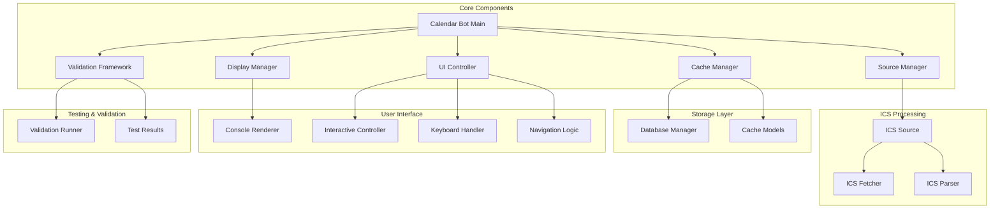
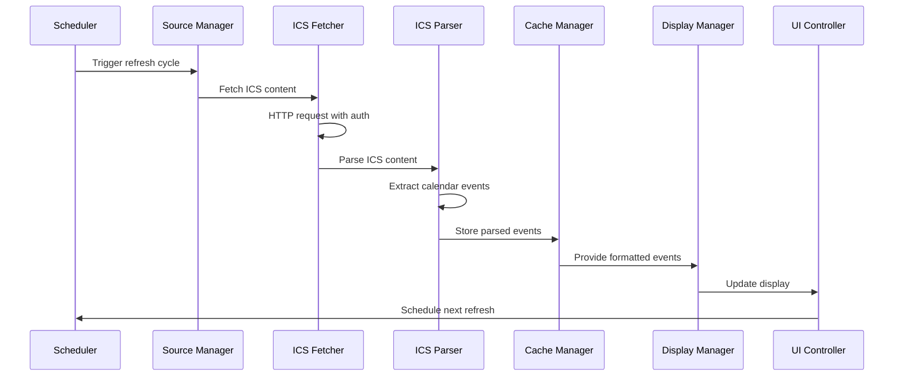

# ICS Calendar Display - System Architecture

**Document Version:** 2.0
**Last Updated:** January 5, 2025
**Architecture Version:** ICS-based Universal Calendar System v2.0
**Previous Architecture:** Microsoft Graph API v1.0 (deprecated)

## Executive Summary

This document outlines the complete system architecture for an ICS-based calendar display application running on Raspberry Pi with an e-ink display. The system is designed for universal calendar compatibility, minimal resource consumption, persistent ICS feed connectivity, and essential meeting information display.

> **Architecture Migration Note**: This system has been completely redesigned from the previous Microsoft Graph API implementation to use standardized ICS calendar feeds, providing universal compatibility and simplified deployment.

## 1. Technology Stack Selection

### Core Platform
- **Hardware**: Raspberry Pi Zero 2 W (optimal for portability and power efficiency)
- **OS**: Raspberry Pi OS Lite (headless, minimal footprint)
- **Programming Language**: Python 3.8+
- **Display**: Console output (with e-ink display support planned)

### Key Libraries & Frameworks
- **ICS Processing**: `icalendar` (RFC 5545 compliant parsing)
- **HTTP Client**: `httpx` (async support for efficient ICS fetching)
- **Data Validation**: `pydantic` (settings and data model validation)
- **Database**: `aiosqlite` (async SQLite for caching)
- **Configuration**: `PyYAML` + `pydantic-settings` for settings management
- **Scheduling**: `asyncio` for concurrent operations and scheduling
- **Logging**: Built-in `logging` with file rotation
- **Date/Time**: `python-dateutil` + `pytz` for timezone handling

### Why ICS Instead of APIs?
- **Universal Compatibility**: Works with any calendar service that exports ICS
- **No API Quotas**: Unlimited access to your own calendar data
- **Privacy**: Direct calendar access without third-party API intermediaries
- **Simplicity**: No complex authentication flows or API registrations
- **Reliability**: ICS is a stable, standardized format (RFC 5545)
- **Performance**: Lower overhead than REST API calls

## 2. ICS Feed Strategy

### Supported ICS Sources
The system supports ICS feeds from any calendar service:

**Major Calendar Services:**
- **Microsoft Outlook/Office 365** - Published calendar ICS URLs
- **Google Calendar** - Secret iCal format URLs
- **Apple iCloud Calendar** - Public calendar ICS URLs
- **CalDAV Servers** - Nextcloud, Radicale, SOGo, etc.
- **Exchange Servers** - Direct ICS export URLs
- **Any RFC 5545 compliant** calendar system

### Authentication Methods
```yaml
# No Authentication (Public Feeds)
ics:
  auth_type: "none"

# HTTP Basic Authentication
ics:
  auth_type: "basic"
  username: "user"
  password: "password"

# Bearer Token Authentication
ics:
  auth_type: "bearer"
  token: "your-bearer-token"
```

### Data Fetching Strategy
- **Polling Interval**: Every 5 minutes (configurable)
- **HTTP Caching**: ETags and Last-Modified headers supported
- **Conditional Requests**: If-None-Match and If-Modified-Since
- **Retry Logic**: Exponential backoff for failed requests
- **Offline Resilience**: SQLite cache for network outages

## 3. Application Architecture

### High-Level Component Architecture

```
┌─────────────────┐    ┌──────────────────┐    ┌─────────────────┐
│ Source Manager  │    │   ICS Fetcher    │    │ Cache Manager   │
│                 │    │                  │    │                 │
│ • Multi-source  │───▶│ • HTTP Client    │───▶│ • SQLite WAL    │
│ • Health Check  │    │ • Auth Support   │    │ • TTL Caching   │
│ • Auto Config   │    │ • Retry Logic    │    │ • Offline Mode  │
└─────────────────┘    └──────────────────┘    └─────────────────┘
         │                        │                        │
         │                        │                        │
         └────────────────────────┼────────────────────────┘
                                  │
                         ┌─────────────────┐
                         │ Display Manager │
                         │                 │
                         │ • Console Out   │
                         │ • Status Info   │
                         │ • Interactive   │
                         └─────────────────┘
```

### Detailed Component Architecture



### Core Components

#### 1. Source Manager (`sources/`)
- **Multi-source coordination**: Manages multiple ICS feeds
- **Health monitoring**: Validates feed accessibility and content
- **Configuration management**: Handles source-specific settings
- **Error recovery**: Automatic retry and fallback strategies

#### 2. ICS Processing (`ics/`)
- **HTTP Fetcher**: Async HTTP client with authentication support
- **Content Parser**: RFC 5545 compliant ICS parsing
- **Event Models**: Structured representation of calendar events
- **Exception Handling**: ICS-specific error types and recovery

#### 3. Cache Manager (`cache/`)
- **SQLite Storage**: WAL mode for performance and durability
- **TTL Management**: Configurable cache expiration
- **Offline Support**: Serve cached data when feeds unavailable
- **Data Models**: Structured cache entry representation

#### 4. Display Manager (`display/`)
- **Console Renderer**: Clean, formatted console output
- **Status Information**: Connection status and update timestamps
- **Error Display**: User-friendly error messages
- **Extensible Design**: Ready for e-ink display integration

#### 5. UI Controller (`ui/`)
- **Interactive Mode**: Keyboard-driven calendar navigation
- **Navigation Logic**: Date browsing and event filtering
- **Input Handling**: Cross-platform keyboard input support
- **Real-time Updates**: Background data fetching during interaction

#### 6. Validation Framework (`validation/`)
- **Test Runner**: Comprehensive system validation
- **Component Testing**: Individual module verification
- **Result Reporting**: Detailed test results and diagnostics
- **Logging Integration**: Enhanced logging for troubleshooting

### Data Flow Architecture



## 4. ICS Processing Pipeline

### HTTP Fetching Layer

```python
# ICS Fetcher Architecture
class ICSFetcher:
    """Async HTTP client for ICS content retrieval."""
    
    async def fetch(self, source: ICSSource) -> ICSResponse:
        """Fetch ICS content with authentication and caching."""
        # HTTP authentication (Basic, Bearer, None)
        # Conditional requests (ETags, Last-Modified)
        # Connection pooling and timeouts
        # Retry logic with exponential backoff
```

### Content Parsing Layer

```python
# ICS Parser Architecture
class ICSParser:
    """RFC 5545 compliant ICS content parser."""
    
    async def parse(self, ics_content: str) -> ICSParseResult:
        """Parse ICS content into structured events."""
        # Validate ICS format
        # Extract calendar metadata
        # Parse VEVENT components
        # Handle timezones and recurrence
        # Filter busy/tentative events
```

### Event Processing Flow

1. **Content Validation**: Verify ICS format compliance
2. **Metadata Extraction**: Calendar name, version, timezone
3. **Event Parsing**: VEVENT components to structured data
4. **Timezone Handling**: Convert to local timezone
5. **Recurrence Expansion**: Handle RRULE patterns
6. **Event Filtering**: Show only busy/tentative events
7. **Data Normalization**: Consistent event representation

## 5. Caching & Storage Architecture

### SQLite Database Design

```sql
-- Cache Events Table
CREATE TABLE cached_events (
    id TEXT PRIMARY KEY,
    source_name TEXT NOT NULL,
    subject TEXT NOT NULL,
    start_datetime TIMESTAMP NOT NULL,
    end_datetime TIMESTAMP NOT NULL,
    location TEXT,
    is_all_day BOOLEAN DEFAULT FALSE,
    show_as TEXT DEFAULT 'busy',
    created_at TIMESTAMP DEFAULT CURRENT_TIMESTAMP,
    expires_at TIMESTAMP NOT NULL
);

-- Cache Metadata Table
CREATE TABLE cache_metadata (
    key TEXT PRIMARY KEY,
    value TEXT NOT NULL,
    updated_at TIMESTAMP DEFAULT CURRENT_TIMESTAMP
);
```

### Caching Strategy

**Write-Ahead Logging (WAL) Mode**:
- Reduces SD card wear
- Improves concurrent access
- Better crash recovery
- Optimal for Raspberry Pi storage

**TTL Management**:
- Configurable cache expiration (default: 1 hour)
- Automatic cleanup of expired events
- Background maintenance tasks
- Smart refresh based on cache age

**Offline Functionality**:
- Serve cached events when network unavailable
- Graceful degradation indicators
- Preserve last successful update timestamp
- Continue operation with stale but valid data

## 6. User Interface Architecture

### Execution Modes

#### 1. Daemon Mode (Default)
```bash
python main.py
```
- Continuous background operation
- Automatic refresh every 5 minutes
- Console output with status updates
- Signal handling for graceful shutdown

#### 2. Interactive Mode
```bash
python main.py --interactive
```
- Keyboard-driven navigation
- Real-time date browsing
- Background data updates
- Cross-platform input handling

#### 3. Test Mode
```bash
python main.py --test-mode
```
- Comprehensive system validation
- ICS feed connectivity testing
- Configuration verification
- Detailed diagnostic output

### Interactive Navigation Features

**Keyboard Controls**:
- **Arrow Keys**: Navigate between dates
- **Space**: Jump to today
- **ESC**: Exit interactive mode
- **Enter**: Refresh current view

**Real-time Updates**:
- Background data fetching continues
- Display updates without interruption
- Seamless transition between cached and live data
- Status indicators for connection state

### Display Layout Design

```
============================================================
📅 ICS CALENDAR - Monday, January 15
============================================================
Updated: 10:05 | 🌐 Live Data

▶ CURRENT EVENT

  Team Standup
  10:00 - 10:30
  📍 Conference Room A
  ⏱️  25 minutes remaining

📋 NEXT UP

• Project Review
  11:00 - 12:00 | 📍 Online

• Lunch Meeting
  12:30 - 13:30 | 📍 Restaurant

⏰ LATER TODAY

• Code Review
  14:00 - 15:00
• 1:1 with Manager
  15:30 - 16:00

============================================================
```

## 7. Configuration Management

### Hierarchical Configuration

1. **Default Values**: Built into application code
2. **YAML Configuration**: `config/config.yaml`
3. **Environment Variables**: `CALENDARBOT_*` prefix
4. **Command Line Arguments**: Override specific settings

### Configuration Schema

```yaml
# ICS Calendar Configuration
ics:
  url: "https://calendar.example.com/calendar.ics"
  auth_type: "none"  # none, basic, bearer
  username: "user"   # for basic auth
  password: "pass"   # for basic auth
  token: "token"     # for bearer auth
  verify_ssl: true
  user_agent: "CalendarBot/1.0"

# Application Settings
app_name: "CalendarBot"
refresh_interval: 300  # seconds
cache_ttl: 3600       # seconds

# Display Settings
display_enabled: true
display_type: "console"

# Network Settings
request_timeout: 30
max_retries: 3
retry_backoff_factor: 1.5

# Logging
log_level: "INFO"
log_file: null
```

### Settings Validation

```python
# Pydantic Settings Model
class CalendarBotSettings(BaseSettings):
    """Type-safe configuration with validation."""
    
    # ICS configuration with validation
    ics_url: Optional[str] = Field(None, description="ICS calendar URL")
    ics_auth_type: Optional[str] = Field(None, regex="^(none|basic|bearer)$")
    
    # Automatic environment variable mapping
    class Config:
        env_prefix = "CALENDARBOT_"
        env_file = ".env"
```

## 8. Error Handling & Resilience

### Network Resilience Strategy

**Connection Failures**:
- Exponential backoff retry logic
- Circuit breaker pattern for persistent failures
- Fallback to cached data during outages
- Clear status indicators for offline mode

**HTTP Error Handling**:
- 4xx errors: Configuration or authentication issues
- 5xx errors: Server-side problems, retry with backoff
- Timeout handling: Configurable timeouts with graceful degradation
- Rate limiting: Respect server limits and back off appropriately

### Data Validation & Recovery

**ICS Content Validation**:
- RFC 5545 compliance checking
- Malformed content error recovery
- Partial parsing with warnings
- Detailed error reporting for debugging

**Cache Corruption Recovery**:
- Database integrity checks
- Automatic cache rebuilding
- Backup and restore procedures
- Graceful handling of SQLite errors

### Application-Level Error Recovery

```python
# Error Recovery Framework
class ErrorRecovery:
    """Comprehensive error handling and recovery."""
    
    async def handle_network_error(self, error: NetworkError):
        """Handle network-related failures."""
        # Log error details
        # Switch to offline mode
        # Schedule retry with backoff
        # Update user status display
    
    async def handle_parse_error(self, error: ICSParseError):
        """Handle ICS parsing failures."""
        # Log parse error details
        # Attempt partial recovery
        # Use cached data if available
        # Notify user of data issues
```

## 9. Performance Optimization

### Resource Utilization Targets

**Memory Usage**:
- Application: < 50MB resident memory
- Cache database: < 10MB for typical use
- Total system impact: < 100MB

**CPU Usage**:
- Idle: < 1% CPU utilization
- Refresh cycle: < 10% CPU peak
- Interactive mode: < 5% CPU average

**Storage Usage**:
- Application files: < 20MB
- Cache database: < 5MB typical, auto-cleanup
- Log files: Rotation to prevent growth

### Async/Await Architecture Benefits

**Concurrent Operations**:
- HTTP requests don't block UI updates
- Cache operations don't block display refresh
- Background tasks run independently
- Responsive user interaction

**I/O Efficiency**:
- Non-blocking HTTP requests
- Async database operations
- Concurrent cache read/write
- Minimal thread overhead

### Caching Optimizations

**HTTP Caching**:
- ETags for content validation
- Last-Modified headers for conditional requests
- Compression support (gzip, deflate)
- Connection reuse and pooling

**Database Optimizations**:
- WAL mode for better concurrency
- Prepared statements for repeated queries
- Index optimization for date range queries
- Automatic vacuum and maintenance

## 10. Testing & Validation Framework

### Validation Components

#### 1. ICS Feed Validation
```python
# Comprehensive ICS testing
class ICSValidator:
    """Validate ICS feed accessibility and content."""
    
    async def validate_connectivity(self, url: str) -> ValidationResult:
        """Test HTTP connectivity to ICS feed."""
    
    async def validate_content(self, content: str) -> ValidationResult:
        """Validate ICS content format and structure."""
    
    async def validate_events(self, events: List[Event]) -> ValidationResult:
        """Validate parsed event data quality."""
```

#### 2. System Integration Testing
```python
# Full system validation
class SystemValidator:
    """End-to-end system testing."""
    
    async def test_full_pipeline(self) -> ValidationResults:
        """Test complete fetch-parse-cache-display pipeline."""
    
    async def test_offline_mode(self) -> ValidationResults:
        """Validate offline functionality with cached data."""
    
    async def test_interactive_mode(self) -> ValidationResults:
        """Test interactive navigation and controls."""
```

### Test Execution Modes

**Quick Validation** (`--test-mode`):
- Basic connectivity testing
- Configuration validation
- Simple ICS parsing test

**Comprehensive Testing** (`--test-mode --verbose`):
- Full system integration testing
- Performance benchmarking
- Error condition simulation
- Detailed diagnostic output

## 11. Security & Privacy Considerations

### Data Protection Strategy

**Local-First Architecture**:
- All calendar data processed locally
- No cloud storage of personal information
- Direct ICS feed access without intermediaries
- User controls all data retention policies

**Authentication Security**:
- Support for secure authentication methods
- Credential storage in configuration files (user-controlled)
- HTTPS-only connections to calendar feeds
- SSL certificate validation (configurable)

### Network Security

**Transport Security**:
- HTTPS required for all ICS feed access
- SSL/TLS certificate validation
- Secure authentication header handling
- Protection against man-in-the-middle attacks

**Privacy Protection**:
- No telemetry or usage data collection
- No external service dependencies
- User-controlled logging and data retention
- Minimal network fingerprint

## 12. Deployment Architecture

### Production Deployment

```yaml
# systemd Service Configuration
[Unit]
Description=ICS Calendar Display Bot
After=network.target

[Service]
Type=simple
User=pi
WorkingDirectory=/home/pi/projects/calendarBot
ExecStart=/home/pi/projects/calendarbot-env/bin/python main.py
Restart=always
RestartSec=10

[Install]
WantedBy=multi-user.target
```

### Monitoring & Maintenance

**Health Monitoring**:
- Application startup validation
- Periodic ICS feed health checks
- Cache performance monitoring
- Resource usage tracking

**Maintenance Automation**:
- Log rotation and cleanup
- Cache database maintenance
- System update notifications
- Configuration backup

### File Structure & Organization

```
calendarBot/
├── README.md                    # Project overview
├── INSTALL.md                   # Installation guide
├── USAGE.md                     # User guide
├── ARCHITECTURE.md              # This document
├── requirements.txt             # Python dependencies
├── main.py                      # Application entry point
├── test_ics.py                  # ICS testing utility
├── test_interactive.py          # Interactive mode testing
├── config/
│   ├── settings.py              # Pydantic settings
│   ├── config.yaml.example      # Example configuration
│   └── ics_config.py            # ICS-specific configuration
├── calendarbot/
│   ├── main.py                  # Core application logic
│   ├── sources/                 # Calendar source management
│   │   ├── manager.py           # Source coordination
│   │   ├── ics_source.py        # ICS feed handling
│   │   ├── models.py            # Source data models
│   │   └── exceptions.py        # Source-specific exceptions
│   ├── ics/                     # ICS processing
│   │   ├── fetcher.py           # HTTP ICS fetching
│   │   ├── parser.py            # ICS content parsing
│   │   ├── models.py            # ICS data models
│   │   └── exceptions.py        # ICS-specific exceptions
│   ├── cache/                   # Local data caching
│   │   ├── manager.py           # Cache coordination
│   │   ├── database.py          # SQLite operations
│   │   └── models.py            # Cache data models
│   ├── display/                 # Display management
│   │   ├── manager.py           # Display coordination
│   │   └── console_renderer.py  # Console output renderer
│   ├── ui/                      # User interface
│   │   ├── interactive.py       # Interactive controller
│   │   ├── keyboard.py          # Keyboard input handling
│   │   └── navigation.py        # Navigation logic
│   ├── utils/                   # Utility functions
│   │   ├── logging.py           # Logging setup
│   │   └── helpers.py           # General utilities
│   └── validation/              # Testing and validation
│       ├── runner.py            # Validation framework
│       ├── results.py           # Result models
│       └── logging_setup.py     # Validation logging
```

## 13. Future Extensibility

### E-ink Display Integration

**Hardware Support Framework**:
- Modular display driver architecture
- Auto-detection of connected displays
- Dynamic layout adaptation
- Power management integration

**Display Size Adaptations**:
- 2.9" (296x128): Current + next event only
- 4.2" (400x300): Current + next 2-3 events
- 7.5" (800x480): Full daily schedule
- 9.7" (1200x825): Multi-day view

### Multiple Calendar Source Support

**Multi-Source Architecture**:
- Multiple ICS feed configuration
- Calendar merging and prioritization
- Source-specific authentication
- Conflict resolution strategies

### CalDAV Integration

**Direct CalDAV Support**:
- Native CalDAV protocol implementation
- Two-way calendar synchronization
- Advanced authentication methods
- Real-time push notifications

---

*This architecture document provides the foundation for a robust, efficient, and privacy-focused ICS calendar display system optimized for Raspberry Pi deployment.*