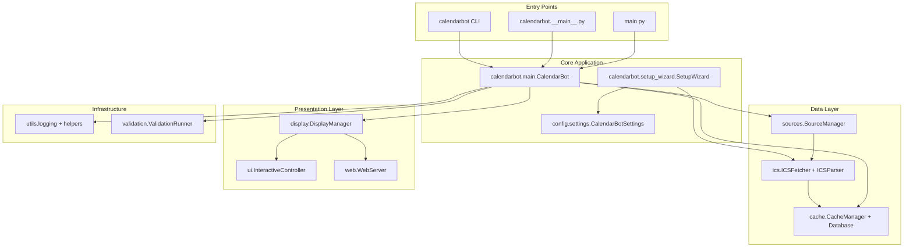
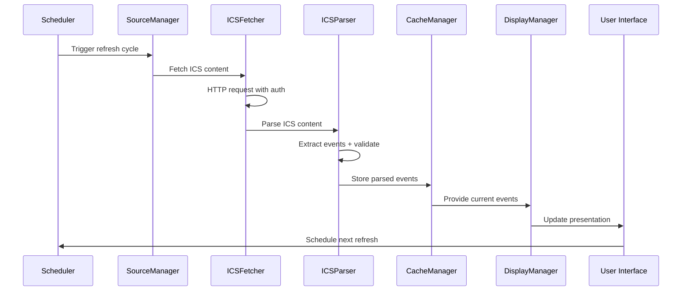
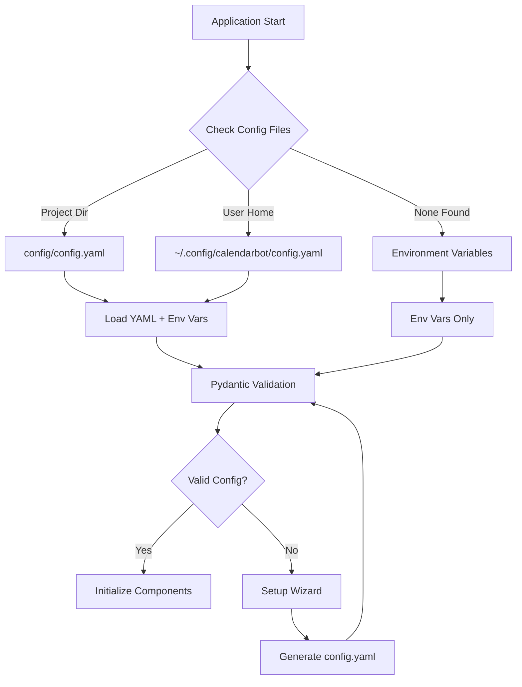

# CalendarBot System Architecture

**Document Version:** 3.0  
**Last Updated:** January 7, 2025  
**Architecture Version:** ICS Calendar System v1.0  
**Target Audience:** Developers, System Architects, Technical Contributors

## Executive Summary

This document outlines the complete system architecture for CalendarBot, an ICS-based calendar display application with multiple operational modes including console, interactive navigation, web interface, and Raspberry Pi e-ink display support. The system is designed for universal calendar compatibility, real-time updates, and extensible deployment options.

## 1. Technology Stack

### Core Platform
- **Language**: Python 3.8+ with modern async/await patterns
- **Architecture**: Modular component-based design with clear separation of concerns
- **Configuration**: Pydantic-based settings with YAML configuration files
- **Packaging**: Modern Python packaging with [`pyproject.toml`](pyproject.toml)

### Key Dependencies
- **ICS Processing**: [`icalendar`](https://pypi.org/project/icalendar/) (RFC 5545 compliant parsing)
- **HTTP Client**: [`httpx`](https://pypi.org/project/httpx/) (async HTTP with authentication support)
- **Data Validation**: [`pydantic`](https://pypi.org/project/pydantic/) v2.0+ (settings and data model validation)
- **Database**: [`aiosqlite`](https://pypi.org/project/aiosqlite/) (async SQLite for event caching)
- **Configuration**: [`PyYAML`](https://pypi.org/project/PyYAML/) + [`pydantic-settings`](https://pypi.org/project/pydantic-settings/) 
- **Date/Time**: [`python-dateutil`](https://pypi.org/project/python-dateutil/) + [`pytz`](https://pypi.org/project/pytz/) (timezone handling)
- **Scheduling**: [`APScheduler`](https://pypi.org/project/APScheduler/) (background task scheduling)

### Universal Calendar Support
- **Microsoft Outlook/Office 365**: Published calendar ICS URLs
- **Google Calendar**: Secret iCal format URLs  
- **Apple iCloud Calendar**: Public calendar ICS URLs
- **CalDAV Servers**: Nextcloud, Radicale, SOGo, etc.
- **Any RFC 5545 compliant** calendar system

## 2. Application Architecture

### High-Level Component Architecture



### Module Structure

#### 1. **Source Management** ([`calendarbot/sources/`](calendarbot/sources/))
- [`manager.py`](calendarbot/sources/manager.py): Multi-source coordination and health monitoring
- [`ics_source.py`](calendarbot/sources/ics_source.py): ICS feed handling and authentication
- [`models.py`](calendarbot/sources/models.py): Source configuration data models
- [`exceptions.py`](calendarbot/sources/exceptions.py): Source-specific error handling

#### 2. **ICS Processing** ([`calendarbot/ics/`](calendarbot/ics/))
- [`fetcher.py`](calendarbot/ics/fetcher.py): Async HTTP client with auth and caching support
- [`parser.py`](calendarbot/ics/parser.py): RFC 5545 compliant ICS content parsing
- [`models.py`](calendarbot/ics/models.py): ICS data models and validation
- [`exceptions.py`](calendarbot/ics/exceptions.py): ICS-specific error types

#### 3. **Cache Management** ([`calendarbot/cache/`](calendarbot/cache/))
- [`manager.py`](calendarbot/cache/manager.py): Cache coordination and TTL management
- [`database.py`](calendarbot/cache/database.py): Async SQLite operations with WAL mode
- [`models.py`](calendarbot/cache/models.py): Cache entry data models

#### 4. **Display Management** ([`calendarbot/display/`](calendarbot/display/))
- [`manager.py`](calendarbot/display/manager.py): Display coordination and mode switching
- [`console_renderer.py`](calendarbot/display/console_renderer.py): Console output formatting
- [`html_renderer.py`](calendarbot/display/html_renderer.py): Web-compatible HTML rendering
- [`rpi_html_renderer.py`](calendarbot/display/rpi_html_renderer.py): E-ink optimized HTML layouts

#### 5. **User Interface** ([`calendarbot/ui/`](calendarbot/ui/))
- [`interactive.py`](calendarbot/ui/interactive.py): Interactive navigation controller
- [`keyboard.py`](calendarbot/ui/keyboard.py): Cross-platform keyboard input handling
- [`navigation.py`](calendarbot/ui/navigation.py): Date navigation and filtering logic

#### 6. **Web Interface** ([`calendarbot/web/`](calendarbot/web/))
- [`server.py`](calendarbot/web/server.py): Web server implementation
- [`navigation.py`](calendarbot/web/navigation.py): Web-based navigation handling
- [`static/`](calendarbot/web/static/): CSS, JavaScript, and theme assets

#### 7. **Utilities** ([`calendarbot/utils/`](calendarbot/utils/))
- [`logging.py`](calendarbot/utils/logging.py): Enhanced logging system with interactive mode support
- [`helpers.py`](calendarbot/utils/helpers.py): Common utility functions

#### 8. **Validation Framework** ([`calendarbot/validation/`](calendarbot/validation/))
- [`runner.py`](calendarbot/validation/runner.py): Comprehensive system validation
- [`results.py`](calendarbot/validation/results.py): Test result models and reporting
- [`logging_setup.py`](calendarbot/validation/logging_setup.py): Validation-specific logging

#### 9. **Configuration System** ([`config/`](config/))
- [`settings.py`](config/settings.py): Pydantic settings models with YAML integration
- [`config.yaml.example`](config/config.yaml.example): Example configuration template
- [`ics_config.py`](config/ics_config.py): ICS-specific configuration helpers

## 3. Operational Modes

### 1. Setup Mode (`--setup`)
**Entry Point**: [`calendarbot/setup_wizard.py`](calendarbot/setup_wizard.py)
- Interactive configuration wizard with service templates
- Automatic ICS feed validation and testing
- Authentication setup (basic auth, bearer tokens)
- Configuration file generation and management

### 2. Interactive Mode (`--interactive`)
**Components**: [`ui.InteractiveController`](calendarbot/ui/interactive.py), [`display.ConsoleRenderer`](calendarbot/display/console_renderer.py)
- Keyboard-driven navigation (arrow keys, space, ESC)
- Real-time background data fetching
- Split-screen logging in development mode
- Cross-platform input handling

### 3. Web Mode (`--web`)
**Components**: [`web.WebServer`](calendarbot/web/server.py), [`display.HTMLRenderer`](calendarbot/display/html_renderer.py)
- Browser-based calendar interface
- Multiple theme support (standard, eink-rpi)
- Auto-refresh capabilities
- Mobile-responsive design

### 4. Raspberry Pi Mode (`--rpi`)
**Components**: [`display.RPIHtmlRenderer`](calendarbot/display/rpi_html_renderer.py)
- E-ink display optimized layouts (800x480px)
- High contrast, minimal refresh themes
- Power-efficient rendering strategies
- Web interface integration

### 5. Test/Validation Mode (`--test-mode`)
**Components**: [`validation.ValidationRunner`](calendarbot/validation/runner.py)
- Comprehensive system validation
- Component-specific testing (ICS, cache, display)
- Performance benchmarking
- Configuration verification

### 6. Daemon Mode (default)
**Components**: [`main.CalendarBot`](calendarbot/main.py)
- Background operation with automatic refresh
- Graceful error handling and recovery
- Resource monitoring and optimization
- Signal-based shutdown handling

## 4. Data Flow Architecture

### Event Processing Pipeline



### Configuration Loading Flow



## 5. Configuration Management

### Settings Architecture

The configuration system uses a hierarchical approach implemented in [`config/settings.py`](config/settings.py):

1. **Default Values**: Built into Pydantic models
2. **YAML Configuration**: Project or user config directories
3. **Environment Variables**: `CALENDARBOT_*` prefix support
4. **Command Line Arguments**: Runtime overrides

### Configuration Schema

```yaml
# ICS Calendar Configuration
ics:
  url: "https://calendar.example.com/calendar.ics"
  auth_type: "none"  # none, basic, bearer
  username: "user"   # for basic auth
  password: "pass"   # for basic auth
  token: "token"     # for bearer auth
  verify_ssl: true
  timeout: 30

# Application Settings
app_name: "CalendarBot"
refresh_interval: 300  # seconds
cache_ttl: 3600       # seconds

# Display Settings
display_enabled: true
display_type: "console"  # console, html, rpi

# Comprehensive Logging Configuration
logging:
  console_enabled: true
  console_level: "WARNING"
  console_colors: true
  file_enabled: true
  file_level: "DEBUG"
  file_directory: null  # defaults to data_dir/logs
  max_log_files: 5
  interactive_split_display: true
  interactive_log_lines: 5

# Web Interface Settings
web:
  enabled: false
  port: 8080
  host: "0.0.0.0"
  theme: "eink-rpi"    # eink, eink-rpi, standard
  auto_refresh: 60

# Raspberry Pi E-ink Settings
rpi:
  enabled: false
  display_width: 800
  display_height: 480
  refresh_mode: "partial"  # partial, full
  auto_theme: true
```

### Settings Validation

```python
# Example from config/settings.py
class CalendarBotSettings(BaseSettings):
    """Type-safe configuration with automatic validation."""
    
    # ICS configuration with validation
    ics_url: Optional[str] = Field(None, description="ICS calendar URL")
    ics_auth_type: Optional[str] = Field(None, regex="^(none|basic|bearer)$")
    
    # Automatic environment variable mapping
    class Config:
        env_prefix = "CALENDARBOT_"
        env_file = ".env"
```

## 6. Caching & Storage Architecture

### SQLite Database Design

The cache system uses async SQLite with WAL mode for optimal performance:

```sql
-- Event Cache Table
CREATE TABLE cached_events (
    id TEXT PRIMARY KEY,
    source_name TEXT NOT NULL,
    subject TEXT NOT NULL,
    start_datetime TIMESTAMP NOT NULL,
    end_datetime TIMESTAMP NOT NULL,
    location TEXT,
    is_all_day BOOLEAN DEFAULT FALSE,
    show_as TEXT DEFAULT 'busy',
    created_at TIMESTAMP DEFAULT CURRENT_TIMESTAMP,
    expires_at TIMESTAMP NOT NULL,
    INDEX idx_start_datetime (start_datetime),
    INDEX idx_expires_at (expires_at)
);

-- Cache Metadata Table
CREATE TABLE cache_metadata (
    key TEXT PRIMARY KEY,
    value TEXT NOT NULL,
    updated_at TIMESTAMP DEFAULT CURRENT_TIMESTAMP
);
```

### Caching Strategy

**WAL Mode Benefits**:
- Reduced storage wear (important for SD cards)
- Better concurrent read/write access
- Improved crash recovery
- Optimal for single-writer, multiple-reader scenarios

**TTL Management**:
- Configurable cache expiration (default: 1 hour)
- Automatic cleanup of expired events
- Smart refresh based on cache freshness
- Offline operation with cached data

## 7. Error Handling & Resilience

### Network Resilience

```python
# Example from source manager
async def fetch_with_retry(self, source: ICSSource) -> ICSResponse:
    """Fetch with exponential backoff retry logic."""
    for attempt in range(self.settings.max_retries):
        try:
            response = await self.fetcher.fetch_ics(source)
            if response.success:
                return response
        except NetworkError as e:
            if attempt < self.settings.max_retries - 1:
                delay = self.settings.retry_backoff_factor ** attempt
                await asyncio.sleep(delay)
            else:
                return ICSResponse(success=False, error_message=str(e))
```

### Graceful Degradation

- **Network Failures**: Automatic fallback to cached data
- **ICS Parse Errors**: Partial recovery with detailed error reporting
- **Cache Corruption**: Automatic cache rebuilding
- **Display Errors**: Minimal error display with system status

## 8. Testing & Validation Framework

### Validation Components

The [`validation`](calendarbot/validation/) module provides comprehensive testing:

```python
# Validation runner supports component-specific testing
class ValidationRunner:
    """Comprehensive system validation."""
    
    async def run_validation(self) -> ValidationResults:
        """Run validation for specified components."""
        if 'ics' in self.components:
            await self._validate_ics_connectivity()
        if 'cache' in self.components:
            await self._validate_cache_operations()
        if 'display' in self.components:
            await self._validate_display_functionality()
```

### Test Execution

```bash
# Quick validation
calendarbot --test-mode

# Comprehensive testing with specific components
calendarbot --test-mode --verbose --components ics,cache --date 2024-01-15

# JSON output for automation
calendarbot --test-mode --output-format json > validation-results.json
```

## 9. Security & Privacy

### Data Protection

- **Local-First Architecture**: All calendar data processed locally
- **No Cloud Dependencies**: Direct ICS feed access without intermediaries
- **User-Controlled Data**: User manages all data retention policies
- **Minimal Network Footprint**: Only necessary ICS fetch requests

### Authentication Security

- **HTTPS Required**: SSL/TLS for all ICS feed access
- **Multiple Auth Methods**: Basic auth, bearer tokens, or public access
- **Credential Protection**: Secure credential storage in configuration files
- **SSL Validation**: Configurable certificate validation

## 10. Performance Optimization

### Resource Utilization Targets

- **Memory Usage**: < 50MB resident memory for typical operation
- **CPU Usage**: < 1% idle, < 10% during refresh cycles
- **Storage**: < 5MB cache database with automatic cleanup
- **Network**: Efficient HTTP caching with conditional requests

### Async/Await Benefits

- **Non-blocking I/O**: HTTP requests don't block UI updates
- **Concurrent Operations**: Multiple data sources can be fetched simultaneously  
- **Responsive UI**: Interactive mode remains responsive during background fetching
- **Resource Efficiency**: Minimal thread overhead compared to threading approaches

## 11. Deployment Architecture

### Entry Points

```python
# pyproject.toml console scripts configuration
[project.scripts]
calendarbot = "main:main_entry"

# Multiple execution methods
python main.py                    # Direct execution
python -m calendarbot            # Module execution  
calendarbot                      # Installed package
```

### File Structure

```
calendarBot/
├── main.py                      # Primary entry point
├── pyproject.toml               # Modern Python packaging
├── config/
│   ├── settings.py              # Pydantic settings models
│   ├── config.yaml.example      # Configuration template
│   └── ics_config.py            # ICS-specific helpers
├── calendarbot/
│   ├── __init__.py              # Package initialization
│   ├── __main__.py              # Module execution support
│   ├── main.py                  # Core application logic
│   ├── setup_wizard.py          # Interactive configuration
│   ├── cache/                   # Event caching system
│   ├── display/                 # Output rendering
│   ├── ics/                     # ICS processing
│   ├── sources/                 # Calendar source management
│   ├── ui/                      # Interactive user interface
│   ├── utils/                   # Common utilities
│   ├── validation/              # Testing framework
│   └── web/                     # Web interface
└── scripts/
    └── dev_setup.py             # Development environment setup
```

## 12. Extension Points

### Adding New Calendar Sources

```python
# Example: Extend sources for CalDAV protocol
class CalDAVSource(BaseSource):
    """Direct CalDAV server integration."""
    
    async def fetch_events(self) -> List[CalendarEvent]:
        """Fetch events using CalDAV protocol."""
        pass
```

### Custom Display Renderers

```python
# Example: Custom display renderer
class CustomRenderer(BaseRenderer):
    """Custom output format renderer."""
    
    async def render_events(self, events: List[CalendarEvent]) -> str:
        """Render events in custom format."""
        pass
```

### Web Theme Development

```css
/* Example: Custom web theme in web/static/ */
.custom-theme {
    /* E-ink optimized styles */
    background: #ffffff;
    color: #000000;
    font-family: 'Roboto Mono', monospace;
}
```

## 13. Development Workflow

### Setup and Contribution

```bash
# Automated development environment setup
python scripts/dev_setup.py

# Development installation
pip install -e .[dev]

# Code quality checks
black calendarbot/
mypy calendarbot/
pytest --cov=calendarbot

# Package testing
python -m build
calendarbot --test-mode --verbose
```

### Architecture Principles

1. **Modular Design**: Clear separation of concerns between modules
2. **Async-First**: All I/O operations use async/await patterns
3. **Type Safety**: Comprehensive type hints and Pydantic validation
4. **Configuration-Driven**: Behavior controlled via YAML configuration
5. **Error Resilience**: Graceful degradation and comprehensive error handling
6. **Universal Compatibility**: Support for any RFC 5545 compliant calendar

---

**Architecture Document v3.0** - Reflects the current ICS-based CalendarBot system with comprehensive module documentation, operational modes, and development workflows.