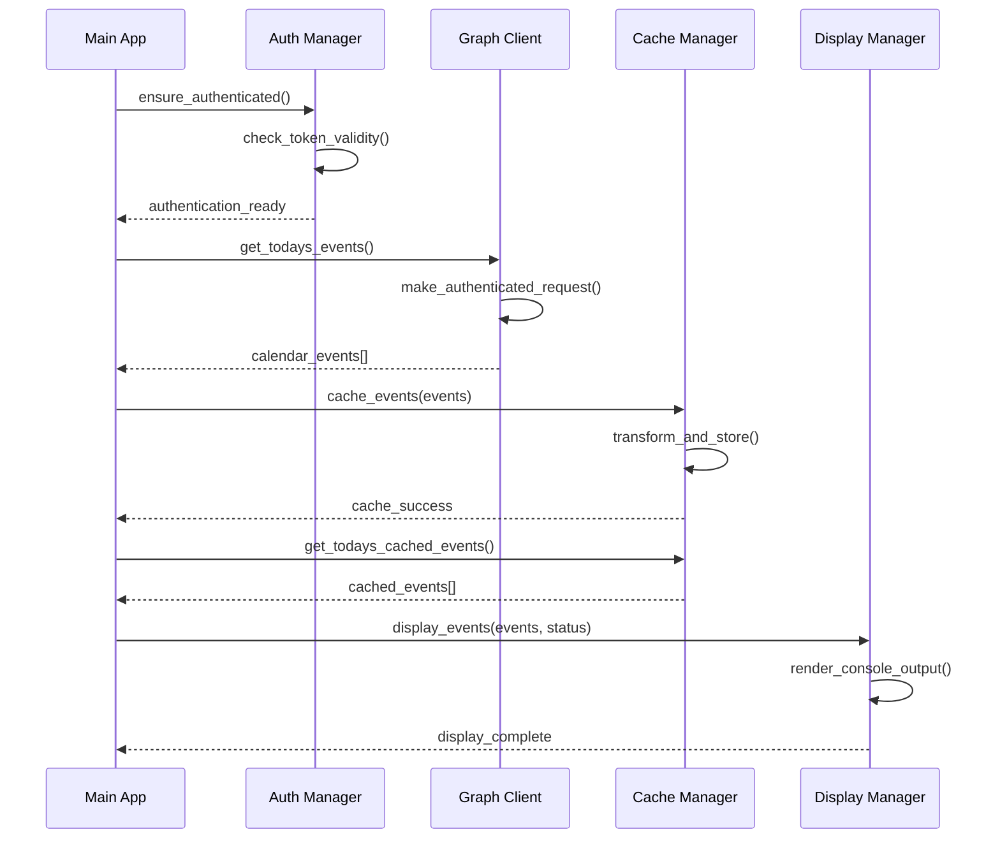

# Development Guide

This guide covers the development environment setup, codebase architecture, and contribution guidelines for the Microsoft 365 Calendar Display Bot.

## Table of Contents

- [Development Environment Setup](#development-environment-setup)
- [Codebase Architecture](#codebase-architecture)
- [Development Workflow](#development-workflow)
- [Testing](#testing)
- [Code Style and Standards](#code-style-and-standards)
- [Contributing Guidelines](#contributing-guidelines)
- [Future Roadmap](#future-roadmap)
- [API Reference](#api-reference)

## Development Environment Setup

### Prerequisites

- **Python 3.8+** with pip and venv
- **Git** for version control
- **Code editor** (VS Code recommended with Python extension)
- **Microsoft 365 developer account** for testing
- **Azure subscription** for app registration testing

### Local Development Setup

1. **Clone and setup repository**:
```bash
# Clone the repository
git clone <repository-url>
cd calendarBot

# Create virtual environment
python3 -m venv venv
source venv/bin/activate  # On Windows: venv\Scripts\activate

# Install dependencies
pip install -r requirements.txt

# Install development dependencies
pip install -r requirements-dev.txt
```

2. **Create development configuration**:
```bash
# Copy example configuration
cp config/config.yaml.example config/config.yaml

# Edit with your development Azure app registration
nano config/config.yaml
```

3. **Set up development environment variables**:
```bash
# Create .env file for development
cat > .env << EOF
CALENDARBOT_CLIENT_ID=your-dev-client-id
CALENDARBOT_TENANT_ID=common
CALENDARBOT_LOG_LEVEL=DEBUG
CALENDARBOT_REFRESH_INTERVAL=60
EOF
```

### Development Tools Setup

**VS Code Extensions** (recommended):
```json
{
  "recommendations": [
    "ms-python.python",
    "ms-python.black-formatter",
    "ms-python.flake8",
    "ms-python.mypy-type-checker",
    "redhat.vscode-yaml",
    "ms-python.pylint"
  ]
}
```

**Pre-commit hooks**:
```bash
# Install pre-commit
pip install pre-commit

# Install hooks
pre-commit install

# Run manually on all files
pre-commit run --all-files
```

### Testing Environment

1. **Install test dependencies**:
```bash
pip install pytest pytest-asyncio pytest-cov pytest-mock
```

2. **Run tests**:
```bash
# Run all tests
pytest

# Run with coverage
pytest --cov=calendarbot

# Run specific test file
pytest tests/test_auth.py

# Run with verbose output
pytest -v
```

3. **Test configuration**:
Create `pytest.ini` in project root:
```ini
[tool:pytest]
testpaths = tests
python_files = test_*.py
python_classes = Test*
python_functions = test_*
addopts = 
    --strict-markers
    --strict-config
    --verbose
asyncio_mode = auto
```

## Codebase Architecture

### High-Level Overview

```
calendarbot/
├── main.py              # Application entry point and main orchestration
├── auth/                # Authentication and token management
│   ├── manager.py       # Authentication coordinator
│   ├── device_flow.py   # OAuth 2.0 device code flow
│   └── token_store.py   # Secure token storage with encryption
├── api/                 # Microsoft Graph API integration
│   ├── graph_client.py  # HTTP client with retry logic
│   ├── models.py        # Pydantic data models for API responses
│   └── exceptions.py    # API-specific exception handling
├── cache/               # Local data persistence
│   ├── manager.py       # Cache coordination and lifecycle
│   ├── database.py      # SQLite operations with WAL mode
│   └── models.py        # Data models for cached events
├── display/             # Display output management
│   ├── manager.py       # Display coordination
│   └── console_renderer.py  # Console/terminal output
└── utils/               # Utility functions and helpers
    ├── logging.py       # Centralized logging configuration
    └── helpers.py       # General utility functions
```

### Core Components

#### 1. Application Main (`calendarbot/main.py`)

**Purpose**: Central orchestration and scheduling
- **CalendarBot class**: Main application coordinator
- **Async scheduler**: 5-minute refresh cycle management
- **Signal handling**: Graceful shutdown with Ctrl+C
- **Error recovery**: Component failure handling and restart logic

**Key Methods**:
- [`initialize()`](calendarbot/main.py:45) - Component initialization
- [`fetch_and_cache_events()`](calendarbot/main.py:71) - API data retrieval
- [`update_display()`](calendarbot/main.py:104) - Display refresh coordination
- [`run_scheduler()`](calendarbot/main.py:194) - Main event loop

#### 2. Authentication (`calendarbot/auth/`)

**Purpose**: Secure Microsoft 365 authentication and token management

**AuthManager** ([`auth/manager.py`](calendarbot/auth/manager.py)):
- Token lifecycle coordination
- Automatic refresh with 5-minute buffer
- Silent authentication attempts
- Interactive device flow fallback

**DeviceCodeFlow** ([`auth/device_flow.py`](calendarbot/auth/device_flow.py)):
- OAuth 2.0 device code flow implementation
- User authentication polling
- Token refresh operations
- MSAL library integration

**TokenStore** ([`auth/token_store.py`](calendarbot/auth/token_store.py)):
- AES-256 encrypted token storage
- Hardware-based device key generation
- Secure file permissions
- Token validation and cleanup

#### 3. API Integration (`calendarbot/api/`)

**GraphClient** ([`api/graph_client.py`](calendarbot/api/graph_client.py)):
- Async HTTP client for Microsoft Graph
- Exponential backoff retry logic
- Rate limiting compliance
- Connection pooling and timeout management

**Data Models** ([`api/models.py`](calendarbot/api/models.py)):
- Pydantic models for type safety
- API response parsing and validation
- DateTime handling with timezone support
- Optional field handling

**Exception Handling** ([`api/exceptions.py`](calendarbot/api/exceptions.py)):
- Structured error hierarchy
- HTTP status code mapping
- Retry-able vs non-retry-able errors
- User-friendly error messages

#### 4. Data Caching (`calendarbot/cache/`)

**CacheManager** ([`cache/manager.py`](calendarbot/cache/manager.py)):
- Cache lifecycle management
- TTL-based expiration (1 hour default)
- Data transformation between API and cache models
- Background cleanup of old events

**Database Operations** ([`cache/database.py`](calendarbot/cache/database.py)):
- SQLite with WAL mode for performance
- Async database operations
- Index optimization for queries
- Database schema migration support

**Cache Models** ([`cache/models.py`](calendarbot/cache/models.py)):
- Event storage representation
- Time-based query methods
- Display formatting helpers
- Status determination (current, upcoming, past)

#### 5. Display Management (`calendarbot/display/`)

**DisplayManager** ([`display/manager.py`](calendarbot/display/manager.py)):
- Renderer coordination
- Status information aggregation
- Error display handling
- Future e-ink display integration point

**ConsoleRenderer** ([`display/console_renderer.py`](calendarbot/display/console_renderer.py)):
- Terminal output formatting
- Event prioritization and grouping
- Text truncation and layout
- Status indicator display

### Data Flow Architecture



### Configuration Management

**Settings Architecture** ([`config/settings.py`](config/settings.py)):
- Pydantic BaseSettings for type validation
- Environment variable override support
- YAML configuration file parsing
- Default value management
- Directory path configuration

**Configuration Hierarchy**:
1. Default values in settings class
2. YAML configuration file values
3. Environment variable overrides
4. Command-line arguments (future)

## Development Workflow

### Git Workflow

1. **Feature Development**:
```bash
# Create feature branch
git checkout -b feature/new-display-driver

# Make changes with frequent commits
git add .
git commit -m "Add e-ink display driver base class"

# Push feature branch
git push origin feature/new-display-driver

# Create pull request for review
```

2. **Testing Before Commit**:
```bash
# Run full test suite
pytest

# Check code style
black --check .
flake8 .

# Type checking
mypy calendarbot/

# Security checks
safety check
```

### Development Testing

**Manual Testing Checklist**:
- ✅ Authentication flow works correctly
- ✅ Calendar events display properly
- ✅ Offline caching functions as expected
- ✅ Error handling displays appropriate messages
- ✅ Configuration changes take effect
- ✅ Graceful shutdown with Ctrl+C

**Integration Testing**:
```bash
# Test with real Microsoft 365 account
python main.py

# Test authentication clearing
rm ~/.config/calendarbot/tokens.enc
python main.py

# Test network disconnection
# Disconnect network, verify cached data display
# Reconnect network, verify live data resume
```

### Debug Mode

Enable comprehensive debugging:

```bash
# Environment variable
export CALENDARBOT_LOG_LEVEL=DEBUG

# Or in config.yaml
log_level: "DEBUG"
log_file: "debug.log"

# Run with debug output
python main.py
```

Debug output includes:
- Detailed API request/response logs
- Token refresh operations
- Cache hit/miss statistics
- Display rendering timing
- Error stack traces

## Testing

### Test Structure

```
tests/
├── conftest.py          # Pytest configuration and fixtures
├── test_auth/
│   ├── test_manager.py      # Authentication manager tests
│   ├── test_device_flow.py  # OAuth flow tests
│   └── test_token_store.py  # Token storage tests
├── test_api/
│   ├── test_graph_client.py # API client tests
│   ├── test_models.py       # Data model tests
│   └── test_exceptions.py   # Exception handling tests
├── test_cache/
│   ├── test_manager.py      # Cache manager tests
│   ├── test_database.py     # Database operation tests
│   └── test_models.py       # Cache model tests
├── test_display/
│   ├── test_manager.py      # Display manager tests
│   └── test_console_renderer.py  # Console output tests
└── fixtures/
    ├── calendar_events.json    # Sample API responses
    └── cached_events.json      # Sample cached data
```

### Test Categories

**Unit Tests**:
- Individual component functionality
- Mock external dependencies
- Test error conditions and edge cases
- Validate data transformations

**Integration Tests**:
- Component interaction testing
- Database operations with real SQLite
- Authentication flow simulation
- End-to-end data flow validation

**Async Tests**:
```python
import pytest
import asyncio

@pytest.mark.asyncio
async def test_calendar_fetch():
    """Test async calendar data fetching."""
    # Test implementation
    pass
```

### Test Utilities

**Mock Fixtures** (`tests/conftest.py`):
```python
@pytest.fixture
def mock_graph_response():
    """Mock Microsoft Graph API response."""
    return {
        "value": [
            {
                "id": "test-event-id",
                "subject": "Test Meeting",
                "start": {"dateTime": "2024-01-15T10:00:00", "timeZone": "UTC"},
                "end": {"dateTime": "2024-01-15T11:00:00", "timeZone": "UTC"}
            }
        ]
    }

@pytest.fixture
def temp_config_dir(tmp_path):
    """Temporary configuration directory for testing."""
    config_dir = tmp_path / "config"
    config_dir.mkdir()
    return config_dir
```

### Coverage Requirements

Maintain minimum test coverage:
- **Overall**: 80%+ line coverage
- **Core modules**: 90%+ line coverage
- **Critical paths**: 100% line coverage (auth, API)

```bash
# Generate coverage report
pytest --cov=calendarbot --cov-report=html

# View coverage report
open htmlcov/index.html
```

## Code Style and Standards

### Python Standards

**Code Formatting**:
- **Black** for automatic code formatting
- **isort** for import sorting
- **flake8** for linting
- **mypy** for type checking

```bash
# Format code
black .

# Sort imports
isort .

# Check linting
flake8 .

# Type checking
mypy calendarbot/
```

**Type Hints**:
```python
from typing import List, Optional, Dict, Any
from datetime import datetime

async def fetch_events(
    start_date: datetime,
    end_date: datetime,
    timezone: str = "UTC"
) -> List[CalendarEvent]:
    """Fetch calendar events with type hints."""
    pass
```

**Documentation Standards**:
```python
class AuthManager:
    """Manages Microsoft Graph authentication with automatic token refresh.
    
    This class coordinates the OAuth 2.0 device code flow, token storage,
    and automatic token refresh operations. It provides a high-level
    interface for ensuring valid authentication is available.
    
    Attributes:
        settings: Application settings instance
        token_store: Secure token storage handler
        device_flow: OAuth device code flow handler
    """
    
    def __init__(self, settings: CalendarBotSettings):
        """Initialize authentication manager.
        
        Args:
            settings: Application settings instance containing
                     client_id, tenant_id, and other auth config
        """
        pass
    
    async def ensure_authenticated(self) -> bool:
        """Ensure we have valid authentication tokens.
        
        This method checks for existing valid tokens, attempts to refresh
        if needed, tries silent authentication, and falls back to
        interactive authentication if necessary.
        
        Returns:
            True if authentication is successful and valid tokens are
            available, False otherwise.
            
        Raises:
            AuthenticationError: If all authentication methods fail
        """
        pass
```

### Error Handling Patterns

**Exception Hierarchy**:
```python
class CalendarBotError(Exception):
    """Base exception for calendar bot errors."""
    pass

class AuthenticationError(CalendarBotError):
    """Authentication-related errors."""
    pass

class APIError(CalendarBotError):
    """Microsoft Graph API errors."""
    
    def __init__(self, message: str, status_code: Optional[int] = None):
        super().__init__(message)
        self.status_code = status_code
```

**Async Error Handling**:
```python
async def safe_api_call(operation: Callable) -> Optional[Any]:
    """Safely execute API operation with error handling."""
    try:
        return await operation()
    except aiohttp.ClientError as e:
        logger.error(f"Network error: {e}")
        return None
    except Exception as e:
        logger.error(f"Unexpected error: {e}")
        return None
```

### Logging Standards

**Structured Logging**:
```python
import logging

logger = logging.getLogger(__name__)

# Info level for normal operations
logger.info("Calendar events fetched successfully", extra={
    "event_count": len(events),
    "fetch_duration": fetch_time,
    "cache_hit": cache_status
})

# Warning for recoverable issues
logger.warning("Token refresh failed, retrying", extra={
    "retry_count": retry_count,
    "max_retries": max_retries
})

# Error for serious issues
logger.error("Authentication failed", extra={
    "error_code": error.code,
    "error_description": error.description
}, exc_info=True)
```

## Contributing Guidelines

### Before Contributing

1. **Read documentation**: Understand architecture and standards
2. **Check existing issues**: Avoid duplicate work
3. **Discuss major changes**: Create issue for discussion first
4. **Set up development environment**: Follow setup guide above

### Contribution Process

1. **Fork and Clone**:
```bash
# Fork repository on GitHub
# Clone your fork
git clone https://github.com/your-username/calendarBot.git
cd calendarBot

# Add upstream remote
git remote add upstream https://github.com/original-repo/calendarBot.git
```

2. **Create Feature Branch**:
```bash
# Create and switch to feature branch
git checkout -b feature/description-of-feature

# Keep branch up to date
git fetch upstream
git rebase upstream/main
```

3. **Development**:
```bash
# Make changes
# Add tests for new functionality
# Update documentation if needed
# Ensure all tests pass
pytest

# Check code style
black --check .
flake8 .
mypy calendarbot/
```

4. **Commit and Push**:
```bash
# Commit with descriptive message
git add .
git commit -m "Add e-ink display driver for Waveshare 4.2inch

- Implement SPI communication protocol
- Add display size auto-detection
- Include power optimization features
- Add comprehensive error handling

Fixes #123"

# Push to your fork
git push origin feature/description-of-feature
```

5. **Pull Request**:
   - Create PR from your fork to main repository
   - Include clear description of changes
   - Reference related issues
   - Ensure CI tests pass
   - Respond to review feedback

### Code Review Guidelines

**For Contributors**:
- Keep PRs focused and reasonably sized
- Write clear commit messages
- Include tests for new functionality
- Update documentation as needed
- Respond promptly to review feedback

**For Reviewers**:
- Focus on code quality, security, and maintainability
- Provide constructive feedback
- Test functionality when possible
- Check for adherence to project standards

### Types of Contributions

**Bug Fixes**:
- Include reproduction steps
- Add regression test
- Update documentation if needed

**New Features**:
- Discuss in issue before implementing
- Follow existing architecture patterns
- Include comprehensive tests
- Update user documentation

**Documentation**:
- Fix typos and improve clarity
- Add examples and usage guides
- Keep up to date with code changes

**Performance Improvements**:
- Include benchmarks showing improvement
- Ensure no regression in functionality
- Test on target hardware (Raspberry Pi)

## Future Roadmap

Based on the [user stories](USER_STORIES.md), development is planned in phases:

### Phase 2: Enhanced Display Features

**E-ink Display Integration**:
- Waveshare display driver implementation
- SPI communication protocols
- Display size auto-detection (2.9", 4.2", 7.5", 9.7")
- Power optimization for battery operation

**Responsive Layout System**:
```python
class DisplayLayoutManager:
    """Manages layout selection based on display capabilities."""
    
    def select_layout(self, display_info: DisplayInfo) -> LayoutTemplate:
        """Select appropriate layout for display size."""
        pass
    
    def render_events(self, events: List[Event], layout: LayoutTemplate) -> Image:
        """Render events using selected layout."""
        pass
```

**Power Management**:
- Partial vs full refresh optimization
- Sleep mode during quiet hours
- Battery status monitoring
- Update frequency adjustment

### Phase 3: Voice Integration

**Alexa Skills Kit Server**:
```python
class AlexaSkillsServer:
    """Local HTTPS server for Alexa voice integration."""
    
    async def handle_intent(self, intent: AlexaIntent) -> AlexaResponse:
        """Process voice command and return calendar information."""
        pass
```

**Privacy-First Architecture**:
- Local calendar data processing only
- No cloud transmission of sensitive data
- Secure HTTPS endpoint on Pi
- Device-specific authentication

**Natural Language Processing**:
- Voice command parsing
- Context-aware responses
- Meeting time formatting for speech
- Error handling for voice interface

### Phase 4: Advanced Features

**System Health Monitoring**:
- Performance metrics collection
- Automated error reporting
- Resource usage tracking
- Predictive maintenance alerts

**Over-the-Air Updates**:
- Secure update mechanism
- Configuration backup before updates
- Rollback capability
- Update verification

**Web Configuration Interface**:
- Browser-based settings management
- Real-time status monitoring
- Log viewing and download
- Remote restart capability

### Implementation Priorities

1. **Core stability** - Fix bugs and improve reliability
2. **E-ink display** - Primary hardware integration
3. **Power optimization** - Battery life improvement
4. **Voice integration** - Alexa Skills implementation
5. **Advanced monitoring** - Health and maintenance features

## API Reference

### Core Classes

#### CalendarBot

```python
class CalendarBot:
    """Main application coordinator."""
    
    async def initialize() -> bool:
        """Initialize all components."""
        
    async def start() -> bool:
        """Start the application with scheduler."""
        
    async def stop():
        """Stop the application gracefully."""
```

#### AuthManager

```python
class AuthManager:
    """Authentication management."""
    
    async def ensure_authenticated() -> bool:
        """Ensure valid authentication tokens."""
        
    async def get_valid_access_token() -> Optional[str]:
        """Get current valid access token."""
        
    def is_authenticated() -> bool:
        """Check if authenticated."""
```

#### GraphClient

```python
class GraphClient:
    """Microsoft Graph API client."""
    
    async def get_todays_events() -> List[CalendarEvent]:
        """Fetch today's calendar events."""
        
    async def test_connection() -> bool:
        """Test API connectivity."""
```

#### CacheManager

```python
class CacheManager:
    """Calendar data caching."""
    
    async def cache_events(events: List[CalendarEvent]) -> bool:
        """Store events in cache."""
        
    async def get_todays_cached_events() -> List[CachedEvent]:
        """Retrieve cached events for today."""
```

### Configuration Models

```python
class CalendarBotSettings(BaseSettings):
    """Application configuration settings."""
    
    client_id: str
    tenant_id: str = "common"
    refresh_interval: int = 300
    cache_ttl: int = 3600
    log_level: str = "INFO"
```

---

**Ready to contribute?** Start by setting up your development environment and checking out the current issues for areas where help is needed.

For questions about development, create a GitHub issue with the "question" label.