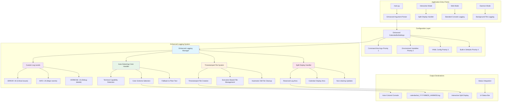

# Comprehensive Logging System Architecture

## Design Requirements Summary

Based on research and requirements gathering:

- **Current Issues**: Interactive mode clears screen frequently via `display_with_clear()`, wiping log output
- **Configuration**: Uses basic `CalendarBotSettings` in `config/settings.py` 
- **Current Logging**: Basic setup in `calendarbot/utils/logging.py` with standard Python levels
- **Interactive Mode Strategy**: Split display with reserved log area that doesn't get cleared
- **File Organization**: New timestamped file per execution, keeping only the last 5 log files
- **Color Scheme**: Auto-detect colors based on terminal capabilities
- **Configuration Priority**: Command-line > Environment > YAML > Defaults
- **Scope**: Focus only on main application logging (not validation framework)

## System Architecture



## Technical Specification

### 1. Enhanced Logging Utility Module

**File**: `calendarbot/utils/logging.py` (Enhanced)

#### Custom Log Levels
```python
# Custom log level between INFO(20) and DEBUG(10)
VERBOSE = 15
logging.addLevelName(VERBOSE, 'VERBOSE')

# Add verbose() method to Logger class
def verbose(self, message, *args, **kwargs):
    if self.isEnabledFor(VERBOSE):
        self._log(VERBOSE, message, args, **kwargs)
        
logging.Logger.verbose = verbose
```

#### Auto-Detecting Color Handler
```python
class AutoColoredFormatter(logging.Formatter):
    """Formatter that auto-detects terminal color support."""
    
    # Color schemes for different terminal types
    COLORS = {
        'ERROR': {'truecolor': '\033[91m', 'basic': '\033[31m', 'none': ''},
        'INFO': {'truecolor': '\033[94m', 'basic': '\033[34m', 'none': ''},
        'VERBOSE': {'truecolor': '\033[92m', 'basic': '\033[32m', 'none': ''},
        'RESET': {'truecolor': '\033[0m', 'basic': '\033[0m', 'none': ''}
    }
    
    def __init__(self, *args, **kwargs):
        super().__init__(*args, **kwargs)
        self.color_mode = self._detect_color_support()
    
    def _detect_color_support(self):
        """Auto-detect terminal color capabilities."""
        # Check if output is a TTY
        # Check TERM environment variable
        # Check COLORTERM environment variable
        # Return: 'truecolor', 'basic', or 'none'
```

#### Split Display Handler for Interactive Mode
```python
class SplitDisplayHandler(logging.Handler):
    """Handler that maintains a reserved log area in interactive mode."""
    
    def __init__(self, display_manager, max_log_lines=5):
        super().__init__()
        self.display_manager = display_manager
        self.max_log_lines = max_log_lines
        self.log_buffer = deque(maxlen=max_log_lines)
        
    def emit(self, record):
        """Add log record to buffer and trigger display update."""
        formatted_msg = self.format(record)
        self.log_buffer.append(formatted_msg)
        self.display_manager.update_log_area(list(self.log_buffer))
```

#### Timestamped File Manager
```python
class TimestampedFileHandler(logging.FileHandler):
    """Handler that creates timestamped log files per execution."""
    
    def __init__(self, log_dir, prefix="calendarbot", max_files=5):
        self.log_dir = Path(log_dir)
        self.prefix = prefix
        self.max_files = max_files
        
        # Create timestamped filename
        timestamp = datetime.now().strftime("%Y%m%d_%H%M%S")
        filename = f"{prefix}_{timestamp}.log"
        log_path = self.log_dir / filename
        
        # Ensure directory exists
        self.log_dir.mkdir(parents=True, exist_ok=True)
        
        # Initialize parent FileHandler
        super().__init__(str(log_path))
        
        # Clean up old files
        self.cleanup_old_files()
    
    def cleanup_old_files(self):
        """Remove log files beyond max_files limit, keeping most recent."""
        pattern = f"{self.prefix}_*.log"
        log_files = list(self.log_dir.glob(pattern))
        
        if len(log_files) > self.max_files:
            # Sort by modification time (most recent first)
            log_files.sort(key=lambda f: f.stat().st_mtime, reverse=True)
            
            # Remove oldest files
            for old_file in log_files[self.max_files:]:
                try:
                    old_file.unlink()
                except OSError:
                    pass  # Ignore cleanup errors
```

### 2. Configuration Schema Extensions

**File**: `config/settings.py` (Extended)

#### Enhanced CalendarBotSettings
```python
class LoggingSettings(BaseModel):
    """Logging configuration section."""
    
    # Console Logging
    console_enabled: bool = Field(default=True, description="Enable console logging")
    console_level: str = Field(default="INFO", description="Console log level")
    console_colors: bool = Field(default=True, description="Auto-detect and use colors")
    
    # File Logging
    file_enabled: bool = Field(default=True, description="Enable file logging")
    file_level: str = Field(default="VERBOSE", description="File log level")
    file_directory: Optional[str] = Field(default=None, description="Custom log directory path")
    
    # Timestamped File Management
    file_prefix: str = Field(default="calendarbot", description="Log file prefix")
    max_log_files: int = Field(default=5, description="Number of log files to keep")
    
    # Interactive Mode
    interactive_split_display: bool = Field(default=True, description="Use split display in interactive mode")
    interactive_log_lines: int = Field(default=5, description="Number of log lines to show in interactive mode")
    
    # Advanced Settings
    include_function_names: bool = Field(default=False, description="Include function names in file logs")
    third_party_level: str = Field(default="WARNING", description="Log level for third-party libraries")

class CalendarBotSettings(BaseSettings):
    # ... existing fields ...
    
    # Enhanced logging configuration
    logging: LoggingSettings = Field(default_factory=LoggingSettings)
```

#### YAML Configuration Extension
```yaml
# Enhanced config/config.yaml.example
logging:
  # Console Output
  console_enabled: true
  console_level: "INFO"           # ERROR, INFO, VERBOSE, DEBUG
  console_colors: true            # Auto-detect terminal color support
  
  # File Output
  file_enabled: true
  file_level: "VERBOSE"           # Usually more detailed than console
  file_directory: null            # null = auto-generate in data_dir/logs/
  
  # Timestamped File Management
  file_prefix: "calendarbot"      # Prefix for log files
  max_log_files: 5               # Keep last 5 execution logs
  
  # Interactive Mode Display
  interactive_split_display: true  # Reserved log area that doesn't get cleared
  interactive_log_lines: 5        # Number of recent log lines to show
  
  # Advanced Options
  include_function_names: false   # Add function names to file logs for debugging
  third_party_level: "WARNING"   # Reduce noise from aiohttp, urllib3, etc.
```

### 3. Command-Line Argument Extensions

**File**: `main.py` (Enhanced argument parser)

#### New Logging Arguments
```python
def create_parser() -> argparse.ArgumentParser:
    # ... existing parser setup ...
    
    # Logging argument group
    logging_group = parser.add_argument_group('logging options')
    
    logging_group.add_argument(
        '--log-level',
        choices=['ERROR', 'INFO', 'VERBOSE', 'DEBUG'],
        help='Set logging level (overrides config file)'
    )
    
    logging_group.add_argument(
        '--log-dir',
        help='Specify log directory path (overrides config file)'
    )
    
    logging_group.add_argument(
        '--no-log-colors',
        action='store_true',
        help='Disable colored console output'
    )
    
    logging_group.add_argument(
        '--max-log-files',
        type=int,
        help='Maximum number of log files to keep'
    )
    
    logging_group.add_argument(
        '--verbose', '-v',
        action='store_true',
        help='Enable verbose logging (shortcut for --log-level VERBOSE)'
    )
    
    logging_group.add_argument(
        '--quiet', '-q',
        action='store_true',
        help='Quiet logging - errors only (shortcut for --log-level ERROR)'
    )
```

### 4. Interactive Mode Integration

**File**: `calendarbot/ui/interactive.py` (Enhanced)

#### Split Display Implementation
```python
class InteractiveController:
    def __init__(self, cache_manager: CacheManager, display_manager: DisplayManager):
        # ... existing initialization ...
        
        # Set up split display logging if enabled
        if settings.logging.interactive_split_display:
            self._setup_split_display_logging()
    
    def _setup_split_display_logging(self):
        """Configure logging for split display mode."""
        # Create split display handler
        split_handler = SplitDisplayHandler(
            self.display_manager,
            max_log_lines=settings.logging.interactive_log_lines
        )
        
        # Configure formatter
        formatter = AutoColoredFormatter(
            '%(levelname)s: %(message)s'
        )
        split_handler.setFormatter(formatter)
        
        # Add to logger
        logger = get_logger(__name__)
        logger.addHandler(split_handler)
```

**File**: `calendarbot/display/console_renderer.py` (Enhanced)

#### Enhanced Console Renderer with Log Area
```python
class ConsoleRenderer:
    def __init__(self, settings):
        # ... existing initialization ...
        self.log_area_lines = []
        self.split_display_enabled = settings.logging.interactive_split_display
    
    def update_log_area(self, log_lines: List[str]):
        """Update the reserved log area with new log lines."""
        self.log_area_lines = log_lines
    
    def render_events(self, events: List[CachedEvent], status_info: Optional[dict] = None) -> str:
        # ... existing event rendering ...
        
        # Add log area if in interactive mode and split display enabled
        if status_info.get('interactive_mode') and self.split_display_enabled:
            lines.extend(self._render_log_area())
        
        return "\n".join(lines)
    
    def _render_log_area(self) -> List[str]:
        """Render the reserved log area."""
        lines = []
        if self.log_area_lines:
            lines.append("─" * self.width)
            lines.append("📋 RECENT LOGS")
            lines.append("─" * self.width)
            lines.extend(self.log_area_lines)
        return lines
    
    def display_with_clear(self, content: str):
        """Display content after clearing screen - log area preserved."""
        self.clear_screen()
        print(content)
        print()  # Extra newline for spacing
```

### 5. Enhanced Logging Manager

**File**: `calendarbot/utils/logging.py` (Main enhancement)

#### Complete Enhanced Setup Function
```python
def setup_enhanced_logging(settings: CalendarBotSettings, 
                          interactive_mode: bool = False,
                          display_manager: Optional[DisplayManager] = None) -> logging.Logger:
    """Set up enhanced logging system with all features."""
    
    # Create main logger
    logger = logging.getLogger('calendarbot')
    logger.setLevel(logging.DEBUG)  # Allow all levels, handlers will filter
    
    # Clear existing handlers
    logger.handlers.clear()
    
    # 1. Console Handler (if enabled)
    if settings.logging.console_enabled:
        console_handler = logging.StreamHandler()
        console_level = getattr(logging, settings.logging.console_level.upper())
        console_handler.setLevel(console_level)
        
        # Auto-detecting color formatter
        console_formatter = AutoColoredFormatter(
            '%(asctime)s - %(levelname)s - %(message)s',
            datefmt='%H:%M:%S'
        )
        console_handler.setFormatter(console_formatter)
        
        # Add split display handler for interactive mode
        if interactive_mode and settings.logging.interactive_split_display and display_manager:
            split_handler = SplitDisplayHandler(display_manager)
            split_handler.setLevel(console_level)
            split_handler.setFormatter(console_formatter)
            logger.addHandler(split_handler)
        else:
            logger.addHandler(console_handler)
    
    # 2. File Handler (if enabled)
    if settings.logging.file_enabled:
        # Determine log directory
        if settings.logging.file_directory:
            log_dir = Path(settings.logging.file_directory)
        else:
            log_dir = settings.data_dir / "logs"
        
        # Timestamped file handler
        file_handler = TimestampedFileHandler(
            log_dir=log_dir,
            prefix=settings.logging.file_prefix,
            max_files=settings.logging.max_log_files
        )
        
        file_level = getattr(logging, settings.logging.file_level.upper())
        file_handler.setLevel(file_level)
        
        # Detailed file formatter
        if settings.logging.include_function_names:
            file_format = '%(asctime)s - %(name)s - %(levelname)s - %(funcName)s:%(lineno)d - %(message)s'
        else:
            file_format = '%(asctime)s - %(name)s - %(levelname)s - %(message)s'
        
        file_formatter = logging.Formatter(
            file_format,
            datefmt='%Y-%m-%d %H:%M:%S'
        )
        file_handler.setFormatter(file_formatter)
        logger.addHandler(file_handler)
    
    # 3. Configure third-party library levels
    third_party_level = getattr(logging, settings.logging.third_party_level.upper())
    for lib in ['aiohttp', 'urllib3', 'msal', 'asyncio']:
        logging.getLogger(lib).setLevel(third_party_level)
    
    # 4. Add custom VERBOSE level
    logging.addLevelName(VERBOSE, 'VERBOSE')
    
    logger.info("Enhanced logging system initialized")
    return logger
```

## Implementation Plan

### Phase 1: Core Logging Enhancement
1. **Enhanced Logging Utility** (`calendarbot/utils/logging.py`)
   - Add custom VERBOSE log level (15)
   - Implement `AutoColoredFormatter` with terminal detection
   - Create `TimestampedFileHandler` with execution-based file management
   - Implement `SplitDisplayHandler` for interactive mode

### Phase 2: Configuration Integration
2. **Settings Extension** (`config/settings.py`)
   - Add `LoggingSettings` class with all new options
   - Integrate into `CalendarBotSettings`
   - Maintain backward compatibility with existing `log_level` and `log_file`

3. **Command-line Arguments** (`main.py`)
   - Add comprehensive logging argument group
   - Implement priority system: Command-line > Environment > YAML > Defaults
   - Add convenience flags (`--verbose`, `--quiet`)

### Phase 3: Interactive Mode Integration
4. **Split Display Implementation** (`calendarbot/ui/interactive.py`, `calendarbot/display/console_renderer.py`)
   - Modify `InteractiveController` to set up split display logging
   - Enhance `ConsoleRenderer` with log area rendering
   - Ensure log area persists across screen clears

### Phase 4: Integration Testing
5. **Cross-Mode Testing**
   - Test interactive mode with split display
   - Test web mode with standard console logging
   - Test daemon mode with file-only logging
   - Verify configuration priority system

## File Structure Changes

### New Files
- `calendarbot/utils/log_colors.py` - Color detection and schemes
- `calendarbot/utils/log_rotation.py` - Enhanced rotation logic
- `LOGGING_ARCHITECTURE.md` - This specification document

### Enhanced Files
- `calendarbot/utils/logging.py` - Core logging enhancements
- `config/settings.py` - Extended logging configuration
- `main.py` - Enhanced command-line arguments
- `calendarbot/ui/interactive.py` - Split display integration
- `calendarbot/display/console_renderer.py` - Log area rendering
- `config/config.yaml.example` - Extended with logging examples

### New Directories
- `{data_dir}/logs/` - Log file storage (auto-created)

## Log File Structure

**Timestamped Log Files:**
```
logs/
├── calendarbot_20250105_142030.log  # Current session
├── calendarbot_20250105_131505.log  # Previous session  
├── calendarbot_20250104_095820.log
├── calendarbot_20250103_164412.log
└── calendarbot_20250102_122045.log  # Oldest kept (5th file)
```

**File Management:**
- **New file per execution**: Each time the application starts, a new timestamped log file is created
- **Timestamped naming**: `{prefix}_{YYYYMMDD_HHMMSS}.log` format
- **Automatic cleanup**: Keep only the most recent `max_log_files` (default: 5)
- **Startup cleanup**: Remove old files during logger initialization

## Integration Points

### Existing Code Compatibility
- All existing `get_logger(__name__)` calls continue to work unchanged
- Current `log_level` and `log_file` settings remain functional
- No breaking changes to existing logging patterns

### Enhanced Features
- `logger.verbose()` method available on all loggers
- Auto-colored output based on terminal capabilities
- Split display in interactive mode preserves log visibility
- Timestamped files with automatic cleanup
- Comprehensive configuration options

## Configuration Examples

### Minimal Configuration (YAML)
```yaml
logging:
  console_level: "INFO"
  file_enabled: true
```

### Advanced Configuration (YAML)
```yaml
logging:
  console_enabled: true
  console_level: "INFO"
  console_colors: true
  file_enabled: true
  file_level: "VERBOSE"
  file_directory: "/custom/log/path"
  file_prefix: "myapp"
  max_log_files: 10
  interactive_split_display: true
  interactive_log_lines: 8
  include_function_names: true
  third_party_level: "ERROR"
```

### Command-line Examples
```bash
# Verbose logging to console and file
python main.py --interactive --verbose

# Quiet console, detailed file logging
python main.py --interactive --quiet --log-dir /tmp/logs

# Keep more log files and no colors
python main.py --max-log-files 10 --no-log-colors
```

## Testing Strategy

### Interactive Mode Testing
- Verify split display shows recent logs
- Confirm log area persists across screen refreshes
- Test navigation while logs are being generated

### Timestamped File Testing
- Verify new timestamped files are created for each execution
- Test cleanup of old files beyond the max_log_files limit
- Confirm proper file naming with timestamps

### Color Detection Testing
- Test on various terminal types (xterm, tmux, Windows Terminal)
- Verify graceful fallback to plain text
- Test color override functionality

### Configuration Priority Testing
- Set conflicting values in YAML, environment, and command-line
- Verify command-line takes highest priority
- Test environment variable override of YAML values

This comprehensive architecture addresses all identified requirements while maintaining backward compatibility and providing extensive configurability for different use cases. The key change from size-based rotation to timestamped files per execution ensures cleaner log organization and easier debugging of specific application runs.