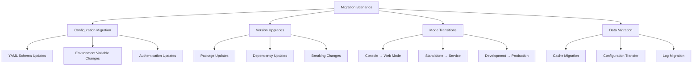

# Migration Guide

**Document Version:** 2.0
**Last Updated:** January 7, 2025
**Migration Scope:** Configuration and Version Migrations
**Target Audience:** Existing Users, System Administrators

This guide covers migration procedures for CalendarBot, including configuration updates, version upgrades, and transitioning between different operational modes.

## Table of Contents

- [Migration Overview](#migration-overview)
- [Configuration Migration](#configuration-migration)
- [Version Upgrade Procedures](#version-upgrade-procedures)
- [Operational Mode Migration](#operational-mode-migration)
- [Data Migration](#data-migration)
- [Backup and Restore](#backup-and-restore)
- [Troubleshooting Migrations](#troubleshooting-migrations)

## Migration Overview

### Migration Scenarios

CalendarBot supports several migration scenarios:



### Migration Safety

**Always backup before migration**:
```bash
# Backup configuration and data
calendarbot --backup

# Manual backup
cp -r ~/.config/calendarbot ~/.config/calendarbot.backup
cp -r ~/.local/share/calendarbot ~/.local/share/calendarbot.backup
```

## Configuration Migration

### Configuration Schema Updates

#### From Legacy to Current Schema

**Legacy Configuration** (if migrating from older versions):
```yaml
# Old format
calendar_url: "https://calendar.example.com/calendar.ics"
log_level: "INFO"
refresh_minutes: 5
```

**Current Configuration**:
```yaml
# New hierarchical format
ics:
  url: "https://calendar.example.com/calendar.ics"
  auth_type: "none"
  verify_ssl: true
  timeout: 30

refresh_interval: 300  # seconds, not minutes
cache_ttl: 3600

logging:
  console_level: "INFO"
  file_level: "DEBUG"
  file_enabled: true

display:
  type: "console"
  enabled: true

web:
  enabled: false
  port: 8080
  theme: "eink-rpi"
```

#### Migration Script for Configuration

```bash
#!/bin/bash
# migrate-config.sh

CONFIG_DIR="$HOME/.config/calendarbot"
BACKUP_DIR="$CONFIG_DIR/migration-backup"
OLD_CONFIG="$CONFIG_DIR/config.yaml"
NEW_CONFIG="$CONFIG_DIR/config-migrated.yaml"

# Create backup
mkdir -p "$BACKUP_DIR"
cp "$OLD_CONFIG" "$BACKUP_DIR/config-$(date +%Y%m%d_%H%M%S).yaml"

# Run migration using CalendarBot's built-in tools
calendarbot --setup --migrate-from "$OLD_CONFIG" --output "$NEW_CONFIG"

# Validate new configuration
if calendarbot --test-mode --config "$NEW_CONFIG"; then
    mv "$NEW_CONFIG" "$OLD_CONFIG"
    echo "✅ Configuration migration successful"
else
    echo "❌ Configuration migration failed, check $NEW_CONFIG"
    exit 1
fi
```

### Environment Variable Migration

**Environment Variable Updates**:
```bash
# Old environment variables (if any)
export CALENDAR_URL="https://example.com/cal.ics"
export LOG_LEVEL="DEBUG"

# New environment variables
export CALENDARBOT_ICS_URL="https://example.com/cal.ics"
export CALENDARBOT_LOGGING_CONSOLE_LEVEL="DEBUG"
export CALENDARBOT_LOGGING_FILE_LEVEL="DEBUG"
export CALENDARBOT_WEB_ENABLED="true"
export CALENDARBOT_WEB_PORT="8080"
```

### Authentication Migration

#### Adding Authentication to Existing Setup

```yaml
# Before: Public calendar
ics:
  url: "https://public-calendar.ics"
  auth_type: "none"

# After: Private calendar with authentication
ics:
  url: "https://private-calendar.ics"
  auth_type: "basic"
  username: "your-username"
  password: "your-password"
  verify_ssl: true
```

#### Migrating Between Authentication Methods

```bash
# Test new authentication before applying
calendarbot --test-mode --verbose --components ics

# Update configuration incrementally
calendarbot --setup --update-auth
```

## Version Upgrade Procedures

### Package Version Upgrades

#### pip Installation Upgrades

```bash
# Check current version
calendarbot --version

# Upgrade to latest version
pip install --upgrade calendarbot

# Verify upgrade
calendarbot --version
calendarbot --test-mode --verbose

# Rollback if needed
pip install calendarbot==previous-version
```

#### Source Installation Upgrades

```bash
# Navigate to installation directory
cd /path/to/calendarbot

# Backup current installation
git stash save "Pre-upgrade backup $(date)"

# Pull latest changes
git pull origin main

# Update dependencies
pip install --upgrade -r requirements.txt

# Reinstall in development mode
pip install -e .

# Test upgrade
calendarbot --test-mode --verbose

# Rollback if needed
git stash pop
```

### Database Schema Migrations

CalendarBot automatically handles cache database migrations:

```bash
# Check cache database status
sqlite3 ~/.local/share/calendarbot/calendar_cache.db ".schema"

# Force cache rebuild if needed
rm ~/.local/share/calendarbot/calendar_cache.db
calendarbot --test-mode  # Will recreate database

# Manual migration verification
calendarbot --test-mode --components cache --verbose
```

### Breaking Changes Handling

**Version 1.0 → 1.1 (Example)**:
```bash
# Before upgrade - backup
calendarbot --backup

# Check for breaking changes
curl -s https://github.com/calendarbot/calendarbot/releases/latest | grep "BREAKING"

# Upgrade with testing
pip install --upgrade calendarbot
calendarbot --test-mode --verbose

# Update configuration if needed
calendarbot --setup --validate
```

## Operational Mode Migration

### Console to Web Mode Migration

#### Configuration Changes

```yaml
# Before: Console mode
display:
  type: "console"
  enabled: true

web:
  enabled: false

# After: Web mode
display:
  type: "html"  # or "rpi" for e-ink optimization
  enabled: true

web:
  enabled: true
  port: 8080
  host: "0.0.0.0"
  theme: "eink-rpi"
  auto_refresh: 60
```

#### Service Migration

```bash
# Update systemd service for web mode
sudo systemctl stop calendarbot.service

# Edit service file
sudo tee /etc/systemd/system/calendarbot.service << EOF
[Unit]
Description=CalendarBot Web Interface
After=network-online.target

[Service]
Type=simple
User=calendarbot
ExecStart=/opt/calendarbot/venv/bin/calendarbot --web --port 8080
Restart=always

[Install]
WantedBy=multi-user.target
EOF

# Reload and restart
sudo systemctl daemon-reload
sudo systemctl start calendarbot.service
sudo systemctl status calendarbot.service
```

### Development to Production Migration

#### Configuration Hardening

```yaml
# Development configuration
logging:
  console_level: "DEBUG"
  file_level: "DEBUG"

refresh_interval: 60  # Fast refresh for development

# Production configuration
logging:
  console_level: "WARNING"
  file_level: "INFO"
  max_log_files: 5

refresh_interval: 300  # Conservative refresh for production
cache_ttl: 3600

web:
  host: "127.0.0.1"  # Restrict to localhost, use reverse proxy
```

#### Security Hardening

```bash
# Create dedicated user
sudo useradd --system --shell /bin/false calendarbot

# Set proper permissions
sudo chown -R calendarbot:calendarbot /opt/calendarbot
sudo chmod 600 /opt/calendarbot/config/config.yaml

# Configure firewall
sudo ufw allow 8080/tcp  # If directly exposing web interface
# OR use reverse proxy (recommended)
```

### Standalone to Containerized Migration

#### Docker Migration

```dockerfile
# Create Dockerfile for existing installation
FROM python:3.10-slim

# Copy existing configuration
COPY ~/.config/calendarbot /home/calendarbot/.config/calendarbot
COPY ~/.local/share/calendarbot /home/calendarbot/.local/share/calendarbot

# Install CalendarBot
RUN pip install calendarbot

# Set user
USER calendarbot

# Run web mode
CMD ["calendarbot", "--web", "--host", "0.0.0.0"]
```

```bash
# Build and test container
docker build -t calendarbot-migration .
docker run -d -p 8080:8080 --name calendarbot-test calendarbot-migration

# Verify migration
curl http://localhost:8080
docker logs calendarbot-test

# Production deployment
docker-compose up -d
```

## Data Migration

### Cache Migration

#### Database Location Changes

```bash
# Old cache location (if changed)
OLD_CACHE="$HOME/.cache/calendarbot/events.db"

# Current cache location
NEW_CACHE="$HOME/.local/share/calendarbot/calendar_cache.db"

# Migrate cache if structure is compatible
if [ -f "$OLD_CACHE" ]; then
    mkdir -p "$(dirname "$NEW_CACHE")"
    cp "$OLD_CACHE" "$NEW_CACHE"

    # Verify migration
    calendarbot --test-mode --components cache
fi
```

#### Cache Format Updates

```bash
# Force cache rebuild after format changes
rm -f ~/.local/share/calendarbot/calendar_cache.db

# CalendarBot will automatically recreate with new format
calendarbot --test-mode --components cache --verbose

# Verify events are cached correctly
sqlite3 ~/.local/share/calendarbot/calendar_cache.db "SELECT COUNT(*) FROM cached_events;"
```

### Configuration Directory Migration

#### User to System Configuration

```bash
# Copy user configuration to system location
sudo mkdir -p /etc/calendarbot
sudo cp ~/.config/calendarbot/config.yaml /etc/calendarbot/
sudo chown root:calendarbot /etc/calendarbot/config.yaml
sudo chmod 640 /etc/calendarbot/config.yaml

# Update service to use system configuration
sudo systemctl edit calendarbot.service
# Add:
# [Service]
# Environment="CALENDARBOT_CONFIG_FILE=/etc/calendarbot/config.yaml"
```

#### Project to User Configuration

```bash
# Move from project directory to user directory
PROJECT_CONFIG="./config/config.yaml"
USER_CONFIG="$HOME/.config/calendarbot/config.yaml"

if [ -f "$PROJECT_CONFIG" ]; then
    mkdir -p "$(dirname "$USER_CONFIG")"
    cp "$PROJECT_CONFIG" "$USER_CONFIG"

    # Test new location
    calendarbot --test-mode --verbose
fi
```

## Backup and Restore

### Comprehensive Backup

```bash
#!/bin/bash
# comprehensive-backup.sh

BACKUP_DIR="$HOME/calendarbot-backups/$(date +%Y%m%d_%H%M%S)"
mkdir -p "$BACKUP_DIR"

echo "Creating comprehensive CalendarBot backup..."

# Configuration
if [ -d "$HOME/.config/calendarbot" ]; then
    cp -r "$HOME/.config/calendarbot" "$BACKUP_DIR/config"
fi

# Data and cache
if [ -d "$HOME/.local/share/calendarbot" ]; then
    cp -r "$HOME/.local/share/calendarbot" "$BACKUP_DIR/data"
fi

# Logs (if in home directory)
if [ -d "$HOME/.local/share/calendarbot/logs" ]; then
    cp -r "$HOME/.local/share/calendarbot/logs" "$BACKUP_DIR/logs"
fi

# Package information
pip freeze | grep calendarbot > "$BACKUP_DIR/package-info.txt"
calendarbot --version > "$BACKUP_DIR/version.txt"

# System service (if exists)
if systemctl is-active --quiet calendarbot.service; then
    sudo cp /etc/systemd/system/calendarbot.service "$BACKUP_DIR/calendarbot.service" 2>/dev/null || true
fi

echo "Backup completed: $BACKUP_DIR"
echo "Files backed up:"
find "$BACKUP_DIR" -type f | sort
```

### Selective Restore

```bash
#!/bin/bash
# selective-restore.sh

BACKUP_DIR="$1"
COMPONENT="$2"  # config, data, logs, service

if [ -z "$BACKUP_DIR" ] || [ -z "$COMPONENT" ]; then
    echo "Usage: $0 <backup_directory> <component>"
    echo "Components: config, data, logs, service, all"
    exit 1
fi

case "$COMPONENT" in
    config)
        if [ -d "$BACKUP_DIR/config" ]; then
            cp -r "$BACKUP_DIR/config" "$HOME/.config/calendarbot"
            echo "Configuration restored"
        fi
        ;;
    data)
        if [ -d "$BACKUP_DIR/data" ]; then
            cp -r "$BACKUP_DIR/data" "$HOME/.local/share/calendarbot"
            echo "Data restored"
        fi
        ;;
    service)
        if [ -f "$BACKUP_DIR/calendarbot.service" ]; then
            sudo cp "$BACKUP_DIR/calendarbot.service" /etc/systemd/system/
            sudo systemctl daemon-reload
            echo "Service configuration restored"
        fi
        ;;
    all)
        $0 "$BACKUP_DIR" config
        $0 "$BACKUP_DIR" data
        $0 "$BACKUP_DIR" service
        ;;
    *)
        echo "Unknown component: $COMPONENT"
        exit 1
        ;;
esac

# Test restored configuration
calendarbot --test-mode --verbose
```

### Automated Backup Verification

```bash
#!/bin/bash
# verify-backup.sh

BACKUP_DIR="$1"

if [ -z "$BACKUP_DIR" ]; then
    echo "Usage: $0 <backup_directory>"
    exit 1
fi

echo "Verifying backup: $BACKUP_DIR"

# Check backup completeness
REQUIRED_FILES=("config/config.yaml" "data/calendar_cache.db" "version.txt")

for file in "${REQUIRED_FILES[@]}"; do
    if [ -f "$BACKUP_DIR/$file" ]; then
        echo "✅ $file"
    else
        echo "❌ Missing: $file"
    fi
done

# Verify configuration syntax
if [ -f "$BACKUP_DIR/config/config.yaml" ]; then
    python -c "
import yaml
try:
    with open('$BACKUP_DIR/config/config.yaml') as f:
        yaml.safe_load(f)
    print('✅ Configuration syntax valid')
except Exception as e:
    print(f'❌ Configuration syntax error: {e}')
"
fi

# Check database integrity
if [ -f "$BACKUP_DIR/data/calendar_cache.db" ]; then
    sqlite3 "$BACKUP_DIR/data/calendar_cache.db" "PRAGMA integrity_check;" | head -1
fi

echo "Backup verification completed"
```

## Troubleshooting Migrations

### Common Migration Issues

#### Configuration Format Errors

```bash
# Issue: YAML syntax errors after migration
# Solution: Validate and fix syntax

# Check YAML syntax
python -c "
import yaml
with open('~/.config/calendarbot/config.yaml') as f:
    try:
        yaml.safe_load(f)
        print('✅ YAML syntax is valid')
    except yaml.YAMLError as e:
        print(f'❌ YAML error: {e}')
"

# Fix common issues
sed -i 's/\t/  /g' ~/.config/calendarbot/config.yaml  # Replace tabs with spaces
```

#### Database Migration Failures

```bash
# Issue: Cache database corruption during migration
# Solution: Rebuild cache

# Check database integrity
sqlite3 ~/.local/share/calendarbot/calendar_cache.db "PRAGMA integrity_check;"

# Rebuild if corrupted
rm ~/.local/share/calendarbot/calendar_cache.db
calendarbot --test-mode --components cache

# Verify rebuilt database
calendarbot --test-mode --components cache --verbose
```

#### Permission Issues After Migration

```bash
# Issue: Permission denied errors
# Solution: Fix ownership and permissions

# Check current permissions
ls -la ~/.config/calendarbot/
ls -la ~/.local/share/calendarbot/

# Fix ownership (if needed)
chown -R $USER:$USER ~/.config/calendarbot/
chown -R $USER:$USER ~/.local/share/calendarbot/

# Fix permissions
chmod 600 ~/.config/calendarbot/config.yaml
chmod 644 ~/.local/share/calendarbot/calendar_cache.db
```

#### Service Migration Issues

```bash
# Issue: Service fails to start after migration
# Solution: Debug service configuration

# Check service status
sudo systemctl status calendarbot.service

# Check service logs
sudo journalctl -u calendarbot.service --since "10 minutes ago"

# Test configuration manually
sudo -u calendarbot calendarbot --test-mode --verbose

# Verify service file syntax
sudo systemd-analyze verify /etc/systemd/system/calendarbot.service
```

### Migration Validation

#### Pre-Migration Checklist

```bash
#!/bin/bash
# pre-migration-check.sh

echo "Pre-migration validation checklist:"

# Check current version
echo "Current version: $(calendarbot --version)"

# Test current functionality
if calendarbot --test-mode --quiet; then
    echo "✅ Current installation working"
else
    echo "❌ Current installation has issues"
fi

# Check disk space
AVAILABLE=$(df ~/.local/share/calendarbot | awk 'NR==2 {print $4}')
if [ "$AVAILABLE" -gt 100000 ]; then  # 100MB
    echo "✅ Sufficient disk space"
else
    echo "⚠️  Low disk space: ${AVAILABLE}KB available"
fi

# Check configuration backup
if [ -f ~/.config/calendarbot/config.yaml ]; then
    echo "✅ Configuration file exists"
    calendarbot --backup && echo "✅ Backup created"
else
    echo "❌ No configuration file found"
fi

echo "Pre-migration checks completed"
```

#### Post-Migration Validation

```bash
#!/bin/bash
# post-migration-check.sh

echo "Post-migration validation:"

# Test all components
calendarbot --test-mode --components ics,cache,display --verbose

# Check configuration
if calendarbot --test-mode --quiet; then
    echo "✅ Migration successful"
else
    echo "❌ Migration validation failed"
    echo "Consider restoring from backup"
fi

# Verify specific functionality
echo "Testing operational modes:"

# Test interactive mode (brief)
timeout 5s calendarbot --interactive < /dev/null && echo "✅ Interactive mode" || echo "⚠️  Interactive mode issue"

# Test web mode (if configured)
if grep -q "web:" ~/.config/calendarbot/config.yaml; then
    timeout 10s calendarbot --web --port 8081 &
    WEB_PID=$!
    sleep 3

    if curl -f -s http://localhost:8081 > /dev/null; then
        echo "✅ Web mode working"
    else
        echo "❌ Web mode not responding"
    fi

    kill $WEB_PID 2>/dev/null
fi

echo "Post-migration validation completed"
```

### Rollback Procedures

#### Emergency Rollback

```bash
#!/bin/bash
# emergency-rollback.sh

BACKUP_DIR="$1"

if [ -z "$BACKUP_DIR" ]; then
    echo "Usage: $0 <backup_directory>"
    echo "Available backups:"
    ls -la ~/calendarbot-backups/
    exit 1
fi

echo "Emergency rollback from: $BACKUP_DIR"

# Stop service if running
sudo systemctl stop calendarbot.service 2>/dev/null || true

# Restore configuration
if [ -d "$BACKUP_DIR/config" ]; then
    rm -rf ~/.config/calendarbot
    cp -r "$BACKUP_DIR/config" ~/.config/calendarbot
    echo "✅ Configuration restored"
fi

# Restore data
if [ -d "$BACKUP_DIR/data" ]; then
    rm -rf ~/.local/share/calendarbot
    cp -r "$BACKUP_DIR/data" ~/.local/share/calendarbot
    echo "✅ Data restored"
fi

# Restore service (if exists)
if [ -f "$BACKUP_DIR/calendarbot.service" ]; then
    sudo cp "$BACKUP_DIR/calendarbot.service" /etc/systemd/system/
    sudo systemctl daemon-reload
    echo "✅ Service restored"
fi

# Restart service
sudo systemctl start calendarbot.service 2>/dev/null || true

# Test rollback
if calendarbot --test-mode --quiet; then
    echo "✅ Rollback successful"
else
    echo "❌ Rollback failed - manual intervention required"
fi
```

---

## Migration Support

### Getting Help with Migrations

1. **Pre-Migration**: Always create comprehensive backups
2. **Test Migrations**: Use test environments when possible
3. **Validation**: Run post-migration validation scripts
4. **Documentation**: Keep migration logs for troubleshooting
5. **Community**: Check migration guides and community forums

### Migration Best Practices

- **Backup Everything**: Configuration, data, service files, and environment
- **Test First**: Validate migrations in non-production environments
- **Incremental Changes**: Make one change at a time when possible
- **Validation**: Always test functionality after migration
- **Document Changes**: Keep records of what was migrated and why

---

**Migration Guide v2.0** - Comprehensive migration procedures for CalendarBot configuration, versions, and operational modes with automated tooling and validation.
