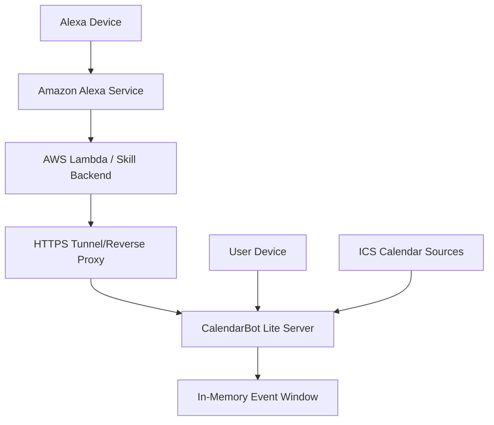

# Amazon Alexa Integration for CalendarBot Lite

This document describes the integration between Amazon Alexa and CalendarBot Lite, enabling voice queries like "What's my next meeting?" and "How long until my next meeting?".

## Architecture Overview

The integration uses a **Local LAN + Static Bearer Token** approach:



## Components

1. **CalendarBot Lite Server** - Runs on user device with new Alexa endpoints
2. **Reverse Proxy/TLS Terminator** - Caddy or nginx for HTTPS exposure
3. **Alexa Custom Skill** - Registered in Amazon Developer Console
4. **Skill Backend** - AWS Lambda function calling CalendarBot endpoints
5. **Bearer Token Authentication** - Static token for API security

## API Contract

### Endpoint: `/api/alexa/next-meeting`

**Purpose**: Get next upcoming meeting with speech-formatted response

**Authentication**: Bearer token required

**Request**:
```http
GET /api/alexa/next-meeting
Authorization: Bearer <static-token>
```

**Response** (meeting found):
```json
{
  "meeting": {
    "subject": "Team Standup",
    "start_iso": "2023-10-25T14:30:00Z",
    "seconds_until_start": 1800,
    "speech_text": "Your next meeting is Team Standup in 30 minutes.",
    "duration_spoken": "in 30 minutes"
  }
}
```

**Response** (no meetings):
```json
{
  "meeting": null,
  "speech_text": "You have no upcoming meetings."
}
```

### Endpoint: `/api/alexa/time-until-next`

**Purpose**: Get time until next meeting

**Authentication**: Bearer token required

**Request**:
```http
GET /api/alexa/time-until-next
Authorization: Bearer <static-token>
```

**Response** (meeting found):
```json
{
  "seconds_until_start": 1800,
  "duration_spoken": "in 30 minutes",
  "speech_text": "Your next meeting is in 30 minutes."
}
```

**Response** (no meetings):
```json
{
  "seconds_until_start": null,
  "speech_text": "You have no upcoming meetings."
}
```

## Alexa Skill Model

### Interaction Model

```json
{
  "interactionModel": {
    "languageModel": {
      "invocationName": "calendar bot",
      "intents": [
        {
          "name": "GetNextMeetingIntent",
          "slots": [],
          "samples": [
            "what's my next meeting",
            "what is my next meeting",
            "tell me my next meeting",
            "what meeting do I have next",
            "what's coming up next",
            "what's next on my calendar",
            "what do I have next"
          ]
        },
        {
          "name": "GetTimeUntilNextMeetingIntent",
          "slots": [],
          "samples": [
            "how long until my next meeting",
            "when is my next meeting",
            "how much time until my next meeting",
            "how many minutes until my next meeting",
            "when do I need to be in my next meeting",
            "how long do I have until my next meeting",
            "what time is my next meeting"
          ]
        },
        {
          "name": "AMAZON.HelpIntent",
          "samples": []
        },
        {
          "name": "AMAZON.StopIntent", 
          "samples": []
        },
        {
          "name": "AMAZON.CancelIntent",
          "samples": []
        }
      ],
      "types": []
    }
  }
}
```

### Example Interactions

**User**: "Alexa, ask Calendar Bot what's my next meeting?"
**Alexa**: "Your next meeting is Team Standup in 30 minutes."

**User**: "Alexa, ask Calendar Bot how long until my next meeting?"
**Alexa**: "Your next meeting is in 30 minutes."

**User**: "Alexa, ask Calendar Bot what's my next meeting?"
**Alexa**: "You have no upcoming meetings."

## Security and Privacy

### Authentication
- Static bearer token stored in Alexa skill environment variables
- Token transmitted over HTTPS only
- No OAuth complexity - suitable for single-user home deployment

### Privacy Controls
- Minimal data exposure: only subject, start time, duration
- No attendee information, meeting content, or location shared
- Local processing - calendar data stays on user device
- Logs retention configurable on device

### Network Security
- HTTPS required for all communication
- Bearer token in Authorization header (not URL)
- Rate limiting recommended (not implemented)
- IP allowlisting possible at reverse proxy level

### Data Minimization
- Only next meeting information exposed
- No historical or bulk calendar access
- Skipped meetings respected (privacy feature)
- Session-based access only (no persistent storage)

## Error Handling

### HTTP Status Codes
- `200` - Success
- `401` - Unauthorized (invalid/missing bearer token)
- `500` - Internal server error

### Alexa Responses
- Network errors: "Sorry, I'm having trouble accessing your calendar right now."
- No meetings: "You have no upcoming meetings."
- Auth errors: Logged but not exposed to user

## Configuration

### CalendarBot Lite Config

Add to `calendarbot_lite/config.yaml`:

```yaml
sources:
  - "https://calendar.example.com/calendar.ics"

# Alexa Integration
alexa_bearer_token: "your-secret-token-here"

# Standard settings
refresh_interval_seconds: 300
server_bind: "0.0.0.0"
server_port: 8080
```

### Environment Variables

```bash
# CalendarBot Lite
CALENDARBOT_ICS_URL="https://calendar.example.com/calendar.ics"
CALENDARBOT_ALEXA_BEARER_TOKEN="your-secret-token-here"

# AWS Lambda (Skill Backend)
CALENDARBOT_ENDPOINT="https://your-domain.com"
CALENDARBOT_BEARER_TOKEN="your-secret-token-here"
REQUEST_TIMEOUT="10"
```

## Deployment Options

### Option A: Local Network with Port Forwarding

1. Run CalendarBot Lite on local device
2. Configure router port forwarding (8080 → device)
3. Set up dynamic DNS (optional)
4. Use Caddy for automatic HTTPS/LetsEncrypt
5. Deploy Alexa skill backend to AWS Lambda

**Pros**: Simple, no external dependencies
**Cons**: Requires router configuration, security responsibility

### Option B: Secure Tunnel (Development)

1. Run CalendarBot Lite locally
2. Use ngrok or similar for HTTPS tunnel
3. Deploy Alexa skill backend with tunnel URL
4. Temporary/testing solution

**Pros**: No router configuration needed
**Cons**: Tunnel dependency, not for production

### Option C: Cloud Proxy (Advanced)

1. Deploy lightweight proxy on cloud (AWS/DigitalOcean)
2. Proxy forwards requests to home device via VPN/tunnel
3. CalendarBot Lite stays local for privacy

**Pros**: Professional setup, good security
**Cons**: More complex, ongoing cloud costs

## Testing

### Unit Tests
```bash
# Test authentication and formatting functions
pytest tests/test_alexa_integration.py -v
```

### Manual Testing
```bash
# Test endpoints with curl
curl -H "Authorization: Bearer your-token" \
     https://your-domain.com/api/alexa/next-meeting

curl -H "Authorization: Bearer your-token" \
     https://your-domain.com/api/alexa/time-until-next
```

### Alexa Skill Testing
1. Use Alexa Developer Console simulator
2. Test on actual Alexa device
3. Check AWS CloudWatch logs for skill backend

## Troubleshooting

### Common Issues

**"Unauthorized" responses**:
- Check bearer token configuration in both CalendarBot and Lambda
- Verify token matches exactly (no extra spaces/characters)

**"Calendar access trouble" responses**:
- Check CalendarBot Lite server is running and accessible
- Verify HTTPS endpoint is reachable from Lambda
- Check AWS CloudWatch logs for detailed errors

**Alexa doesn't respond**:
- Verify skill is enabled in Alexa app
- Check interaction model is saved and built
- Test with Alexa Developer Console first

**Network connectivity**:
- Test HTTPS endpoint with curl from external network
- Check firewall/router port forwarding
- Verify TLS certificate is valid

### Log Locations

- **CalendarBot Lite**: Console output, configurable log level
- **AWS Lambda**: CloudWatch Logs `/aws/lambda/your-function-name`
- **Alexa Requests**: Alexa Developer Console > Test tab

## Future Enhancements

- Support for specific meeting queries ("What's my 2pm meeting?")
- Meeting location information
- Multiple calendar support
- Time zone handling improvements
- Rate limiting and abuse protection
- Meeting creation/modification via voice
- Integration with meeting platforms (Zoom, Teams)