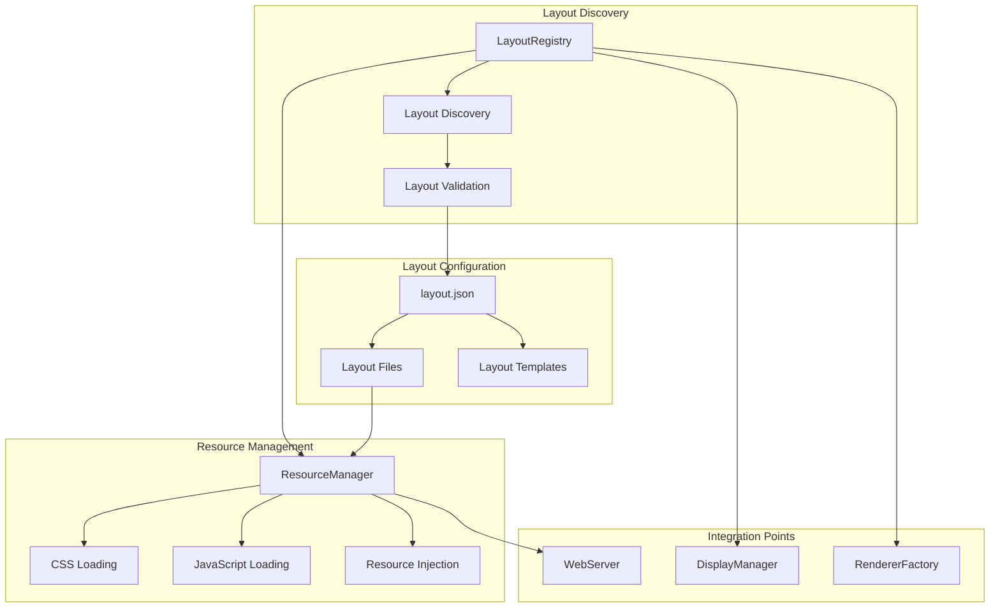
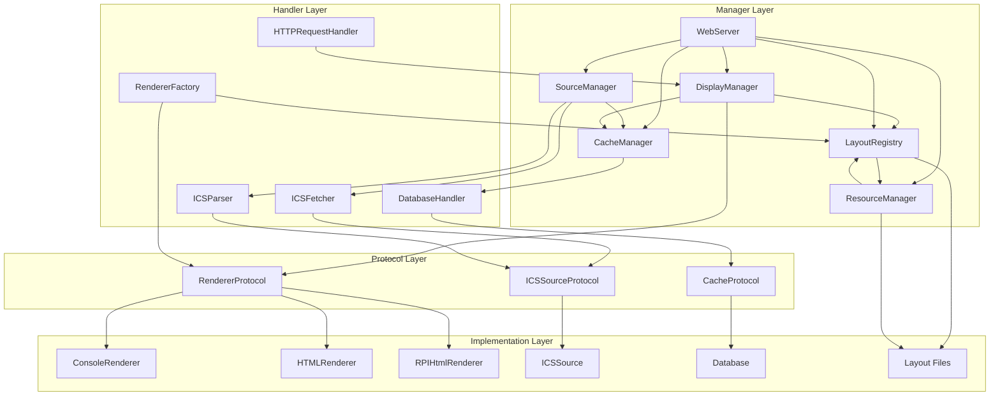
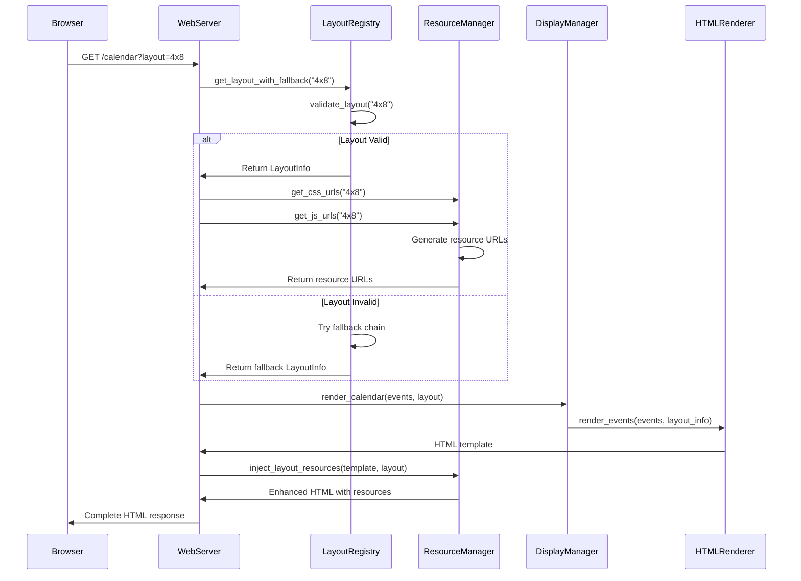
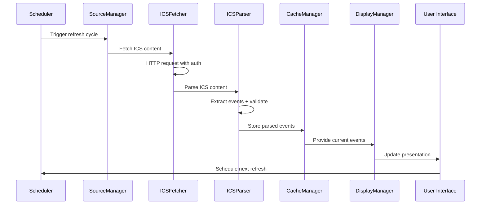
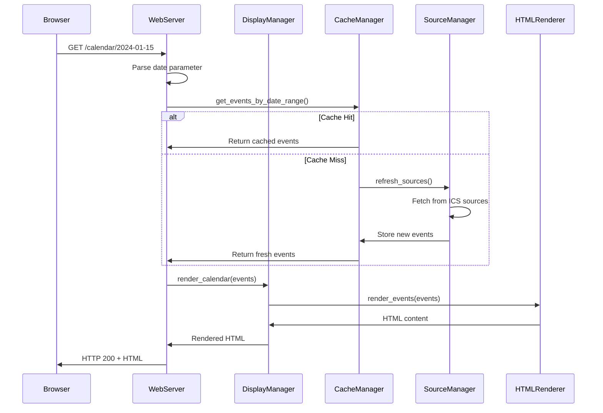
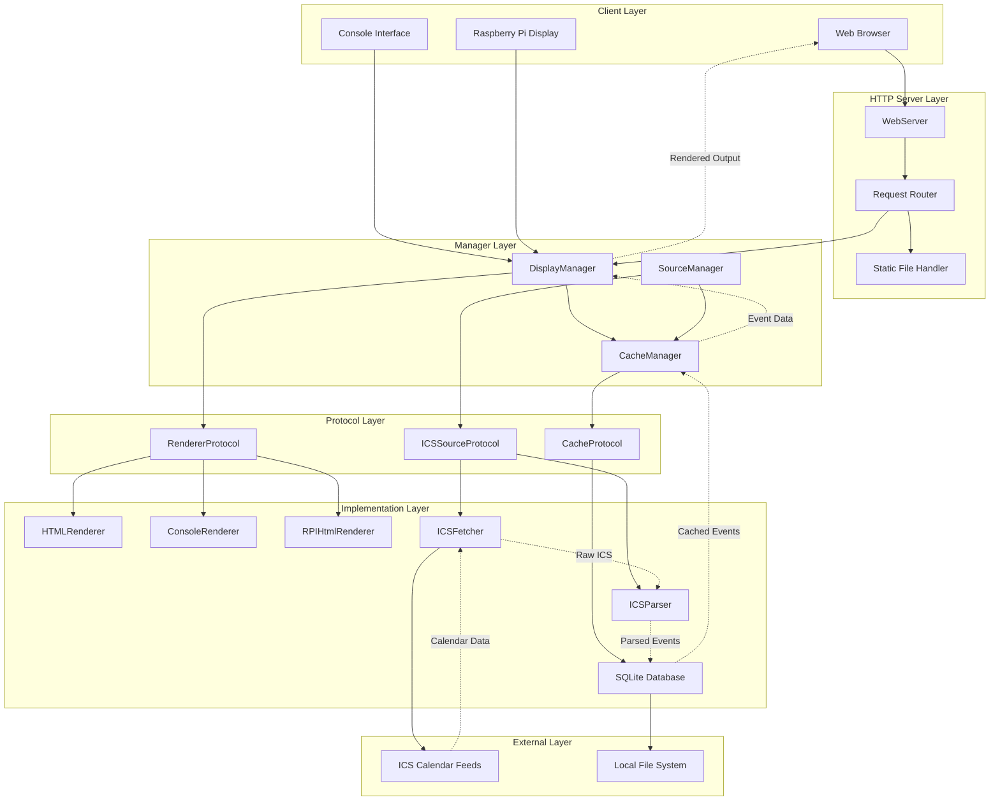
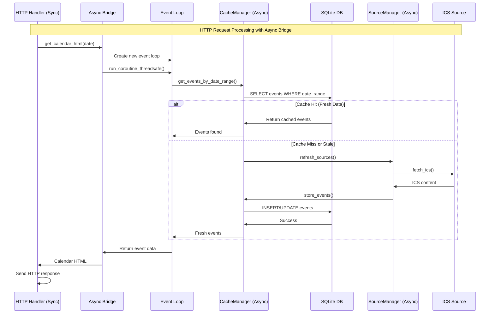
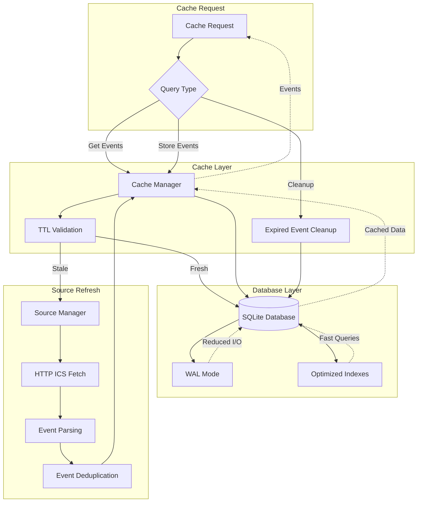
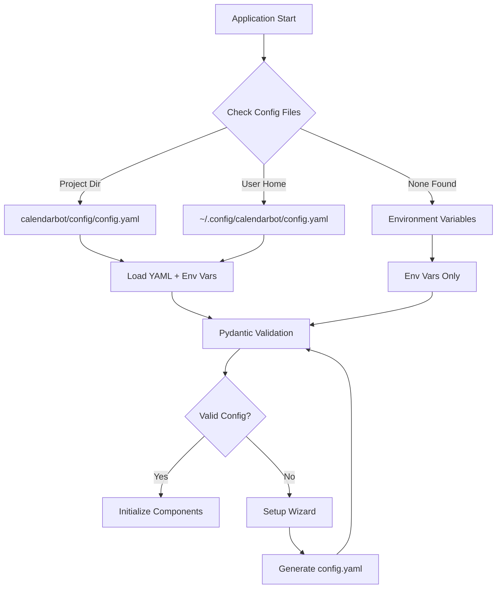

# CalendarBot System Architecture

**Document Version:** 3.2
**Last Updated:** August 3, 2025 (Updated to match current implementation)
**Architecture Version:** ICS Calendar System v1.0
**Target Audience:** Developers, System Architects, Technical Contributors

## Executive Summary

This document outlines the complete system architecture for CalendarBot, an ICS-based calendar display application with multiple operational modes including console, interactive navigation, web interface, and Raspberry Pi e-ink display support. The system is designed for universal calendar compatibility, real-time updates, and extensible deployment options.

## 1. Technology Stack

### Core Platform
- **Language**: Python 3.8+ with modern async/await patterns
- **Architecture**: Modular component-based design with clear separation of concerns
- **Configuration**: Pydantic-based settings with YAML configuration files
- **Packaging**: Modern Python packaging with [`pyproject.toml`](pyproject.toml)

### Key Dependencies
- **ICS Processing**: [`icalendar`](https://pypi.org/project/icalendar/) (RFC 5545 compliant parsing)
- **HTTP Client**: [`httpx`](https://pypi.org/project/httpx/) (async HTTP with authentication support)
- **Data Validation**: [`pydantic`](https://pypi.org/project/pydantic/) v2.0+ (settings and data model validation)
- **Database**: [`aiosqlite`](https://pypi.org/project/aiosqlite/) (async SQLite for event caching)
- **Configuration**: [`PyYAML`](https://pypi.org/project/PyYAML/) + [`pydantic-settings`](https://pypi.org/project/pydantic-settings/)
- **Date/Time**: [`python-dateutil`](https://pypi.org/project/python-dateutil/) + [`pytz`](https://pypi.org/project/pytz/) (timezone handling)
- **Scheduling**: [`APScheduler`](https://pypi.org/project/APScheduler/) (background task scheduling)

### Universal Calendar Support
- **Microsoft Outlook/Office 365**: Published calendar ICS URLs
- **Google Calendar**: Secret iCal format URLs
- **Apple iCloud Calendar**: Public calendar ICS URLs
- **CalDAV Servers**: Nextcloud, Radicale, SOGo, etc.
- **Any RFC 5545 compliant** calendar system

## 2. Application Architecture

### High-Level Component Architecture

```mermaid
graph TB
    subgraph "Entry Points"
        CLI_MAIN["calendarbot/cli/__init__.py"]
        EP2[calendarbot.__main__.py]
    end

    subgraph "Core Application"
        MAIN[calendarbot.cli.main_entry() → calendarbot.main.CalendarBot]
        SETTINGS[config.settings.CalendarBotSettings]
        WIZARD[calendarbot.setup_wizard.SetupWizard]
    end

    subgraph "Data Layer"
        SOURCES[sources.SourceManager]
        ICS[ics.ICSFetcher + ICSParser]
        CACHE[cache.CacheManager + Database]
    end

    subgraph "Presentation Layer"
        DISPLAY[display.DisplayManager]
        UI[ui.InteractiveController]
        WEB[web.WebServer]
    end

    subgraph "Infrastructure"
        UTILS[utils.logging + helpers]
        VALIDATION[validation.ValidationRunner]
    end

    EP1 --> MAIN
    EP2 --> MAIN
    EP3 --> MAIN

    MAIN --> SOURCES
    MAIN --> CACHE
    MAIN --> DISPLAY

    SOURCES --> ICS
    ICS --> CACHE

    DISPLAY --> UI
    DISPLAY --> WEB

    MAIN --> VALIDATION
    MAIN --> UTILS

    WIZARD --> SETTINGS
    WIZARD --> ICS
```

### Module Structure

#### 1. **Source Management** ([`calendarbot/sources/`](calendarbot/sources/))
- Source coordination and health monitoring
- ICS feed handling and authentication
- Source configuration data models
- Source-specific error handling

#### 2. **ICS Processing** ([`calendarbot/ics/`](calendarbot/ics/))
- Async HTTP client with auth and caching support
- RFC 5545 compliant ICS content parsing
- ICS data models and validation
- ICS-specific error types

#### 3. **Cache Management** ([`calendarbot/cache/`](calendarbot/cache/))
- Cache coordination and TTL management
- Async SQLite operations with WAL mode
- Cache entry data models

#### 4. **Display Management** ([`calendarbot/display/`](calendarbot/display/))
- Display coordination and mode switching
- Console output formatting
- Web-compatible HTML rendering
- E-ink optimized HTML layouts
- E-paper display drivers and integration

#### 5. **Layout Management** ([`calendarbot/layout/`](calendarbot/layout/))
- Dynamic layout discovery and validation
- CSS/JS resource loading and injection
- Layout-specific error handling

#### 6. **User Interface** ([`calendarbot/ui/`](calendarbot/ui/))
- Interactive navigation controller
- Cross-platform keyboard input handling
- Date navigation and filtering logic

#### 7. **Web Interface** ([`calendarbot/web/`](calendarbot/web/))
- Web server implementation with layout integration
- Web-based navigation handling
- Layout configurations and resources in `static/layouts/`

#### 8. **Utilities** ([`calendarbot/utils/`](calendarbot/utils/))
- Enhanced logging system with interactive mode support
- Common utility functions

#### 9. **Validation Framework** ([`calendarbot/validation/`](calendarbot/validation/))
- Comprehensive system validation
- Test result models and reporting
- Validation-specific logging

#### 10. **Configuration System** ([`calendarbot/config/`](calendarbot/config/))
- Pydantic settings models with YAML integration
- Example configuration template
- ICS-specific configuration helpers

## 3. Operational Modes

### 1. Setup Mode (`--setup`)
**Entry Point**: [`calendarbot/setup_wizard.py`](calendarbot/setup_wizard.py)
- Interactive configuration wizard with service templates
- Automatic ICS feed validation and testing
- Authentication setup (basic auth, bearer tokens)
- Configuration file generation and management

### 2. Interactive Mode (`--interactive`)
**Components**: [`cli/modes/interactive.py`](calendarbot/cli/modes/interactive.py)
- Keyboard-driven navigation (arrow keys, space, ESC)
- Real-time background data fetching
- Split-screen logging in development mode
- Cross-platform input handling

### 3. Web Mode (`--web`)
**Components**: [`cli/modes/web.py`](calendarbot/cli/modes/web.py)
- Browser-based calendar interface
- Multiple layout support (4x8, 3x4, whats-next-view)
- Auto-refresh capabilities
- Mobile-responsive design

### 4. E-Paper Mode (`--epaper`)
**Components**: [`cli/modes/epaper.py`](calendarbot/cli/modes/epaper.py)
- E-ink display optimized layouts (800x480px)
- High contrast, minimal refresh themes
- Power-efficient rendering strategies
- Web interface integration

### 5. Test/Validation Mode (`--test-mode`)
**Components**: [`cli/modes/test.py`](calendarbot/cli/modes/test.py)
- Comprehensive system validation
- Component-specific testing (ICS, cache, display)
- Performance benchmarking
- Configuration verification

### 6. Default Mode
**Components**: [`cli/__init__.py`](calendarbot/cli/__init__.py)
- Defaults to web mode when no other mode is specified
- Configuration validation and loading
- Graceful error handling and recovery
- Command-line argument processing

## 4. Layout Management System

### Layout Architecture Overview

The layout system provides dynamic layout discovery, validation, and resource management for flexible UI rendering across different devices and display types.



### Layout Component Dependencies

```python
# calendarbot/layout/registry.py
class LayoutRegistry:
    """Central registry for dynamic layout discovery and management."""
    
    # Core Functionality:
    - discover_layouts(): Filesystem-based layout discovery
    - validate_layout(): Configuration validation
    - get_layout_with_fallback(): Automatic fallback chain resolution
    - get_renderer_type(): Renderer selection integration
    
    # Integration Points:
    - DisplayManager: Layout selection and renderer coordination
    - WebServer: Dynamic layout switching
    - ResourceManager: Layout resource loading
```

```python
# calendarbot/layout/resource_manager.py
class ResourceManager:
    """Manages dynamic loading of layout resources."""
    
    # Resource Management:
    - get_css_urls(): Dynamic CSS URL generation
    - get_js_urls(): Dynamic JavaScript URL generation
    - inject_layout_resources(): HTML template resource injection
    - validate_layout_resources(): Resource existence validation
    
    # Caching Strategy:
    - Resource URL caching for performance
    - Content caching for offline operation
    - Cache invalidation on layout changes
```

## 5. Component Dependency Architecture

### Manager→Handler→Protocol Relationship Mapping

The system uses a three-tier architecture with clear dependency relationships, now including layout management:



### Detailed Component Dependencies

#### 1. **SourceManager Dependencies**
```python
# calendarbot/sources/manager.py
class SourceManager:
    """Coordinates multiple calendar sources with health monitoring."""
    
    # Direct Dependencies:
    - ICSFetcher: HTTP client for calendar feeds
    - ICSParser: RFC 5545 compliant parsing
    - CacheManager: Event storage and retrieval
    - Logger: Structured logging with context
    
    # Protocol Dependencies:
    - ICSSourceProtocol: Type-safe source definitions
    - CacheProtocol: Cache operation contracts
    
    # Async Coordination:
    - asyncio.gather(): Concurrent source fetching
    - asyncio.wait_for(): Timeout management
    - asyncio.Lock(): Thread-safe cache updates
```

#### 2. **DisplayManager Dependencies**
```python
# calendarbot/display/manager.py
class DisplayManager:
    """Coordinates display rendering with renderer selection."""
    
    # Direct Dependencies:
    - RendererProtocol: Type-safe renderer interface
    - CacheManager: Event data retrieval
    - Settings: Display configuration
    
    # Renderer Implementations:
    - ConsoleRenderer: Terminal output
    - HTMLRenderer: Web interface rendering
    - RPIHtmlRenderer: E-ink optimized rendering
    
    # Dependency Injection Pattern:
    - Runtime renderer selection based on mode
    - Protocol-based renderer swapping
    - Configuration-driven behavior
```

#### 3. **WebServer Dependencies**
```python
# calendarbot/web/server.py
class WebServer(BaseHTTPRequestHandler):
    """HTTP server with async/sync bridge patterns."""
    
    # Manager Dependencies:
    - DisplayManager: HTML rendering coordination
    - CacheManager: Event data access
    - SourceManager: Calendar source management
    
    # Async Bridge Dependencies:
    - ThreadPoolExecutor: Async execution in sync context
    - asyncio.run_coroutine_threadsafe(): Event loop bridging
    - concurrent.futures: Thread coordination
    
    # Protocol Dependencies:
    - RendererProtocol: Consistent rendering interface
    - CacheProtocol: Cache operation contracts
```

### Component Interaction Patterns

#### Manager Coordination Pattern
```python
# Example: DisplayManager → RendererProtocol → Implementation
async def render_calendar(self, date_range: DateRange) -> str:
    """Coordinate rendering through protocol interface."""
    
    # 1. Get data through CacheManager
    events = await self.cache_manager.get_events_in_range(date_range)
    
    # 2. Delegate to protocol implementation
    return await self.renderer.render_events(
        events=events,
        date_range=date_range,
        settings=self.settings
    )
```

#### Async Bridge Pattern
```python
# Example: WebServer async/sync coordination
def get_calendar_html(self, date_str: str) -> str:
    """Bridge sync HTTP handler to async operations."""
    
    # Create new event loop for async operations
    loop = asyncio.new_event_loop()
    asyncio.set_event_loop(loop)
    
    try:
        # Execute async manager calls in controlled environment
        future = asyncio.run_coroutine_threadsafe(
            self._async_get_calendar(date_str),
            self._async_loop
        )
        return future.result(timeout=30)
    finally:
        loop.close()
```

### Layout Configuration Format

Each layout is defined by a `layout.json` configuration file with the following structure:

```json
{
  "name": "4x8",
  "display_name": "4×8 Landscape",
  "description": "Standard landscape layout optimized for 4×8 inch displays",
  "version": "1.0.0",
  "orientation": "landscape",
  "dimensions": {
    "min_width": 480,
    "min_height": 800,
    "optimal_width": 480,
    "optimal_height": 800,
    "fixed_dimensions": true
  },
  "capabilities": {
    "grid_dimensions": {
      "columns": 4,
      "rows": 8
    },
    "display_modes": ["landscape", "standard"],
    "supported_devices": ["lcd", "oled", "web"],
    "animations": true,
    "layout_switching": true
  },
  "resources": {
    "css": [
      {
        "file": "4x8.css",
        "media": "screen",
        "priority": 1
      }
    ],
    "js": [
      {
        "file": "4x8.js",
        "type": "module",
        "priority": 1,
        "defer": true
      }
    ]
  },
  "fallback_layouts": ["3x4", "console"],
  "compatibility": {
    "min_screen_width": 320,
    "min_screen_height": 240,
    "supports_touch": true,
    "supports_keyboard": true,
    "accessibility_features": [
      "keyboard_navigation",
      "focus_management",
      "screen_reader_support"
    ]
  }
}
```

### Specialized Layout Example: whats-next-view

The **whats-next-view** layout demonstrates advanced layout capabilities with specialized functionality:

```json
{
  "name": "whats-next-view",
  "display_name": "What's Next Countdown",
  "description": "Countdown timer layout for next meeting with smart detection",
  "version": "1.0.0",
  "orientation": "flexible",
  "dimensions": {
    "min_width": 320,
    "min_height": 240,
    "optimal_width": 800,
    "optimal_height": 480,
    "fixed_dimensions": false
  },
  "capabilities": {
    "real_time_updates": true,
    "countdown_timer": true,
    "meeting_detection": true,
    "display_modes": ["countdown", "eink", "standard"],
    "supported_devices": ["eink", "rpi", "web", "mobile"],
    "animations": false,
    "layout_switching": true,
    "accessibility_features": [
      "high_contrast_mode",
      "large_text_support",
      "screen_reader_announcements"
    ]
  },
  "specialized_features": {
    "countdown_precision": "seconds",
    "meeting_detection_algorithm": "next_event_priority",
    "auto_refresh_interval": 1000,
    "timezone_aware": true,
    "fallback_display": "next_day_events"
  },
  "resources": {
    "css": [
      {
        "file": "whats-next-view.css",
        "media": "screen",
        "priority": 1
      }
    ],
    "js": [
      {
        "file": "whats-next-view.js",
        "type": "module",
        "priority": 1,
        "defer": true,
        "features": ["countdown_timer", "meeting_detection"]
      }
    ]
  },
  "fallback_layouts": ["4x8", "3x4", "console"],
  "compatibility": {
    "min_screen_width": 240,
    "min_screen_height": 180,
    "supports_touch": true,
    "supports_keyboard": true,
    "eink_optimized": true,
    "power_efficient": true
  }
}
```

#### whats-next-view Architecture Features

1. **Real-time Countdown System**
   - JavaScript-based countdown timer with 1-second precision
   - Automatic detection of next upcoming meeting
   - Graceful handling of timezone transitions

2. **E-ink Display Optimization**
   - High contrast CSS with minimal refresh requirements
   - Power-efficient rendering strategies
   - Optimized for 800x480px e-ink displays

3. **Meeting Detection Algorithm**
   - Prioritizes meetings starting within the next 24 hours
   - Filters out all-day events for countdown accuracy
   - Fallback to next day's first event when no meetings today

4. **Accessibility Integration**
   - Large text support for distant viewing
   - High contrast mode for various lighting conditions
   - Screen reader announcements for countdown updates

### Layout Directory Structure

```
calendarbot/web/static/layouts/
├── 4x8/
│   ├── layout.json          # Layout configuration
│   ├── 4x8.css             # Layout styles
│   ├── 4x8.js              # Layout JavaScript
│   └── assets/             # Optional: layout-specific assets
├── 3x4/
│   ├── layout.json
│   ├── 3x4.css
│   └── 3x4.js
├── whats-next-view/
│   ├── layout.json         # Specialized countdown layout
│   ├── whats-next-view.css # E-ink optimized styles
│   ├── whats-next-view.js  # Meeting detection logic
│   └── assets/
│       └── countdown-icons/ # Countdown-specific icons
└── custom-layout/
    ├── layout.json
    ├── custom.css
    ├── custom.js
    └── themes/
        ├── dark.css
        └── light.css
```

### Layout Integration Flow



## 6. Data Flow Architecture

### Event Processing Pipeline



### HTTP Request Flow Through Components



### Complete System Data Flow



### Async Operation Flow



### Cache Management Flow



### Configuration Loading Flow



## 5. Configuration Management

### Settings Architecture

The configuration system uses a hierarchical approach implemented in [`config/settings.py`](config/settings.py):

1. **Default Values**: Built into Pydantic models
2. **YAML Configuration**: Project or user config directories
3. **Environment Variables**: `CALENDARBOT_*` prefix support
4. **Command Line Arguments**: Runtime overrides

### Configuration Schema

```yaml
# ICS Calendar Configuration
ics:
  url: "https://calendar.example.com/calendar.ics"
  auth_type: "none"  # none, basic, bearer
  username: "user"   # for basic auth
  password: "pass"   # for basic auth
  token: "token"     # for bearer auth
  verify_ssl: true
  timeout: 30

# Application Settings
app_name: "CalendarBot"
refresh_interval: 300  # seconds
cache_ttl: 3600       # seconds

# Display Settings
display_enabled: true
display_type: "console"  # console, html, rpi

# Comprehensive Logging Configuration
logging:
  console_enabled: true
  console_level: "WARNING"
  console_colors: true
  file_enabled: true
  file_level: "DEBUG"
  file_directory: null  # defaults to data_dir/logs
  max_log_files: 5
  interactive_split_display: true
  interactive_log_lines: 5

# Web Interface Settings
web:
  enabled: false
  port: 8080
  host: "0.0.0.0"
  theme: "4x8"    # 4x8, 3x4
  auto_refresh: 60

# Raspberry Pi E-ink Settings
rpi:
  enabled: false
  display_width: 800
  display_height: 480
  refresh_mode: "partial"  # partial, full
  auto_theme: true
```

### Settings Validation

```python
# Example from config/settings.py
class CalendarBotSettings(BaseSettings):
    """Type-safe configuration with automatic validation."""

    # ICS configuration with validation
    ics_url: Optional[str] = Field(None, description="ICS calendar URL")
    ics_auth_type: Optional[str] = Field(None, regex="^(none|basic|bearer)$")

    # Automatic environment variable mapping
    class Config:
        env_prefix = "CALENDARBOT_"
        env_file = ".env"
```

## 6. Caching & Storage Architecture

### SQLite Database Design

The cache system uses async SQLite with WAL mode for optimal performance:

```sql
-- Event Cache Table
CREATE TABLE cached_events (
    id TEXT PRIMARY KEY,
    source_name TEXT NOT NULL,
    subject TEXT NOT NULL,
    start_datetime TIMESTAMP NOT NULL,
    end_datetime TIMESTAMP NOT NULL,
    location TEXT,
    is_all_day BOOLEAN DEFAULT FALSE,
    show_as TEXT DEFAULT 'busy',
    created_at TIMESTAMP DEFAULT CURRENT_TIMESTAMP,
    expires_at TIMESTAMP NOT NULL,
    INDEX idx_start_datetime (start_datetime),
    INDEX idx_expires_at (expires_at)
);

-- Cache Metadata Table
CREATE TABLE cache_metadata (
    key TEXT PRIMARY KEY,
    value TEXT NOT NULL,
    updated_at TIMESTAMP DEFAULT CURRENT_TIMESTAMP
);
```

### Caching Strategy

**WAL Mode Benefits**:
- Reduced storage wear (important for SD cards)
- Better concurrent read/write access
- Improved crash recovery
- Optimal for single-writer, multiple-reader scenarios

**TTL Management**:
- Configurable cache expiration (default: 1 hour)
- Automatic cleanup of expired events
- Smart refresh based on cache freshness
- Offline operation with cached data

## 7. Error Handling & Resilience

### Network Resilience

```python
# Example from source manager
async def fetch_with_retry(self, source: ICSSource) -> ICSResponse:
    """Fetch with exponential backoff retry logic."""
    for attempt in range(self.settings.max_retries):
        try:
            response = await self.fetcher.fetch_ics(source)
            if response.success:
                return response
        except NetworkError as e:
            if attempt < self.settings.max_retries - 1:
                delay = self.settings.retry_backoff_factor ** attempt
                await asyncio.sleep(delay)
            else:
                return ICSResponse(success=False, error_message=str(e))
```

### Graceful Degradation

- **Network Failures**: Automatic fallback to cached data
- **ICS Parse Errors**: Partial recovery with detailed error reporting
- **Cache Corruption**: Automatic cache rebuilding
- **Display Errors**: Minimal error display with system status

## 8. Testing & Validation Framework

### Validation Components

The [`validation`](calendarbot/validation/) module provides comprehensive testing:

```python
# Validation runner supports component-specific testing
class ValidationRunner:
    """Comprehensive system validation."""

    async def run_validation(self) -> ValidationResults:
        """Run validation for specified components."""
        if 'ics' in self.components:
            await self._validate_ics_connectivity()
        if 'cache' in self.components:
            await self._validate_cache_operations()
        if 'display' in self.components:
            await self._validate_display_functionality()
```

### Test Execution

```bash
# Quick validation
calendarbot --test-mode

# Comprehensive testing with specific components
calendarbot --test-mode --verbose --components ics,cache --date 2024-01-15

# JSON output for automation
calendarbot --test-mode --output-format json > validation-results.json
```

## 9. Security & Privacy

### Data Protection

- **Local-First Architecture**: All calendar data processed locally
- **No Cloud Dependencies**: Direct ICS feed access without intermediaries
- **User-Controlled Data**: User manages all data retention policies
- **Minimal Network Footprint**: Only necessary ICS fetch requests

### Authentication Security

- **HTTPS Required**: SSL/TLS for all ICS feed access
- **Multiple Auth Methods**: Basic auth, bearer tokens, or public access
- **Credential Protection**: Secure credential storage in configuration files
- **SSL Validation**: Configurable certificate validation

## 10. Performance Optimization

### Resource Utilization Targets

- **Memory Usage**: < 50MB resident memory for typical operation
- **CPU Usage**: < 1% idle, < 10% during refresh cycles
- **Storage**: < 5MB cache database with automatic cleanup
- **Network**: Efficient HTTP caching with conditional requests

### Async/Await Benefits

- **Non-blocking I/O**: HTTP requests don't block UI updates
- **Concurrent Operations**: Multiple data sources can be fetched simultaneously
- **Responsive UI**: Interactive mode remains responsive during background fetching
- **Resource Efficiency**: Minimal thread overhead compared to threading approaches

## 11. Deployment Architecture

### Entry Points

```
# Execution methods
python main.py                    # Direct execution
python -m calendarbot            # Module execution via __main__.py
calendarbot --web --port 8080    # Web interface with specified port
calendarbot --interactive        # Interactive console mode
calendarbot --epaper             # E-paper display mode
calendarbot --test-mode          # Test/validation mode
calendarbot --setup              # Configuration wizard
```

### File Structure

```
calendarBot/
├── main.py                      # Primary entry point
├── requirements-dev.txt         # Development dependencies
├── requirements-dev-full.txt    # Full development dependencies
├── calendarbot/
│   ├── __init__.py              # Package initialization
│   ├── __main__.py              # Module execution support
│   ├── main.py                  # Core application logic
│   ├── setup_wizard.py          # Interactive configuration
│   ├── benchmarking/            # Performance benchmarking
│   ├── cache/                   # Event caching system
│   ├── cli/                     # Command-line interface
│   │   └── modes/               # Operational modes
│   ├── config/                  # Configuration management
│   ├── display/                 # Output rendering
│   │   └── epaper/              # E-paper display support
│   ├── features/                # Feature-specific modules
│   ├── ics/                     # ICS processing
│   ├── layout/                  # Layout management
│   ├── monitoring/              # System monitoring
│   ├── optimization/            # Performance optimization
│   ├── security/                # Security-related functionality
│   ├── settings/                # Settings management
│   ├── sources/                 # Calendar source management
│   ├── structured/              # Structured data models
│   ├── theme-images/            # Theme-related images
│   ├── ui/                      # Interactive user interface
│   ├── utils/                   # Common utilities
│   ├── validation/              # Testing framework
│   └── web/                     # Web interface
│       ├── static/              # Static assets
│       │   └── layouts/         # Layout configurations
│       └── templates/           # HTML templates
└── scripts/                     # Development scripts
```

## 12. Extension Points

### Adding New Calendar Sources

```python
# Example: Extend sources for CalDAV protocol
class CalDAVSource(BaseSource):
    """Direct CalDAV server integration."""

    async def fetch_events(self) -> List[CalendarEvent]:
        """Fetch events using CalDAV protocol."""
        pass
```

### Custom Display Renderers

```python
# Example: Custom display renderer
class CustomRenderer(BaseRenderer):
    """Custom output format renderer."""

    async def render_events(self, events: List[CalendarEvent]) -> str:
        """Render events in custom format."""
        pass
```

### Custom Layout Development

```bash
# Example: Create a new layout for e-ink displays
mkdir calendarbot/web/static/layouts/eink-optimized
cd calendarbot/web/static/layouts/eink-optimized

# Create layout configuration
cat > layout.json << 'EOF'
{
  "name": "eink-optimized",
  "display_name": "E-ink Optimized",
  "description": "High contrast layout optimized for e-ink displays",
  "version": "1.0.0",
  "capabilities": {
    "grid_dimensions": {"columns": 4, "rows": 6},
    "display_modes": ["eink", "high-contrast"],
    "supported_devices": ["eink", "rpi"]
  },
  "resources": {
    "css": ["eink.css"],
    "js": []
  },
  "fallback_layouts": ["4x8", "console"]
}
EOF

# Create optimized CSS
cat > eink.css << 'EOF'
/* E-ink optimized styles */
body {
    background: #ffffff;
    color: #000000;
    font-family: 'DejaVu Sans Mono', monospace;
}

/* Remove all animations and transitions */
* {
    transition: none !important;
    animation: none !important;
}

/* High contrast borders */
.event {
    border: 3px solid #000000;
    border-radius: 0;
}
EOF
```

### Layout Resource Management

```python
# Example: Custom resource manager for CDN integration
class CDNResourceManager(ResourceManager):
    """Extended resource manager with CDN support."""
    
    def __init__(self, layout_registry: LayoutRegistry, cdn_base: str = "") -> None:
        super().__init__(layout_registry)
        self.cdn_base = cdn_base
    
    def get_css_urls(self, layout_name: str) -> List[str]:
        """Get CSS URLs with CDN support."""
        urls = super().get_css_urls(layout_name)
        
        # Transform local URLs to CDN URLs if configured
        if self.cdn_base:
            cdn_urls = []
            for url in urls:
                if not url.startswith('http'):
                    cdn_urls.append(f"{self.cdn_base}{url}")
                else:
                    cdn_urls.append(url)
            return cdn_urls
        
        return urls
```

## 13. Layout System Configuration

### Web Server Layout Integration

The web server integrates with the layout system through several configuration points:

```yaml
# Web Interface Settings with Layout Support
web:
  enabled: true
  port: 8080
  host: "0.0.0.0"
  default_layout: "4x8"    # Default layout name
  layout_switching: true   # Enable runtime layout switching
  theme_switching: true    # Enable theme switching
  auto_refresh: 60
  layout_discovery: true   # Enable automatic layout discovery
  
  # Layout-specific settings
  layouts:
    "4x8":
      auto_refresh: 30
      themes: ["standard", "dark"]
    "3x4":
      auto_refresh: 60
      themes: ["standard", "eink"]
    "custom":
      auto_refresh: 120
      themes: ["custom-theme"]
```

### Layout URL Parameters

The web interface supports layout switching via URL parameters:

- `?layout=4x8` - Switch to 4x8 layout
- `?layout=3x4&theme=dark` - Switch to 3x4 layout with dark theme
- `?layout=custom&date=2025-01-15` - Custom layout for specific date

### Runtime Layout Discovery

```python
# Example: Runtime layout management
class DynamicLayoutManager:
    """Manages dynamic layout discovery and hot-reloading."""
    
    def __init__(self, registry: LayoutRegistry) -> None:
        self.registry = registry
        self.watchers: Dict[str, Any] = {}
    
    def watch_layouts(self) -> None:
        """Watch layout directory for changes."""
        from watchdog.observers import Observer
        from watchdog.events import FileSystemEventHandler
        
        class LayoutHandler(FileSystemEventHandler):
            def __init__(self, manager: DynamicLayoutManager) -> None:
                self.manager = manager
            
            def on_modified(self, event) -> None:
                if event.src_path.endswith('layout.json'):
                    self.manager.reload_layout(event.src_path)
        
        observer = Observer()
        observer.schedule(
            LayoutHandler(self),
            str(self.registry.layouts_dir),
            recursive=True
        )
        observer.start()
    
    def reload_layout(self, config_path: str) -> None:
        """Reload specific layout configuration."""
        self.registry.discover_layouts()
        logger.info(f"Reloaded layout configuration: {config_path}")
```

## 14. External MCP Services

CalendarBot development utilizes several external MCP (Model-Controller-Portal) services for testing and documentation purposes:

### Playwright MCP

- **Purpose**: Browser automation, UI testing, and visual validation
- **Usage**: Page navigation, element interaction, screenshot capture
- **Status**: External service used during development
- **Integration**: Used for automated browser testing of UI components

### Context7 MCP

- **Purpose**: Documentation and code examples
- **Usage**: Retrieving library documentation and code samples
- **Status**: External service used during development
- **Integration**: Used via `resolve-library-id` and `get-library-docs` calls

These services are not implemented within the CalendarBot codebase but are external tools used during development and testing as specified in the development rules.

## 15. Development Workflow

### Setup and Contribution

```bash
# Automated development environment setup
python scripts/dev_setup.py

# Development installation
pip install -e .[dev]

# Code quality checks
black calendarbot/
mypy calendarbot/
pytest --cov=calendarbot

# Package testing
python -m build
calendarbot --test-mode --verbose
```

### Architecture Principles

1. **Modular Design**: Clear separation of concerns between modules
2. **Async-First**: All I/O operations use async/await patterns
3. **Type Safety**: Comprehensive type hints and Pydantic validation
4. **Configuration-Driven**: Behavior controlled via YAML configuration
5. **Error Resilience**: Graceful degradation and comprehensive error handling
6. **Universal Compatibility**: Support for any RFC 5545 compliant calendar

---

**Architecture Document v3.2** - Reflects the current ICS-based CalendarBot system with comprehensive module documentation, operational modes, development workflows, and external MCP service usage. Updated to align with actual implementation.
