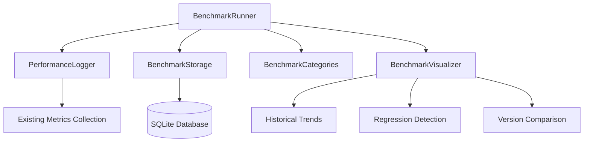

# CalendarBot Performance Benchmarking System

## System Overview

The CalendarBot Performance Benchmarking System is designed to provide a lightweight, comprehensive framework for measuring, tracking, and analyzing performance metrics across different components of the application. This system leverages the existing performance monitoring infrastructure while adding specialized benchmarking capabilities.

## Design Goals

1. **Minimal Performance Impact**: The benchmarking system must add less than 5% overhead during benchmark execution
2. **Integration with Existing Infrastructure**: Seamless integration with the existing `PerformanceLogger` and monitoring decorators
3. **Comprehensive Coverage**: Support for benchmarking all critical application components
4. **Historical Analysis**: Ability to track performance trends over time and across versions
5. **Regression Detection**: Automated identification of performance regressions
6. **Visualization**: Clear visualization of benchmark results and trends

## Architecture Components

### Component Diagram



### Core Components

#### BenchmarkRunner

The central component responsible for executing benchmarks, collecting results, and coordinating with other components.

**Key Responsibilities:**
- Benchmark initialization and configuration
- Benchmark execution and timing
- Result collection and storage
- Integration with existing performance monitoring

**Key Methods:**
- `__init__(settings: Any, categories: Optional[List[str]] = None)`
- `run_benchmark(category: str, benchmark_name: str, iterations: int = 5) -> BenchmarkResult`
- `run_benchmark_suite(suite_name: str) -> List[BenchmarkResult]`
- `compare_with_baseline(results: List[BenchmarkResult]) -> ComparisonResult`
- `save_results(results: List[BenchmarkResult]) -> bool`

#### BenchmarkStorage

Handles persistence of benchmark results and retrieval for historical analysis.

**Key Responsibilities:**
- Schema management for benchmark results
- Storage of benchmark data
- Retrieval of historical results
- Data migration and maintenance

**Database Schema:**
- `benchmark_runs` - Metadata about benchmark execution runs
- `benchmark_results` - Individual benchmark measurements
- `benchmark_baselines` - Baseline measurements for comparison
- `benchmark_categories` - Categories of benchmarks
- `benchmark_metrics` - Detailed metrics for each benchmark

#### BenchmarkCategories

Defines standard benchmark categories and specific benchmarks within each category.

**Standard Categories:**
1. **Calendar Data Processing**
   - ICS parsing performance
   - Event filtering and sorting
   - Calendar data transformation

2. **Database Operations**
   - Query performance
   - Cache hit/miss rates
   - Transaction throughput

3. **Web API**
   - Response times
   - Request handling throughput
   - API error rates

4. **UI Rendering**
   - Component render times
   - Layout calculation performance
   - DOM update efficiency

5. **Memory Usage**
   - Peak memory consumption
   - Memory growth patterns
   - Garbage collection impact

#### BenchmarkVisualizer

Provides visualization capabilities for benchmark results.

**Key Responsibilities:**
- Generate trend charts for historical data
- Highlight performance regressions
- Compare performance across versions
- Export visualizations for reporting

## Integration with Existing Performance Monitoring

The benchmarking system will integrate with the existing performance monitoring infrastructure in `calendarbot/monitoring/performance.py`:

1. **PerformanceLogger Integration**:
   - The `BenchmarkRunner` will utilize the existing `PerformanceLogger` for metric collection
   - Benchmark-specific metrics will be tagged with a `benchmark` context
   - Existing metric types (TIMER, COUNTER, etc.) will be reused

2. **Decorator Integration**:
   - New `benchmark` decorator will be added, building on the existing `performance_monitor` decorator
   - Context managers will be extended to support benchmarking contexts

3. **Metric Collection**:
   - Benchmarks will use the existing metric collection mechanisms
   - Additional benchmark-specific metadata will be added to metrics

## Benchmark Result Storage Schema

The benchmark results will be stored in a SQLite database with the following schema:

### Tables

#### benchmark_runs
```sql
CREATE TABLE benchmark_runs (
    run_id TEXT PRIMARY KEY,
    timestamp TEXT NOT NULL,
    app_version TEXT NOT NULL,
    environment TEXT NOT NULL,
    description TEXT,
    metadata TEXT
);
```

#### benchmark_categories
```sql
CREATE TABLE benchmark_categories (
    category_id TEXT PRIMARY KEY,
    name TEXT NOT NULL,
    description TEXT
);
```

#### benchmark_results
```sql
CREATE TABLE benchmark_results (
    result_id TEXT PRIMARY KEY,
    run_id TEXT NOT NULL,
    category_id TEXT NOT NULL,
    benchmark_name TEXT NOT NULL,
    execution_time REAL NOT NULL,
    iterations INTEGER NOT NULL,
    min_value REAL NOT NULL,
    max_value REAL NOT NULL,
    mean_value REAL NOT NULL,
    median_value REAL NOT NULL,
    std_deviation REAL NOT NULL,
    timestamp TEXT NOT NULL,
    metadata TEXT,
    FOREIGN KEY (run_id) REFERENCES benchmark_runs(run_id),
    FOREIGN KEY (category_id) REFERENCES benchmark_categories(category_id)
);
```

#### benchmark_metrics
```sql
CREATE TABLE benchmark_metrics (
    metric_id TEXT PRIMARY KEY,
    result_id TEXT NOT NULL,
    metric_name TEXT NOT NULL,
    metric_type TEXT NOT NULL,
    value REAL NOT NULL,
    unit TEXT,
    FOREIGN KEY (result_id) REFERENCES benchmark_results(result_id)
);
```

#### benchmark_baselines
```sql
CREATE TABLE benchmark_baselines (
    baseline_id TEXT PRIMARY KEY,
    category_id TEXT NOT NULL,
    benchmark_name TEXT NOT NULL,
    baseline_value REAL NOT NULL,
    tolerance_percent REAL NOT NULL,
    created_at TEXT NOT NULL,
    updated_at TEXT NOT NULL,
    description TEXT,
    FOREIGN KEY (category_id) REFERENCES benchmark_categories(category_id)
);
```

### Indexes

```sql
CREATE INDEX idx_benchmark_results_run_id ON benchmark_results(run_id);
CREATE INDEX idx_benchmark_results_category_id ON benchmark_results(category_id);
CREATE INDEX idx_benchmark_results_benchmark_name ON benchmark_results(benchmark_name);
CREATE INDEX idx_benchmark_metrics_result_id ON benchmark_metrics(result_id);
CREATE INDEX idx_benchmark_baselines_category_benchmark ON benchmark_baselines(category_id, benchmark_name);
```

## Benchmark Execution Workflow

The benchmark execution follows this workflow:

1. **Setup Phase**
   - Initialize BenchmarkRunner with configuration
   - Connect to benchmark storage
   - Load baseline values (if comparing)
   - Prepare environment (e.g., clear caches)

2. **Execution Phase**
   - For each benchmark:
     - Run warm-up iterations (not recorded)
     - Execute benchmark for specified iterations
     - Collect metrics via PerformanceLogger
     - Calculate statistics (min, max, mean, median, std dev)

3. **Analysis Phase**
   - Compare results with baselines
   - Detect performance regressions
   - Generate visualizations
   - Store results in database

4. **Cleanup Phase**
   - Restore environment to pre-benchmark state
   - Close database connections
   - Generate summary report

## Performance Impact Analysis

To ensure the benchmarking system itself doesn't significantly impact the measurements:

1. **Overhead Measurement**
   - The system will measure its own overhead by comparing instrumented vs. non-instrumented runs
   - Overhead metrics will be included in benchmark results

2. **Minimization Techniques**
   - Lazy loading of benchmark components
   - Batch database operations
   - Minimal logging during benchmark execution
   - Separate storage operations from measurement operations

3. **Thresholds**
   - Overall system overhead must remain below 5%
   - Individual benchmark overhead should be below 2%
   - Storage operations occur after timing measurements

## Visualization Capabilities

The benchmarking system will provide the following visualization capabilities:

### Historical Trend Analysis

- Line charts showing benchmark performance over time
- Ability to filter by category, benchmark, or time range
- Trend line calculation to identify gradual performance changes

### Performance Regression Detection

- Automatic detection of significant performance degradation
- Statistical analysis to identify outliers
- Notification system for regression alerts

### Version Comparison

- Side-by-side comparison of performance across application versions
- Percentage change calculation
- Highlighting of significant improvements or regressions

## Implementation Considerations

1. **Minimal Dependencies**
   - Use built-in Python libraries where possible
   - Leverage existing CalendarBot infrastructure
   - Minimize external dependencies

2. **Testability**
   - All benchmark components should be unit testable
   - Mock interfaces for database and performance logger
   - Deterministic benchmark implementations for testing

3. **Extensibility**
   - Plugin architecture for custom benchmarks
   - Extensible visualization system
   - Configurable thresholds and baselines

## Conclusion

The CalendarBot Performance Benchmarking System provides a comprehensive solution for monitoring, analyzing, and visualizing application performance. By leveraging the existing performance monitoring infrastructure and adding specialized benchmarking capabilities, the system enables developers to track performance trends, detect regressions, and ensure optimal application performance with minimal overhead.