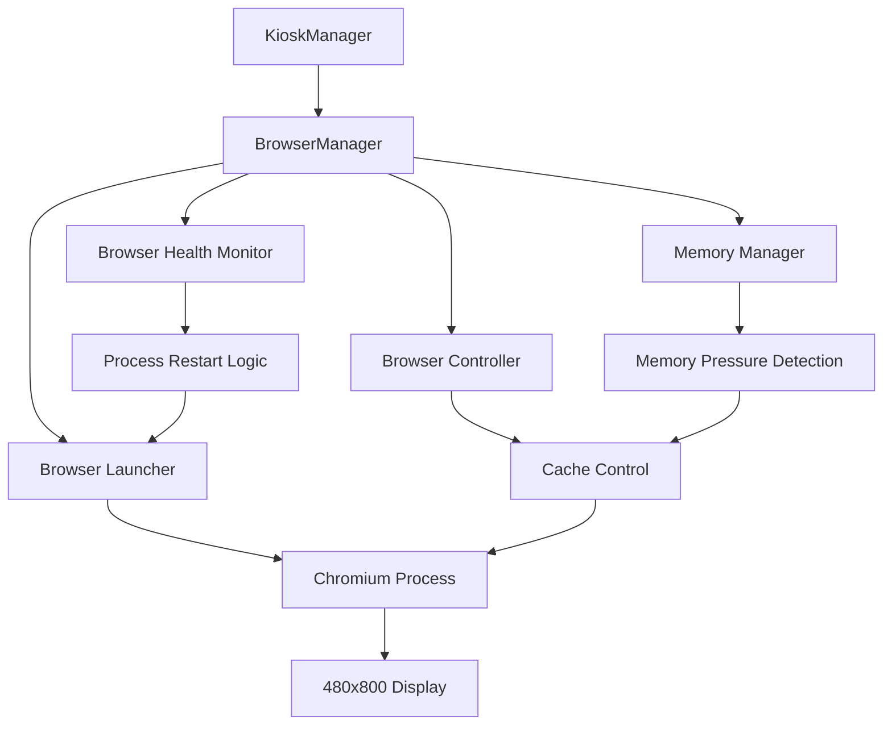

# BrowserManager Component Specification

## Overview

The BrowserManager handles Chromium browser lifecycle management optimized for Pi Zero 2W constraints, providing robust crash recovery, memory management, and health monitoring for reliable kiosk operation.

## Design Constraints

### Pi Zero 2W Limitations
- **RAM**: 512MB total (need to keep browser under 150MB)
- **CPU**: Single-core ARM Cortex-A53 @ 1GHz  
- **Display**: 480x800 portrait via HDMI
- **Storage**: SD card with potential I/O limitations

### Browser Requirements
- **Target**: Chromium kiosk mode displaying What's Next view
- **Reliability**: Auto-restart on crashes with minimal downtime
- **Memory**: Aggressive memory management and cache control
- **Touch**: Support touch interaction for 480x800 display

## Component Architecture



## Class Definition

```python
from typing import Optional, List, Dict, Any
from dataclasses import dataclass
from datetime import datetime, timedelta
from enum import Enum
import asyncio
import subprocess
import psutil
import logging
import time
import os


class BrowserState(Enum):
    """Browser process states."""
    STOPPED = "stopped"
    STARTING = "starting"
    RUNNING = "running"
    CRASHED = "crashed"
    RESTARTING = "restarting"
    FAILED = "failed"


@dataclass
class BrowserStatus:
    """Browser health and status information."""
    
    state: BrowserState
    pid: Optional[int]
    start_time: Optional[datetime]
    uptime: Optional[timedelta]
    
    # Performance metrics
    memory_usage_mb: int
    cpu_usage_percent: float
    
    # Reliability metrics
    crash_count: int
    restart_count: int
    last_restart_time: Optional[datetime]
    
    # Health indicators
    is_responsive: bool
    last_health_check: Optional[datetime]
    
    # Error tracking
    last_error: Optional[str]
    error_time: Optional[datetime]


@dataclass
class BrowserConfig:
    """Browser configuration optimized for Pi Zero 2W."""
    
    # Process management
    executable_path: str = "chromium-browser"
    startup_delay: int = 5
    startup_timeout: int = 30
    shutdown_timeout: int = 10
    
    # Restart behavior
    crash_restart_delay: int = 3
    max_restart_attempts: int = 5
    restart_backoff_factor: float = 1.5
    reset_attempts_after: int = 3600  # seconds
    
    # Health monitoring
    health_check_interval: int = 30
    response_timeout: int = 5
    memory_check_interval: int = 60
    
    # Memory management
    memory_limit_mb: int = 128
    memory_warning_threshold: float = 0.85
    memory_critical_threshold: float = 0.95
    cache_clear_on_restart: bool = True
    
    # Display settings
    window_width: int = 480
    window_height: int = 800
    scale_factor: float = 1.0
    
    # Kiosk behavior
    disable_infobars: bool = True
    disable_session_restore: bool = True
    disable_first_run: bool = True


class BrowserManager:
    """Chromium browser process management for Pi Zero 2W kiosk mode.
    
    Provides robust browser lifecycle management with crash recovery,
    memory optimization, and health monitoring specifically tuned for
    512MB RAM constraints.
    """
    
    def __init__(self, config: BrowserConfig) -> None:
        """Initialize BrowserManager with Pi Zero 2W optimized configuration.
        
        Args:
            config: Browser configuration settings
        """
        self.config = config
        self.logger = logging.getLogger(f"{__name__}.BrowserManager")
        
        # Process management
        self._process: Optional[subprocess.Popen] = None
        self._state = BrowserState.STOPPED
        self._current_url: Optional[str] = None
        
        # Timing and metrics
        self._start_time: Optional[datetime] = None
        self._crash_count = 0
        self._restart_count = 0
        self._restart_attempts = 0
        self._last_restart_time: Optional[datetime] = None
        self._last_health_check: Optional[datetime] = None
        
        # Error tracking
        self._last_error: Optional[str] = None
        self._error_time: Optional[datetime] = None
        
        # Control flags
        self._shutdown_requested = False
        
        # Background tasks
        self._health_task: Optional[asyncio.Task] = None
        self._memory_task: Optional[asyncio.Task] = None

    async def start_browser(self, url: str) -> bool:
        """Start Chromium browser in kiosk mode.
        
        Args:
            url: URL to load (typically http://localhost:8080/whats-next-view)
            
        Returns:
            True if browser started successfully, False otherwise
            
        Raises:
            BrowserError: If browser fails to start
        """
        try:
            if self._state != BrowserState.STOPPED:
                self.logger.warning(f"Browser already in state {self._state}, stopping first")
                await self.stop_browser()
                
            self.logger.info(f"Starting Chromium browser for URL: {url}")
            self._state = BrowserState.STARTING
            self._current_url = url
            self._shutdown_requested = False
            
            # Apply startup delay for Pi Zero 2W
            if self.config.startup_delay > 0:
                self.logger.info(f"Applying startup delay: {self.config.startup_delay}s")
                await asyncio.sleep(self.config.startup_delay)
            
            # Build optimized command line arguments
            cmd_args = self._build_chromium_args(url)
            
            # Start browser process
            self._process = await self._launch_process(cmd_args)
            
            if self._process:
                self._start_time = datetime.now()
                self._state = BrowserState.RUNNING
                
                # Start background monitoring
                await self._start_monitoring()
                
                # Wait for browser to be responsive
                if await self._wait_for_responsive(timeout=self.config.startup_timeout):
                    self.logger.info(f"Browser started successfully (PID: {self._process.pid})")
                    return True
                else:
                    await self._handle_startup_failure("Browser failed to become responsive")
                    return False
            else:
                await self._handle_startup_failure("Failed to launch browser process")
                return False
                
        except Exception as e:
            await self._handle_startup_failure(f"Browser startup error: {e}")
            return False

    async def stop_browser(self, timeout: int = None) -> bool:
        """Stop browser gracefully.
        
        Args:
            timeout: Maximum seconds to wait for graceful shutdown
            
        Returns:
            True if browser stopped successfully, False otherwise
        """
        if timeout is None:
            timeout = self.config.shutdown_timeout
            
        try:
            self.logger.info("Stopping Chromium browser")
            self._shutdown_requested = True
            
            # Stop monitoring tasks
            await self._stop_monitoring()
            
            if not self._process:
                self._state = BrowserState.STOPPED
                return True
            
            # Try graceful shutdown first
            try:
                self._process.terminate()
                await asyncio.wait_for(
                    asyncio.create_task(self._wait_for_process_exit()),
                    timeout=timeout
                )
                self.logger.info("Browser stopped gracefully")
                
            except asyncio.TimeoutError:
                # Force kill if graceful shutdown fails
                self.logger.warning("Browser did not stop gracefully, forcing shutdown")
                self._process.kill()
                await asyncio.sleep(1)
                
            self._cleanup_process_state()
            return True
            
        except Exception as e:
            self.logger.error(f"Error stopping browser: {e}")
            self._cleanup_process_state()
            return False

    async def restart_browser(self) -> bool:
        """Restart browser with exponential backoff.
        
        Returns:
            True if restart successful, False otherwise
        """
        try:
            self._restart_count += 1
            self._restart_attempts += 1
            self._last_restart_time = datetime.now()
            
            self.logger.info(f"Restarting browser (attempt {self._restart_attempts})")
            
            # Check restart attempt limits
            if self._restart_attempts > self.config.max_restart_attempts:
                self.logger.error("Maximum restart attempts exceeded")
                self._state = BrowserState.FAILED
                return False
                
            # Stop current browser
            await self.stop_browser()
            
            # Apply exponential backoff delay
            delay = self._calculate_restart_delay()
            if delay > 0:
                self.logger.info(f"Applying restart delay: {delay}s")
                await asyncio.sleep(delay)
                
            # Start browser again
            if self._current_url:
                return await self.start_browser(self._current_url)
            else:
                self.logger.error("No URL available for restart")
                return False
                
        except Exception as e:
            self.logger.error(f"Error during browser restart: {e}")
            self._state = BrowserState.FAILED
            return False

    def is_browser_healthy(self) -> bool:
        """Check if browser is running and responsive.
        
        Returns:
            True if browser is healthy, False otherwise
        """
        try:
            if self._state != BrowserState.RUNNING or not self._process:
                return False
                
            # Check if process is still alive
            if self._process.poll() is not None:
                self.logger.warning("Browser process has exited")
                self._state = BrowserState.CRASHED
                self._crash_count += 1
                return False
                
            # Check memory usage
            memory_usage = self._get_memory_usage()
            if memory_usage > self.config.memory_limit_mb:
                self.logger.warning(f"Browser memory usage too high: {memory_usage}MB")
                return False
                
            # TODO: Add more sophisticated health checks
            # - HTTP request to check if page is loading
            # - Check if browser is accepting input
            # - Verify DOM elements are present
                
            return True
            
        except Exception as e:
            self.logger.error(f"Error checking browser health: {e}")
            return False

    def get_browser_status(self) -> BrowserStatus:
        """Get comprehensive browser status.
        
        Returns:
            Current browser status and metrics
        """
        try:
            # Calculate uptime
            uptime = None
            if self._start_time and self._state == BrowserState.RUNNING:
                uptime = datetime.now() - self._start_time
                
            # Get performance metrics
            memory_usage = self._get_memory_usage()
            cpu_usage = self._get_cpu_usage()
            
            return BrowserStatus(
                state=self._state,
                pid=self._process.pid if self._process else None,
                start_time=self._start_time,
                uptime=uptime,
                memory_usage_mb=memory_usage,
                cpu_usage_percent=cpu_usage,
                crash_count=self._crash_count,
                restart_count=self._restart_count,
                last_restart_time=self._last_restart_time,
                is_responsive=self.is_browser_healthy(),
                last_health_check=self._last_health_check,
                last_error=self._last_error,
                error_time=self._error_time
            )
            
        except Exception as e:
            self.logger.error(f"Error getting browser status: {e}")
            return BrowserStatus(
                state=BrowserState.FAILED,
                pid=None,
                start_time=None,
                uptime=None,
                memory_usage_mb=0,
                cpu_usage_percent=0.0,
                crash_count=self._crash_count,
                restart_count=self._restart_count,
                last_restart_time=self._last_restart_time,
                is_responsive=False,
                last_health_check=None,
                last_error=str(e),
                error_time=datetime.now()
            )

    async def clear_cache(self) -> bool:
        """Clear browser cache to free memory.
        
        Returns:
            True if cache cleared successfully, False otherwise
        """
        try:
            self.logger.info("Clearing browser cache")
            
            # For now, we restart the browser to clear cache
            # TODO: Implement more sophisticated cache clearing
            if self._state == BrowserState.RUNNING:
                return await self.restart_browser()
            
            return True
            
        except Exception as e:
            self.logger.error(f"Error clearing cache: {e}")
            return False

    def _build_chromium_args(self, url: str) -> List[str]:
        """Build optimized Chromium command line arguments for Pi Zero 2W.
        
        Args:
            url: Target URL to load
            
        Returns:
            List of command line arguments
        """
        args = [
            self.config.executable_path,
            
            # Kiosk mode settings
            "--kiosk",
            "--start-fullscreen",
            f"--window-size={self.config.window_width},{self.config.window_height}",
            f"--force-device-scale-factor={self.config.scale_factor}",
            
            # Security settings (relaxed for local kiosk)
            "--no-sandbox",
            "--disable-web-security",
            "--disable-features=VizDisplayCompositor",
            
            # Memory optimization for 512MB RAM
            "--memory-pressure-off",
            f"--max_old_space_size=64",  # Limit V8 heap to 64MB
            "--disable-background-timer-throttling",
            "--disable-renderer-backgrounding", 
            "--disable-backgrounding-occluded-windows",
            "--disable-background-networking",
            "--disable-extensions",
            "--disable-plugins",
            "--disable-print-preview",
            "--disable-translate",
            
            # Performance optimizations
            "--disable-features=TranslateUI,BlinkGenPropertyTrees",
            "--disable-ipc-flooding-protection",
            "--disable-hang-monitor",
            "--disable-prompt-on-repost",
            "--disable-client-side-phishing-detection",
            "--disable-component-update",
            "--disable-default-apps",
            "--disable-dev-shm-usage",  # Important for limited memory
            
            # Kiosk behavior
            "--no-first-run",
            "--no-default-browser-check",
            "--disable-infobars" if self.config.disable_infobars else "",
            "--disable-session-crashed-bubble",
            "--disable-restore-session-state" if self.config.disable_session_restore else "",
            
            # Touch optimization for 480x800 display
            "--touch-events=enabled",
            "--enable-pinch",
            
            # Target URL
            url
        ]
        
        # Remove empty arguments
        return [arg for arg in args if arg]

    async def _launch_process(self, cmd_args: List[str]) -> Optional[subprocess.Popen]:
        """Launch Chromium process with proper environment.
        
        Args:
            cmd_args: Command line arguments
            
        Returns:
            Process handle or None if failed
        """
        try:
            # Set environment variables for kiosk mode
            env = os.environ.copy()
            env.update({
                'DISPLAY': ':0',
                'XAUTHORITY': '/home/pi/.Xauthority',  # Adjust path as needed
            })
            
            self.logger.debug(f"Launching: {' '.join(cmd_args)}")
            
            process = subprocess.Popen(
                cmd_args,
                env=env,
                stdout=subprocess.PIPE,
                stderr=subprocess.PIPE,
                preexec_fn=os.setsid  # Create new process group
            )
            
            # Give process a moment to start
            await asyncio.sleep(1)
            
            # Check if process started successfully
            if process.poll() is None:
                return process
            else:
                self.logger.error("Browser process exited immediately")
                return None
                
        except Exception as e:
            self.logger.error(f"Failed to launch browser: {e}")
            return None

    async def _wait_for_responsive(self, timeout: int) -> bool:
        """Wait for browser to become responsive.
        
        Args:
            timeout: Maximum seconds to wait
            
        Returns:
            True if browser becomes responsive, False otherwise
        """
        # For now, just wait and check if process is still alive
        # TODO: Implement more sophisticated responsiveness check
        # - HTTP request to verify page is loaded
        # - Check window is visible
        # - Verify touch input is working
        
        for _ in range(timeout):
            if self._process and self._process.poll() is None:
                await asyncio.sleep(1)
            else:
                return False
                
        return self._process and self._process.poll() is None

    async def _start_monitoring(self) -> None:
        """Start background monitoring tasks."""
        try:
            self._health_task = asyncio.create_task(self._health_monitoring_loop())
            self._memory_task = asyncio.create_task(self._memory_monitoring_loop())
            self.logger.debug("Browser monitoring started")
            
        except Exception as e:
            self.logger.error(f"Failed to start monitoring: {e}")

    async def _stop_monitoring(self) -> None:
        """Stop background monitoring tasks."""
        for task in [self._health_task, self._memory_task]:
            if task and not task.done():
                task.cancel()
                try:
                    await task
                except asyncio.CancelledError:
                    pass

    async def _health_monitoring_loop(self) -> None:
        """Background health monitoring loop."""
        while not self._shutdown_requested:
            try:
                self._last_health_check = datetime.now()
                
                if not self.is_browser_healthy():
                    self.logger.warning("Browser health check failed, triggering restart")
                    asyncio.create_task(self.restart_browser())
                    break
                    
            except Exception as e:
                self.logger.error(f"Error in health monitoring: {e}")
                
            await asyncio.sleep(self.config.health_check_interval)

    async def _memory_monitoring_loop(self) -> None:
        """Background memory monitoring loop."""
        while not self._shutdown_requested:
            try:
                memory_usage = self._get_memory_usage()
                memory_percent = memory_usage / self.config.memory_limit_mb
                
                if memory_percent > self.config.memory_critical_threshold:
                    self.logger.warning(f"Critical memory usage: {memory_usage}MB, restarting browser")
                    asyncio.create_task(self.restart_browser())
                    break
                elif memory_percent > self.config.memory_warning_threshold:
                    self.logger.warning(f"High memory usage: {memory_usage}MB, clearing cache")
                    asyncio.create_task(self.clear_cache())
                    
            except Exception as e:
                self.logger.error(f"Error in memory monitoring: {e}")
                
            await asyncio.sleep(self.config.memory_check_interval)

    def _get_memory_usage(self) -> int:
        """Get browser memory usage in MB.
        
        Returns:
            Memory usage in megabytes
        """
        try:
            if not self._process:
                return 0
                
            process = psutil.Process(self._process.pid)
            memory_info = process.memory_info()
            return int(memory_info.rss / 1024 / 1024)  # Convert to MB
            
        except (psutil.NoSuchProcess, psutil.AccessDenied):
            return 0
        except Exception as e:
            self.logger.error(f"Error getting memory usage: {e}")
            return 0

    def _get_cpu_usage(self) -> float:
        """Get browser CPU usage percentage.
        
        Returns:
            CPU usage as percentage
        """
        try:
            if not self._process:
                return 0.0
                
            process = psutil.Process(self._process.pid)
            return process.cpu_percent()
            
        except (psutil.NoSuchProcess, psutil.AccessDenied):
            return 0.0
        except Exception as e:
            self.logger.error(f"Error getting CPU usage: {e}")
            return 0.0

    def _calculate_restart_delay(self) -> int:
        """Calculate restart delay with exponential backoff.
        
        Returns:
            Delay in seconds
        """
        if self._restart_attempts == 1:
            return self.config.crash_restart_delay
            
        delay = self.config.crash_restart_delay * (
            self.config.restart_backoff_factor ** (self._restart_attempts - 1)
        )
        
        # Cap maximum delay at 60 seconds
        return min(int(delay), 60)

    async def _wait_for_process_exit(self) -> None:
        """Wait for browser process to exit."""
        if self._process:
            while self._process.poll() is None:
                await asyncio.sleep(0.1)

    def _cleanup_process_state(self) -> None:
        """Clean up process state after shutdown."""
        self._process = None
        self._state = BrowserState.STOPPED
        self._start_time = None

    async def _handle_startup_failure(self, error_msg: str) -> None:
        """Handle browser startup failure.
        
        Args:
            error_msg: Error message describing the failure
        """
        self.logger.error(error_msg)
        self._last_error = error_msg
        self._error_time = datetime.now()
        self._state = BrowserState.FAILED
        
        await self._stop_monitoring()
        self._cleanup_process_state()


class BrowserError(Exception):
    """Exception raised for browser-related errors."""
    pass
```

## Pi Zero 2W Specific Optimizations

### Memory Management
1. **V8 Heap Limit**: `--max_old_space_size=64` limits JavaScript heap to 64MB
2. **Shared Memory**: `--disable-dev-shm-usage` avoids /dev/shm for limited RAM
3. **Background Processes**: Disable all background networking and timers
4. **Cache Strategy**: Restart browser to clear cache when memory pressure detected

### Performance Tuning
1. **Process Priority**: Set browser process to normal priority (avoid starving system)
2. **GPU Memory**: Minimal GPU memory allocation for 480x800 display
3. **Compositor**: Disable VizDisplayCompositor for better performance
4. **Extensions**: Disable all extensions and plugins

### Display Optimization
1. **Fixed Scale**: `--force-device-scale-factor=1.0` for consistent rendering
2. **Touch Events**: Enable touch events for 4-inch touchscreen
3. **Window Size**: Exact 480x800 window size matching display
4. **Kiosk Mode**: Full-screen with no browser UI elements

## Recovery Strategies

### Crash Detection
1. **Process Monitoring**: Check if browser process is still alive
2. **Memory Monitoring**: Detect memory pressure before crash
3. **Responsiveness**: HTTP requests to verify page is loading
4. **Touch Input**: Verify touch events are being processed

### Restart Logic
1. **Exponential Backoff**: 3s, 4.5s, 6.75s, 10s, 15s, then 60s max
2. **Attempt Limiting**: Max 5 restart attempts per hour
3. **Reset Counter**: Reset attempt counter after 1 hour of stable operation
4. **Failure State**: Enter failed state if restart limit exceeded

### Memory Recovery
1. **Warning Threshold**: Clear cache at 85% memory limit
2. **Critical Threshold**: Restart browser at 95% memory limit
3. **Cache Strategy**: Restart browser instead of trying to clear cache programmatically
4. **Monitoring**: Check memory usage every 60 seconds

## Integration Points

### KioskManager Integration
- **Startup Coordination**: BrowserManager waits for web server ready signal
- **Health Reporting**: Provides status to KioskManager for overall health assessment
- **Restart Coordination**: KioskManager can trigger browser restarts
- **Configuration**: Receives configuration from KioskSettings

### Monitoring Integration
- **Health Metrics**: Reports memory, CPU, crash count to HealthMonitor
- **Error Reporting**: Logs errors to centralized error tracking
- **Performance Data**: Provides metrics for remote monitoring dashboard

## Testing Strategy

### Unit Tests
- Mock subprocess.Popen for process management testing
- Test restart logic with various failure scenarios
- Verify memory monitoring thresholds
- Test configuration argument building

### Integration Tests  
- Test with real Chromium browser on Pi Zero 2W
- Stress test memory limits and recovery
- Verify touch input functionality
- Test startup/shutdown coordination with KioskManager

### Performance Tests
- Memory usage profiling over 24+ hours
- Browser restart time measurements
- Touch responsiveness validation
- Network failure recovery testing