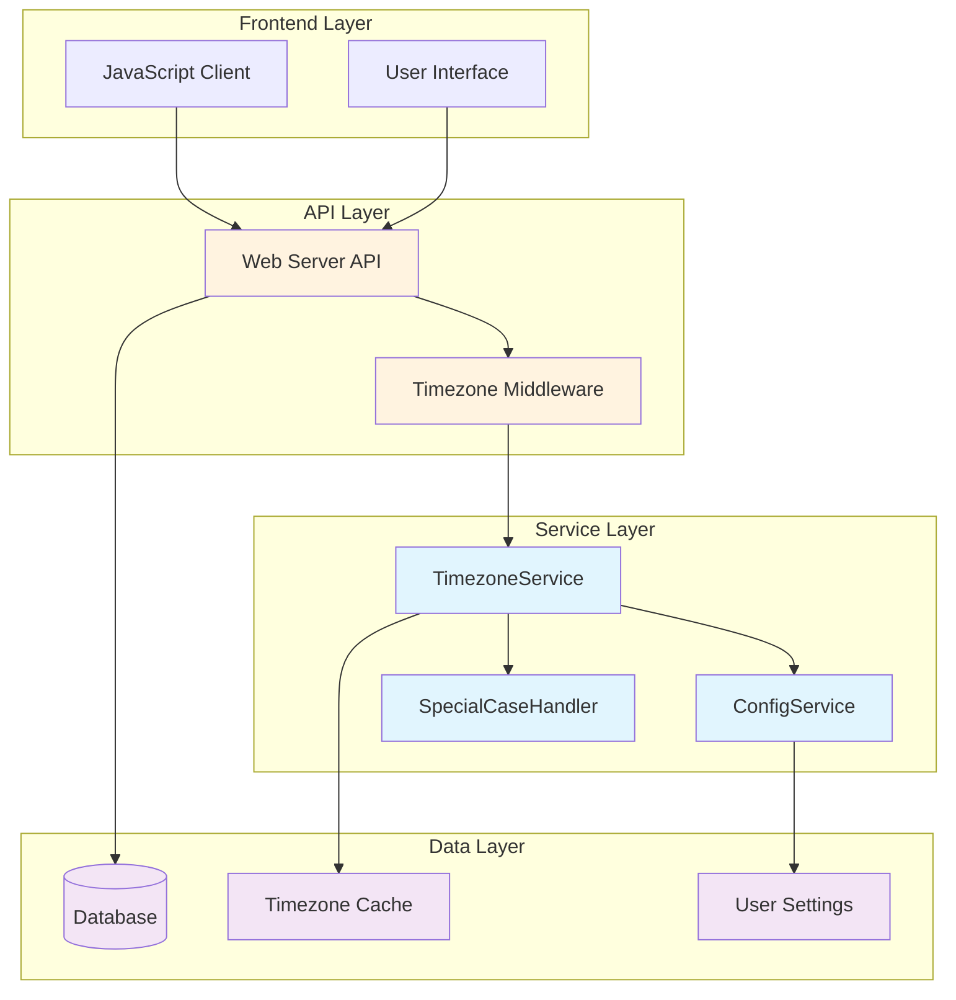

# Centralized Timezone Architecture Specification

## Executive Summary

This document specifies a comprehensive centralized timezone handling architecture for CalendarBot that eliminates scattered timezone operations, standardizes library usage, and provides robust extensibility for edge cases while maintaining database compatibility and supporting system-wide debugging capabilities.

## 1. Core Architecture Design

### 1.1 Central Timezone Service Interface

**Service Responsibility**: Single source of truth for all timezone operations across CalendarBot

**Core Interface**:
```
TimezoneService:
  - now_in_timezone(timezone_name: Optional[str]) -> datetime
  - ensure_timezone_aware(dt: datetime, default_tz: Optional[str]) -> datetime
  - convert_timezone(dt: datetime, target_tz: str) -> datetime
  - set_debug_time(override: Optional[datetime]) -> None
  - validate_timezone(tz_name: str) -> bool
  - get_user_timezone() -> str
  - list_supported_timezones() -> List[str]
```

**Implementation Plan**:
- **Primary Library**: zoneinfo (Python 3.9+ standard library)
- **Fallback Strategy**: pytz for unsupported zones or older Python versions
- **Singleton Pattern**: Global service instance with dependency injection support
- **Error Handling**: Graceful degradation to UTC with comprehensive logging

### 1.2 System Architecture Diagram



### 1.3 Component Responsibilities

**TimezoneService**: Core timezone operations, library abstraction, debug time management
**ConfigService**: User timezone preferences, fallback settings, validation
**SpecialCaseHandler**: Extensible framework for timezone edge cases and corrections
**TimezoneMiddleware**: Request/response timezone conversion at API boundaries
**TimezoneCache**: Performance optimization for frequently used timezone data

## 2. Migration Strategy

### 2.1 Current State Analysis

**Scattered Implementations**:
- `calendarbot/utils/helpers.py`: Hardcoded "America/Los_Angeles" default (lines 195-218)
- `calendarbot/ics/parser.py`: Australian timezone hack with +1 day correction (lines 304-314)  
- Mixed library usage: pytz, dateutil.tz, datetime.timezone, zoneinfo

### 2.2 Migration Phases

**Phase 1: Service Foundation**
- Create `calendarbot/timezone/` module with core service
- Implement TimezoneService with standardized zoneinfo library
- Add configuration layer for user timezone preferences
- Create timezone middleware for API boundary enforcement

**Phase 2: Core Integration**
- Replace hardcoded timezone usage in helpers.py and parser.py
- Integrate TimezoneService with existing calendar parsing logic
- Implement special case handler for Australian timezone workaround
- Add comprehensive unit testing for all timezone operations

**Phase 3: API Standardization**
- Update all API endpoints to use consistent timezone handling
- Implement frontend-backend timezone coordination protocols
- Add timezone validation and error handling across all interfaces
- Deploy with backward compatibility preservation

**Phase 4: Advanced Features**
- Add system-wide debug time override capability
- Implement timezone caching and performance optimizations
- Create comprehensive timezone testing framework
- Remove deprecated timezone handling code

### 2.3 Rollback Strategy

- Maintain feature flags for new timezone service activation
- Preserve existing timezone logic during migration period
- Implement A/B testing capability for validation
- Document rollback procedures for each migration phase

## 3. API Contracts

### 3.1 Internal Service Contracts

**TimezoneService Interface**:
```python
class TimezoneServiceInterface:
    def now_in_timezone(self, timezone_name: Optional[str] = None) -> datetime:
        """Returns current time in specified timezone (UTC if None)"""
    
    def ensure_timezone_aware(self, dt: datetime, default_tz: Optional[str] = None) -> datetime:
        """Ensures datetime is timezone-aware, applying default if naive"""
    
    def convert_timezone(self, dt: datetime, target_tz: str) -> datetime:
        """Converts datetime to target timezone"""
    
    def set_debug_time(self, override_time: Optional[datetime]) -> None:
        """Sets system-wide debug time override for testing"""
```

**Configuration Service Contract**:
```python
class TimezoneConfigInterface:
    def get_user_timezone(self) -> str:
        """Returns user's configured timezone"""
    
    def set_user_timezone(self, timezone_name: str) -> bool:
        """Sets user timezone with validation"""
    
    def get_fallback_timezone(self) -> str:
        """Returns system fallback timezone"""
```

### 3.2 HTTP API Contracts

**Request/Response Timezone Headers**:
```
X-User-Timezone: America/Los_Angeles
X-Server-Timezone: UTC
X-Debug-Time: 2025-08-12T14:00:00Z (optional)
```

**Event Data Format**:
```json
{
  "id": "event_123",
  "title": "Meeting",
  "start_datetime": "2025-08-12T14:00:00-07:00",
  "end_datetime": "2025-08-12T15:00:00-07:00",
  "timezone": "America/Los_Angeles",
  "original_timezone": "America/Los_Angeles"
}
```

### 3.3 Database Interface Contracts

**Timezone Data Storage**:
- Maintain existing ISO 8601 + timezone field format
- Add optional `original_timezone` field for audit trail
- Preserve UTC storage for all datetime calculations
- Add timezone validation constraints

## 4. Configuration System

### 4.1 User Timezone Settings

**Settings Structure**:
```json
{
  "timezone": {
    "user_timezone": "America/Los_Angeles",
    "fallback_timezone": "UTC",
    "auto_detect": true,
    "dst_handling": "automatic",
    "display_format": "12h"
  }
}
```

**Configuration Sources** (in priority order):
1. User explicit settings
2. Browser timezone detection
3. System environment variables
4. Hardcoded fallback (UTC)

### 4.2 System Configuration

**Environment Variables**:
```
CALENDARBOT_DEFAULT_TIMEZONE=UTC
CALENDARBOT_ENABLE_TIMEZONE_CACHE=true
CALENDARBOT_DEBUG_TIME_OVERRIDE=2025-08-12T14:00:00Z
```

**Configuration Validation**:
- Timezone name validation against zoneinfo database
- Fallback chain verification
- Performance setting validation

## 5. Special Case Handling Framework

### 5.1 Extensible Handler Architecture

**Handler Interface**:
```python
class TimezoneSpecialCaseHandler:
    def should_apply(self, event_data: dict, context: dict) -> bool:
        """Determines if special case applies to event"""
    
    def apply_correction(self, dt: datetime, event_data: dict) -> datetime:
        """Applies timezone correction to datetime"""
    
    def get_priority(self) -> int:
        """Handler priority (lower = higher priority)"""
```

**Australian Timezone Handler Example**:
```python
class AustralianTimezoneHandler(TimezoneSpecialCaseHandler):
    def should_apply(self, event_data: dict, context: dict) -> bool:
        return (event_data.get('timezone', '').startswith('Australia/') and 
                context.get('source') == 'ics_import')
    
    def apply_correction(self, dt: datetime, event_data: dict) -> datetime:
        return dt + timedelta(days=1)  # Existing +1 day correction
```

### 5.2 Handler Registration System

**Dynamic Handler Registration**:
- Plugin-style handler discovery
- Priority-based execution order
- Configuration-driven handler enabling/disabling
- Comprehensive logging of all applied corrections

## 6. Frontend Integration

### 6.1 JavaScript Timezone Coordination

**Client-Side Timezone Detection**:
```javascript
class TimezoneManager {
    static detectUserTimezone() {
        return Intl.DateTimeFormat().resolvedOptions().timeZone;
    }
    
    static setRequestHeaders(request) {
        request.headers['X-User-Timezone'] = this.detectUserTimezone();
        return request;
    }
    
    static convertEventTimes(events, targetTimezone) {
        // Convert server times to user timezone for display
    }
}
```

**Server Response Processing**:
- Automatic timezone conversion for display
- Preservation of original timezone information
- Consistent datetime formatting across UI components

### 6.2 Frontend-Backend Synchronization

**Request Flow**:
1. Frontend detects user timezone
2. Sends timezone preference in request headers
3. Backend processes with user timezone context
4. Returns data with timezone-aware formatting
5. Frontend displays in user's local time

**Data Consistency**:
- All server calculations in UTC
- Timezone conversion only at display boundaries
- Bidirectional timezone information preservation

## 7. Testing Strategy

### 7.1 Comprehensive Test Framework

**Test Categories**:
- **Unit Tests**: Individual timezone service methods
- **Integration Tests**: End-to-end timezone workflows
- **Edge Case Tests**: DST transitions, leap seconds, invalid timezones
- **Performance Tests**: Timezone conversion performance under load
- **Compatibility Tests**: Multiple timezone library compatibility

**Debug Time Override Testing**:
```python
class TimezoneTestCase:
    def setUp(self):
        self.tz_service = get_timezone_service()
        self.tz_service.set_debug_time(datetime(2025, 8, 12, 14, 0, 0, tzinfo=timezone.utc))
    
    def test_dst_transition(self):
        # Test behavior during DST transition with fixed time
        pass
```

### 7.2 Test Data Management

**Timezone Test Fixtures**:
- Representative timezone samples from all regions
- DST transition boundary cases
- Historical timezone change scenarios
- Invalid timezone handling cases

**Mock Time Management**:
- System-wide time freezing capability
- Timezone-specific time simulation
- DST transition simulation
- Performance benchmark scenarios

### 7.3 Validation Criteria

**Success Metrics**:
- Zero hardcoded timezone references outside configuration
- All datetime objects timezone-aware at system boundaries
- Consistent timezone handling across all components
- No timezone double-conversion bugs
- Performance within acceptable limits (<1ms per conversion)

## 8. Implementation Guidelines

### 8.1 Development Standards

**Code Quality Requirements**:
- Full type annotations for all timezone-related functions
- Comprehensive docstrings with timezone behavior documentation
- Error handling with graceful degradation to UTC
- Extensive logging for timezone operations and corrections

**Security Considerations**:
- Timezone injection attack prevention
- User timezone preference validation
- Debug time override access control
- Audit logging for timezone configuration changes

### 8.2 Performance Requirements

**Optimization Targets**:
- Timezone conversion: <1ms average
- Cache hit ratio: >95% for common timezones
- Memory usage: <10MB for timezone cache
- Database impact: No additional queries for timezone operations

### 8.3 Monitoring and Observability

**Metrics Collection**:
- Timezone conversion operation counts
- Special case handler execution frequency
- Cache hit/miss ratios
- Error rates by timezone and operation type

**Alerting Thresholds**:
- Timezone conversion error rate >1%
- Cache miss rate >10%
- Special case handler failures
- Debug time override detection in production

## 9. Architectural Decision Records

### ADR-001: Primary Timezone Library Selection
**Decision**: Use zoneinfo as primary library with pytz fallback
**Rationale**: Python 3.9+ standard library, better performance, official IANA support
**Consequences**: Requires Python 3.9+, simplified dependency management

### ADR-002: Centralized vs Distributed Timezone Handling
**Decision**: Single centralized TimezoneService
**Rationale**: Eliminates inconsistencies, enables global debug time override, simplifies testing
**Consequences**: Single point of failure, requires careful service design

### ADR-003: Database Storage Strategy
**Decision**: Maintain existing ISO 8601 + timezone field format
**Rationale**: Preserves existing data, maintains compatibility, leverages proven patterns
**Consequences**: No migration required, maintains audit trail capabilities

## 10. Risk Assessment and Mitigation

### 10.1 Technical Risks

**Risk**: Timezone library incompatibilities
**Mitigation**: Comprehensive fallback strategy, extensive compatibility testing

**Risk**: Performance degradation from centralized service
**Mitigation**: Aggressive caching, performance monitoring, optimization benchmarks

**Risk**: Double conversion bugs during migration
**Mitigation**: Comprehensive testing, feature flags, gradual rollout

### 10.2 Business Risks

**Risk**: User experience disruption during migration
**Mitigation**: Backward compatibility, A/B testing, rollback procedures

**Risk**: Data accuracy issues with timezone corrections
**Mitigation**: Extensive validation, audit logging, manual verification processes

## Conclusion

This architecture provides a robust, scalable, and maintainable foundation for centralized timezone handling in CalendarBot. The design prioritizes consistency, performance, and extensibility while maintaining compatibility with existing systems and providing comprehensive testing and debugging capabilities.