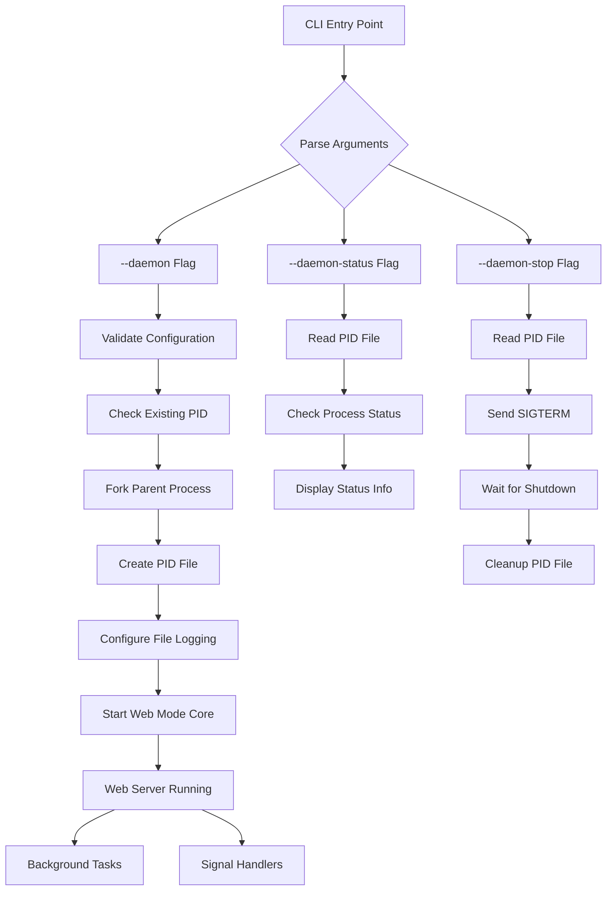
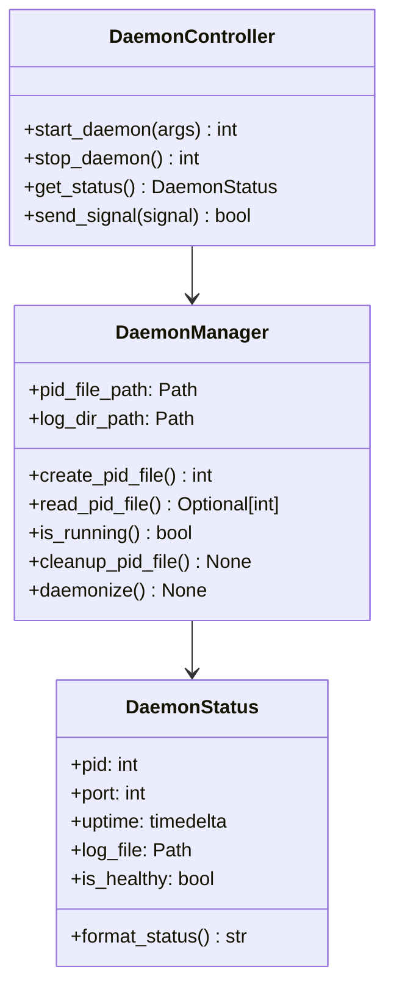
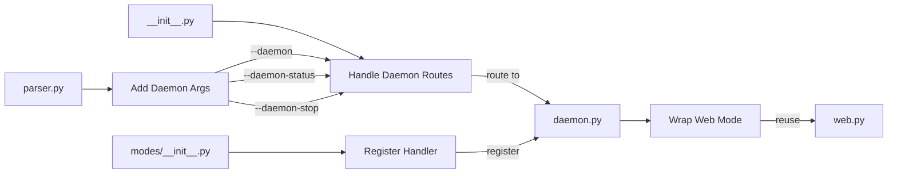

# CalendarBot Daemon Mode Architecture

## Overview

This document provides the comprehensive architectural design for implementing daemon mode in CalendarBot. The design directly addresses the 10 user stories retrieved from ConPort and leverages the existing web mode infrastructure to minimize code duplication while ensuring robust background service operation.

## Architectural Principles

### 1. Code Reuse Strategy
- **Reuse Web Mode Foundation**: Daemon mode wraps existing web mode functionality rather than reimplementing it
- **Minimal New Code**: Focus on process management, logging configuration, and CLI integration
- **Consistency**: Follow existing patterns in MODE_REGISTRY and CLI structure

### 2. Process Management Architecture
- **Unix Daemon Conventions**: Double fork for proper process detachment
- **PID File Management**: Track running instances with ~/.calendarbot/daemon.pid
- **Signal Handling**: Graceful shutdown on SIGTERM/SIGINT
- **File-Only Logging**: No console output after successful startup

## System Architecture



## Component Architecture

### 1. Process Management Layer (`calendarbot/utils/daemon.py`)



### 2. CLI Integration Layer



## Implementation Plan

### Phase 1: Core Infrastructure
1. **Daemon Process Utilities** (`calendarbot/utils/daemon.py`)
   - `DaemonManager` class for PID file management
   - `daemonize()` function implementing double fork
   - Process status checking utilities

2. **CLI Argument Extensions** (`calendarbot/cli/parser.py`)
   - Add `--daemon` flag for background mode
   - Add `--daemon-status` for status checking
   - Add `--daemon-stop` for graceful shutdown
   - Update argument validation for daemon mode conflicts

### Phase 2: Mode Implementation
3. **Daemon Mode Handler** (`calendarbot/cli/modes/daemon.py`)
   - `run_daemon_mode()` function that wraps web mode
   - Configuration validation before daemonization
   - File-only logging setup
   - Integration with existing web mode infrastructure

4. **CLI Integration** (`calendarbot/cli/__init__.py`)
   - Route daemon arguments to appropriate handlers
   - Add daemon mode to mutual exclusion validation
   - Import and expose daemon functionality

### Phase 3: Registration and Testing
5. **Mode Registry Update** (`calendarbot/cli/modes/__init__.py`)
   - Register daemon handler in MODE_REGISTRY
   - Update mode execution logic for daemon support

6. **Comprehensive Testing**
   - Unit tests for all daemon utilities
   - Integration tests for daemon lifecycle
   - Error handling and edge case validation

## User Story Mapping

### Core Functional Stories (DAEMON-001 to DAEMON-003)

**DAEMON-001: Start as Background Service**
- Handled by: `run_daemon_mode()` in `daemon.py`
- Implementation: Wraps `run_web_mode()` with process detachment
- Key Components: `daemonize()`, PID file creation, logging configuration

**DAEMON-002: Monitor Daemon Status**
- Handled by: `--daemon-status` argument processing
- Implementation: `DaemonStatus` class with process validation
- Key Components: PID file reading, process health checks, status formatting

**DAEMON-003: Stop Background Service**
- Handled by: `--daemon-stop` argument processing  
- Implementation: Signal sending with graceful shutdown monitoring
- Key Components: SIGTERM handling, cleanup verification, timeout logic

### Error Handling Stories (DAEMON-004 to DAEMON-006)

**DAEMON-004: Port Conflict Management**
- Handled by: Web mode's existing port validation + daemon pre-flight checks
- Implementation: Configuration validation before daemonization
- Key Components: Port binding validation, clear error messages, exit codes

**DAEMON-005: Configuration Validation**
- Handled by: Pre-daemon configuration checking in `run_daemon_mode()`
- Implementation: Reuse existing configuration validation logic
- Key Components: Config file validation, setup guidance, error reporting

**DAEMON-006: Runtime Error Recovery**
- Handled by: Enhanced file logging with daemon-specific configuration
- Implementation: Rotating log files, structured error logging, crash reporting
- Key Components: Log rotation, error context, debugging information

### Technical Infrastructure Stories (DAEMON-007 to DAEMON-010)

**DAEMON-007: Process Infrastructure**
- Handled by: `DaemonManager` class and `daemonize()` function
- Implementation: Unix daemon conventions, signal handling, PID management
- Key Components: Double fork, setsid, signal handlers, PID file operations

**DAEMON-008: Logging System**
- Handled by: Daemon-specific logging configuration in `run_daemon_mode()`
- Implementation: File-only handlers, log rotation, daemon-appropriate formatting
- Key Components: Logging handler configuration, file rotation, structured output

**DAEMON-009: CLI Arguments**
- Handled by: Extensions to `create_parser()` function
- Implementation: New argument groups, validation logic, help text
- Key Components: Argument parser extensions, mutual exclusion, help documentation

**DAEMON-010: Mode Execution Handler**
- Handled by: `run_daemon_mode()` function and MODE_REGISTRY integration
- Implementation: Follow existing mode patterns, web mode reuse, proper async handling
- Key Components: Mode handler registration, async execution, web mode integration

## File Structure Impact

### New Files
```
calendarbot/utils/daemon.py           # Process management utilities
calendarbot/cli/modes/daemon.py       # Daemon mode handler
tests/unit/utils/test_daemon.py       # Unit tests for daemon utilities
tests/unit/cli/modes/test_daemon.py   # Unit tests for daemon mode
tests/integration/test_daemon_lifecycle.py  # Integration tests
```

### Modified Files
```
calendarbot/cli/parser.py             # Add daemon CLI arguments
calendarbot/cli/__init__.py           # Add daemon routing logic
calendarbot/cli/modes/__init__.py     # Register daemon handler
```

## Integration Points

### 1. Web Mode Reuse
```python
# In daemon.py
async def run_daemon_mode(args: Any) -> int:
    # Configure daemon-specific settings
    daemon_settings = configure_daemon_settings(args)
    
    # Daemonize process
    daemonize()
    
    # Configure file-only logging
    setup_daemon_logging(daemon_settings)
    
    # Run web mode with daemon configuration
    return await run_web_mode(args)
```

### 2. PID File Management
```python
# PID file location: ~/.calendarbot/daemon.pid
# Format: Single line with process ID
# Management: Created on start, validated on status/stop, cleaned on exit
```

### 3. Signal Handling
```python
# Reuse web mode's existing signal handlers
# SIGTERM: Graceful shutdown (existing in web mode)
# SIGINT: Graceful shutdown (existing in web mode)
# PID cleanup on signal receipt
```

## Testing Strategy

### Unit Tests
- `test_daemon_manager_*`: PID file operations, process management
- `test_daemon_status_*`: Status checking, health validation
- `test_daemon_controller_*`: Start/stop operations, signal handling
- `test_daemon_mode_*`: Mode handler functionality, web mode integration

### Integration Tests
- `test_daemon_lifecycle_*`: Full start/status/stop workflow
- `test_daemon_error_handling_*`: Port conflicts, configuration errors
- `test_daemon_logging_*`: File-only logging, log rotation
- `test_daemon_cli_integration_*`: Argument parsing, mode routing

## Success Criteria

Each user story's acceptance criteria are mapped to specific implementation components:

1. **Background Service**: Process detachment with web functionality maintained
2. **Status Monitoring**: Accurate process state reporting with operational details
3. **Graceful Shutdown**: Clean termination with resource cleanup
4. **Error Handling**: Clear messaging for common failure scenarios
5. **Configuration**: Proper validation before background operation
6. **Logging**: Comprehensive file-based logging for debugging
7. **Process Management**: Reliable PID tracking and signal handling
8. **CLI Integration**: Seamless integration with existing CLI patterns

This architecture ensures that daemon mode provides robust background service operation while maintaining consistency with CalendarBot's existing design patterns and user expectations.