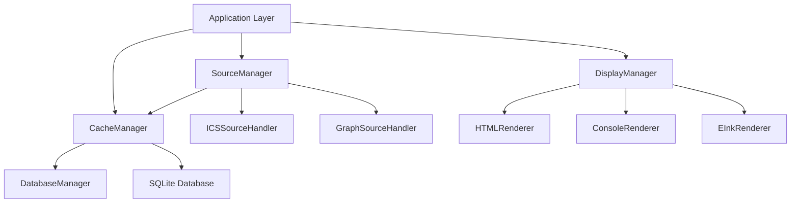
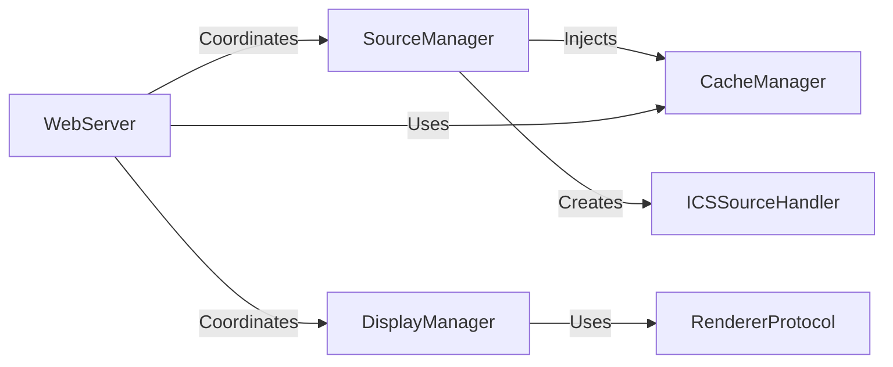

# Integration Patterns Documentation

## Overview

CalendarBot implements sophisticated architectural patterns to achieve clean separation of concerns, type safety, and robust async/sync coordination. This document details the core integration patterns that enable the system's modularity and extensibility.

## Protocol Pattern

### RendererProtocol Interface

The Protocol Pattern provides compile-time type checking and runtime interface compliance using Python's `typing.Protocol`.

```python
from typing import Protocol

class RendererProtocol(Protocol):
    """Protocol defining the interface that all renderers must implement."""
    
    def render_events(
        self, events: List[CachedEvent], status_info: Optional[Dict[str, Any]] = None
    ) -> str:
        """Render events to formatted output."""
        ...
    
    def render_error(
        self, error_message: str, cached_events: Optional[List[CachedEvent]] = None
    ) -> str:
        """Render an error message with optional cached events."""
        ...
    
    def render_authentication_prompt(self, verification_uri: str, user_code: str) -> str:
        """Render authentication prompt for device code flow."""
        ...
```

### Extended Console Protocol

```python
class ConsoleRendererProtocol(RendererProtocol, Protocol):
    """Extended protocol for console-specific renderers."""
    
    def clear_screen(self) -> None:
        """Clear the console screen."""
        ...
    
    def display_with_clear(self, content: str) -> None:
        """Display content after clearing screen."""
        ...
    
    def enable_split_display(self, max_log_lines: int = 5) -> None:
        """Enable split display mode for interactive logging."""
        ...
```

### Protocol Benefits

1. **Compile-Time Type Safety**: MyPy validates interface compliance
2. **Runtime Flexibility**: No inheritance required, duck typing with validation
3. **Clear Contracts**: Explicit method signatures and documentation
4. **Extensibility**: Easy to add new renderer types without modifying existing code

### Implementation Example

```python
class HTMLRenderer:
    """HTML renderer implementing RendererProtocol."""
    
    def render_events(
        self, events: List[CachedEvent], status_info: Optional[Dict[str, Any]] = None
    ) -> str:
        # Implementation renders events as HTML
        return "<html>...</html>"
    
    def render_error(
        self, error_message: str, cached_events: Optional[List[CachedEvent]] = None
    ) -> str:
        # Implementation renders error as HTML
        return f"<html><body><h1>Error: {error_message}</h1></body></html>"
```

## Manager Pattern

### Coordination Architecture

Manager classes coordinate between subsystems, implementing dependency injection and resource management patterns.



### SourceManager Pattern

Coordinates calendar data fetching from multiple sources with health checking and error handling.

```python
class SourceManager:
    """Manages calendar sources and coordinates data fetching."""
    
    def __init__(self, settings: Any, cache_manager: Optional[CacheManager] = None):
        self.settings = settings
        self.cache_manager = cache_manager
        self._sources: Dict[str, ICSSourceHandler] = {}
        self._source_configs: Dict[str, SourceConfig] = {}
```

#### Key Responsibilities

1. **Source Lifecycle Management**: Add, remove, configure calendar sources
2. **Health Monitoring**: Track source availability and response times
3. **Data Orchestration**: Coordinate fetching from multiple sources
4. **Error Handling**: Graceful degradation when sources fail
5. **Cache Integration**: Coordinate with cache manager for storage

#### Async Coordination Pattern

```python
async def fetch_and_cache_events(self) -> bool:
    """Orchestrates asynchronous event fetching with error isolation."""
    all_events = []
    successful_sources = 0
    
    # Sequential processing for stability
    for name, handler in self._sources.items():
        try:
            if not handler.is_healthy():
                logger.warning(f"Skipping unhealthy source: {name}")
                continue
            
            events = await handler.fetch_events()
            all_events.extend(events)
            successful_sources += 1
            
        except Exception as e:
            # Individual source failures don't abort entire operation
            logger.error(f"Failed to fetch from source '{name}': {e}")
    
    # Atomic cache operation
    if self.cache_manager and all_events:
        return await self.cache_manager.cache_events(all_events)
    
    return len(all_events) > 0
```

### DisplayManager Pattern

Coordinates between data sources and rendering engines with dynamic renderer selection.

```python
class DisplayManager:
    """Manages display output and coordination between data and renderers."""
    
    def __init__(self, settings: Any) -> None:
        self.settings = settings
        self.renderer: Optional[RendererProtocol] = None
        
        # Dynamic renderer selection based on configuration
        if settings.display_type == "console":
            self.renderer = ConsoleRenderer(settings)
        elif settings.display_type == "html":
            self.renderer = HTMLRenderer(settings)
        elif settings.display_type == "3x4":
            self.renderer = CompactEInkRenderer(settings)
```

#### Runtime Display Type Switching

```python
def set_display_type(self, display_type: str) -> bool:
    """Change the display type at runtime."""
    type_mapping = {
        "4x8": "html",
        "3x4": "3x4",
    }
    
    mapped_type = type_mapping.get(display_type, display_type)
    
    # Create new renderer instance
    if mapped_type == "html":
        new_renderer = HTMLRenderer(self.settings)
    elif mapped_type == "3x4":
        new_renderer = CompactEInkRenderer(self.settings)
    else:
        new_renderer = ConsoleRenderer(self.settings)
    
    # Atomic state update
    self.settings.display_type = mapped_type
    self.renderer = new_renderer
    return True
```

### Manager Coordination Benefits

1. **Loose Coupling**: Managers coordinate without tight dependencies
2. **Fault Isolation**: Failures in one subsystem don't affect others
3. **Dynamic Configuration**: Runtime reconfiguration without restart
4. **Resource Management**: Centralized lifecycle management
5. **Monitoring Integration**: Built-in health checks and metrics

## Async/Sync Bridge Pattern

### Complex Event Loop Management

The WebServer class implements sophisticated patterns for bridging synchronous HTTP handlers with asynchronous cache operations.

```python
class WebServer:
    """Web server implementing async/sync bridge patterns."""
    
    def get_calendar_html(self) -> str:
        """Get calendar HTML from sync context calling async cache methods."""
        try:
            # Detect if we're already in an event loop
            loop = asyncio.get_running_loop()
            
            # Run async operation in separate thread to avoid conflicts
            def run_async_in_thread() -> Any:
                new_loop = asyncio.new_event_loop()
                asyncio.set_event_loop(new_loop)
                try:
                    return new_loop.run_until_complete(
                        self.cache_manager.get_events_by_date_range(
                            start_datetime, end_datetime
                        )
                    )
                finally:
                    new_loop.close()
            
            with concurrent.futures.ThreadPoolExecutor() as executor:
                future = executor.submit(run_async_in_thread)
                events = future.result(timeout=5.0)
                
        except RuntimeError:
            # No running event loop, safe to use asyncio.run()
            events = asyncio.run(
                self.cache_manager.get_events_by_date_range(start_datetime, end_datetime)
            )
```

### Bridge Pattern Components

#### 1. Event Loop Detection

```python
try:
    loop = asyncio.get_running_loop()
    # Handle case where we're already in an event loop
except RuntimeError:
    # No event loop running, safe to create one
```

#### 2. Thread Pool Execution

```python
def run_async_in_thread() -> Any:
    """Execute async function in isolated event loop."""
    new_loop = asyncio.new_event_loop()
    asyncio.set_event_loop(new_loop)
    try:
        return new_loop.run_until_complete(async_operation())
    finally:
        new_loop.close()

with concurrent.futures.ThreadPoolExecutor() as executor:
    future = executor.submit(run_async_in_thread)
    result = future.result(timeout=5.0)
```

#### 3. Timeout and Error Handling

```python
try:
    result = future.result(timeout=5.0)
except concurrent.futures.TimeoutError:
    logger.error("Async operation timed out")
    return default_result
except Exception as e:
    logger.error(f"Async operation failed: {e}")
    return error_result
```

### HTTP Request Handler Integration

```python
class WebRequestHandler(BaseHTTPRequestHandler):
    """HTTP handler integrating sync request processing with async operations."""
    
    def _handle_refresh_api(self) -> None:
        """Handle refresh API using async/sync bridge."""
        if not self.web_server:
            self._send_json_response(500, {"error": "Web server not available"})
            return
        
        # Sync method that internally bridges to async operations
        success = self.web_server.refresh_data()
        html_content = self.web_server.get_calendar_html()
        
        self._send_json_response(200, {"success": success, "html": html_content})
```

### Bridge Pattern Benefits

1. **Event Loop Isolation**: Prevents "event loop is already running" errors
2. **Thread Safety**: Each async operation gets its own event loop
3. **Timeout Protection**: Prevents hanging operations
4. **Error Containment**: Failures don't crash the web server
5. **Performance**: Avoids blocking the main HTTP server thread

## Dependency Injection Pattern

### Manager-Handler Relationships



### Injection Implementation

```python
class SourceManager:
    def __init__(self, settings: Any, cache_manager: Optional[CacheManager] = None):
        """Dependency injection of cache manager."""
        self.cache_manager = cache_manager
        
    async def fetch_and_cache_events(self) -> bool:
        """Use injected cache manager for storage."""
        if self.cache_manager and all_events:
            return await self.cache_manager.cache_events(all_events)
```

### Factory Pattern Integration

```python
def create_renderer(display_type: str, settings: Any) -> RendererProtocol:
    """Factory function for renderer creation."""
    if display_type == "console":
        return ConsoleRenderer(settings)
    elif display_type == "html":
        return HTMLRenderer(settings)
    elif display_type == "3x4":
        return CompactEInkRenderer(settings)
    else:
        raise ValueError(f"Unknown display type: {display_type}")
```

## Observer Pattern

### Event Notification System

```python
class DisplayManager:
    async def display_events(
        self,
        events: List[CachedEvent],
        status_info: Optional[Dict[str, Any]] = None,
        clear_screen: bool = True,
    ) -> bool:
        """Observer pattern for display updates."""
        
        # Prepare status information (event data)
        display_status = status_info or {}
        display_status["last_update"] = datetime.now().isoformat()
        
        # Notify renderer (observer) of new events
        if self.renderer:
            content = self.renderer.render_events(events, display_status)
            
            # Update display based on renderer capabilities
            if hasattr(self.renderer, "display_with_clear") and clear_screen:
                self.renderer.display_with_clear(content)
            else:
                print(content)
```

## Strategy Pattern

### Renderer Selection Strategy

```python
class DisplayManager:
    def _create_renderer_strategy(self, display_type: str) -> RendererProtocol:
        """Strategy pattern for renderer selection."""
        strategies = {
            "console": lambda: ConsoleRenderer(self.settings),
            "html": lambda: HTMLRenderer(self.settings),
            "rpi": lambda: RaspberryPiHTMLRenderer(self.settings),
            "3x4": lambda: CompactEInkRenderer(self.settings),
        }
        
        strategy = strategies.get(display_type)
        if strategy:
            return strategy()
        else:
            # Default strategy
            return ConsoleRenderer(self.settings)
```

## Resource Management Patterns

### Context Management

```python
class DatabaseManager:
    async def store_events(self, events: List[CachedEvent]) -> bool:
        """Resource management with proper cleanup."""
        async with aiosqlite.connect(str(self.database_path)) as db:
            await db.executemany(INSERT_QUERY, event_data)
            await db.commit()
            return True
```

### Thread Pool Management

```python
class WebServer:
    def get_calendar_html(self) -> str:
        """Resource-managed thread pool execution."""
        with concurrent.futures.ThreadPoolExecutor() as executor:
            future = executor.submit(run_async_in_thread)
            return future.result(timeout=5.0)
        # ThreadPoolExecutor automatically cleaned up
```

## Error Handling Patterns

### Graceful Degradation

```python
async def fetch_and_cache_events(self) -> bool:
    """Graceful degradation on partial failures."""
    successful_sources = 0
    
    for name, handler in self._sources.items():
        try:
            if not handler.is_healthy():
                # Skip unhealthy sources, continue with others
                continue
                
            events = await handler.fetch_events()
            all_events.extend(events)
            successful_sources += 1
            
        except Exception as e:
            # Log error but continue processing other sources
            logger.error(f"Source '{name}' failed: {e}")
    
    # Return success if at least one source worked
    return successful_sources > 0
```

### Circuit Breaker Pattern

```python
class ICSSourceHandler:
    def is_healthy(self) -> bool:
        """Circuit breaker implementation."""
        if self._consecutive_failures > self.max_failures:
            return False
        if self._last_failure_time:
            time_since_failure = datetime.now() - self._last_failure_time
            if time_since_failure < self.backoff_period:
                return False
        return True
```

## Best Practices

### 1. Protocol Design

- **Single Responsibility**: Each protocol defines one cohesive interface
- **Comprehensive Documentation**: Include docstrings for all protocol methods
- **Type Annotations**: Use complete type hints for all parameters and returns
- **Version Compatibility**: Design protocols to be backward compatible

### 2. Manager Coordination

- **Explicit Dependencies**: Use constructor injection for required dependencies
- **Health Monitoring**: Implement health checks for all managed resources
- **Graceful Degradation**: Handle partial failures without system crash
- **Resource Cleanup**: Ensure proper cleanup in all error scenarios

### 3. Async/Sync Bridging

- **Event Loop Detection**: Always check for existing event loops
- **Timeout Protection**: Set reasonable timeouts for all async operations
- **Error Isolation**: Don't let async errors crash sync contexts
- **Thread Pool Management**: Use context managers for resource cleanup

### 4. Error Handling

- **Fail Fast**: Validate inputs early and return clear error messages
- **Graceful Recovery**: Implement fallback strategies for common failures
- **Comprehensive Logging**: Log errors with sufficient context for debugging
- **Circuit Breakers**: Prevent cascading failures with health-based skipping

### 5. Performance Considerations

- **Lazy Initialization**: Create expensive resources only when needed
- **Connection Pooling**: Reuse database and network connections
- **Caching Strategies**: Cache expensive computations and API calls
- **Memory Management**: Use streaming for large data sets

## Testing Patterns

### Protocol Testing

```python
def test_renderer_protocol_compliance():
    """Test that renderer implements required protocol methods."""
    renderer = HTMLRenderer(settings)
    
    # Protocol compliance test
    assert hasattr(renderer, 'render_events')
    assert hasattr(renderer, 'render_error')
    assert hasattr(renderer, 'render_authentication_prompt')
    
    # Method signature test
    events = []
    result = renderer.render_events(events)
    assert isinstance(result, str)
```

### Manager Testing

```python
@pytest.mark.asyncio
async def test_source_manager_graceful_degradation():
    """Test manager handles source failures gracefully."""
    manager = SourceManager(settings)
    
    # Add healthy and unhealthy sources
    await manager.add_ics_source("healthy", "http://good.example.com/cal.ics")
    await manager.add_ics_source("unhealthy", "http://bad.example.com/cal.ics")
    
    # Mock unhealthy source
    manager._sources["unhealthy"].is_healthy = lambda: False
    
    # Should still succeed with healthy source
    success = await manager.fetch_and_cache_events()
    assert success
```

### Async/Sync Bridge Testing

```python
def test_async_sync_bridge():
    """Test async/sync bridge handles event loop conflicts."""
    # Simulate existing event loop
    async def test_in_event_loop():
        web_server = WebServer(settings, display_manager, cache_manager)
        html = web_server.get_calendar_html()
        assert html is not None
        assert isinstance(html, str)
    
    # Run test in event loop to trigger bridge logic
    asyncio.run(test_in_event_loop())
```

This integration pattern documentation provides a comprehensive guide to the sophisticated architectural patterns used throughout CalendarBot, enabling maintainable and extensible calendar management functionality.