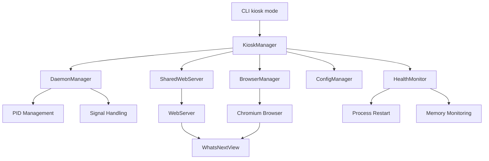

# KioskManager Component Specification

## Overview

The KioskManager serves as the central orchestrator for kiosk mode operations, integrating with existing CalendarBot infrastructure (DaemonManager, SharedWebServer) while adding kiosk-specific functionality for browser management and health monitoring.

## Component Integration Architecture



## Class Definition

```python
from typing import Optional, Dict, Any
from dataclasses import dataclass
from datetime import datetime, timedelta
import asyncio
import logging

from calendarbot.utils.daemon import DaemonManager, DaemonStatus
from calendarbot.cli.modes.shared_webserver import SharedWebServer
from calendarbot.config.settings import CalendarBotSettings
from calendarbot.kiosk.browser import BrowserManager, BrowserStatus
from calendarbot.kiosk.monitoring import HealthMonitor, KioskHealthStatus
from calendarbot.kiosk.settings import KioskSettings


@dataclass
class KioskStatus:
    """Comprehensive kiosk system status."""
    
    # Overall status
    is_running: bool
    start_time: Optional[datetime]
    uptime: Optional[timedelta]
    
    # Component statuses
    daemon_status: Optional[DaemonStatus]
    browser_status: Optional[BrowserStatus]
    health_status: Optional[KioskHealthStatus]
    
    # System metrics
    memory_usage_mb: int
    cpu_usage_percent: float
    
    # Error tracking
    restart_count: int
    last_error: Optional[str]
    error_time: Optional[datetime]


class KioskManager:
    """Central coordinator for kiosk mode operations.
    
    Integrates with existing CalendarBot infrastructure while adding
    kiosk-specific orchestration, browser management, and health monitoring.
    """
    
    def __init__(
        self,
        settings: CalendarBotSettings,
        kiosk_settings: KioskSettings,
        daemon_manager: Optional[DaemonManager] = None
    ) -> None:
        """Initialize KioskManager with existing infrastructure integration.
        
        Args:
            settings: Main CalendarBot settings
            kiosk_settings: Kiosk-specific settings
            daemon_manager: Optional custom daemon manager (for testing)
        """
        self.settings = settings
        self.kiosk_settings = kiosk_settings
        self.logger = logging.getLogger(f"{__name__}.KioskManager")
        
        # Core components - integrate with existing infrastructure
        self.daemon_manager = daemon_manager or DaemonManager()
        self.browser_manager = BrowserManager(kiosk_settings.browser)
        self.health_monitor = HealthMonitor(kiosk_settings.monitoring)
        
        # Shared web server integration
        self.shared_webserver: Optional[SharedWebServer] = None
        
        # State tracking
        self._start_time: Optional[datetime] = None
        self._restart_count: int = 0
        self._last_error: Optional[str] = None
        self._error_time: Optional[datetime] = None
        
        # Control flags
        self._shutdown_requested: bool = False
        self._monitoring_task: Optional[asyncio.Task] = None

    async def start_kiosk(self) -> bool:
        """Start complete kiosk system with proper startup orchestration.
        
        Returns:
            True if kiosk started successfully, False otherwise
            
        Raises:
            KioskError: If critical startup failure occurs
        """
        try:
            self.logger.info("Starting CalendarBot kiosk mode")
            self._start_time = datetime.now()
            
            # Phase 1: Start web server using existing daemon infrastructure
            if not await self._start_web_server():
                raise KioskError("Failed to start web server")
                
            # Phase 2: Wait for web server to be ready
            if not await self._wait_for_web_server_ready():
                raise KioskError("Web server failed to become ready")
                
            # Phase 3: Start browser pointing to web server
            if not await self._start_browser():
                raise KioskError("Failed to start browser")
                
            # Phase 4: Start health monitoring
            await self._start_health_monitoring()
            
            self.logger.info("Kiosk mode started successfully")
            return True
            
        except Exception as e:
            self._last_error = str(e)
            self._error_time = datetime.now()
            self.logger.error(f"Failed to start kiosk: {e}")
            
            # Cleanup on failure
            await self._cleanup_on_failure()
            return False

    async def stop_kiosk(self, timeout: int = 30) -> bool:
        """Gracefully stop kiosk system with proper cleanup.
        
        Args:
            timeout: Maximum seconds to wait for graceful shutdown
            
        Returns:
            True if shutdown completed successfully, False otherwise
        """
        try:
            self.logger.info("Stopping CalendarBot kiosk mode")
            self._shutdown_requested = True
            
            # Phase 1: Stop health monitoring
            await self._stop_health_monitoring()
            
            # Phase 2: Stop browser gracefully
            if not await self.browser_manager.stop_browser(timeout=10):
                self.logger.warning("Browser did not stop gracefully, forcing shutdown")
                
            # Phase 3: Stop web server using daemon manager
            if not await self._stop_web_server(timeout=timeout-10):
                self.logger.warning("Web server did not stop gracefully")
                
            self.logger.info("Kiosk mode stopped successfully")
            return True
            
        except Exception as e:
            self.logger.error(f"Error during kiosk shutdown: {e}")
            return False

    def get_kiosk_status(self) -> KioskStatus:
        """Get comprehensive kiosk system status.
        
        Returns:
            Current kiosk status including all component states
        """
        try:
            # Get component statuses
            daemon_status = self._get_daemon_status()
            browser_status = self.browser_manager.get_browser_status()
            health_status = self.health_monitor.get_health_status()
            
            # Calculate uptime
            uptime = None
            if self._start_time:
                uptime = datetime.now() - self._start_time
                
            # Get system metrics
            memory_usage = self.health_monitor.get_memory_usage()
            cpu_usage = self.health_monitor.get_cpu_usage()
            
            return KioskStatus(
                is_running=self._is_running(),
                start_time=self._start_time,
                uptime=uptime,
                daemon_status=daemon_status,
                browser_status=browser_status,
                health_status=health_status,
                memory_usage_mb=memory_usage,
                cpu_usage_percent=cpu_usage,
                restart_count=self._restart_count,
                last_error=self._last_error,
                error_time=self._error_time
            )
            
        except Exception as e:
            self.logger.error(f"Error getting kiosk status: {e}")
            return KioskStatus(
                is_running=False,
                start_time=None,
                uptime=None,
                daemon_status=None,
                browser_status=None,
                health_status=None,
                memory_usage_mb=0,
                cpu_usage_percent=0.0,
                restart_count=self._restart_count,
                last_error=str(e),
                error_time=datetime.now()
            )

    async def restart_kiosk(self) -> bool:
        """Restart entire kiosk system.
        
        Returns:
            True if restart successful, False otherwise
        """
        try:
            self.logger.info("Restarting kiosk system")
            self._restart_count += 1
            
            # Stop first
            await self.stop_kiosk(timeout=15)
            
            # Brief pause to ensure cleanup
            await asyncio.sleep(2)
            
            # Start again
            return await self.start_kiosk()
            
        except Exception as e:
            self.logger.error(f"Error during kiosk restart: {e}")
            return False

    # Integration with existing DaemonManager
    async def _start_web_server(self) -> bool:
        """Start CalendarBot web server using existing daemon infrastructure."""
        try:
            self.logger.info("Starting CalendarBot web server")
            
            # Check if daemon is already running
            if self.daemon_manager.is_daemon_running():
                existing_pid = self.daemon_manager.get_daemon_pid()
                self.logger.info(f"Using existing CalendarBot daemon (PID {existing_pid})")
                return True
            
            # Initialize shared web server with kiosk-optimized settings
            app = await self._initialize_calendarbot_app()
            
            self.shared_webserver = SharedWebServer(
                settings=self.settings,
                display_manager=app.display_manager,
                cache_manager=app.cache_manager
            )
            
            # Start the web server
            success = await self.shared_webserver.start()
            if success:
                # Create PID file for daemon tracking
                self.daemon_manager.create_pid_file()
                self.logger.info(f"Web server started on port {self.settings.web_port}")
                
            return success
            
        except Exception as e:
            self.logger.error(f"Failed to start web server: {e}")
            return False

    async def _wait_for_web_server_ready(self, timeout: int = 30) -> bool:
        """Wait for web server to be ready to serve requests."""
        import aiohttp
        
        url = f"http://localhost:{self.settings.web_port}/whats-next-view"
        
        for attempt in range(timeout):
            try:
                async with aiohttp.ClientSession() as session:
                    async with session.get(url, timeout=1) as response:
                        if response.status == 200:
                            self.logger.info("Web server is ready")
                            return True
                            
            except Exception:
                pass  # Expected during startup
                
            await asyncio.sleep(1)
            
        self.logger.error("Web server failed to become ready within timeout")
        return False

    async def _start_browser(self) -> bool:
        """Start browser pointing to local web server."""
        try:
            port = self.settings.web_port
            url = f"http://localhost:{port}/whats-next-view"
            
            # Add startup delay for Pi Zero 2W
            if self.kiosk_settings.browser.startup_delay > 0:
                self.logger.info(f"Waiting {self.kiosk_settings.browser.startup_delay}s before starting browser")
                await asyncio.sleep(self.kiosk_settings.browser.startup_delay)
            
            return await self.browser_manager.start_browser(url)
            
        except Exception as e:
            self.logger.error(f"Failed to start browser: {e}")
            return False

    async def _start_health_monitoring(self) -> None:
        """Start health monitoring task."""
        try:
            self._monitoring_task = asyncio.create_task(self._monitoring_loop())
            self.logger.info("Health monitoring started")
            
        except Exception as e:
            self.logger.error(f"Failed to start health monitoring: {e}")

    async def _monitoring_loop(self) -> None:
        """Main health monitoring loop with automatic recovery."""
        interval = self.kiosk_settings.monitoring.health_check_interval
        
        while not self._shutdown_requested:
            try:
                # Check component health
                browser_healthy = self.browser_manager.is_browser_healthy()
                web_server_healthy = await self._check_web_server_health()
                memory_healthy = self.health_monitor.check_memory_usage()
                
                # Handle browser failures
                if not browser_healthy:
                    self.logger.warning("Browser unhealthy, attempting restart")
                    await self.browser_manager.restart_browser()
                
                # Handle web server failures
                if not web_server_healthy:
                    self.logger.warning("Web server unhealthy, attempting restart")
                    await self._restart_web_server()
                
                # Handle memory pressure
                if not memory_healthy:
                    self.logger.warning("Memory pressure detected, clearing browser cache")
                    await self.browser_manager.clear_cache()
                
            except Exception as e:
                self.logger.error(f"Error in monitoring loop: {e}")
                
            await asyncio.sleep(interval)

    async def _check_web_server_health(self) -> bool:
        """Check if web server is responding properly."""
        try:
            import aiohttp
            
            url = f"http://localhost:{self.settings.web_port}/whats-next-view"
            async with aiohttp.ClientSession() as session:
                async with session.get(url, timeout=5) as response:
                    return response.status == 200
                    
        except Exception:
            return False

    def _get_daemon_status(self) -> Optional[DaemonStatus]:
        """Get daemon status using existing DaemonManager."""
        try:
            if self.daemon_manager.is_daemon_running():
                pid = self.daemon_manager.get_daemon_pid()
                # Create basic status - could be enhanced with more details
                return DaemonStatus(
                    pid=pid,
                    port=self.settings.web_port,
                    is_healthy=True  # Simplified for now
                )
            return None
            
        except Exception as e:
            self.logger.error(f"Error getting daemon status: {e}")
            return None

    def _is_running(self) -> bool:
        """Check if kiosk system is running."""
        return (
            self._start_time is not None
            and not self._shutdown_requested
            and self.daemon_manager.is_daemon_running()
        )

    async def _initialize_calendarbot_app(self):
        """Initialize CalendarBot application components."""
        # Import here to avoid circular imports
        from calendarbot.main import CalendarBot
        
        app = CalendarBot(self.settings)
        await app.initialize()
        return app

    async def _stop_web_server(self, timeout: int = 20) -> bool:
        """Stop web server using existing daemon infrastructure."""
        try:
            if self.shared_webserver:
                await self.shared_webserver.stop()
                
            # Clean up daemon tracking
            self.daemon_manager.cleanup_pid_file()
            return True
            
        except Exception as e:
            self.logger.error(f"Error stopping web server: {e}")
            return False

    async def _stop_health_monitoring(self) -> None:
        """Stop health monitoring task."""
        if self._monitoring_task and not self._monitoring_task.done():
            self._monitoring_task.cancel()
            try:
                await self._monitoring_task
            except asyncio.CancelledError:
                pass

    async def _cleanup_on_failure(self) -> None:
        """Clean up resources after startup failure."""
        try:
            await self.browser_manager.stop_browser()
            await self._stop_web_server()
            await self._stop_health_monitoring()
            
        except Exception as e:
            self.logger.error(f"Error during cleanup: {e}")

    async def _restart_web_server(self) -> bool:
        """Restart web server component."""
        try:
            await self._stop_web_server()
            await asyncio.sleep(2)
            return await self._start_web_server()
            
        except Exception as e:
            self.logger.error(f"Error restarting web server: {e}")
            return False


class KioskError(Exception):
    """Exception raised for kiosk-related errors."""
    pass
```

## Integration Points

### 1. DaemonManager Integration
- **PID Management**: Uses existing PID file system (`~/.calendarbot/daemon.pid`)
- **Process Tracking**: Leverages daemon health checking
- **Signal Handling**: Inherits graceful shutdown capabilities

### 2. SharedWebServer Integration  
- **Port Management**: Uses existing port conflict resolution
- **Component Reuse**: Leverages display_manager and cache_manager
- **Configuration**: Respects existing web server settings

### 3. Configuration Integration
- **Settings Hierarchy**: KioskSettings extends CalendarBotSettings
- **CLI Integration**: Works with existing argument parsing
- **File Configuration**: Integrates with YAML config system

## Usage Example

```python
# CLI mode handler
async def run_kiosk_mode(args) -> int:
    """Run CalendarBot in kiosk mode."""
    try:
        # Load configuration
        settings = CalendarBotSettings()
        kiosk_settings = KioskSettings.from_cli_args(args)
        
        # Create and start kiosk manager
        kiosk_manager = KioskManager(settings, kiosk_settings)
        
        if await kiosk_manager.start_kiosk():
            # Keep running until shutdown signal
            try:
                while True:
                    await asyncio.sleep(1)
                    status = kiosk_manager.get_kiosk_status()
                    if not status.is_running:
                        break
                        
            except KeyboardInterrupt:
                logger.info("Shutdown requested")
                
            await kiosk_manager.stop_kiosk()
            return 0
        else:
            return 1
            
    except Exception as e:
        print(f"Kiosk mode error: {e}")
        return 1
```

## Error Handling Strategy

1. **Startup Failures**: Clean rollback of partially initialized components
2. **Runtime Failures**: Component-specific restart with exponential backoff
3. **Resource Exhaustion**: Automatic cache clearing and memory optimization
4. **Communication Failures**: Retry logic with circuit breaker pattern
5. **Critical Failures**: Full system restart with error logging

## Testing Considerations

- **Unit Tests**: Mock DaemonManager and SharedWebServer for isolated testing
- **Integration Tests**: Test with real CalendarBot components
- **Stress Tests**: Memory pressure and component failure scenarios
- **Hardware Tests**: Specific Pi Zero 2W performance validation