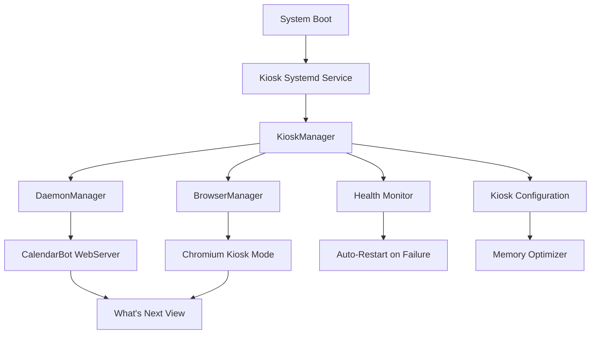
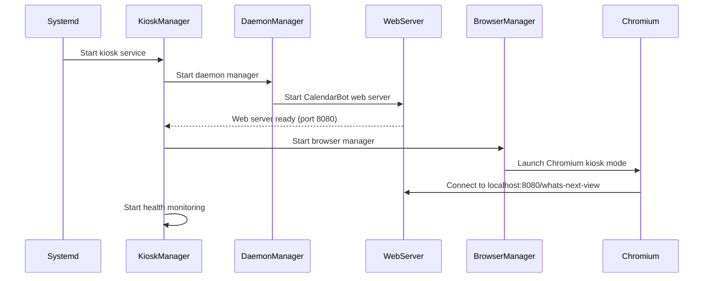

# CalendarBot Kiosk Mode Architecture

## Executive Summary

This document defines the comprehensive architecture for CalendarBot kiosk mode on Raspberry Pi Zero 2W, extending existing web server infrastructure with automatic browser launching and robust process management optimized for 512MB RAM constraints.

## System Overview

### Target Platform
- **Hardware**: Raspberry Pi Zero 2W (512MB RAM, ARMv7)
- **Display**: Waveshare 4" HDMI LCD (480x800 portrait)
- **Environment**: Personal office, reliable network
- **Use Case**: Always-on What's Next calendar display with touch interaction

### Core Architecture Principle
**Extend, Don't Replace**: Leverage existing CalendarBot components (WebServer, DaemonManager, SharedWebServer, CalendarBotSettings) and add kiosk-specific orchestration layer.

## High-Level Architecture



## Component Architecture

### 1. KioskManager (New Component)
**Location**: `calendarbot/kiosk/manager.py`

Primary orchestrator that coordinates all kiosk operations.

```python
class KioskManager:
    """Central coordinator for kiosk mode operations."""
    
    def __init__(self, settings: KioskSettings):
        self.settings = settings
        self.daemon_manager = DaemonManager()
        self.browser_manager = BrowserManager(settings.browser)
        self.health_monitor = HealthMonitor()
        
    async def start_kiosk(self) -> bool:
        """Start complete kiosk system."""
        
    async def stop_kiosk(self) -> bool:
        """Gracefully stop kiosk system."""
        
    def get_kiosk_status(self) -> KioskStatus:
        """Get comprehensive kiosk health status."""
```

**Responsibilities**:
- Coordinate startup sequence (web server → browser → monitoring)
- Handle graceful shutdown with proper cleanup
- Monitor component health and trigger restarts
- Manage configuration updates
- Provide unified status reporting

### 2. BrowserManager (New Component)
**Location**: `calendarbot/kiosk/browser.py`

Manages Chromium browser lifecycle with crash recovery optimized for Pi Zero 2W.

```python
class BrowserManager:
    """Chromium browser process management for kiosk mode."""
    
    def __init__(self, browser_config: BrowserConfig):
        self.config = browser_config
        self.process: Optional[subprocess.Popen] = None
        
    async def start_browser(self, url: str) -> bool:
        """Launch Chromium in kiosk mode."""
        
    async def restart_browser(self) -> bool:
        """Restart browser after crash."""
        
    def is_browser_healthy(self) -> bool:
        """Check if browser is responsive."""
```

**Optimizations for Pi Zero 2W**:
```bash
# Chromium launch arguments for 512MB RAM
chromium-browser 
  --kiosk 
  --no-sandbox 
  --disable-web-security 
  --disable-features=TranslateUI,BlinkGenPropertyTrees
  --disable-ipc-flooding-protection 
  --memory-pressure-off 
  --max_old_space_size=64 
  --disable-background-timer-throttling 
  --disable-renderer-backgrounding 
  --disable-backgrounding-occluded-windows
  --force-device-scale-factor=1.0
  --window-size=480,800
  --start-fullscreen
```

### 3. KioskSettings (New Component)
**Location**: `calendarbot/config/kiosk.py`

Extends CalendarBotSettings with kiosk-specific configuration.

```python
class BrowserConfig(BaseModel):
    """Browser-specific configuration."""
    executable_path: str = "chromium-browser"
    startup_delay: int = 5  # seconds
    crash_restart_delay: int = 3
    max_restart_attempts: int = 5
    health_check_interval: int = 30
    memory_limit_mb: int = 128

class DisplayConfig(BaseModel):
    """Display configuration for 480x800."""
    width: int = 480
    height: int = 800
    orientation: str = "portrait"
    scale_factor: float = 1.0
    touch_enabled: bool = True

class KioskSettings(BaseModel):
    """Kiosk mode specific settings."""
    enabled: bool = False
    auto_start: bool = True
    browser: BrowserConfig = Field(default_factory=BrowserConfig)
    display: DisplayConfig = Field(default_factory=DisplayConfig)
    monitoring: MonitoringConfig = Field(default_factory=MonitoringConfig)
```

### 4. HealthMonitor (New Component)
**Location**: `calendarbot/kiosk/monitoring.py`

Monitors system health and triggers recovery actions.

```python
class HealthMonitor:
    """Monitor kiosk component health and trigger recovery."""
    
    async def start_monitoring(self):
        """Start health monitoring loop."""
        
    def check_web_server_health(self) -> bool:
        """Verify web server is responding."""
        
    def check_browser_health(self) -> bool:
        """Verify browser is displaying content."""
        
    def check_memory_usage(self) -> MemoryStatus:
        """Monitor RAM usage on Pi Zero 2W."""
```

## Process Management Architecture

### Startup Sequence


### Memory Management Strategy
**Total Available**: 512MB RAM
**Target Allocation**:
- System + Boot: ~200MB
- CalendarBot Python: ~100MB
- Chromium Browser: ~150MB  
- Buffer/Cache: ~62MB

**Optimization Techniques**:
1. **Chromium Memory Limits**: `--max_old_space_size=64`
2. **Python Process Optimization**: Disable unused CalendarBot modules
3. **Swap Configuration**: 512MB swap on SD card for emergency
4. **Memory Monitoring**: Auto-restart if usage > 90%

## Integration with Existing Components

### CLI Mode Integration
Add kiosk mode to existing MODE_REGISTRY:

```python
# calendarbot/cli/modes/__init__.py
MODE_REGISTRY["kiosk"] = {
    "name": "Kiosk Mode",
    "description": "Full-screen kiosk display with automatic browser launching",
    "handler": run_kiosk_mode,
    "requires_display": True,
    "async_mode": True,
}
```

### Web Server Extension
Leverage existing SharedWebServer with kiosk-specific optimizations:

```python
# calendarbot/cli/modes/kiosk.py
async def run_kiosk_mode(args):
    """Run CalendarBot in kiosk mode."""
    settings = KioskSettings.from_cli_args(args)
    kiosk_manager = KioskManager(settings)
    return await kiosk_manager.start_kiosk()
```

### Configuration Integration
Extend CalendarBotSettings with kiosk section:

```yaml
# ~/.config/calendarbot/config.yaml
kiosk:
  enabled: true
  auto_start: true
  browser:
    startup_delay: 5
    crash_restart_delay: 3
  display:
    width: 480
    height: 800
    orientation: portrait
  monitoring:
    health_check_interval: 30
    memory_threshold_mb: 400
```

## Error Handling and Recovery

### Recovery Strategies
1. **Browser Crash**: Auto-restart with exponential backoff
2. **Web Server Failure**: Restart CalendarBot daemon
3. **Memory Exhaustion**: Clear browser cache, restart browser
4. **Network Issues**: Retry with cached data
5. **Complete System Hang**: Watchdog timer restart

### Failure Detection
```python
class FailureDetector:
    """Detect various failure modes and trigger appropriate recovery."""
    
    def detect_browser_crash(self) -> bool:
        """Check if browser process exists and is responsive."""
        
    def detect_memory_pressure(self) -> bool:
        """Check if system is low on memory."""
        
    def detect_web_server_failure(self) -> bool:
        """Check if CalendarBot web server is responding."""
```

## Security Architecture

Since this is a personal office deployment with low security requirements:

### Minimal Security Model
1. **No Authentication**: Direct access to calendar view
2. **Local Network Only**: Web server binds to localhost
3. **Read-Only Interface**: No configuration changes via touch
4. **Process Isolation**: Standard Linux user permissions

### Future Security Extensions
- SSH key-based remote management
- Optional basic authentication
- Configuration change restrictions

## Deployment Architecture

### System Service Configuration
```ini
# /etc/systemd/system/calendarbot-kiosk.service
[Unit]
Description=CalendarBot Kiosk Mode
After=network.target graphical-session.target
Wants=graphical-session.target

[Service]
Type=simple
User=pi
Environment=DISPLAY=:0
ExecStart=/home/pi/calendarbot/venv/bin/python -m calendarbot --kiosk
Restart=always
RestartSec=10

[Install]
WantedBy=graphical.target
```

### Boot Sequence Integration
1. **X11 Auto-login**: Configure automatic desktop login
2. **Display Configuration**: Set 480x800 portrait mode
3. **Service Activation**: Enable calendarbot-kiosk.service
4. **Health Monitoring**: Enable watchdog for system recovery

## Performance Optimization

### Pi Zero 2W Specific Optimizations
1. **CPU Scaling**: Set performance governor for consistent response
2. **GPU Memory Split**: Allocate 64MB to GPU for display
3. **SD Card Optimization**: Use fast SD card, enable tmpfs for logs
4. **Network Optimization**: Optimize TCP buffers for low memory

### CalendarBot Optimizations
1. **Disable Unused Features**: Remove interactive mode components
2. **Cache Optimization**: Reduce cache size, shorter TTL
3. **Logging Optimization**: Log to memory buffer, periodic flush
4. **Python Optimization**: Use `-O` flag, compile .pyc files

## Monitoring and Maintenance

### Health Metrics Collection
```python
class KioskMetrics:
    """Collect and report kiosk performance metrics."""
    
    memory_usage: int  # MB
    cpu_usage: float   # %
    browser_restarts: int
    uptime: timedelta
    last_calendar_update: datetime
```

### Remote Management Interface
Simple REST API for remote monitoring:
```
GET /api/kiosk/status    # Get current status
POST /api/kiosk/restart  # Trigger restart
GET /api/kiosk/logs      # Get recent logs
```

## File Structure

```
calendarbot/
├── kiosk/
│   ├── __init__.py
│   ├── manager.py          # KioskManager
│   ├── browser.py          # BrowserManager  
│   ├── monitoring.py       # HealthMonitor
│   └── settings.py         # KioskSettings
├── cli/modes/
│   └── kiosk.py           # CLI mode handler
├── config/
│   └── kiosk.py           # Configuration extensions
└── web/
    └── kiosk/             # Kiosk-specific web assets
        ├── css/
        └── js/
```

## Next Steps

This architecture provides the foundation for implementing a robust, memory-optimized kiosk mode that leverages CalendarBot's existing infrastructure while adding the specialized components needed for reliable Pi Zero 2W operation.

The design prioritizes:
1. **Reliability**: Robust crash recovery and health monitoring
2. **Memory Efficiency**: Optimized for 512MB RAM constraints  
3. **Simplicity**: Leverages existing proven components
4. **Maintainability**: Clear separation of concerns
5. **Extensibility**: Foundation for future enhancements