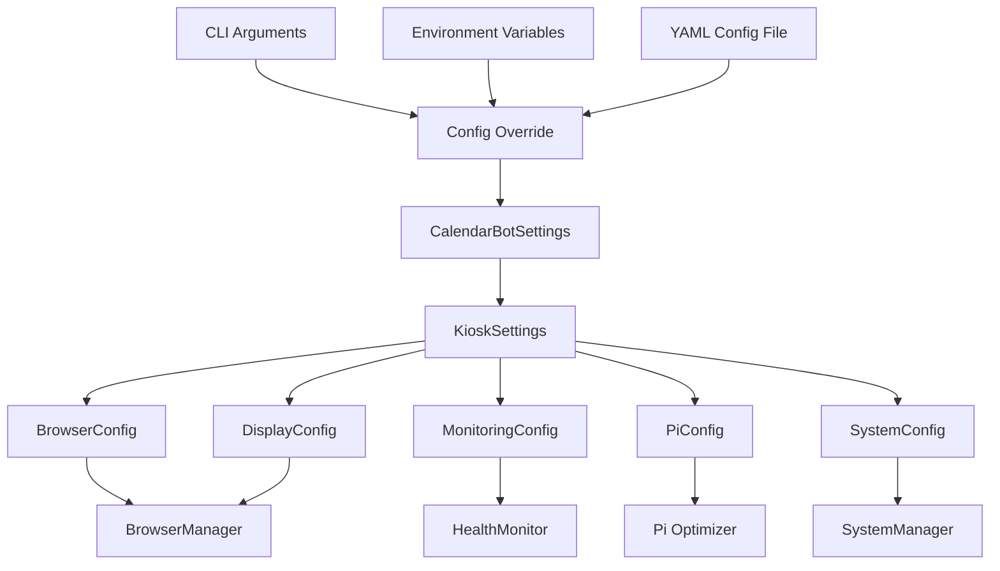

# KioskSettings Configuration Schema Specification

## Overview

The KioskSettings configuration schema extends CalendarBotSettings to provide comprehensive configuration management for kiosk mode, integrating seamlessly with existing YAML config, environment variables, and CLI argument systems.

## Configuration Architecture



## Core Configuration Classes

### KioskSettings (Main Configuration)

```python
from typing import Optional, Dict, Any, List
from pydantic import BaseModel, Field
from pathlib import Path

from calendarbot.config.settings import CalendarBotSettings


class KioskSettings(BaseModel):
    """Kiosk mode configuration extending CalendarBot settings.
    
    Provides comprehensive configuration for Pi Zero 2W kiosk deployment
    including browser management, display optimization, monitoring, and
    system integration.
    """
    
    # Core kiosk settings
    enabled: bool = Field(
        default=False,
        description="Enable kiosk mode functionality"
    )
    
    auto_start: bool = Field(
        default=True,
        description="Automatically start kiosk mode on system boot"
    )
    
    target_layout: str = Field(
        default="whats-next-view",
        description="CalendarBot layout to display in kiosk mode"
    )
    
    # Component configurations
    browser: BrowserConfig = Field(
        default_factory=lambda: BrowserConfig(),
        description="Browser process management configuration"
    )
    
    display: DisplayConfig = Field(
        default_factory=lambda: DisplayConfig(),
        description="Display and UI configuration for 480x800 screen"
    )
    
    monitoring: MonitoringConfig = Field(
        default_factory=lambda: MonitoringConfig(),
        description="Health monitoring and alerting configuration"
    )
    
    pi_optimization: PiOptimizationConfig = Field(
        default_factory=lambda: PiOptimizationConfig(),
        description="Raspberry Pi Zero 2W specific optimizations"
    )
    
    system: SystemConfig = Field(
        default_factory=lambda: SystemConfig(),
        description="System integration and service configuration"
    )
    
    # Advanced settings
    debug_mode: bool = Field(
        default=False,
        description="Enable debug logging and development features"
    )
    
    config_version: str = Field(
        default="1.0",
        description="Configuration schema version for migration support"
    )


class BrowserConfig(BaseModel):
    """Chromium browser configuration optimized for Pi Zero 2W."""
    
    # Process management
    executable_path: str = Field(
        default="chromium-browser",
        description="Path to Chromium executable"
    )
    
    startup_delay: int = Field(
        default=5,
        ge=0,
        le=60,
        description="Delay in seconds before starting browser after web server ready"
    )
    
    startup_timeout: int = Field(
        default=30,
        ge=10,
        le=120,
        description="Maximum seconds to wait for browser startup"
    )
    
    shutdown_timeout: int = Field(
        default=10,
        ge=1,
        le=30,
        description="Maximum seconds to wait for graceful browser shutdown"
    )
    
    # Restart and recovery
    crash_restart_delay: int = Field(
        default=3,
        ge=1,
        le=30,
        description="Initial delay in seconds before restarting crashed browser"
    )
    
    max_restart_attempts: int = Field(
        default=5,
        ge=1,
        le=20,
        description="Maximum restart attempts per hour"
    )
    
    restart_backoff_factor: float = Field(
        default=1.5,
        ge=1.0,
        le=3.0,
        description="Exponential backoff factor for restart delays"
    )
    
    reset_attempts_after: int = Field(
        default=3600,
        ge=300,
        le=86400,
        description="Reset restart attempt counter after this many seconds"
    )
    
    # Memory management
    memory_limit_mb: int = Field(
        default=128,
        ge=64,
        le=256,
        description="Maximum memory usage in MB before restart"
    )
    
    memory_warning_threshold: float = Field(
        default=0.85,
        ge=0.5,
        le=0.95,
        description="Memory usage percentage to trigger warning"
    )
    
    memory_critical_threshold: float = Field(
        default=0.95,
        ge=0.8,
        le=1.0,
        description="Memory usage percentage to trigger restart"
    )
    
    cache_clear_on_restart: bool = Field(
        default=True,
        description="Clear browser cache when restarting"
    )
    
    # Health monitoring
    health_check_interval: int = Field(
        default=30,
        ge=5,
        le=300,
        description="Health check interval in seconds"
    )
    
    response_timeout: int = Field(
        default=5,
        ge=1,
        le=30,
        description="Timeout for health check responses in seconds"
    )
    
    # Chromium optimization flags
    custom_flags: List[str] = Field(
        default_factory=list,
        description="Additional Chromium command line flags"
    )
    
    disable_extensions: bool = Field(
        default=True,
        description="Disable all Chromium extensions"
    )
    
    disable_plugins: bool = Field(
        default=True,
        description="Disable browser plugins"
    )


class DisplayConfig(BaseModel):
    """Display configuration for 480x800 portrait kiosk display."""
    
    # Physical display properties
    width: int = Field(
        default=480,
        ge=320,
        le=1920,
        description="Display width in pixels"
    )
    
    height: int = Field(
        default=800,
        ge=240,
        le=1080,
        description="Display height in pixels"
    )
    
    orientation: str = Field(
        default="portrait",
        description="Display orientation: portrait, landscape, portrait-flipped, landscape-flipped"
    )
    
    scale_factor: float = Field(
        default=1.0,
        ge=0.5,
        le=3.0,
        description="Display scaling factor for UI elements"
    )
    
    # Touch interface
    touch_enabled: bool = Field(
        default=True,
        description="Enable touch input handling"
    )
    
    touch_calibration: Optional[Dict[str, float]] = Field(
        default=None,
        description="Touch calibration parameters if needed"
    )
    
    # Kiosk display behavior
    screen_saver_timeout: int = Field(
        default=0,
        ge=0,
        le=3600,
        description="Screen saver timeout in seconds (0 = disabled)"
    )
    
    brightness: int = Field(
        default=100,
        ge=10,
        le=100,
        description="Display brightness percentage"
    )
    
    auto_brightness: bool = Field(
        default=False,
        description="Automatically adjust brightness based on ambient light"
    )
    
    # UI customization
    hide_cursor: bool = Field(
        default=True,
        description="Hide mouse cursor in kiosk mode"
    )
    
    fullscreen_mode: bool = Field(
        default=True,
        description="Force fullscreen browser display"
    )
    
    prevent_zoom: bool = Field(
        default=True,
        description="Prevent user zoom gestures"
    )


class MonitoringConfig(BaseModel):
    """Health monitoring and alerting configuration."""
    
    # Health monitoring
    enabled: bool = Field(
        default=True,
        description="Enable health monitoring"
    )
    
    health_check_interval: int = Field(
        default=30,
        ge=5,
        le=300,
        description="Overall health check interval in seconds"
    )
    
    memory_check_interval: int = Field(
        default=60,
        ge=10,
        le=600,
        description="Memory usage check interval in seconds"
    )
    
    # System resource monitoring
    memory_threshold_mb: int = Field(
        default=400,
        ge=200,
        le=500,
        description="System memory usage threshold for warnings (MB)"
    )
    
    cpu_threshold_percent: float = Field(
        default=80.0,
        ge=50.0,
        le=95.0,
        description="CPU usage threshold for warnings (%)"
    )
    
    disk_threshold_percent: float = Field(
        default=85.0,
        ge=50.0,
        le=95.0,
        description="Disk usage threshold for warnings (%)"
    )
    
    temperature_threshold_celsius: float = Field(
        default=75.0,
        ge=60.0,
        le=85.0,
        description="CPU temperature threshold for warnings (°C)"
    )
    
    # Error tracking
    max_error_history: int = Field(
        default=100,
        ge=10,
        le=1000,
        description="Maximum number of errors to keep in history"
    )
    
    error_rate_threshold: float = Field(
        default=0.1,
        ge=0.01,
        le=1.0,
        description="Error rate threshold for alerts (errors per minute)"
    )
    
    # Remote monitoring
    remote_monitoring_enabled: bool = Field(
        default=False,
        description="Enable remote monitoring API"
    )
    
    remote_monitoring_port: int = Field(
        default=8081,
        ge=1024,
        le=65535,
        description="Port for remote monitoring API"
    )
    
    remote_monitoring_auth: Optional[str] = Field(
        default=None,
        description="Authentication token for remote monitoring"
    )
    
    # Alerting
    alert_methods: List[str] = Field(
        default_factory=lambda: ["log"],
        description="Alert methods: log, email, webhook, mqtt"
    )
    
    webhook_url: Optional[str] = Field(
        default=None,
        description="Webhook URL for alerts"
    )
    
    email_config: Optional[Dict[str, str]] = Field(
        default=None,
        description="Email configuration for alerts"
    )


class PiOptimizationConfig(BaseModel):
    """Raspberry Pi Zero 2W specific optimizations."""
    
    # Memory management
    enable_memory_optimization: bool = Field(
        default=True,
        description="Enable Pi-specific memory optimizations"
    )
    
    swap_size_mb: int = Field(
        default=512,
        ge=0,
        le=2048,
        description="Swap file size in MB (0 = disabled)"
    )
    
    memory_split_mb: int = Field(
        default=64,
        ge=16,
        le=128,
        description="GPU memory split in MB"
    )
    
    # CPU optimization
    cpu_governor: str = Field(
        default="performance",
        description="CPU frequency governor: performance, powersave, ondemand"
    )
    
    cpu_max_freq_mhz: Optional[int] = Field(
        default=None,
        ge=600,
        le=1400,
        description="Maximum CPU frequency in MHz (None = default)"
    )
    
    # Thermal management
    enable_thermal_throttling: bool = Field(
        default=True,
        description="Enable CPU thermal throttling"
    )
    
    thermal_soft_limit: float = Field(
        default=70.0,
        ge=60.0,
        le=80.0,
        description="Temperature for soft throttling (°C)"
    )
    
    thermal_hard_limit: float = Field(
        default=80.0,
        ge=70.0,
        le=85.0,
        description="Temperature for hard throttling (°C)"
    )
    
    # Storage optimization
    enable_tmpfs_logs: bool = Field(
        default=True,
        description="Use tmpfs for log files to reduce SD card wear"
    )
    
    tmpfs_size_mb: int = Field(
        default=64,
        ge=16,
        le=256,
        description="Size of tmpfs for logs in MB"
    )
    
    log_rotation_size_mb: int = Field(
        default=10,
        ge=1,
        le=100,
        description="Log file size before rotation in MB"
    )
    
    # Network optimization
    enable_network_optimization: bool = Field(
        default=True,
        description="Enable network stack optimizations"
    )
    
    tcp_window_size_kb: int = Field(
        default=64,
        ge=32,
        le=256,
        description="TCP window size in KB"
    )


class SystemConfig(BaseModel):
    """System integration and service configuration."""
    
    # Service management
    systemd_service_name: str = Field(
        default="calendarbot-kiosk",
        description="Name for systemd service"
    )
    
    service_user: str = Field(
        default="pi",
        description="User to run kiosk service as"
    )
    
    service_group: str = Field(
        default="pi",
        description="Group to run kiosk service as"
    )
    
    # Boot configuration
    boot_delay: int = Field(
        default=30,
        ge=0,
        le=120,
        description="Delay after boot before starting kiosk (seconds)"
    )
    
    wait_for_network: bool = Field(
        default=True,
        description="Wait for network connectivity before starting"
    )
    
    network_timeout: int = Field(
        default=120,
        ge=30,
        le=300,
        description="Maximum time to wait for network (seconds)"
    )
    
    # X11 configuration
    x11_display: str = Field(
        default=":0",
        description="X11 display to use"
    )
    
    auto_login: bool = Field(
        default=True,
        description="Enable automatic login for kiosk user"
    )
    
    disable_screen_blanking: bool = Field(
        default=True,
        description="Disable screen blanking/power saving"
    )
    
    # Watchdog configuration
    enable_watchdog: bool = Field(
        default=True,
        description="Enable hardware watchdog for automatic recovery"
    )
    
    watchdog_timeout: int = Field(
        default=60,
        ge=30,
        le=300,
        description="Watchdog timeout in seconds"
    )
    
    # Maintenance
    auto_update: bool = Field(
        default=False,
        description="Enable automatic system updates"
    )
    
    update_schedule: str = Field(
        default="daily",
        description="Update schedule: daily, weekly, monthly"
    )
    
    backup_config: bool = Field(
        default=True,
        description="Automatically backup configuration files"
    )
    
    # Remote access
    ssh_enabled: bool = Field(
        default=True,
        description="Enable SSH access for remote maintenance"
    )
    
    ssh_port: int = Field(
        default=22,
        ge=1,
        le=65535,
        description="SSH port number"
    )
    
    vnc_enabled: bool = Field(
        default=False,
        description="Enable VNC for remote desktop access"
    )
```

## Integration with CalendarBotSettings

### Extended Settings Class

```python
from calendarbot.config.settings import CalendarBotSettings

class CalendarBotKioskSettings(CalendarBotSettings):
    """CalendarBot settings extended with kiosk configuration."""
    
    kiosk: KioskSettings = Field(
        default_factory=KioskSettings,
        description="Kiosk mode configuration"
    )
    
    def is_kiosk_mode(self) -> bool:
        """Check if kiosk mode is enabled."""
        return self.kiosk.enabled
    
    def get_kiosk_url(self) -> str:
        """Get the URL for kiosk mode display."""
        return f"http://localhost:{self.web_port}/{self.kiosk.target_layout}"
    
    def validate_kiosk_config(self) -> bool:
        """Validate kiosk configuration consistency."""
        if not self.kiosk.enabled:
            return True
            
        # Ensure web server is enabled for kiosk mode
        if not self.web_enabled:
            raise ValueError("Web server must be enabled for kiosk mode")
            
        # Validate display dimensions
        if self.kiosk.display.width <= 0 or self.kiosk.display.height <= 0:
            raise ValueError("Invalid display dimensions")
            
        # Validate memory limits for Pi Zero 2W
        total_memory = (
            self.kiosk.browser.memory_limit_mb +
            100 +  # Estimated CalendarBot memory
            200    # System memory
        )
        
        if total_memory > 500:  # Leave some buffer on 512MB Pi
            raise ValueError("Total memory allocation exceeds Pi Zero 2W limits")
            
        return True


# Factory function for easy creation
def create_kiosk_settings(**overrides) -> CalendarBotKioskSettings:
    """Create kiosk settings with optional overrides."""
    return CalendarBotKioskSettings(**overrides)
```

## Configuration File Integration

### YAML Configuration Example

```yaml
# ~/.config/calendarbot/config.yaml

# Existing CalendarBot settings
ics:
  url: "https://calendar.example.com/calendar.ics"
  
web:
  enabled: true
  port: 8080
  host: "0.0.0.0"
  layout: "whats-next-view"
  
# Kiosk mode configuration
kiosk:
  enabled: true
  auto_start: true
  target_layout: "whats-next-view"
  
  browser:
    startup_delay: 5
    memory_limit_mb: 128
    crash_restart_delay: 3
    max_restart_attempts: 5
    
  display:
    width: 480
    height: 800
    orientation: "portrait"
    scale_factor: 1.0
    touch_enabled: true
    hide_cursor: true
    
  monitoring:
    enabled: true
    health_check_interval: 30
    memory_threshold_mb: 400
    cpu_threshold_percent: 80.0
    remote_monitoring_enabled: false
    
  pi_optimization:
    enable_memory_optimization: true
    swap_size_mb: 512
    memory_split_mb: 64
    cpu_governor: "performance"
    enable_tmpfs_logs: true
    
  system:
    systemd_service_name: "calendarbot-kiosk"
    service_user: "pi"
    boot_delay: 30
    wait_for_network: true
    enable_watchdog: true
    ssh_enabled: true
```

### Environment Variable Support

```bash
# Core kiosk settings
export CALENDARBOT_KIOSK_ENABLED=true
export CALENDARBOT_KIOSK_AUTO_START=true
export CALENDARBOT_KIOSK_TARGET_LAYOUT="whats-next-view"

# Browser settings
export CALENDARBOT_KIOSK_BROWSER_MEMORY_LIMIT_MB=128
export CALENDARBOT_KIOSK_BROWSER_STARTUP_DELAY=5

# Display settings
export CALENDARBOT_KIOSK_DISPLAY_WIDTH=480
export CALENDARBOT_KIOSK_DISPLAY_HEIGHT=800
export CALENDARBOT_KIOSK_DISPLAY_ORIENTATION="portrait"

# Pi optimization
export CALENDARBOT_KIOSK_PI_OPTIMIZATION_CPU_GOVERNOR="performance"
export CALENDARBOT_KIOSK_PI_OPTIMIZATION_MEMORY_SPLIT_MB=64
```

## CLI Integration

### New CLI Arguments

```python
# calendarbot/cli/parser.py

def add_kiosk_arguments(parser):
    """Add kiosk mode arguments to CLI parser."""
    
    kiosk_group = parser.add_argument_group("kiosk", "Kiosk mode configuration")
    
    # Basic kiosk mode
    kiosk_group.add_argument(
        "--kiosk",
        action="store_true",
        help="Run in kiosk mode with full-screen browser"
    )
    
    # Display configuration
    kiosk_group.add_argument(
        "--kiosk-display-width",
        type=int,
        default=480,
        help="Kiosk display width in pixels"
    )
    
    kiosk_group.add_argument(
        "--kiosk-display-height", 
        type=int,
        default=800,
        help="Kiosk display height in pixels"
    )
    
    kiosk_group.add_argument(
        "--kiosk-orientation",
        choices=["portrait", "landscape", "portrait-flipped", "landscape-flipped"],
        default="portrait",
        help="Display orientation"
    )
    
    # Browser configuration
    kiosk_group.add_argument(
        "--kiosk-browser-memory-limit",
        type=int,
        default=128,
        help="Browser memory limit in MB"
    )
    
    kiosk_group.add_argument(
        "--kiosk-startup-delay",
        type=int,
        default=5,
        help="Delay before starting browser (seconds)"
    )
    
    # Pi optimization
    kiosk_group.add_argument(
        "--kiosk-cpu-governor",
        choices=["performance", "powersave", "ondemand"],
        default="performance", 
        help="CPU frequency governor"
    )
    
    # System configuration
    kiosk_group.add_argument(
        "--kiosk-enable-watchdog",
        action="store_true",
        help="Enable hardware watchdog"
    )
    
    kiosk_group.add_argument(
        "--kiosk-debug",
        action="store_true",
        help="Enable kiosk debug mode"
    )
```

### CLI Override Integration

```python
def apply_kiosk_cli_overrides(settings: CalendarBotKioskSettings, args) -> CalendarBotKioskSettings:
    """Apply CLI argument overrides to kiosk settings."""
    
    if hasattr(args, 'kiosk') and args.kiosk:
        settings.kiosk.enabled = True
    
    if hasattr(args, 'kiosk_display_width') and args.kiosk_display_width:
        settings.kiosk.display.width = args.kiosk_display_width
        
    if hasattr(args, 'kiosk_display_height') and args.kiosk_display_height:
        settings.kiosk.display.height = args.kiosk_display_height
        
    if hasattr(args, 'kiosk_orientation') and args.kiosk_orientation:
        settings.kiosk.display.orientation = args.kiosk_orientation
        
    if hasattr(args, 'kiosk_browser_memory_limit') and args.kiosk_browser_memory_limit:
        settings.kiosk.browser.memory_limit_mb = args.kiosk_browser_memory_limit
        
    if hasattr(args, 'kiosk_startup_delay') and args.kiosk_startup_delay:
        settings.kiosk.browser.startup_delay = args.kiosk_startup_delay
        
    if hasattr(args, 'kiosk_cpu_governor') and args.kiosk_cpu_governor:
        settings.kiosk.pi_optimization.cpu_governor = args.kiosk_cpu_governor
        
    if hasattr(args, 'kiosk_enable_watchdog') and args.kiosk_enable_watchdog:
        settings.kiosk.system.enable_watchdog = True
        
    if hasattr(args, 'kiosk_debug') and args.kiosk_debug:
        settings.kiosk.debug_mode = True
        
    return settings
```

## Validation and Error Handling

### Configuration Validation

```python
def validate_kiosk_configuration(settings: CalendarBotKioskSettings) -> List[str]:
    """Validate kiosk configuration and return list of errors."""
    
    errors = []
    
    if not settings.kiosk.enabled:
        return errors  # Skip validation if kiosk disabled
    
    # Validate web server integration
    if not settings.web_enabled:
        errors.append("Web server must be enabled for kiosk mode")
    
    # Validate display configuration
    if settings.kiosk.display.width <= 0 or settings.kiosk.display.height <= 0:
        errors.append("Display dimensions must be positive")
    
    # Validate memory allocation for Pi Zero 2W
    total_memory = (
        settings.kiosk.browser.memory_limit_mb +
        100 +  # CalendarBot estimated memory
        200    # System memory
    )
    
    if total_memory > 450:  # Conservative limit for 512MB Pi
        errors.append(f"Total memory allocation ({total_memory}MB) exceeds Pi Zero 2W safe limits")
    
    # Validate browser configuration
    if settings.kiosk.browser.max_restart_attempts <= 0:
        errors.append("Browser max restart attempts must be positive")
        
    if settings.kiosk.browser.startup_timeout <= settings.kiosk.browser.startup_delay:
        errors.append("Browser startup timeout must be greater than startup delay")
    
    # Validate monitoring thresholds
    if settings.kiosk.monitoring.memory_threshold_mb > 512:
        errors.append("Memory threshold exceeds Pi Zero 2W total memory")
    
    # Validate Pi optimization
    if settings.kiosk.pi_optimization.memory_split_mb > 128:
        errors.append("GPU memory split too large for Pi Zero 2W")
    
    return errors


def load_and_validate_kiosk_config(config_path: Optional[Path] = None) -> CalendarBotKioskSettings:
    """Load and validate kiosk configuration from all sources."""
    
    try:
        # Load base configuration
        if config_path:
            settings = CalendarBotKioskSettings(_config_file=config_path)
        else:
            settings = CalendarBotKioskSettings()
        
        # Validate configuration
        errors = validate_kiosk_configuration(settings)
        
        if errors:
            error_msg = "Configuration validation failed:\n" + "\n".join(f"  - {error}" for error in errors)
            raise ValueError(error_msg)
        
        return settings
        
    except Exception as e:
        raise ValueError(f"Failed to load kiosk configuration: {e}")
```

## Migration and Versioning

### Configuration Migration

```python
def migrate_kiosk_config(config_data: Dict[str, Any], from_version: str, to_version: str) -> Dict[str, Any]:
    """Migrate kiosk configuration between versions."""
    
    if from_version == "1.0" and to_version == "1.1":
        # Example migration from v1.0 to v1.1
        if "kiosk" in config_data:
            kiosk_config = config_data["kiosk"]
            
            # Rename old setting
            if "browser_memory_mb" in kiosk_config:
                kiosk_config["browser"]["memory_limit_mb"] = kiosk_config.pop("browser_memory_mb")
            
            # Add new default settings
            if "monitoring" not in kiosk_config:
                kiosk_config["monitoring"] = {"enabled": True}
    
    return config_data
```

## Usage Examples

### Basic Kiosk Setup

```python
# Simple kiosk configuration
settings = CalendarBotKioskSettings(
    web_enabled=True,
    web_port=8080,
    kiosk=KioskSettings(
        enabled=True,
        auto_start=True,
        display=DisplayConfig(
            width=480,
            height=800,
            orientation="portrait"
        ),
        browser=BrowserConfig(
            memory_limit_mb=128,
            startup_delay=5
        )
    )
)
```

### Advanced Pi Zero 2W Configuration

```python
# Optimized for Pi Zero 2W with monitoring
settings = CalendarBotKioskSettings(
    kiosk=KioskSettings(
        enabled=True,
        browser=BrowserConfig(
            memory_limit_mb=100,  # Conservative for 512MB Pi
            max_restart_attempts=3,
            health_check_interval=60
        ),
        pi_optimization=PiOptimizationConfig(
            enable_memory_optimization=True,
            swap_size_mb=256,  # Smaller swap for SD card longevity
            cpu_governor="ondemand",  # Balance performance and power
            enable_tmpfs_logs=True
        ),
        monitoring=MonitoringConfig(
            enabled=True,
            memory_threshold_mb=350,  # Conservative threshold
            remote_monitoring_enabled=True,
            remote_monitoring_port=8081
        )
    )
)
```

## Testing Configuration

### Configuration Test Suite

```python
def test_kiosk_config_defaults():
    """Test default kiosk configuration values."""
    settings = CalendarBotKioskSettings()
    
    assert not settings.kiosk.enabled  # Disabled by default
    assert settings.kiosk.display.width == 480
    assert settings.kiosk.display.height == 800
    assert settings.kiosk.browser.memory_limit_mb == 128

def test_kiosk_config_validation():
    """Test configuration validation."""
    settings = CalendarBotKioskSettings()
    settings.kiosk.enabled = True
    settings.kiosk.browser.memory_limit_mb = 300  # Too high for Pi Zero 2W
    
    errors = validate_kiosk_configuration(settings)
    assert len(errors) > 0
    assert any("memory" in error.lower() for error in errors)

def test_kiosk_config_yaml_loading():
    """Test loading configuration from YAML."""
    yaml_content = """
    kiosk:
      enabled: true
      display:
        width: 480
        height: 800
    """
    
    # Test YAML loading logic
    # ... implementation depends on pydantic-settings integration
```

This configuration system provides comprehensive, flexible configuration management that integrates seamlessly with CalendarBot's existing settings infrastructure while adding all the kiosk-specific options needed for reliable Pi Zero 2W deployment.