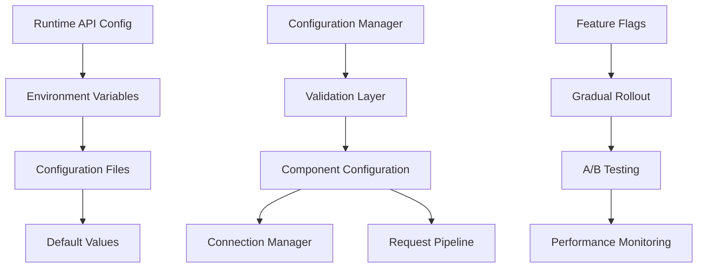

# Phase 2A: Configuration Management and Feature Flags

## Overview

This document defines the comprehensive configuration management system for Phase 2A optimization components, enabling controlled gradual rollout with feature flags, environment variables, runtime toggles, and safe fallback mechanisms.

## 1. Configuration Architecture

### 1.1 Configuration Hierarchy



### 1.2 Configuration Sources Priority

1. **Runtime API Configuration** (highest priority)
   - Hot-reloadable configuration changes
   - Admin API endpoints for real-time adjustments
   - Emergency shutdown capabilities

2. **Environment Variables** (high priority)
   - Container/deployment configuration
   - CI/CD pipeline settings
   - Production environment overrides

3. **Configuration Files** (medium priority)
   - JSON/YAML configuration files
   - Development environment settings
   - Default deployment configurations

4. **Default Values** (lowest priority)
   - Hardcoded safe defaults in code
   - Fallback when no configuration available
   - Pi Zero 2W optimized defaults

## 2. Configuration Data Model

### 2.1 Phase2AConfig Class

```python
from dataclasses import dataclass, field
from typing import Dict, Any, Optional, List
from enum import Enum
import os
import json
from pathlib import Path

class RolloutStrategy(Enum):
    """Rollout strategy options for gradual deployment."""
    DISABLED = "disabled"
    CANARY = "canary"  # 5% of requests
    GRADUAL = "gradual"  # 25% of requests
    MAJORITY = "majority"  # 75% of requests
    FULL = "full"  # 100% of requests

class ComponentStatus(Enum):
    """Component operational status."""
    DISABLED = "disabled"
    ENABLED = "enabled"
    MAINTENANCE = "maintenance"
    ERROR = "error"

@dataclass
class ConnectionPoolConfig:
    """Connection pool configuration settings."""
    
    # Feature control
    enabled: bool = True
    status: ComponentStatus = ComponentStatus.ENABLED
    rollout_strategy: RolloutStrategy = RolloutStrategy.DISABLED
    
    # HTTP connection pool settings
    http_total_pool_size: int = 100
    http_connections_per_host: int = 30
    http_connection_timeout: float = 10.0
    http_pool_cleanup_interval: int = 300  # 5 minutes
    
    # Database connection pool settings
    db_pool_size: int = 10
    db_connection_timeout: float = 5.0
    db_pool_overflow: int = 20
    db_pool_recycle: int = 3600  # 1 hour
    
    # Performance limits
    max_concurrent_connections: int = 150
    connection_retry_attempts: int = 3
    connection_retry_delay: float = 1.0
    
    # Monitoring and health checks
    enable_metrics: bool = True
    health_check_interval: int = 60  # 1 minute
    alert_threshold_failed_connections: int = 10
    
    @classmethod
    def from_environment(cls) -> 'ConnectionPoolConfig':
        """Create configuration from environment variables."""
        return cls(
            enabled=_parse_bool(os.getenv('CONNECTION_POOL_ENABLED', 'true')),
            rollout_strategy=RolloutStrategy(
                os.getenv('CONNECTION_POOL_ROLLOUT', 'disabled')
            ),
            http_total_pool_size=int(os.getenv('HTTP_POOL_SIZE', '100')),
            http_connections_per_host=int(os.getenv('HTTP_CONNECTIONS_PER_HOST', '30')),
            db_pool_size=int(os.getenv('DB_POOL_SIZE', '10')),
            enable_metrics=_parse_bool(os.getenv('CONNECTION_POOL_METRICS', 'true')),
        )

@dataclass
class RequestPipelineConfig:
    """Request pipeline configuration settings."""
    
    # Feature control
    enabled: bool = True
    status: ComponentStatus = ComponentStatus.ENABLED
    rollout_strategy: RolloutStrategy = RolloutStrategy.DISABLED
    
    # Caching configuration
    enable_caching: bool = True
    cache_ttl_seconds: int = 300  # 5 minutes
    cache_max_size: int = 1000
    cache_memory_limit_mb: int = 50
    cache_cleanup_interval: int = 600  # 10 minutes
    
    # Request batching configuration
    enable_batching: bool = True
    batch_size: int = 10
    batch_timeout_ms: int = 50
    max_batch_wait_time_ms: int = 100
    
    # Request deduplication
    enable_deduplication: bool = True
    deduplication_window_ms: int = 1000
    
    # Performance limits
    max_concurrent_requests: int = 100
    request_timeout_seconds: float = 30.0
    
    # Monitoring and metrics
    enable_metrics: bool = True
    enable_request_tracing: bool = False  # Disabled by default for performance
    cache_hit_rate_alert_threshold: float = 0.7  # Alert if cache hit rate < 70%
    
    @classmethod
    def from_environment(cls) -> 'RequestPipelineConfig':
        """Create configuration from environment variables."""
        return cls(
            enabled=_parse_bool(os.getenv('REQUEST_PIPELINE_ENABLED', 'true')),
            rollout_strategy=RolloutStrategy(
                os.getenv('REQUEST_PIPELINE_ROLLOUT', 'disabled')
            ),
            enable_caching=_parse_bool(os.getenv('REQUEST_PIPELINE_CACHING', 'true')),
            cache_ttl_seconds=int(os.getenv('CACHE_TTL_SECONDS', '300')),
            cache_max_size=int(os.getenv('CACHE_MAX_SIZE', '1000')),
            enable_batching=_parse_bool(os.getenv('REQUEST_BATCHING', 'true')),
            batch_size=int(os.getenv('BATCH_SIZE', '10')),
            enable_metrics=_parse_bool(os.getenv('REQUEST_PIPELINE_METRICS', 'true')),
        )

@dataclass
class Phase2AConfig:
    """Master configuration for Phase 2A optimization components."""
    
    # Global feature control
    phase_2a_enabled: bool = False  # Disabled by default for safety
    global_rollout_strategy: RolloutStrategy = RolloutStrategy.DISABLED
    
    # Component configurations
    connection_pool: ConnectionPoolConfig = field(default_factory=ConnectionPoolConfig)
    request_pipeline: RequestPipelineConfig = field(default_factory=RequestPipelineConfig)
    
    # Global performance settings
    max_memory_usage_mb: int = 256  # Half of Pi Zero 2W memory for optimization
    performance_monitoring_enabled: bool = True
    emergency_shutdown_enabled: bool = True
    
    # Rollout control
    rollout_percentage: float = 0.0  # 0% to 100%
    rollout_target_requests_per_minute: int = 100
    rollout_user_agent_whitelist: List[str] = field(default_factory=list)
    rollout_ip_whitelist: List[str] = field(default_factory=list)
    
    # Safety and fallback
    enable_automatic_fallback: bool = True
    fallback_failure_threshold: int = 5
    fallback_recovery_time_minutes: int = 5
    
    # Configuration metadata
    config_version: str = "1.0.0"
    last_updated: Optional[str] = None
    loaded_from: Optional[str] = None
    
    @classmethod
    def from_environment(cls) -> 'Phase2AConfig':
        """Create master configuration from environment variables."""
        
        config = cls(
            phase_2a_enabled=_parse_bool(os.getenv('PHASE_2A_ENABLED', 'false')),
            global_rollout_strategy=RolloutStrategy(
                os.getenv('PHASE_2A_ROLLOUT', 'disabled')
            ),
            rollout_percentage=float(os.getenv('PHASE_2A_ROLLOUT_PERCENTAGE', '0.0')),
            max_memory_usage_mb=int(os.getenv('PHASE_2A_MAX_MEMORY_MB', '256')),
            performance_monitoring_enabled=_parse_bool(
                os.getenv('PHASE_2A_MONITORING', 'true')
            ),
        )
        
        # Load component configurations
        config.connection_pool = ConnectionPoolConfig.from_environment()
        config.request_pipeline = RequestPipelineConfig.from_environment()
        
        # Mark configuration source
        config.loaded_from = "environment"
        
        return config
    
    @classmethod
    def from_file(cls, config_path: Path) -> 'Phase2AConfig':
        """Load configuration from JSON file."""
        
        if not config_path.exists():
            raise FileNotFoundError(f"Configuration file not found: {config_path}")
        
        with config_path.open('r') as f:
            config_data = json.load(f)
        
        config = cls(**config_data)
        config.loaded_from = str(config_path)
        
        return config
    
    def to_file(self, config_path: Path) -> None:
        """Save configuration to JSON file."""
        
        with config_path.open('w') as f:
            json.dump(self.to_dict(), f, indent=2)
    
    def to_dict(self) -> Dict[str, Any]:
        """Convert configuration to dictionary."""
        
        return {
            'phase_2a_enabled': self.phase_2a_enabled,
            'global_rollout_strategy': self.global_rollout_strategy.value,
            'connection_pool': self.connection_pool.__dict__,
            'request_pipeline': self.request_pipeline.__dict__,
            'max_memory_usage_mb': self.max_memory_usage_mb,
            'rollout_percentage': self.rollout_percentage,
            'config_version': self.config_version,
            'last_updated': self.last_updated,
            'loaded_from': self.loaded_from,
        }
    
    def validate(self) -> List[str]:
        """Validate configuration and return list of errors."""
        
        errors = []
        
        # Validate rollout percentage
        if not 0.0 <= self.rollout_percentage <= 100.0:
            errors.append("rollout_percentage must be between 0.0 and 100.0")
        
        # Validate memory limits for Pi Zero 2W
        if self.max_memory_usage_mb > 400:  # Leave 112MB for system
            errors.append("max_memory_usage_mb too high for Pi Zero 2W (max 400MB)")
        
        # Validate connection pool settings
        if self.connection_pool.http_total_pool_size > 200:
            errors.append("http_total_pool_size too high for Pi Zero 2W")
        
        if self.connection_pool.db_pool_size > 20:
            errors.append("db_pool_size too high for Pi Zero 2W")
        
        # Validate request pipeline settings
        if self.request_pipeline.cache_memory_limit_mb > self.max_memory_usage_mb:
            errors.append("cache_memory_limit_mb exceeds max_memory_usage_mb")
        
        # Validate batch settings
        if self.request_pipeline.batch_size > 50:
            errors.append("batch_size too high, may cause memory issues")
        
        return errors
    
    def is_component_enabled(self, component_name: str) -> bool:
        """Check if a specific component is enabled considering rollout strategy."""
        
        if not self.phase_2a_enabled:
            return False
        
        component_config = getattr(self, component_name, None)
        if not component_config or not component_config.enabled:
            return False
        
        # Check rollout strategy
        rollout = component_config.rollout_strategy
        
        if rollout == RolloutStrategy.DISABLED:
            return False
        elif rollout == RolloutStrategy.FULL:
            return True
        else:
            # For gradual rollout, use rollout_percentage
            import random
            return random.random() * 100 < self.rollout_percentage

def _parse_bool(value: str) -> bool:
    """Parse boolean from string value."""
    return value.lower() in ('true', '1', 'yes', 'on', 'enabled')
```

## 3. Configuration Manager

### 3.1 ConfigurationManager Class

```python
import threading
import time
from datetime import datetime
from typing import Dict, Any, Optional, Callable
import logging

logger = logging.getLogger(__name__)

class ConfigurationManager:
    """Centralized configuration management for Phase 2A components."""
    
    def __init__(self, config_path: Optional[Path] = None):
        self.config_path = config_path
        self.config: Phase2AConfig = Phase2AConfig()
        self.config_lock = threading.RLock()
        self.change_callbacks: List[Callable[[Phase2AConfig], None]] = []
        
        # Hot reload settings
        self.enable_hot_reload = True
        self.reload_check_interval = 30  # seconds
        self.last_file_mtime: Optional[float] = None
        self.reload_thread: Optional[threading.Thread] = None
        
        # Configuration validation cache
        self._validation_cache: Dict[str, List[str]] = {}
        self._cache_expiry: float = 0
        
        # Load initial configuration
        self.load_configuration()
        
        # Start hot reload thread if enabled
        if self.enable_hot_reload and self.config_path:
            self.start_hot_reload()
    
    def load_configuration(self) -> None:
        """Load configuration from all sources in priority order."""
        
        with self.config_lock:
            try:
                # Start with defaults
                config = Phase2AConfig()
                
                # Override with file configuration if available
                if self.config_path and self.config_path.exists():
                    try:
                        file_config = Phase2AConfig.from_file(self.config_path)
                        config = self._merge_configurations(config, file_config)
                        logger.info(f"Loaded configuration from file: {self.config_path}")
                    except Exception as e:
                        logger.error(f"Failed to load config file {self.config_path}: {e}")
                
                # Override with environment variables
                try:
                    env_config = Phase2AConfig.from_environment()
                    config = self._merge_configurations(config, env_config)
                    logger.debug("Applied environment variable overrides")
                except Exception as e:
                    logger.error(f"Failed to load environment configuration: {e}")
                
                # Validate configuration
                validation_errors = config.validate()
                if validation_errors:
                    logger.warning(f"Configuration validation errors: {validation_errors}")
                    # Use fallback configuration for invalid settings
                    config = self._apply_fallback_for_errors(config, validation_errors)
                
                # Update timestamp and apply configuration
                config.last_updated = datetime.now().isoformat()
                old_config = self.config
                self.config = config
                
                # Notify components of configuration change
                if old_config != config:
                    self._notify_configuration_change(config)
                    logger.info("Configuration updated successfully")
                
            except Exception as e:
                logger.error(f"Critical error loading configuration: {e}")
                # Keep existing configuration on critical errors
    
    def get_config(self) -> Phase2AConfig:
        """Get current configuration (thread-safe)."""
        with self.config_lock:
            return self.config
    
    def update_configuration(
        self, 
        updates: Dict[str, Any], 
        persist: bool = True
    ) -> bool:
        """Update configuration with new values."""
        
        with self.config_lock:
            try:
                # Create updated configuration
                config_dict = self.config.to_dict()
                config_dict.update(updates)
                
                # Validate new configuration
                new_config = Phase2AConfig(**config_dict)
                validation_errors = new_config.validate()
                
                if validation_errors:
                    logger.error(f"Configuration update validation failed: {validation_errors}")
                    return False
                
                # Apply configuration
                old_config = self.config
                new_config.last_updated = datetime.now().isoformat()
                self.config = new_config
                
                # Persist to file if requested
                if persist and self.config_path:
                    try:
                        self.config.to_file(self.config_path)
                        logger.info(f"Configuration persisted to {self.config_path}")
                    except Exception as e:
                        logger.error(f"Failed to persist configuration: {e}")
                
                # Notify components
                self._notify_configuration_change(new_config)
                logger.info("Configuration updated via API")
                
                return True
                
            except Exception as e:
                logger.error(f"Failed to update configuration: {e}")
                return False
    
    def register_change_callback(self, callback: Callable[[Phase2AConfig], None]) -> None:
        """Register callback for configuration changes."""
        self.change_callbacks.append(callback)
    
    def start_hot_reload(self) -> None:
        """Start hot reload monitoring thread."""
        
        if self.reload_thread and self.reload_thread.is_alive():
            return
        
        def monitor_config_file():
            while self.enable_hot_reload:
                try:
                    if self.config_path and self.config_path.exists():
                        current_mtime = self.config_path.stat().st_mtime
                        
                        if (self.last_file_mtime is not None and 
                            current_mtime > self.last_file_mtime):
                            logger.info("Configuration file changed, reloading...")
                            self.load_configuration()
                        
                        self.last_file_mtime = current_mtime
                    
                    time.sleep(self.reload_check_interval)
                    
                except Exception as e:
                    logger.error(f"Error in hot reload monitor: {e}")
                    time.sleep(self.reload_check_interval)
        
        self.reload_thread = threading.Thread(target=monitor_config_file, daemon=True)
        self.reload_thread.start()
        logger.info("Hot reload monitoring started")
    
    def stop_hot_reload(self) -> None:
        """Stop hot reload monitoring."""
        self.enable_hot_reload = False
        if self.reload_thread:
            self.reload_thread.join(timeout=5)
        logger.info("Hot reload monitoring stopped")
    
    def _merge_configurations(
        self, 
        base_config: Phase2AConfig, 
        override_config: Phase2AConfig
    ) -> Phase2AConfig:
        """Merge two configurations with override taking precedence."""
        
        # Create merged configuration dictionary
        base_dict = base_config.to_dict()
        override_dict = override_config.to_dict()
        
        # Recursively merge dictionaries
        merged_dict = self._deep_merge_dicts(base_dict, override_dict)
        
        return Phase2AConfig(**merged_dict)
    
    def _deep_merge_dicts(self, base: Dict[str, Any], override: Dict[str, Any]) -> Dict[str, Any]:
        """Deep merge two dictionaries."""
        
        result = base.copy()
        
        for key, value in override.items():
            if key in result and isinstance(result[key], dict) and isinstance(value, dict):
                result[key] = self._deep_merge_dicts(result[key], value)
            else:
                result[key] = value
        
        return result
    
    def _apply_fallback_for_errors(
        self, 
        config: Phase2AConfig, 
        errors: List[str]
    ) -> Phase2AConfig:
        """Apply safe fallback values for configuration errors."""
        
        # Create fallback configuration with safe defaults
        fallback_config = Phase2AConfig()
        
        # Apply specific fallbacks based on error types
        for error in errors:
            if "memory" in error.lower():
                config.max_memory_usage_mb = min(config.max_memory_usage_mb, 200)
                config.request_pipeline.cache_memory_limit_mb = min(
                    config.request_pipeline.cache_memory_limit_mb, 25
                )
            elif "pool_size" in error.lower():
                config.connection_pool.http_total_pool_size = min(
                    config.connection_pool.http_total_pool_size, 50
                )
                config.connection_pool.db_pool_size = min(
                    config.connection_pool.db_pool_size, 5
                )
        
        logger.warning("Applied configuration fallbacks for validation errors")
        return config
    
    def _notify_configuration_change(self, new_config: Phase2AConfig) -> None:
        """Notify all registered callbacks of configuration change."""
        
        for callback in self.change_callbacks:
            try:
                callback(new_config)
            except Exception as e:
                logger.error(f"Error in configuration change callback: {e}")
    
    def get_effective_rollout_percentage(self, component_name: str) -> float:
        """Get effective rollout percentage for a component."""
        
        config = self.get_config()
        
        if not config.phase_2a_enabled:
            return 0.0
        
        component_config = getattr(config, component_name, None)
        if not component_config or not component_config.enabled:
            return 0.0
        
        rollout = component_config.rollout_strategy
        
        if rollout == RolloutStrategy.DISABLED:
            return 0.0
        elif rollout == RolloutStrategy.CANARY:
            return 5.0
        elif rollout == RolloutStrategy.GRADUAL:
            return 25.0
        elif rollout == RolloutStrategy.MAJORITY:
            return 75.0
        elif rollout == RolloutStrategy.FULL:
            return 100.0
        else:
            return config.rollout_percentage
```

## 4. Feature Flag Implementation

### 4.1 FeatureFlagManager Class

```python
import hashlib
import random
from typing import Set, Dict, Any, Optional
from dataclasses import dataclass

@dataclass
class FeatureFlagContext:
    """Context for feature flag evaluation."""
    
    request_id: Optional[str] = None
    user_agent: Optional[str] = None
    client_ip: Optional[str] = None
    api_endpoint: Optional[str] = None
    request_timestamp: Optional[float] = None
    
    def to_hash_key(self) -> str:
        """Generate consistent hash key for this context."""
        
        # Use request attributes that should be consistent for the same user/session
        hash_input = f"{self.client_ip}:{self.user_agent}"
        return hashlib.md5(hash_input.encode()).hexdigest()

class FeatureFlagManager:
    """Advanced feature flag management for gradual rollout."""
    
    def __init__(self, config_manager: ConfigurationManager):
        self.config_manager = config_manager
        self.forced_enabled_requests: Set[str] = set()
        self.forced_disabled_requests: Set[str] = set()
        
        # Consistent rollout cache
        self._rollout_cache: Dict[str, bool] = {}
        self._cache_expiry = time.time() + 3600  # 1 hour cache
    
    def is_feature_enabled(
        self, 
        feature_name: str, 
        context: Optional[FeatureFlagContext] = None
    ) -> bool:
        """Determine if a feature is enabled for the given context."""
        
        config = self.config_manager.get_config()
        
        # Check if Phase 2A is globally disabled
        if not config.phase_2a_enabled:
            return False
        
        # Check forced overrides
        if context and context.request_id:
            if context.request_id in self.forced_enabled_requests:
                return True
            if context.request_id in self.forced_disabled_requests:
                return False
        
        # Get component configuration
        component_config = getattr(config, feature_name, None)
        if not component_config or not component_config.enabled:
            return False
        
        # Check component status
        if component_config.status != ComponentStatus.ENABLED:
            return False
        
        # Evaluate rollout strategy
        return self._evaluate_rollout_strategy(
            component_config.rollout_strategy,
            config.rollout_percentage,
            context
        )
    
    def _evaluate_rollout_strategy(
        self,
        strategy: RolloutStrategy,
        global_percentage: float,
        context: Optional[FeatureFlagContext]
    ) -> bool:
        """Evaluate rollout strategy for feature enablement."""
        
        if strategy == RolloutStrategy.DISABLED:
            return False
        elif strategy == RolloutStrategy.FULL:
            return True
        
        # For gradual strategies, use consistent hash-based rollout
        if context:
            return self._consistent_rollout_decision(strategy, global_percentage, context)
        else:
            # Fallback to random rollout without context
            return self._random_rollout_decision(strategy, global_percentage)
    
    def _consistent_rollout_decision(
        self,
        strategy: RolloutStrategy,
        global_percentage: float,
        context: FeatureFlagContext
    ) -> bool:
        """Make consistent rollout decision based on context hash."""
        
        # Generate consistent hash key
        hash_key = context.to_hash_key()
        
        # Check cache first
        if time.time() < self._cache_expiry and hash_key in self._rollout_cache:
            return self._rollout_cache[hash_key]
        
        # Clear cache if expired
        if time.time() >= self._cache_expiry:
            self._rollout_cache.clear()
            self._cache_expiry = time.time() + 3600
        
        # Calculate rollout percentage based on strategy
        target_percentage = self._get_strategy_percentage(strategy, global_percentage)
        
        # Use hash to determine rollout (consistent for same user)
        hash_value = int(hashlib.md5(hash_key.encode()).hexdigest()[:8], 16)
        rollout_decision = (hash_value % 100) < target_percentage
        
        # Cache decision
        self._rollout_cache[hash_key] = rollout_decision
        
        return rollout_decision
    
    def _random_rollout_decision(
        self,
        strategy: RolloutStrategy,
        global_percentage: float
    ) -> bool:
        """Make random rollout decision (fallback when no context)."""
        
        target_percentage = self._get_strategy_percentage(strategy, global_percentage)
        return random.random() * 100 < target_percentage
    
    def _get_strategy_percentage(
        self,
        strategy: RolloutStrategy,
        global_percentage: float
    ) -> float:
        """Get target percentage for rollout strategy."""
        
        if strategy == RolloutStrategy.CANARY:
            return 5.0
        elif strategy == RolloutStrategy.GRADUAL:
            return 25.0
        elif strategy == RolloutStrategy.MAJORITY:
            return 75.0
        else:
            return global_percentage
    
    def force_enable_for_request(self, request_id: str) -> None:
        """Force enable features for a specific request."""
        self.forced_enabled_requests.add(request_id)
    
    def force_disable_for_request(self, request_id: str) -> None:
        """Force disable features for a specific request."""
        self.forced_disabled_requests.add(request_id)
    
    def clear_forced_overrides(self) -> None:
        """Clear all forced overrides."""
        self.forced_enabled_requests.clear()
        self.forced_disabled_requests.clear()
    
    def get_rollout_statistics(self) -> Dict[str, Any]:
        """Get current rollout statistics."""
        
        config = self.config_manager.get_config()
        
        return {
            'phase_2a_enabled': config.phase_2a_enabled,
            'global_rollout_percentage': config.rollout_percentage,
            'connection_pool': {
                'enabled': config.connection_pool.enabled,
                'strategy': config.connection_pool.rollout_strategy.value,
                'status': config.connection_pool.status.value,
            },
            'request_pipeline': {
                'enabled': config.request_pipeline.enabled,
                'strategy': config.request_pipeline.rollout_strategy.value,
                'status': config.request_pipeline.status.value,
            },
            'cache_entries': len(self._rollout_cache),
            'forced_enabled_count': len(self.forced_enabled_requests),
            'forced_disabled_count': len(self.forced_disabled_requests),
        }
```

## 5. Environment Variable Schema

### 5.1 Complete Environment Variable List

```bash
# Global Phase 2A Control
PHASE_2A_ENABLED=false                      # Master enable/disable switch
PHASE_2A_ROLLOUT=disabled                   # disabled|canary|gradual|majority|full
PHASE_2A_ROLLOUT_PERCENTAGE=0.0             # Custom rollout percentage (0.0-100.0)
PHASE_2A_MAX_MEMORY_MB=256                  # Maximum memory usage for optimizations
PHASE_2A_MONITORING=true                    # Enable performance monitoring

# Connection Pool Configuration
CONNECTION_POOL_ENABLED=true                # Enable connection pooling
CONNECTION_POOL_ROLLOUT=disabled            # Component-specific rollout strategy
HTTP_POOL_SIZE=100                         # Total HTTP connection pool size
HTTP_CONNECTIONS_PER_HOST=30               # HTTP connections per host limit
HTTP_CONNECTION_TIMEOUT=10.0               # HTTP connection timeout (seconds)
DB_POOL_SIZE=10                            # Database connection pool size
DB_CONNECTION_TIMEOUT=5.0                  # Database connection timeout (seconds)
CONNECTION_POOL_METRICS=true              # Enable connection pool metrics

# Request Pipeline Configuration
REQUEST_PIPELINE_ENABLED=true              # Enable request pipeline
REQUEST_PIPELINE_ROLLOUT=disabled          # Component-specific rollout strategy
REQUEST_PIPELINE_CACHING=true              # Enable response caching
CACHE_TTL_SECONDS=300                      # Cache time-to-live (5 minutes)
CACHE_MAX_SIZE=1000                        # Maximum cache entries
CACHE_MEMORY_LIMIT_MB=50                   # Cache memory limit
REQUEST_BATCHING=true                      # Enable request batching
BATCH_SIZE=10                              # Request batch size
BATCH_TIMEOUT_MS=50                        # Batch timeout (milliseconds)
REQUEST_PIPELINE_METRICS=true             # Enable pipeline metrics

# Safety and Fallback
ENABLE_AUTOMATIC_FALLBACK=true             # Enable automatic fallback on failures
FALLBACK_FAILURE_THRESHOLD=5               # Failure count before fallback
FALLBACK_RECOVERY_TIME_MINUTES=5           # Time before attempting recovery

# Development and Testing
PHASE_2A_CONFIG_FILE=/path/to/config.json  # Configuration file path
ENABLE_HOT_RELOAD=true                      # Enable configuration hot reload
CONFIG_VALIDATION_STRICT=false             # Strict configuration validation
FEATURE_FLAG_CACHE_TTL=3600                # Feature flag cache TTL (seconds)

# Performance Monitoring
ENABLE_PERFORMANCE_ALERTS=true             # Enable performance alerts
MEMORY_ALERT_THRESHOLD_MB=200              # Memory usage alert threshold
CONNECTION_FAILURE_ALERT_THRESHOLD=10      # Connection failure alert threshold
CACHE_HIT_RATE_ALERT_THRESHOLD=0.7         # Cache hit rate alert threshold (70%)

# Debug and Logging
PHASE_2A_LOG_LEVEL=INFO                    # Logging level for Phase 2A components
ENABLE_REQUEST_TRACING=false               # Enable detailed request tracing
METRICS_EXPORT_INTERVAL=60                 # Metrics export interval (seconds)
```

## 6. Configuration API Endpoints

### 6.1 Administrative Configuration API

```python
from flask import Flask, request, jsonify
from typing import Dict, Any

class ConfigurationAPI:
    """REST API for runtime configuration management."""
    
    def __init__(self, config_manager: ConfigurationManager, feature_flag_manager: FeatureFlagManager):
        self.config_manager = config_manager
        self.feature_flag_manager = feature_flag_manager
    
    def register_routes(self, app: Flask) -> None:
        """Register configuration API routes."""
        
        @app.route('/api/admin/phase2a/config', methods=['GET'])
        def get_config():
            """Get current Phase 2A configuration."""
            try:
                config = self.config_manager.get_config()
                return jsonify({
                    'success': True,
                    'data': config.to_dict()
                })
            except Exception as e:
                return jsonify({
                    'success': False,
                    'error': str(e)
                }), 500
        
        @app.route('/api/admin/phase2a/config', methods=['PUT'])
        def update_config():
            """Update Phase 2A configuration."""
            try:
                updates = request.get_json()
                if not updates:
                    return jsonify({
                        'success': False,
                        'error': 'No configuration data provided'
                    }), 400
                
                success = self.config_manager.update_configuration(updates, persist=True)
                
                if success:
                    return jsonify({
                        'success': True,
                        'message': 'Configuration updated successfully'
                    })
                else:
                    return jsonify({
                        'success': False,
                        'error': 'Configuration validation failed'
                    }), 400
                    
            except Exception as e:
                return jsonify({
                    'success': False,
                    'error': str(e)
                }), 500
        
        @app.route('/api/admin/phase2a/rollout', methods=['GET'])
        def get_rollout_status():
            """Get current rollout status and statistics."""
            try:
                stats = self.feature_flag_manager.get_rollout_statistics()
                return jsonify({
                    'success': True,
                    'data': stats
                })
            except Exception as e:
                return jsonify({
                    'success': False,
                    'error': str(e)
                }), 500
        
        @app.route('/api/admin/phase2a/rollout', methods=['POST'])
        def update_rollout():
            """Update rollout configuration."""
            try:
                rollout_data = request.get_json()
                
                # Validate rollout data
                valid_strategies = [s.value for s in RolloutStrategy]
                
                updates = {}
                if 'global_strategy' in rollout_data:
                    if rollout_data['global_strategy'] not in valid_strategies:
                        return jsonify({
                            'success': False,
                            'error': f'Invalid rollout strategy. Valid options: {valid_strategies}'
                        }), 400
                    updates['global_rollout_strategy'] = rollout_data['global_strategy']
                
                if 'percentage' in rollout_data:
                    percentage = float(rollout_data['percentage'])
                    if not 0.0 <= percentage <= 100.0:
                        return jsonify({
                            'success': False,
                            'error': 'Rollout percentage must be between 0.0 and 100.0'
                        }), 400
                    updates['rollout_percentage'] = percentage
                
                # Apply updates
                success = self.config_manager.update_configuration(updates, persist=True)
                
                if success:
                    return jsonify({
                        'success': True,
                        'message': 'Rollout configuration updated successfully'
                    })
                else:
                    return jsonify({
                        'success': False,
                        'error': 'Rollout configuration update failed'
                    }), 400
                    
            except Exception as e:
                return jsonify({
                    'success': False,
                    'error': str(e)
                }), 500
        
        @app.route('/api/admin/phase2a/emergency-disable', methods=['POST'])
        def emergency_disable():
            """Emergency disable all Phase 2A optimizations."""
            try:
                updates = {
                    'phase_2a_enabled': False,
                    'global_rollout_strategy': 'disabled',
                    'connection_pool': {'enabled': False, 'status': 'maintenance'},
                    'request_pipeline': {'enabled': False, 'status': 'maintenance'}
                }
                
                success = self.config_manager.update_configuration(updates, persist=True)
                
                if success:
                    logger.warning("Emergency disable activated for Phase 2A optimizations")
                    return jsonify({
                        'success': True,
                        'message': 'Phase 2A optimizations emergency disabled'
                    })
                else:
                    return jsonify({
                        'success': False,
                        'error': 'Emergency disable failed'
                    }), 500
                    
            except Exception as e:
                logger.error(f"Emergency disable failed: {e}")
                return jsonify({
                    'success': False,
                    'error': str(e)
                }), 500
        
        @app.route('/api/admin/phase2a/validate', methods=['POST'])
        def validate_config():
            """Validate a configuration without applying it."""
            try:
                config_data = request.get_json()
                if not config_data:
                    return jsonify({
                        'success': False,
                        'error': 'No configuration data provided'
                    }), 400
                
                # Create test configuration
                test_config = Phase2AConfig(**config_data)
                validation_errors = test_config.validate()
                
                return jsonify({
                    'success': len(validation_errors) == 0,
                    'valid': len(validation_errors) == 0,
                    'errors': validation_errors
                })
                
            except Exception as e:
                return jsonify({
                    'success': False,
                    'error': str(e)
                }), 500
```

## 7. Configuration Testing Strategy

### 7.1 Configuration Test Framework

```python
import unittest
from unittest.mock import patch, MagicMock
import tempfile
import json
from pathlib import Path

class TestPhase2AConfiguration(unittest.TestCase):
    """Test suite for Phase 2A configuration management."""
    
    def setUp(self):
        """Set up test environment."""
        self.temp_dir = Path(tempfile.mkdtemp())
        self.config_file = self.temp_dir / "test_config.json"
        
    def tearDown(self):
        """Clean up test environment."""
        import shutil
        shutil.rmtree(self.temp_dir)
    
    def test_default_configuration(self):
        """Test default configuration values."""
        config = Phase2AConfig()
        
        self.assertFalse(config.phase_2a_enabled)
        self.assertEqual(config.global_rollout_strategy, RolloutStrategy.DISABLED)
        self.assertTrue(config.connection_pool.enabled)
        self.assertTrue(config.request_pipeline.enabled)
        self.assertEqual(config.max_memory_usage_mb, 256)
    
    @patch.dict('os.environ', {
        'PHASE_2A_ENABLED': 'true',
        'PHASE_2A_ROLLOUT': 'gradual',
        'HTTP_POOL_SIZE': '50'
    })
    def test_environment_configuration(self):
        """Test configuration loading from environment variables."""
        config = Phase2AConfig.from_environment()
        
        self.assertTrue(config.phase_2a_enabled)
        self.assertEqual(config.global_rollout_strategy, RolloutStrategy.GRADUAL)
        self.assertEqual(config.connection_pool.http_total_pool_size, 50)
    
    def test_configuration_validation(self):
        """Test configuration validation."""
        config = Phase2AConfig()
        
        # Valid configuration
        errors = config.validate()
        self.assertEqual(len(errors), 0)
        
        # Invalid memory setting
        config.max_memory_usage_mb = 600  # Too high for Pi Zero 2W
        errors = config.validate()
        self.assertGreater(len(errors), 0)
        self.assertIn('max_memory_usage_mb too high', errors[0])
    
    def test_configuration_file_loading(self):
        """Test configuration loading from file."""
        test_config = {
            'phase_2a_enabled': True,
            'global_rollout_strategy': 'canary',
            'rollout_percentage': 10.0
        }
        
        # Write test configuration
        with self.config_file.open('w') as f:
            json.dump(test_config, f)
        
        # Load configuration
        config = Phase2AConfig.from_file(self.config_file)
        
        self.assertTrue(config.phase_2a_enabled)
        self.assertEqual(config.global_rollout_strategy, RolloutStrategy.CANARY)
        self.assertEqual(config.rollout_percentage, 10.0)
    
    def test_configuration_manager(self):
        """Test configuration manager functionality."""
        manager = ConfigurationManager(self.config_file)
        
        # Test initial configuration
        config = manager.get_config()
        self.assertIsNotNone(config)
        
        # Test configuration update
        updates = {'rollout_percentage': 25.0}
        success = manager.update_configuration(updates, persist=False)
        self.assertTrue(success)
        
        updated_config = manager.get_config()
        self.assertEqual(updated_config.rollout_percentage, 25.0)
    
    def test_feature_flag_manager(self):
        """Test feature flag manager functionality."""
        config_manager = ConfigurationManager()
        flag_manager = FeatureFlagManager(config_manager)
        
        # Test with disabled Phase 2A
        context = FeatureFlagContext(client_ip="192.168.1.1", user_agent="test")
        enabled = flag_manager.is_feature_enabled('connection_pool', context)
        self.assertFalse(enabled)
        
        # Enable Phase 2A and test rollout
        config_manager.update_configuration({
            'phase_2a_enabled': True,
            'connection_pool': {'rollout_strategy': 'full'}
        }, persist=False)
        
        enabled = flag_manager.is_feature_enabled('connection_pool', context)
        self.assertTrue(enabled)
```

## Summary

This configuration management system provides:

1. **Hierarchical Configuration**: Environment variables override file config override defaults
2. **Feature Flags**: Granular rollout control with consistent hash-based distribution  
3. **Hot Reload**: Automatic configuration reloading without service restart
4. **Safety Mechanisms**: Validation, fallback, and emergency disable capabilities
5. **API Control**: Runtime configuration updates via REST API
6. **Pi Zero 2W Optimization**: Memory and resource limits tailored for the target platform
7. **Comprehensive Testing**: Full test coverage for all configuration scenarios

The system enables safe, controlled rollout of Phase 2A optimizations with the ability to quickly disable features if issues arise.