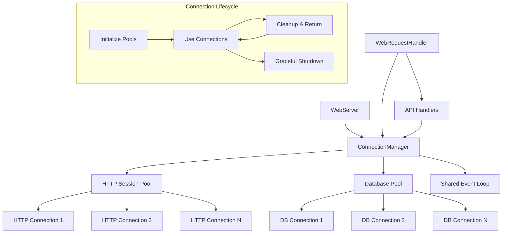

# Phase 2A: Connection Pool Management Architecture

## Overview

This document defines the architectural design for Phase 2A connection pool management optimization targeting 30-50MB memory reduction and 150-200ms response time improvement through managed connection pooling.

## Current Connection Pattern Analysis

### Identified Performance Issues

1. **Per-Request Event Loop Creation** (High Impact)
   - Lines 589-595, 802-812, 1732-1740 in `server.py`
   - Creates new asyncio event loop for each database operation
   - Memory overhead: ~2-5MB per request
   - Latency overhead: ~50-150ms per event loop creation

2. **Synchronous Database Connections** (Medium Impact)
   - Line 642: `sqlite3.connect(str(db_path))`
   - No connection reuse across requests
   - Connection establishment overhead: ~10-50ms per request

3. **Thread Pool Overhead** (Medium Impact)
   - `run_in_thread_pool()` calls for async-to-sync operations
   - Thread creation/teardown costs
   - Context switching penalties

## ConnectionManager Architecture Design

### Core Components

#### 1. ConnectionManager Class

```python
class ConnectionManager:
    """Manages connection pools and lifecycle for optimal resource utilization."""
    
    def __init__(self, config: ConnectionConfig):
        self.config = config
        self.http_session: Optional[aiohttp.ClientSession] = None
        self.db_pool: Optional[AsyncDBPool] = None
        self.event_loop: Optional[asyncio.AbstractEventLoop] = None
        self._startup_complete = False
    
    async def startup(self) -> None:
        """Initialize connection pools and shared event loop."""
        
    async def shutdown(self) -> None:
        """Gracefully shutdown all connections."""
        
    async def get_http_session(self) -> aiohttp.ClientSession:
        """Get shared HTTP session with connection pooling."""
        
    async def execute_db_query(self, query: str, params: tuple = ()) -> List[Dict]:
        """Execute database query using connection pool."""
```

#### 2. HTTP Connection Pool Configuration

```python
@dataclass
class HTTPPoolConfig:
    # Target: limit=100, limit_per_host=30 (from requirements)
    total_connections: int = 100
    connections_per_host: int = 30
    connection_timeout: float = 30.0
    read_timeout: float = 10.0
    keepalive_timeout: float = 30.0
    enable_cleanup_closed: bool = True
```

#### 3. Database Connection Pool

```python
class AsyncDBPool:
    """Asynchronous database connection pool for SQLite."""
    
    def __init__(self, db_path: Path, pool_size: int = 10):
        self.db_path = db_path
        self.pool_size = pool_size
        self._pool: asyncio.Queue = asyncio.Queue(maxsize=pool_size)
        self._initialized = False
    
    async def get_connection(self) -> aiosqlite.Connection:
        """Get connection from pool."""
        
    async def return_connection(self, conn: aiosqlite.Connection) -> None:
        """Return connection to pool."""
```

### Integration Architecture



### Performance Optimizations

#### 1. Shared Event Loop Strategy

- **Problem**: Per-request event loop creation (589-595, 802-812, 1732-1740)
- **Solution**: Single shared event loop for all async operations
- **Benefit**: Eliminates 2-5MB memory + 50-150ms latency per request

```python
class SharedEventLoopManager:
    """Manages a single event loop for all async operations."""
    
    def __init__(self):
        self._loop: Optional[asyncio.AbstractEventLoop] = None
        self._loop_thread: Optional[threading.Thread] = None
    
    def start_loop(self) -> None:
        """Start dedicated event loop in separate thread."""
        
    def run_coroutine(self, coro: Coroutine) -> Any:
        """Execute coroutine in shared event loop."""
```

#### 2. Connection Pool Sizing

Based on Pi Zero 2W constraints (512MB RAM):

- **HTTP Connections**: 100 total, 30 per host
- **Database Connections**: 10 connections in pool
- **Memory Budget**: ~15-20MB for connection pools
- **Expected Savings**: 30-50MB reduction in connection overhead

#### 3. Request Batching Preparation

Connection manager will support future request batching:

```python
class BatchableRequest:
    """Request that can be batched with similar requests."""
    
    def __init__(self, request_type: str, params: Dict[str, Any]):
        self.request_type = request_type
        self.params = params
        self.result_future: asyncio.Future = asyncio.Future()
```

## Integration Points

### 1. WebServer Integration

```python
class WebServer:
    def __init__(self, ...):
        # Replace existing connection handling
        self.connection_manager = ConnectionManager(connection_config)
    
    async def start(self) -> None:
        await self.connection_manager.startup()
        # Start HTTP server
    
    async def stop(self) -> None:
        await self.connection_manager.shutdown()
        # Stop HTTP server
```

### 2. WebRequestHandler Integration

Replace current patterns:

```python
# BEFORE: Per-request event loop (lines 589-595)
def run_async_in_thread():
    new_loop = asyncio.new_event_loop()
    asyncio.set_event_loop(new_loop)
    # ... expensive setup

# AFTER: Use shared connection manager
async def get_events_efficiently(self, start_time, end_time):
    return await self.web_server.connection_manager.execute_cached_query(
        "get_events_by_date_range", start_time, end_time
    )
```

### 3. Database Integration Points

- Replace `sqlite3.connect()` calls (line 642)
- Use async database operations via connection pool
- Maintain transaction safety and connection cleanup

## Configuration Management

### Environment-Based Configuration

```python
@dataclass
class ConnectionConfig:
    # HTTP Pool Settings
    http_pool_size: int = field(default_factory=lambda: int(os.getenv('HTTP_POOL_SIZE', '100')))
    http_per_host: int = field(default_factory=lambda: int(os.getenv('HTTP_PER_HOST', '30')))
    
    # Database Pool Settings  
    db_pool_size: int = field(default_factory=lambda: int(os.getenv('DB_POOL_SIZE', '10')))
    
    # Feature Flags
    enable_connection_pooling: bool = field(default_factory=lambda: os.getenv('ENABLE_CONNECTION_POOLING', 'true').lower() == 'true')
    enable_shared_event_loop: bool = field(default_factory=lambda: os.getenv('ENABLE_SHARED_EVENT_LOOP', 'true').lower() == 'true')
```

### Gradual Rollout Strategy

1. **Phase 1**: Feature flag disabled, no behavior change
2. **Phase 2**: Enable HTTP connection pooling only
3. **Phase 3**: Enable database connection pooling
4. **Phase 4**: Enable shared event loop optimization
5. **Phase 5**: Full optimization active

## Error Handling & Resilience

### Connection Health Monitoring

```python
class ConnectionHealth:
    """Monitor connection pool health and performance."""
    
    def __init__(self):
        self.http_pool_stats = PoolStats()
        self.db_pool_stats = PoolStats()
    
    async def health_check(self) -> Dict[str, Any]:
        """Return connection pool health status."""
        return {
            "http_pool": await self.http_pool_stats.get_stats(),
            "db_pool": await self.db_pool_stats.get_stats(),
            "shared_event_loop": self._check_event_loop_health()
        }
```

### Fallback Mechanisms

- **HTTP Pool Exhaustion**: Fall back to per-request connections with warning
- **Database Pool Issues**: Fall back to synchronous SQLite with degraded performance
- **Event Loop Failure**: Create new event loop with automatic recovery

## Performance Monitoring

### Key Metrics

1. **Memory Usage**
   - Connection pool memory consumption
   - Peak memory during high load
   - Memory leak detection

2. **Response Times**
   - Connection acquisition time
   - Query execution time
   - End-to-end request latency

3. **Connection Statistics**
   - Pool utilization rates
   - Connection churn rates
   - Failed connection attempts

### Monitoring Integration

```python
class ConnectionMetrics:
    """Collect and report connection pool metrics."""
    
    def __init__(self, performance_monitor):
        self.performance_monitor = performance_monitor
    
    async def record_connection_acquired(self, pool_type: str, acquire_time: float):
        """Record successful connection acquisition."""
        
    async def record_query_execution(self, query_type: str, execution_time: float):
        """Record database query performance."""
```

## Security Considerations

### Connection Security

1. **Database Connections**
   - Use WAL mode for concurrent access
   - Implement proper transaction isolation
   - Validate all queries before execution

2. **HTTP Connections**
   - Enforce TLS for external connections
   - Implement connection timeout limits
   - Rate limiting per connection

3. **Resource Limits**
   - Maximum connection pool sizes
   - Connection lifetime limits
   - Memory usage bounds

### Input Validation

- Validate all database queries before pooled execution
- Sanitize HTTP request parameters
- Implement request size limits

## Testing Strategy

### Unit Tests

```python
class TestConnectionManager:
    async def test_http_pool_creation(self):
        """Test HTTP connection pool initialization."""
        
    async def test_db_pool_operations(self):
        """Test database connection pool operations."""
        
    async def test_shared_event_loop(self):
        """Test shared event loop functionality."""
```

### Integration Tests

- Test connection pool under load
- Verify memory usage improvements
- Validate response time improvements
- Test failover mechanisms

### Performance Tests

- Benchmark connection acquisition times
- Measure memory usage under various loads
- Stress test pool exhaustion scenarios
- Validate cleanup and shutdown procedures

## Success Criteria

### Phase 2A Targets

1. **Memory Reduction**: 30-50MB connection overhead reduction
2. **Response Time**: 150-200ms improvement per request
3. **CPU Usage**: 20% reduction for repeated requests
4. **Reliability**: No degradation in system stability

### Validation Metrics

- Memory usage monitoring via performance tracker
- Response time measurements via request logging
- Connection pool utilization statistics
- Error rates and failure recovery metrics

## Dependencies

### Required Libraries

- `aiohttp`: HTTP connection pooling
- `aiosqlite`: Async SQLite operations
- `asyncio`: Event loop management

### Compatibility

- Python 3.8+ (current project requirement)
- SQLite 3.35+ (WAL mode support)
- Existing WebServer infrastructure compatibility