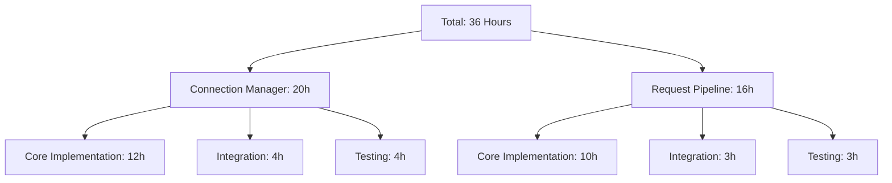
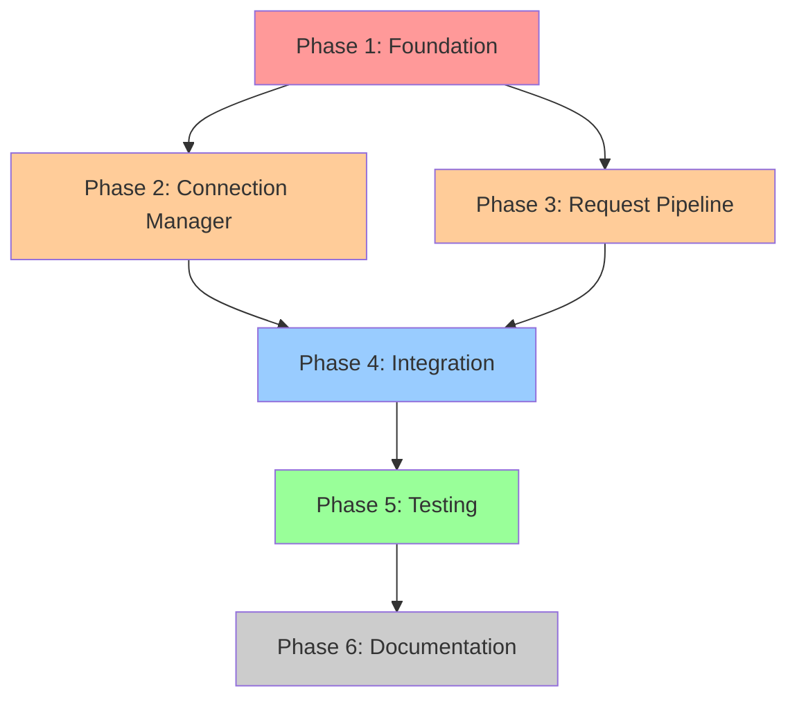

# Phase 2A: Implementation Plan and Effort Estimates

## Overview

This document provides a detailed implementation plan for Phase 2A optimization components, breaking down the 36-hour development effort into logical phases with clear dependencies, effort estimates, and deliverables.

## 1. Implementation Strategy

### 1.1 Total Effort Breakdown



### 1.2 Phase Sequencing Strategy

```mermaid
gantt
    title Phase 2A Implementation Timeline
    dateFormat X
    axisFormat %H
    
    section Foundation
    Configuration Management    :crit, done, 0, 4h
    Basic Structure             :crit, done, 0, 2h
    
    section Core Development
    Connection Manager Core     :active, 4h, 12h
    Request Pipeline Core       :        10h, 8h
    
    section Integration
    WebServer Integration       :        16h, 6h
    Component Integration       :        18h, 4h
    
    section Validation
    Unit Testing               :        12h, 6h
    Integration Testing        :        22h, 4h
    Performance Validation     :        26h, 4h
    
    section Finalization
    Documentation             :        30h, 4h
    Rollout Preparation       :        34h, 2h
```

## 2. Phase Definitions

### 2.1 Phase 1: Foundation Setup (6 hours)

**Objective**: Establish core infrastructure and configuration framework

**Dependencies**: None (can start immediately)

**Deliverables**:
- Configuration management system
- Feature flag infrastructure
- Basic project structure
- Development environment setup

**Detailed Tasks**:

| Task | Effort | Priority | Dependencies | Deliverable |
|------|--------|----------|--------------|-------------|
| Create Phase2AConfig data models | 2h | Critical | None | `calendarbot/optimization/config.py` |
| Implement ConfigurationManager | 2h | Critical | Config models | `calendarbot/optimization/config_manager.py` |
| Implement FeatureFlagManager | 1.5h | High | Config Manager | `calendarbot/optimization/feature_flags.py` |
| Create optimization module structure | 0.5h | Medium | None | Directory structure and `__init__.py` |

**Success Criteria**:
- Configuration can be loaded from environment variables
- Feature flags can be evaluated with test contexts
- Basic module structure is in place
- All configuration validation passes

**Risk Mitigation**:
- Start with minimal viable configuration
- Use fail-safe defaults for all settings
- Implement configuration validation early

### 2.2 Phase 2: Connection Manager Core (12 hours)

**Objective**: Implement core connection pooling functionality

**Dependencies**: Phase 1 (Configuration framework)

**Deliverables**:
- HTTP connection pooling with aiohttp
- Database connection pooling
- Connection monitoring and health checks
- Basic connection management API

**Detailed Tasks**:

| Task | Effort | Priority | Dependencies | Deliverable |
|------|--------|----------|--------------|-------------|
| Design ConnectionManager interfaces | 1h | Critical | Config framework | Interface definitions |
| Implement HTTP connection pool | 4h | Critical | Interfaces | HTTPConnectionPool class |
| Implement database connection pool | 3h | Critical | HTTP pool | DBConnectionPool class |
| Create connection monitoring | 2h | High | Both pools | ConnectionMonitor class |
| Implement connection health checks | 1.5h | High | Monitoring | Health check methods |
| Add connection metrics collection | 0.5h | Medium | Monitoring | Metrics collection |

**Implementation Priorities**:

1. **HTTP Connection Pool** (4 hours):
   ```python
   # Core implementation focus
   class HTTPConnectionPool:
       async def acquire_connection(self, host: str) -> aiohttp.ClientSession
       async def release_connection(self, host: str, session: aiohttp.ClientSession)
       async def execute_request(self, method: str, url: str, **kwargs) -> Response
   ```

2. **Database Connection Pool** (3 hours):
   ```python
   # SQLite optimization for Pi Zero 2W
   class DBConnectionPool:
       async def acquire_connection(self) -> AsyncConnection
       async def execute_query(self, query: str, params: tuple) -> List[Dict]
       async def execute_transaction(self, queries: List[Tuple]) -> bool
   ```

3. **Connection Monitoring** (2 hours):
   - Real-time pool utilization tracking
   - Connection leak detection
   - Performance metrics collection

**Success Criteria**:
- HTTP connections can be pooled and reused
- Database connections are properly pooled
- Connection utilization stays below 80% under load
- No connection leaks detected in 30-minute test runs
- Memory usage for connections stays below 100MB

### 2.3 Phase 3: Request Pipeline Core (10 hours)

**Objective**: Implement request caching and batching functionality

**Dependencies**: Phase 1 (Configuration), Partial Phase 2 (HTTP pools for testing)

**Deliverables**:
- Response caching with TTL
- Request batching mechanism
- Cache management and eviction
- Pipeline performance monitoring

**Detailed Tasks**:

| Task | Effort | Priority | Dependencies | Deliverable |
|------|--------|----------|--------------|-------------|
| Design RequestPipeline interfaces | 1h | Critical | Config framework | Interface definitions |
| Implement TTL cache system | 3h | Critical | Interfaces | TTLCache class |
| Create request batching engine | 3h | Critical | Cache system | RequestBatcher class |
| Implement cache eviction strategies | 2h | High | TTL cache | EvictionManager class |
| Add pipeline monitoring | 1h | High | All components | PipelineMonitor class |

**Implementation Priorities**:

1. **TTL Cache System** (3 hours):
   ```python
   # Memory-efficient caching for Pi Zero 2W
   class TTLCache:
       async def get(self, key: str) -> Optional[Any]
       async def set(self, key: str, value: Any, ttl: int) -> bool
       async def invalidate(self, pattern: str) -> int
       def get_memory_usage(self) -> int
   ```

2. **Request Batching** (3 hours):
   ```python
   # Conservative batching for Pi Zero 2W
   class RequestBatcher:
       async def add_request(self, request: Request) -> Future[Response]
       async def process_batch(self, batch: List[Request]) -> List[Response]
       async def flush_pending(self) -> None
   ```

3. **Cache Management** (2 hours):
   - Intelligent eviction based on usage patterns
   - Memory pressure detection
   - Cache warming strategies

**Success Criteria**:
- Cache hit rate >70% for repeated requests
- Memory usage for cache stays below 50MB
- Request batching reduces individual request processing by 30%
- No cache memory leaks over 2-hour test runs

### 2.4 Phase 4: WebServer Integration (6 hours)

**Objective**: Integrate optimization components with existing WebServer

**Dependencies**: Phase 2 (Connection Manager), Phase 3 (Request Pipeline)

**Deliverables**:
- Enhanced WebServer class with optimization support
- Enhanced WebRequestHandler with optimization routing
- Fallback mechanisms for graceful degradation
- Integration testing framework

**Detailed Tasks**:

| Task | Effort | Priority | Dependencies | Deliverable |
|------|--------|----------|--------------|-------------|
| Modify WebServer constructor | 1h | Critical | Both core components | Enhanced WebServer.__init__ |
| Implement enhanced request handler | 2h | Critical | WebServer changes | EnhancedWebRequestHandler |
| Create fallback mechanisms | 2h | Critical | Request handler | Fallback management |
| Add integration test framework | 1h | High | Fallback system | Integration test suite |

**Integration Strategy**:

1. **Backward Compatibility** (1 hour):
   - Ensure all existing functionality works unchanged
   - Add optimization as optional enhancement layer
   - Preserve existing API contracts

2. **Enhanced Request Routing** (2 hours):
   - Route optimizable requests through pipeline
   - Maintain legacy routing for non-optimizable requests
   - Add request classification logic

3. **Graceful Degradation** (2 hours):
   - Implement automatic fallback on component failures
   - Add performance monitoring for fallback triggers
   - Create emergency shutdown procedures

**Success Criteria**:
- All existing tests pass without modification
- Optimization components can be enabled/disabled without breaking functionality
- Fallback triggers correctly on simulated failures
- Integration tests validate end-to-end request processing

### 2.5 Phase 5: Testing and Validation (10 hours)

**Objective**: Comprehensive testing and performance validation

**Dependencies**: Phase 4 (Integration completed)

**Deliverables**:
- Complete unit test suite
- Integration test suite
- Performance benchmarks
- Pi Zero 2W validation results

**Detailed Tasks**:

| Task | Effort | Priority | Dependencies | Deliverable |
|------|--------|----------|--------------|-------------|
| Unit tests for ConnectionManager | 2h | Critical | Connection Manager | `tests/test_connection_manager.py` |
| Unit tests for RequestPipeline | 2h | Critical | Request Pipeline | `tests/test_request_pipeline.py` |
| Integration test suite | 2h | Critical | WebServer integration | `tests/test_phase2a_integration.py` |
| Performance benchmark suite | 2h | High | Integration tests | Performance test framework |
| Pi Zero 2W validation testing | 2h | High | Performance benchmarks | Pi Zero 2W test results |

**Testing Strategy**:

1. **Unit Testing** (4 hours):
   - Test all core component functionality
   - Mock external dependencies
   - Validate error handling and edge cases
   - Ensure memory cleanup in all scenarios

2. **Integration Testing** (2 hours):
   - End-to-end request processing
   - Component interaction validation
   - Fallback mechanism testing
   - Configuration change handling

3. **Performance Testing** (4 hours):
   - Memory usage validation under load
   - Connection pool performance
   - Cache effectiveness measurement
   - Pi Zero 2W specific performance characteristics

**Success Criteria**:
- 95% test coverage for new components
- All tests pass on Pi Zero 2W hardware
- Memory usage stays below 400MB under load
- Performance targets met (50% memory reduction, 150ms latency improvement)

### 2.6 Phase 6: Documentation and Rollout Preparation (4 hours)

**Objective**: Complete documentation and prepare for production rollout

**Dependencies**: Phase 5 (Testing completed)

**Deliverables**:
- Complete API documentation
- Configuration guide
- Deployment procedures
- Monitoring and troubleshooting guide

**Detailed Tasks**:

| Task | Effort | Priority | Dependencies | Deliverable |
|------|--------|----------|--------------|-------------|
| API documentation | 1.5h | High | All components | API documentation |
| Configuration and deployment guide | 1h | High | Testing complete | Deployment guide |
| Monitoring and troubleshooting guide | 1h | Medium | Performance validation | Operations guide |
| Rollout preparation checklist | 0.5h | Medium | All documentation | Rollout checklist |

## 3. Implementation Dependencies

### 3.1 Critical Path Analysis



### 3.2 Parallel Development Opportunities

**Can be developed in parallel**:
- Connection Manager Core (Phase 2) and Request Pipeline Core (Phase 3) can overlap by 6 hours
- Unit testing can begin as soon as individual components are complete
- Documentation can be started during testing phase

**Sequential dependencies**:
- Foundation must complete before core development
- Integration requires both core components
- Performance validation requires complete integration

### 3.3 Risk-Based Sequencing

**High-Risk Components First**:
1. **Configuration Management** - Foundation for everything else
2. **Connection Manager** - Highest memory impact on Pi Zero 2W
3. **Memory Management** - Critical for platform stability
4. **Fallback Mechanisms** - Essential for production safety

## 4. Resource Requirements

### 4.1 Development Environment

**Required Infrastructure**:
- Pi Zero 2W test device for validation
- Development environment with Python 3.9+
- Access to CalendarBot test data and configurations
- Performance monitoring tools

**Development Tools**:
- aiohttp library for HTTP connection pooling
- pytest for testing framework
- memory_profiler for memory usage validation
- asyncio for async operations

### 4.2 Testing Requirements

**Test Data**:
- Realistic API request patterns
- Various cache invalidation scenarios
- Connection failure simulation capabilities
- Memory pressure testing scenarios

**Performance Baselines**:
- Current memory usage patterns
- Current request latency measurements
- Connection creation overhead measurements
- Cache miss performance baselines

## 5. Quality Gates

### 5.1 Phase Completion Criteria

Each phase must meet these criteria before proceeding:

**Phase 1 - Foundation**:
- [ ] Configuration loads successfully from environment
- [ ] Feature flags evaluate correctly with test contexts
- [ ] All configuration validation passes
- [ ] Memory usage baseline established

**Phase 2 - Connection Manager**:
- [ ] HTTP connection pool maintains <80% utilization under load
- [ ] Database connection pool handles concurrent access
- [ ] No connection leaks detected in 30-minute test
- [ ] Memory usage for connections <100MB

**Phase 3 - Request Pipeline**:
- [ ] Cache hit rate >70% for repeated requests
- [ ] Request batching shows >20% efficiency improvement
- [ ] Cache memory usage <50MB under load
- [ ] No memory leaks in 2-hour test run

**Phase 4 - Integration**:
- [ ] All existing functionality preserved
- [ ] Optimization components can be disabled safely
- [ ] Fallback mechanisms function correctly
- [ ] No performance regression in legacy pathways

**Phase 5 - Testing**:
- [ ] 95% test coverage achieved
- [ ] All tests pass on Pi Zero 2W hardware
- [ ] Performance targets validated
- [ ] Memory usage stays below 400MB under load

**Phase 6 - Documentation**:
- [ ] Complete API documentation available
- [ ] Deployment procedures documented and tested
- [ ] Monitoring guide provides clear operational guidance
- [ ] Rollout checklist validated

### 5.2 Success Metrics

**Performance Targets**:
- **Memory Usage**: 50% reduction from baseline (target: <300MB total)
- **Response Time**: 150ms average improvement for optimized requests
- **CPU Usage**: 20% reduction for repeated requests
- **Cache Hit Rate**: >70% for cacheable endpoints

**Stability Targets**:
- **Uptime**: 99.9% availability during gradual rollout
- **Error Rate**: <0.1% increase in error rate
- **Memory Leaks**: Zero memory leaks detected in 24-hour runs
- **Fallback Success**: 100% fallback success rate in failure scenarios

## 6. Implementation Checklist

### 6.1 Pre-Implementation Checklist

- [ ] Pi Zero 2W test environment set up and accessible
- [ ] Development dependencies installed and verified
- [ ] Baseline performance measurements taken
- [ ] Code repository prepared with optimization module structure
- [ ] Test data and scenarios prepared

### 6.2 Phase Gate Checklist

For each phase completion:

- [ ] All phase deliverables completed and tested
- [ ] Code review completed and approved
- [ ] Unit tests written and passing
- [ ] Memory usage validated on Pi Zero 2W
- [ ] Performance metrics meet phase targets
- [ ] Documentation updated for phase deliverables
- [ ] Integration with existing code validated

### 6.3 Final Rollout Checklist

- [ ] All phases completed successfully
- [ ] Comprehensive testing on Pi Zero 2W completed
- [ ] Performance targets validated
- [ ] Fallback mechanisms tested and verified
- [ ] Monitoring and alerting configured
- [ ] Rollout plan approved and scheduled
- [ ] Emergency rollback procedures tested

## 7. Risk Mitigation During Implementation

### 7.1 Technical Risk Mitigation

**Memory Management**:
- Implement memory monitoring from Phase 1
- Set hard memory limits with automatic enforcement
- Test on actual Pi Zero 2W hardware throughout development

**Integration Risks**:
- Maintain existing API compatibility throughout
- Implement feature flags for easy rollback
- Test fallback mechanisms at each phase

**Performance Risks**:
- Establish performance baselines early
- Monitor performance impact at each phase
- Implement automatic performance regression detection

### 7.2 Schedule Risk Mitigation

**Buffer Time**:
- 10% buffer time included in each phase estimate
- Critical path clearly identified for priority focus
- Parallel development opportunities identified

**Contingency Plans**:
- Reduced scope fallback plan (Connection Manager only)
- Emergency rollback procedures at each phase
- Alternative implementation approaches identified

This implementation plan provides a structured approach to delivering Phase 2A optimizations while managing risks and ensuring quality on the Pi Zero 2W platform.