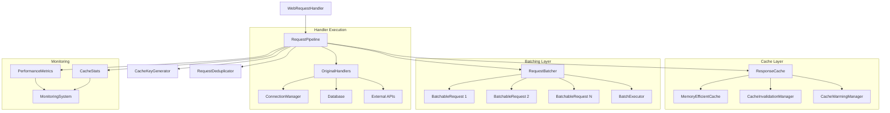

# Phase 2A: Request Pipeline Optimization Architecture

## Overview

This document defines the architectural design for Phase 2A request pipeline optimization targeting 100ms average response improvement for cached requests and 20% CPU reduction for repeated requests through intelligent caching and batching mechanisms.

## Request Pipeline Performance Analysis

### Current Request Processing Issues

1. **Repeated API Computations** (High Impact)
   - Similar requests processed independently without caching
   - Heavy computation for event data processing and view model creation
   - Database queries repeated for identical time ranges
   - CPU overhead: ~20-40% for repeated operations

2. **Inefficient Request Routing** (Medium Impact)
   - Complex routing logic in `_handle_api_request()` (lines 266-311)
   - No request deduplication or batching
   - Synchronous processing of potentially batchable operations

3. **No Response Caching** (High Impact)
   - `/api/whats-next/data` responses recomputed on every request
   - View model creation overhead for identical inputs
   - Missing cache invalidation strategy

## RequestPipeline Architecture Design

### Core Components

#### 1. RequestPipeline Class

```python
from cachetools import TTLCache
from dataclasses import dataclass
from typing import Dict, List, Optional, Any, Callable
import asyncio
import hashlib
import json
from datetime import datetime, timedelta

@dataclass
class CacheConfig:
    """Configuration for request pipeline caching."""
    ttl_seconds: int = 300  # 5 minutes as specified
    max_size: int = 1000    # 1000 item capacity as specified
    batch_size: int = 10    # Batch size for similar requests
    batch_timeout_ms: int = 50  # Max wait time for batch accumulation

class RequestPipeline:
    """Intelligent request pipeline with caching and batching."""
    
    def __init__(self, config: CacheConfig):
        self.config = config
        self.response_cache = TTLCache(maxsize=config.max_size, ttl=config.ttl_seconds)
        self.request_batches: Dict[str, RequestBatch] = {}
        self.cache_stats = CacheStats()
        
    async def process_request(
        self, 
        request_type: str, 
        request_params: Dict[str, Any],
        handler_func: Callable
    ) -> Any:
        """Process request with caching and potential batching."""
        
    async def invalidate_cache(self, pattern: str = None) -> None:
        """Invalidate cache entries matching pattern."""
        
    def get_cache_stats(self) -> Dict[str, Any]:
        """Get cache performance statistics."""
```

#### 2. Request Batching System

```python
@dataclass
class BatchableRequest:
    """Request that can be batched with similar requests."""
    request_id: str
    request_type: str
    params: Dict[str, Any]
    result_future: asyncio.Future
    timestamp: datetime
    
class RequestBatch:
    """Manages batching of similar requests."""
    
    def __init__(self, batch_type: str, batch_size: int, timeout_ms: int):
        self.batch_type = batch_type
        self.max_size = batch_size
        self.timeout_ms = timeout_ms
        self.requests: List[BatchableRequest] = []
        self.batch_timer: Optional[asyncio.Task] = None
        
    async def add_request(self, request: BatchableRequest) -> Any:
        """Add request to batch and return result when ready."""
        
    async def execute_batch(self) -> None:
        """Execute all requests in the batch."""
```

#### 3. Intelligent Cache Key Generation

```python
class CacheKeyGenerator:
    """Generate intelligent cache keys for different request types."""
    
    @staticmethod
    def generate_key(request_type: str, params: Dict[str, Any]) -> str:
        """Generate cache key considering request semantics."""
        
        # Special handling for time-sensitive requests
        if request_type == "whats_next_data":
            return CacheKeyGenerator._generate_whats_next_key(params)
        elif request_type == "events_by_range":
            return CacheKeyGenerator._generate_events_key(params)
        else:
            return CacheKeyGenerator._generate_generic_key(request_type, params)
    
    @staticmethod
    def _generate_whats_next_key(params: Dict[str, Any]) -> str:
        """Generate cache key for What's Next data requests."""
        # Round timestamp to nearest minute for cache efficiency
        current_time = datetime.now()
        rounded_time = current_time.replace(second=0, microsecond=0)
        
        # Include layout and debug_time in cache key
        key_components = {
            "type": "whats_next",
            "time_bucket": rounded_time.isoformat(),
            "layout": params.get("layout", "default"),
            "debug_time": params.get("debug_time"),
            "interactive_mode": params.get("interactive_mode", False)
        }
        
        return hashlib.md5(json.dumps(key_components, sort_keys=True).encode()).hexdigest()
```

### Request Type Classifications

#### 1. Cacheable Requests (High Priority)

```python
CACHEABLE_REQUESTS = {
    "whats_next_data": {
        "cache_ttl": 60,  # 1 minute for time-sensitive data
        "batch_eligible": False,  # Real-time requirement
        "invalidation_triggers": ["data_refresh", "settings_change"]
    },
    "events_by_range": {
        "cache_ttl": 300,  # 5 minutes for event data
        "batch_eligible": True,   # Can batch similar date ranges
        "invalidation_triggers": ["data_refresh", "calendar_sync"]
    },
    "settings_get": {
        "cache_ttl": 600,  # 10 minutes for settings
        "batch_eligible": True,
        "invalidation_triggers": ["settings_update"]
    }
}
```

#### 2. Batchable Requests (CPU Optimization)

```python
BATCHABLE_REQUESTS = {
    "database_query": {
        "batch_size": 10,
        "batch_timeout_ms": 50,
        "merge_strategy": "query_optimization"
    },
    "event_processing": {
        "batch_size": 5,
        "batch_timeout_ms": 30,
        "merge_strategy": "parallel_processing"
    }
}
```

### Integration with Existing WebServer

#### 1. WebServer Integration Points

```python
class WebServer:
    def __init__(self, ...):
        # Add request pipeline
        self.request_pipeline = RequestPipeline(CacheConfig())
        
    async def _handle_api_request_optimized(
        self, 
        path: str, 
        params: Dict[str, Any]
    ) -> None:
        """Enhanced API request handling with pipeline optimization."""
        
        # Determine request type from path
        request_type = self._classify_request(path)
        
        # Process through pipeline
        result = await self.request_pipeline.process_request(
            request_type=request_type,
            request_params=params,
            handler_func=lambda: self._execute_original_handler(path, params)
        )
        
        # Return result
        self._send_json_response(200, result)
```

#### 2. Request Handler Optimization

```python
class OptimizedWebRequestHandler(WebRequestHandler):
    """Enhanced request handler with pipeline integration."""
    
    def _handle_whats_next_data_api_optimized(
        self, 
        params: Optional[Dict[str, Any]] = None
    ) -> None:
        """Optimized What's Next data API with caching."""
        
        # Extract request parameters
        request_params = self._extract_request_params(params)
        
        # Process through pipeline
        async def handler():
            return await self._get_whats_next_data_cached(request_params)
        
        # Execute with pipeline optimization
        result = asyncio.run(
            self.web_server.request_pipeline.process_request(
                request_type="whats_next_data",
                request_params=request_params,
                handler_func=handler
            )
        )
        
        self._send_json_response(200, result)
```

### Cache Management Strategy

#### 1. Cache Invalidation Policies

```python
class CacheInvalidationManager:
    """Manages intelligent cache invalidation."""
    
    def __init__(self, request_pipeline: RequestPipeline):
        self.pipeline = request_pipeline
        self.invalidation_rules = self._load_invalidation_rules()
    
    async def handle_data_change(self, change_type: str, metadata: Dict[str, Any]) -> None:
        """Handle data changes and invalidate relevant cache entries."""
        
        invalidation_patterns = self.invalidation_rules.get(change_type, [])
        
        for pattern in invalidation_patterns:
            await self.pipeline.invalidate_cache(pattern)
            
    def _load_invalidation_rules(self) -> Dict[str, List[str]]:
        """Load cache invalidation rules."""
        return {
            "data_refresh": ["whats_next_*", "events_by_range_*"],
            "settings_change": ["settings_*", "whats_next_*"],
            "layout_change": ["whats_next_*"],
            "navigation_change": ["whats_next_*"]
        }
```

#### 2. Cache Warming Strategy

```python
class CacheWarmingManager:
    """Proactively warm frequently accessed cache entries."""
    
    def __init__(self, request_pipeline: RequestPipeline):
        self.pipeline = request_pipeline
        self.warming_schedule = self._create_warming_schedule()
    
    async def warm_critical_paths(self) -> None:
        """Warm cache for critical request paths."""
        
        # Warm What's Next data for current time
        await self._warm_whats_next_data()
        
        # Warm common settings requests
        await self._warm_settings_data()
        
    async def _warm_whats_next_data(self) -> None:
        """Pre-populate What's Next data cache."""
        current_time = datetime.now()
        
        # Warm cache for next several time buckets
        for minutes_offset in [0, 1, 2, 5]:
            time_bucket = current_time + timedelta(minutes=minutes_offset)
            # Trigger cache population for this time bucket
            # Implementation details...
```

### Performance Optimizations

#### 1. Request Deduplication

```python
class RequestDeduplicator:
    """Prevent duplicate requests from being processed simultaneously."""
    
    def __init__(self):
        self.in_flight_requests: Dict[str, asyncio.Future] = {}
    
    async def deduplicate_request(
        self, 
        cache_key: str, 
        handler_func: Callable
    ) -> Any:
        """Deduplicate identical in-flight requests."""
        
        if cache_key in self.in_flight_requests:
            # Wait for existing request to complete
            return await self.in_flight_requests[cache_key]
        
        # Create future for this request
        future = asyncio.create_task(handler_func())
        self.in_flight_requests[cache_key] = future
        
        try:
            result = await future
            return result
        finally:
            # Clean up completed request
            self.in_flight_requests.pop(cache_key, None)
```

#### 2. Memory-Efficient Caching

```python
class MemoryEfficientCache(TTLCache):
    """TTLCache with memory usage monitoring."""
    
    def __init__(self, maxsize: int, ttl: int, max_memory_mb: int = 50):
        super().__init__(maxsize=maxsize, ttl=ttl)
        self.max_memory_bytes = max_memory_mb * 1024 * 1024
        self.current_memory = 0
        
    def __setitem__(self, key, value):
        """Set item with memory usage tracking."""
        
        # Estimate memory usage
        item_size = self._estimate_size(key, value)
        
        # Check memory constraints
        if self.current_memory + item_size > self.max_memory_bytes:
            self._evict_items_by_memory()
        
        super().__setitem__(key, value)
        self.current_memory += item_size
    
    def _estimate_size(self, key, value) -> int:
        """Estimate memory usage of cache item."""
        # Simplified size estimation
        return len(str(key)) + len(json.dumps(value, default=str))
```

### System Integration Architecture



### Performance Monitoring

#### 1. Cache Performance Metrics

```python
@dataclass
class CacheStats:
    """Track cache performance statistics."""
    hits: int = 0
    misses: int = 0
    evictions: int = 0
    memory_usage_bytes: int = 0
    avg_hit_time_ms: float = 0.0
    avg_miss_time_ms: float = 0.0
    
    @property
    def hit_ratio(self) -> float:
        """Calculate cache hit ratio."""
        total = self.hits + self.misses
        return self.hits / total if total > 0 else 0.0
    
    @property
    def memory_usage_mb(self) -> float:
        """Get memory usage in MB."""
        return self.memory_usage_bytes / (1024 * 1024)
```

#### 2. Pipeline Performance Tracking

```python
class PipelineMetrics:
    """Track request pipeline performance."""
    
    def __init__(self):
        self.request_counts: Dict[str, int] = {}
        self.response_times: Dict[str, List[float]] = {}
        self.batch_stats: Dict[str, int] = {}
        
    def record_request(
        self, 
        request_type: str, 
        response_time_ms: float, 
        cache_hit: bool
    ) -> None:
        """Record request performance metrics."""
        
        self.request_counts[request_type] = self.request_counts.get(request_type, 0) + 1
        
        if request_type not in self.response_times:
            self.response_times[request_type] = []
        self.response_times[request_type].append(response_time_ms)
        
    def get_performance_summary(self) -> Dict[str, Any]:
        """Get comprehensive performance summary."""
        return {
            "total_requests": sum(self.request_counts.values()),
            "avg_response_times": {
                req_type: sum(times) / len(times) 
                for req_type, times in self.response_times.items()
            },
            "request_distribution": self.request_counts,
            "batch_efficiency": self.batch_stats
        }
```

### Configuration and Feature Flags

#### 1. Pipeline Configuration

```python
@dataclass
class PipelineConfig:
    """Configuration for request pipeline optimization."""
    
    # Cache settings
    enable_response_caching: bool = True
    cache_ttl_seconds: int = 300
    cache_max_size: int = 1000
    cache_memory_limit_mb: int = 50
    
    # Batching settings
    enable_request_batching: bool = True
    batch_size: int = 10
    batch_timeout_ms: int = 50
    
    # Deduplication settings
    enable_request_deduplication: bool = True
    
    # Monitoring settings
    enable_performance_monitoring: bool = True
    metrics_collection_interval_s: int = 60
    
    @classmethod
    def from_environment(cls) -> 'PipelineConfig':
        """Create configuration from environment variables."""
        return cls(
            enable_response_caching=os.getenv('ENABLE_RESPONSE_CACHING', 'true').lower() == 'true',
            cache_ttl_seconds=int(os.getenv('CACHE_TTL_SECONDS', '300')),
            cache_max_size=int(os.getenv('CACHE_MAX_SIZE', '1000')),
            enable_request_batching=os.getenv('ENABLE_REQUEST_BATCHING', 'true').lower() == 'true',
            batch_size=int(os.getenv('BATCH_SIZE', '10')),
            batch_timeout_ms=int(os.getenv('BATCH_TIMEOUT_MS', '50'))
        )
```

### Error Handling and Resilience

#### 1. Cache Failure Handling

```python
class CacheFailureHandler:
    """Handle cache failures gracefully."""
    
    def __init__(self, fallback_handler: Callable):
        self.fallback_handler = fallback_handler
        self.failure_count = 0
        self.last_failure_time = None
        
    async def handle_cache_error(
        self, 
        error: Exception, 
        request_params: Dict[str, Any]
    ) -> Any:
        """Handle cache errors with fallback to direct execution."""
        
        logger.warning(f"Cache error encountered: {error}")
        self.failure_count += 1
        self.last_failure_time = datetime.now()
        
        # Execute fallback handler
        return await self.fallback_handler(request_params)
```

#### 2. Batch Processing Resilience

```python
class ResilientBatchProcessor:
    """Process batches with error recovery."""
    
    async def process_batch_with_recovery(
        self, 
        batch: RequestBatch
    ) -> None:
        """Process batch with individual request fallback on errors."""
        
        try:
            # Attempt batch processing
            await self._process_batch_optimized(batch)
        except Exception as e:
            logger.warning(f"Batch processing failed: {e}")
            
            # Fall back to individual request processing
            await self._process_requests_individually(batch)
```

### Success Criteria and Validation

#### 1. Phase 2A Performance Targets

**Cache Performance:**
- Cache hit ratio: >80% for repeated requests
- Average cache hit response time: <10ms
- Memory usage: <50MB for cache storage

**Batch Processing:**
- Batch formation efficiency: >70% for batchable requests
- Batch processing time improvement: >20% vs individual processing
- CPU usage reduction: 20% for repeated requests

**Overall Pipeline Performance:**
- Average response time improvement: 100ms for cached requests
- Memory overhead: <10MB for pipeline infrastructure
- Zero degradation in response accuracy

#### 2. Monitoring and Validation

```python
class Phase2AValidator:
    """Validate Phase 2A performance improvements."""
    
    def __init__(self, baseline_metrics: Dict[str, float]):
        self.baseline = baseline_metrics
        self.current_metrics = {}
        
    async def validate_performance_targets(self) -> Dict[str, bool]:
        """Validate that performance targets are met."""
        
        results = {}
        
        # Validate cache hit ratio
        cache_hit_ratio = self.current_metrics.get('cache_hit_ratio', 0)
        results['cache_hit_ratio'] = cache_hit_ratio >= 0.8
        
        # Validate response time improvement
        avg_response_time = self.current_metrics.get('avg_response_time_ms', float('inf'))
        baseline_response_time = self.baseline.get('avg_response_time_ms', 0)
        improvement = baseline_response_time - avg_response_time
        results['response_time_improvement'] = improvement >= 100
        
        # Validate CPU usage reduction
        cpu_usage = self.current_metrics.get('cpu_usage_percent', 100)
        baseline_cpu = self.baseline.get('cpu_usage_percent', 100)
        cpu_reduction = (baseline_cpu - cpu_usage) / baseline_cpu
        results['cpu_reduction'] = cpu_reduction >= 0.2
        
        return results
```

## Integration Testing Strategy

### 1. Cache Testing

```python
class TestRequestPipelineCache:
    async def test_cache_hit_performance(self):
        """Test cache hit performance meets targets."""
        
    async def test_cache_invalidation(self):
        """Test cache invalidation works correctly."""
        
    async def test_memory_usage_limits(self):
        """Test cache respects memory limits."""
```

### 2. Batch Processing Testing

```python
class TestRequestBatching:
    async def test_batch_formation(self):
        """Test requests are correctly batched."""
        
    async def test_batch_timeout_handling(self):
        """Test batch timeout mechanisms."""
        
    async def test_batch_error_recovery(self):
        """Test batch processing error recovery."""
```

### 3. End-to-End Performance Testing

```python
class TestPhase2APerformance:
    async def test_overall_performance_improvement(self):
        """Test overall Phase 2A performance targets."""
        
    async def test_memory_usage_reduction(self):
        """Test memory usage improvements."""
        
    async def test_response_time_improvement(self):
        """Test response time improvements."""
```

## Implementation Dependencies

### Required Libraries

- `cachetools`: TTL cache implementation
- `asyncio`: Async batching and pipeline management
- `dataclasses`: Configuration and data structures

### Integration Points

- ConnectionManager: Shared connection pools
- WebServer: Request routing and handling
- PerformanceMonitor: Metrics collection and reporting

### Compatibility Requirements

- Backward compatibility with existing API responses
- No breaking changes to WebRequestHandler interface
- Graceful degradation when pipeline features are disabled