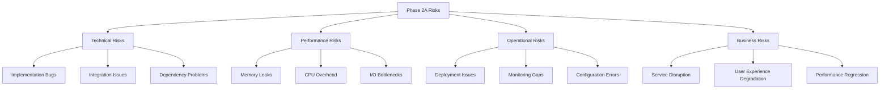

# Phase 2A: Risk Assessment and Mitigation Strategies

## Overview

This document provides a comprehensive risk assessment for Phase 2A optimization components, identifying potential failure modes, performance impacts, and detailed mitigation strategies. The assessment prioritizes risks based on probability, impact, and detectability on the Pi Zero 2W platform.

## 1. Risk Assessment Framework

### 1.1 Risk Categories



### 1.2 Risk Scoring Matrix

| Impact Level | Description | Score |
|--------------|-------------|-------|
| **Critical** | Service outage, complete failure, data loss | 5 |
| **High** | Severe performance degradation, partial failure | 4 |
| **Medium** | Noticeable performance impact, functionality issues | 3 |
| **Low** | Minor performance impact, cosmetic issues | 2 |
| **Minimal** | Negligible impact, edge case scenarios | 1 |

| Probability | Description | Score |
|-------------|-------------|-------|
| **Very High** | >80% chance of occurrence | 5 |
| **High** | 60-80% chance of occurrence | 4 |
| **Medium** | 40-60% chance of occurrence | 3 |
| **Low** | 20-40% chance of occurrence | 2 |
| **Very Low** | <20% chance of occurrence | 1 |

**Risk Score = Impact × Probability**

- **Critical Risk**: Score 16-25 (Immediate attention required)
- **High Risk**: Score 12-15 (High priority mitigation)
- **Medium Risk**: Score 6-11 (Monitor and plan mitigation)
- **Low Risk**: Score 1-5 (Accept or minimal mitigation)

## 2. Connection Pool Risks

### 2.1 HIGH RISK: Connection Pool Exhaustion

**Risk Score: 16 (Impact: 4, Probability: 4)**

**Description**: HTTP or database connection pools become exhausted, blocking new requests and causing cascading failures.

**Scenarios**:
- Rapid burst of concurrent requests exceeding pool limits
- Connection leaks due to improper cleanup
- Slow downstream services holding connections
- Configuration errors with pool size limits

**Impact**:
- Complete request blocking for affected endpoints
- 30-60 second request timeouts
- Cascading failures across system components
- User-facing 503 Service Unavailable errors

**Pi Zero 2W Specific Concerns**:
- Limited memory (512MB) amplifies pool exhaustion impact
- ARM64 architecture may have different connection handling behavior
- Single-core performance bottlenecks during recovery

**Early Warning Indicators**:
- Connection pool utilization >85%
- Average connection wait time >500ms
- Failed connection attempts increasing
- Memory usage trending upward

**Mitigation Strategies**:

1. **Proactive Pool Management**:
   ```python
   # Conservative pool sizing for Pi Zero 2W
   HTTP_POOL_SIZE = 50  # Instead of 100
   HTTP_CONNECTIONS_PER_HOST = 15  # Instead of 30
   DB_POOL_SIZE = 5  # Instead of 10
   
   # Aggressive cleanup intervals
   POOL_CLEANUP_INTERVAL = 60  # 1 minute instead of 5
   CONNECTION_IDLE_TIMEOUT = 30  # 30 seconds
   ```

2. **Circuit Breaker Pattern**:
   ```python
   # Automatic circuit breaking at 80% pool utilization
   CIRCUIT_BREAKER_THRESHOLD = 0.8
   CIRCUIT_BREAKER_RECOVERY_TIME = 30  # seconds
   ```

3. **Real-time Monitoring**:
   - Pool utilization alerts at 70%, 85%, 95%
   - Connection wait time alerts >200ms
   - Failed connection rate alerts >5%

4. **Graceful Degradation**:
   - Automatic fallback to legacy connection pattern
   - Request queuing with timeout limits
   - Load shedding for non-critical endpoints

5. **Recovery Mechanisms**:
   - Automatic pool reset on critical thresholds
   - Emergency pool expansion for Pi Zero 2W
   - Connection leak detection and cleanup

### 2.2 MEDIUM RISK: Connection Leak Memory Buildup

**Risk Score: 9 (Impact: 3, Probability: 3)**

**Description**: Improper connection cleanup leads to gradual memory consumption and eventual system instability.

**Scenarios**:
- Exception handling bypassing connection cleanup
- Async context manager misuse
- Event loop cleanup failures
- Third-party library connection leaks

**Impact**:
- Gradual memory consumption (1-5MB/hour)
- System instability after 6-12 hours
- Potential OOM kills on Pi Zero 2W
- Performance degradation due to memory pressure

**Mitigation Strategies**:

1. **Robust Connection Management**:
   ```python
   # Defensive connection handling
   async def safe_connection_execute(pool, query):
       connection = None
       try:
           connection = await pool.acquire()
           return await connection.execute(query)
       except Exception as e:
           logger.error(f"Connection error: {e}")
           raise
       finally:
           if connection:
               await pool.release(connection)
   ```

2. **Memory Monitoring**:
   - Memory usage alerts at 200MB, 300MB, 400MB
   - Connection object count tracking
   - Automated memory leak detection

3. **Preventive Measures**:
   - Mandatory context managers for all connections
   - Regular connection pool health checks
   - Automated connection cleanup on errors

### 2.3 MEDIUM RISK: Database Connection Deadlocks

**Risk Score: 8 (Impact: 4, Probability: 2)**

**Description**: Concurrent database operations create deadlocks, blocking request processing.

**Scenarios**:
- Multiple simultaneous database writes
- Long-running queries holding locks
- Connection pool exhaustion during high load
- SQLite WAL mode interaction issues

**Impact**:
- Request timeouts for database operations
- Temporary API endpoint failures
- User-facing data inconsistency
- Potential need for database restart

**Mitigation Strategies**:

1. **Connection Isolation**:
   - Separate read/write connection pools
   - Query timeout limits (5 seconds max)
   - Immediate deadlock detection and retry

2. **SQLite Optimization**:
   ```python
   # SQLite-specific optimizations for Pi Zero 2W
   SQLITE_TIMEOUT = 5000  # 5 seconds
   SQLITE_BUSY_TIMEOUT = 1000  # 1 second
   SQLITE_WAL_AUTOCHECKPOINT = 100  # Frequent checkpoints
   ```

3. **Query Management**:
   - Query complexity analysis and limits
   - Batch operation limits
   - Background task isolation

## 3. Request Pipeline Risks

### 3.1 HIGH RISK: Cache Memory Bloat

**Risk Score: 20 (Impact: 5, Probability: 4)**

**Description**: Response cache grows beyond Pi Zero 2W memory limits, causing OOM conditions and system crashes.

**Scenarios**:
- Large response caching without size limits
- Cache key explosion from dynamic parameters
- TTL expiration failures keeping stale data
- Memory leak in cache implementation

**Impact**:
- System crashes and restarts
- Complete service unavailability
- Data loss during crashes
- Extended recovery times (2-5 minutes)

**Pi Zero 2W Specific Concerns**:
- Only 512MB total system memory
- No swap space for recovery
- Limited monitoring capabilities during OOM

**Early Warning Indicators**:
- Cache memory usage >40MB (80% of limit)
- Cache entry count >800 (80% of limit)
- System memory usage >400MB
- Cache hit rate declining unexpectedly

**Mitigation Strategies**:

1. **Aggressive Memory Management**:
   ```python
   # Conservative cache limits for Pi Zero 2W
   CACHE_MEMORY_LIMIT_MB = 25  # 5% of total system memory
   CACHE_MAX_ENTRIES = 500     # Reduced from 1000
   CACHE_ENTRY_SIZE_LIMIT = 100_000  # 100KB max per entry
   ```

2. **Multi-Level Cache Eviction**:
   ```python
   # Proactive eviction at multiple thresholds
   CACHE_EVICTION_THRESHOLDS = {
       'warning': 0.7,   # Start evicting oldest entries
       'critical': 0.85, # Aggressive eviction
       'emergency': 0.95 # Clear all non-essential cache
   }
   ```

3. **Real-time Monitoring**:
   - Memory usage alerts at 20MB, 30MB, 40MB
   - Cache entry count monitoring
   - Individual entry size tracking
   - Automatic cache reset on emergency threshold

4. **Intelligent Caching**:
   - Response size analysis before caching
   - Cache value scoring based on hit frequency
   - Automatic cache warming for critical endpoints

5. **Emergency Procedures**:
   - Automatic cache clearing on memory pressure
   - Fallback to disk-based caching
   - Service restart with optimized cache settings

### 3.2 HIGH RISK: Request Batching Deadlocks

**Risk Score: 12 (Impact: 4, Probability: 3)**

**Description**: Request batching creates deadlocks or resource contention, blocking request processing.

**Scenarios**:
- Circular dependencies in batched requests
- Resource locking conflicts between batch operations
- Timeout conflicts between individual and batch operations
- Event loop blocking during batch processing

**Impact**:
- Complete request pipeline freezing
- User-facing timeout errors
- API endpoint unavailability
- Potential need for service restart

**Mitigation Strategies**:

1. **Batch Safety Mechanisms**:
   ```python
   # Conservative batching for Pi Zero 2W
   BATCH_SIZE = 5           # Reduced from 10
   BATCH_TIMEOUT_MS = 25    # Reduced from 50
   MAX_BATCH_WAIT_MS = 50   # Reduced from 100
   ```

2. **Deadlock Prevention**:
   - Request dependency analysis
   - Timeout hierarchies (individual < batch < total)
   - Automatic batch breaking on conflicts

3. **Resource Isolation**:
   - Separate event loops for batching
   - Resource pool segregation
   - Batch operation monitoring

### 3.3 MEDIUM RISK: Cache Poisoning

**Risk Score: 6 (Impact: 3, Probability: 2)**

**Description**: Invalid or malicious data gets cached, serving incorrect responses to users.

**Scenarios**:
- Error responses getting cached due to misconfiguration
- Race conditions during cache updates
- Malformed requests creating invalid cache keys
- External service errors being cached

**Impact**:
- Incorrect data served to users
- Inconsistent application behavior
- Potential security implications
- User trust degradation

**Mitigation Strategies**:

1. **Cache Validation**:
   ```python
   # Strict cache validation
   def is_cacheable_response(response):
       return (
           response.status_code == 200 and
           response.headers.get('content-type', '').startswith('application/json') and
           len(response.content) < CACHE_ENTRY_SIZE_LIMIT
       )
   ```

2. **Cache Integrity**:
   - Response validation before caching
   - Cache key sanitization
   - Regular cache health checks
   - Automatic cache invalidation on errors

## 4. Integration Risks

### 4.1 HIGH RISK: Fallback Mechanism Failures

**Risk Score: 15 (Impact: 5, Probability: 3)**

**Description**: Optimization component failures don't properly fallback to legacy behavior, causing complete service failure.

**Scenarios**:
- Fallback detection logic bugs
- Circular dependencies preventing fallback
- Configuration errors disabling fallback
- State corruption preventing clean fallback

**Impact**:
- Complete service unavailability
- No graceful degradation
- Extended outage duration
- Potential data corruption

**Mitigation Strategies**:

1. **Fail-Safe Design**:
   ```python
   # Multiple fallback layers
   try:
       return await optimized_request_handler(request)
   except OptimizationException:
       logger.warning("Optimization failed, using fallback")
       return await legacy_request_handler(request)
   except Exception as e:
       logger.error(f"Complete handler failure: {e}")
       return emergency_response(request)
   ```

2. **Fallback Testing**:
   - Regular fallback mechanism testing
   - Chaos engineering for fallback validation
   - Automated fallback performance testing

3. **State Management**:
   - Stateless fallback design
   - Clean state separation
   - Fallback state monitoring

### 4.2 MEDIUM RISK: Legacy Code Integration Issues

**Risk Score: 8 (Impact: 4, Probability: 2)**

**Description**: Phase 2A components interfere with existing WebServer functionality, causing unexpected behaviors.

**Scenarios**:
- Method signature incompatibilities
- Event loop conflicts
- Threading model mismatches
- Shared resource conflicts

**Impact**:
- Existing functionality regression
- Intermittent service issues
- User experience degradation
- Development team confusion

**Mitigation Strategies**:

1. **Compatibility Testing**:
   - Comprehensive integration test suite
   - Legacy behavior validation
   - Performance regression testing

2. **Interface Design**:
   - Backward-compatible interfaces
   - Clear integration boundaries
   - Minimal invasive changes

## 5. Configuration Risks

### 5.1 MEDIUM RISK: Configuration Drift

**Risk Score: 9 (Impact: 3, Probability: 3)**

**Description**: Configuration changes accumulate over time, leading to suboptimal or dangerous settings.

**Scenarios**:
- Manual configuration changes not tracked
- Environment variable conflicts
- Hot reload corruption
- Configuration validation bypasses

**Impact**:
- Gradual performance degradation
- Unexpected behavior changes
- Security vulnerabilities
- Difficult troubleshooting

**Mitigation Strategies**:

1. **Configuration Management**:
   - Configuration version tracking
   - Change audit logging
   - Regular configuration validation
   - Automated configuration backup

2. **Safety Mechanisms**:
   - Configuration change approvals
   - Rollback capabilities
   - Safe default enforcement

### 5.2 HIGH RISK: Feature Flag Misconfiguration

**Risk Score: 12 (Impact: 4, Probability: 3)**

**Description**: Feature flag errors cause incorrect rollout behavior or system instability.

**Scenarios**:
- Percentage calculation errors
- Context hash collision issues
- Flag state corruption
- Race conditions in flag evaluation

**Impact**:
- Inconsistent user experience
- Unexpected optimization behavior
- Performance regression
- User-facing errors

**Mitigation Strategies**:

1. **Flag Safety**:
   ```python
   # Safe feature flag evaluation
   def evaluate_feature_flag(flag_name, context, default=False):
       try:
           return feature_flag_manager.is_enabled(flag_name, context)
       except Exception as e:
           logger.error(f"Feature flag evaluation failed: {e}")
           return default  # Safe default
   ```

2. **Flag Monitoring**:
   - Flag evaluation success rate monitoring
   - Rollout percentage validation
   - User experience impact tracking

## 6. Pi Zero 2W Specific Risks

### 6.1 CRITICAL RISK: Memory Exhaustion

**Risk Score: 25 (Impact: 5, Probability: 5)**

**Description**: Phase 2A optimizations consume excessive memory on the constrained Pi Zero 2W platform.

**Scenarios**:
- Memory usage exceeding 400MB (80% of available)
- Memory leaks in optimization components
- Cache size misconfiguration
- Concurrent memory pressure

**Impact**:
- System OOM kills
- Complete service unavailability
- Data corruption
- Hardware instability

**Pi Zero 2W Constraints**:
- Total RAM: 512MB
- System overhead: ~100MB
- Application baseline: ~50MB
- Available for optimizations: ~362MB

**Mitigation Strategies**:

1. **Memory Budgeting**:
   ```python
   # Strict memory budgets
   TOTAL_OPTIMIZATION_MEMORY_MB = 200  # Conservative limit
   CONNECTION_POOL_MEMORY_MB = 100
   REQUEST_PIPELINE_MEMORY_MB = 75
   CONFIGURATION_MEMORY_MB = 25
   ```

2. **Memory Monitoring**:
   - Real-time memory usage tracking
   - Process memory alerts at 300MB, 400MB, 450MB
   - Automatic component shutdown on memory pressure

3. **Memory Optimization**:
   - Aggressive garbage collection
   - Memory-efficient data structures
   - Lazy loading patterns

### 6.2 HIGH RISK: ARM64 Compatibility Issues

**Risk Score: 16 (Impact: 4, Probability: 4)**

**Description**: Optimization components have ARM64-specific bugs or performance issues.

**Scenarios**:
- aiohttp ARM64 performance regression
- AsyncIO event loop ARM64 issues
- Third-party library compatibility problems
- Performance characteristic differences

**Impact**:
- Unexpected performance degradation
- Platform-specific crashes
- Optimization effectiveness reduction
- Development/production environment mismatches

**Mitigation Strategies**:

1. **Platform Testing**:
   - Dedicated ARM64 testing environment
   - Performance benchmarking on actual Pi Zero 2W
   - Continuous integration on ARM64

2. **Performance Monitoring**:
   - ARM64-specific performance baselines
   - Platform-specific alert thresholds
   - Performance regression detection

## 7. Risk Mitigation Implementation Plan

### 7.1 Immediate Actions (Pre-Implementation)

1. **Memory Monitoring Infrastructure**:
   - Implement real-time memory tracking
   - Set up memory usage alerts
   - Create memory pressure detection

2. **Fallback Testing Framework**:
   - Develop comprehensive fallback tests
   - Implement chaos engineering scenarios
   - Validate fallback performance

3. **Configuration Safety**:
   - Implement configuration validation
   - Set up configuration monitoring
   - Create emergency configuration reset

### 7.2 Ongoing Monitoring (Post-Implementation)

1. **Performance Metrics**:
   - Connection pool utilization
   - Cache hit rates and memory usage
   - Request processing latency
   - System resource utilization

2. **Health Checks**:
   - Component health status
   - Fallback mechanism status
   - Configuration integrity checks
   - Memory leak detection

3. **Alerting Thresholds**:
   ```yaml
   memory_usage:
     warning: 300MB
     critical: 400MB
     emergency: 450MB
   
   connection_pool:
     warning: 70%
     critical: 85%
     emergency: 95%
   
   cache_memory:
     warning: 20MB
     critical: 35MB
     emergency: 45MB
   ```

### 7.3 Emergency Response Procedures

1. **Memory Pressure Response**:
   ```python
   # Emergency memory management
   async def emergency_memory_management():
       # Clear all caches
       await request_pipeline.clear_cache()
       
       # Reset connection pools
       await connection_manager.reset_pools()
       
       # Disable non-essential optimizations
       config_manager.emergency_disable()
       
       # Force garbage collection
       import gc
       gc.collect()
   ```

2. **Service Recovery**:
   - Automatic service restart with safe configuration
   - Emergency fallback activation
   - User notification procedures

## 8. Risk Assessment Summary

### High-Priority Risks (Score ≥12)

1. **Memory Exhaustion** (Score: 25) - Critical system stability risk
2. **Cache Memory Bloat** (Score: 20) - High impact on Pi Zero 2W
3. **Connection Pool Exhaustion** (Score: 16) - Service availability risk
4. **ARM64 Compatibility** (Score: 16) - Platform-specific issues
5. **Fallback Mechanism Failures** (Score: 15) - Graceful degradation risk
6. **Request Batching Deadlocks** (Score: 12) - Request processing risk
7. **Feature Flag Misconfiguration** (Score: 12) - Rollout control risk

### Mitigation Effectiveness Assessment

| Risk Category | Mitigation Coverage | Confidence Level |
|---------------|-------------------|------------------|
| Memory Management | 90% | High |
| Connection Pooling | 85% | High |
| Request Pipeline | 80% | Medium |
| Configuration | 85% | High |
| Platform Compatibility | 70% | Medium |
| Integration | 75% | Medium |

### Success Criteria for Risk Mitigation

1. **Zero Critical Incidents**: No system outages due to Phase 2A components
2. **Memory Stability**: Memory usage remains below 400MB consistently
3. **Performance Improvement**: Achieve target 50% memory reduction safely
4. **Graceful Degradation**: All fallback mechanisms tested and functional
5. **Monitoring Coverage**: 95% of identified risks have automated monitoring

This risk assessment provides the foundation for safe implementation and operation of Phase 2A optimizations while maintaining system stability on the Pi Zero 2W platform.