# Phase 2A: System Architecture Diagrams

## Overview

This document provides comprehensive architectural diagrams for Phase 2A optimization components, showing the integration of ConnectionManager and RequestPipeline with the existing CalendarBot WebServer infrastructure.

## 1. High-Level System Architecture

### Phase 2A Component Overview

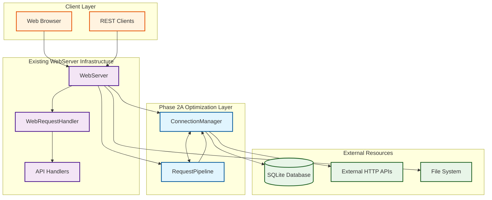

## 2. Detailed Component Architecture

### ConnectionManager Internal Architecture

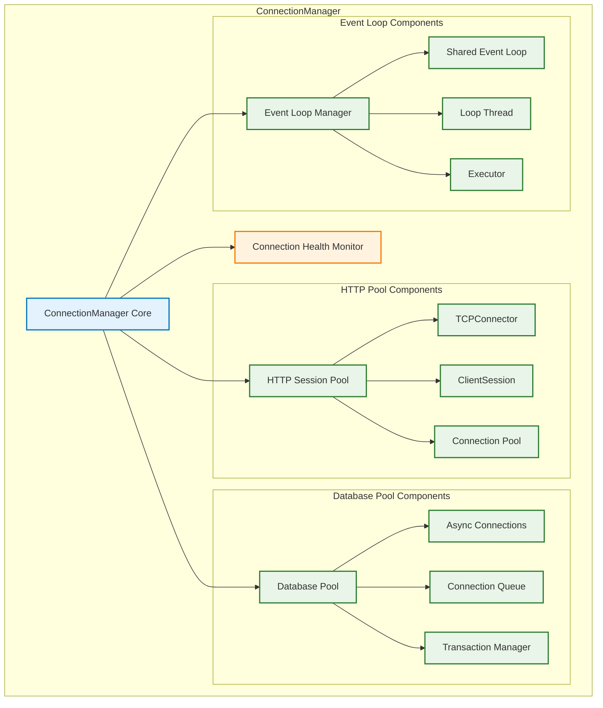

### RequestPipeline Internal Architecture

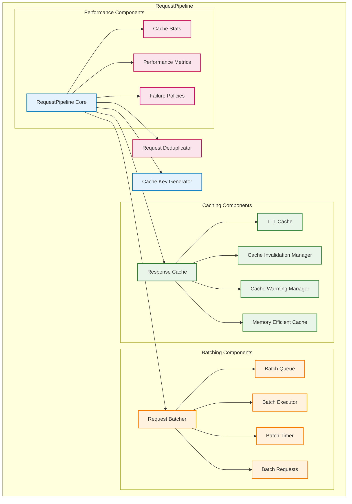

## 3. Request Flow Architecture

### Standard Request Processing Flow

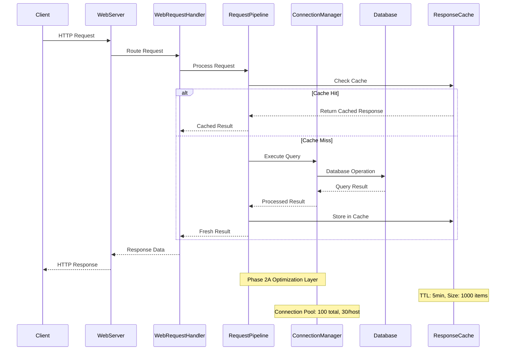

### Batched Request Processing Flow

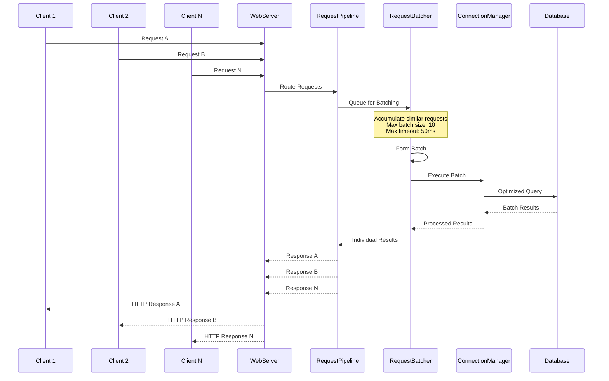

## 4. Integration Architecture

### WebServer Integration Points

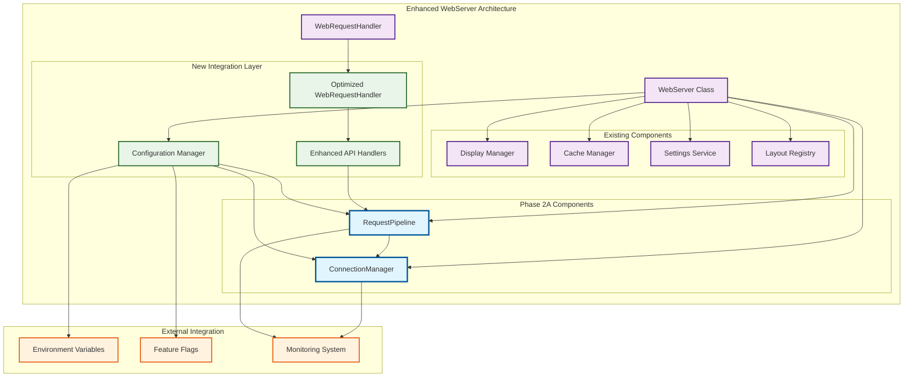

## 5. Data Flow Architecture

### Connection Pool Data Flow

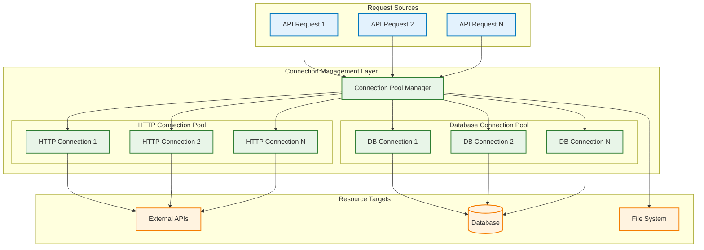

### Cache and Pipeline Data Flow

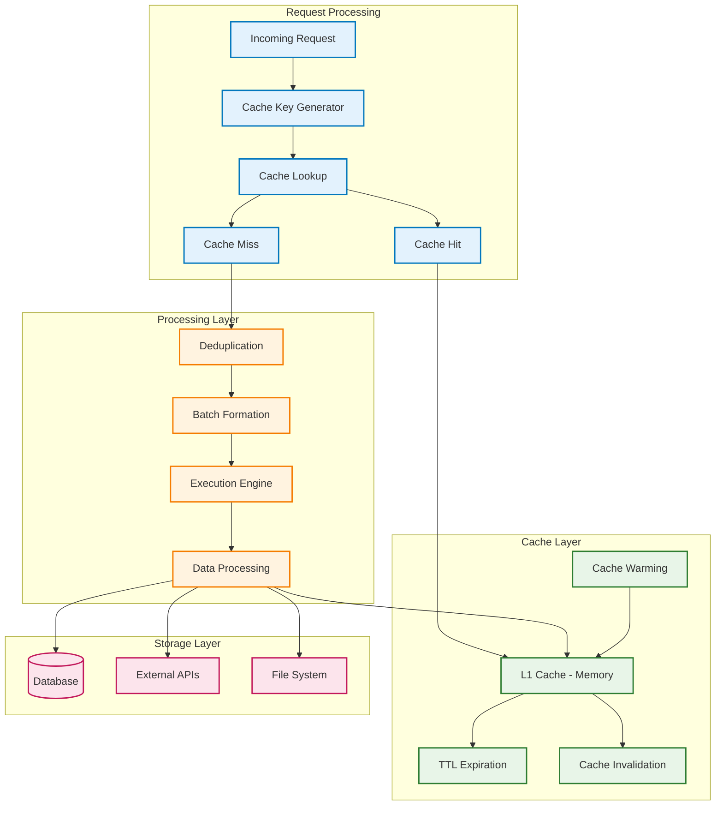

## 6. Performance Architecture

### Memory Usage Distribution

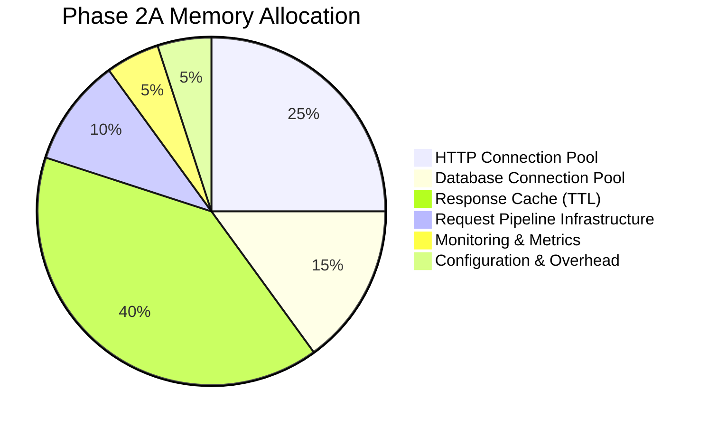

### Performance Monitoring Architecture

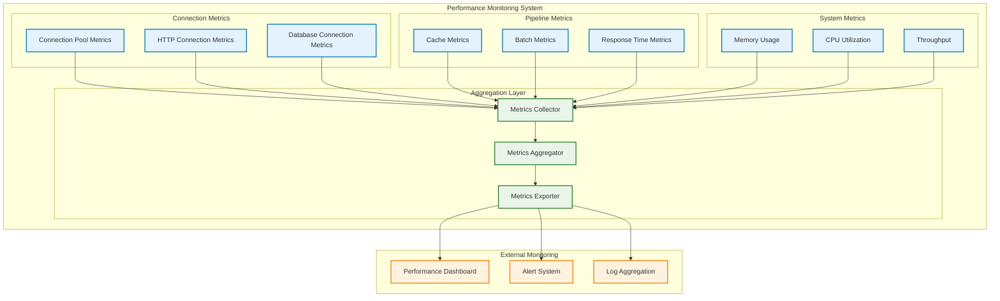

## 7. Deployment Architecture

### Component Deployment View

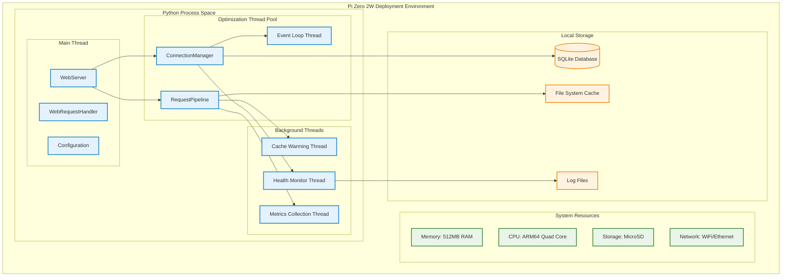

## 8. Error Handling and Recovery Architecture

### Failure Recovery Flow

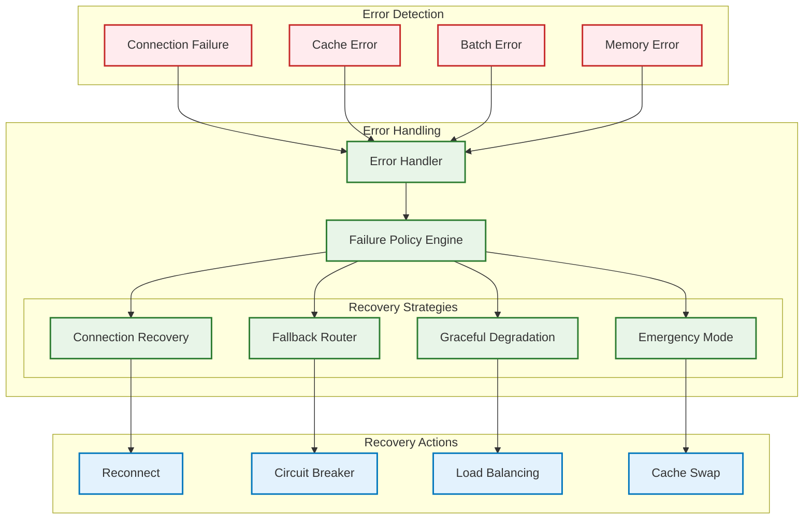

## 9. Security Architecture

### Security Boundary Definition

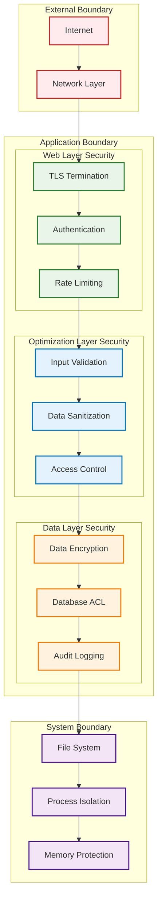

## 10. Configuration Architecture

### Configuration Management Hierarchy

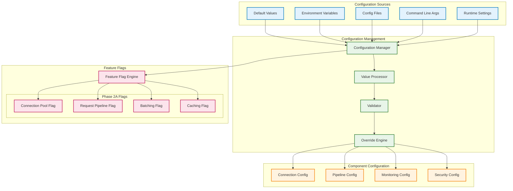

## Summary

These architectural diagrams provide a comprehensive view of the Phase 2A optimization system, showing:

1. **Component Integration**: How ConnectionManager and RequestPipeline integrate with existing WebServer infrastructure
2. **Data Flow**: Request processing paths through caching and batching mechanisms
3. **Performance Architecture**: Memory allocation and monitoring systems
4. **Deployment View**: Component placement within Pi Zero 2W constraints
5. **Error Handling**: Recovery strategies and failure modes
6. **Security Boundaries**: Protection layers and access controls
7. **Configuration Management**: Feature flags and gradual rollout capability

The architecture ensures:
- **Backward Compatibility**: Existing functionality remains unchanged
- **Gradual Rollout**: Feature flags enable phased deployment
- **Performance Monitoring**: Comprehensive metrics collection
- **Error Recovery**: Graceful degradation and fallback mechanisms
- **Resource Efficiency**: Optimized for Pi Zero 2W constraints
- **Security**: Multiple protection layers throughout the system