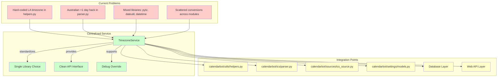

# Simplified Timezone Standardization Plan

## Overview
Focus on eliminating timezone bugs through standardization rather than complex features.

## Core Architecture

## Implementation Strategy

### Phase 1: Core Service (Current Focus)
1. Create `calendarbot/timezone/` module with core service
2. Choose and standardize on single timezone library
3. Implement basic timezone operations with consistent API

### Phase 2: Replace Hardcoded Defaults
1. Replace "America/Los_Angeles" hardcoding in `helpers.py:207`
2. Implement fallback strategy (UTC default with logging)
3. Update all timezone-aware datetime creation points

### Phase 3: Standardize Library Usage
1. Replace mixed pytz/dateutil/datetime usage
2. Update ICS parser timezone handling
3. Standardize database datetime storage/retrieval

### Phase 4: Testing & Validation
1. Create comprehensive test suite for timezone operations
2. Add debug time override capability
3. Validate elimination of timezone bugs

## Key Simplifications
- **No complex user settings**: Use system timezone detection with UTC fallback
- **No migration strategy**: Stateless system, direct replacement
- **Defer special cases**: Address Australian timezone issue after core standardization
- **Focus on bugs**: Prioritize correctness over features

## Success Criteria
- ✅ All hardcoded timezone defaults eliminated
- ✅ Single consistent timezone library usage
- ✅ Clean timezone conversion boundaries
- ✅ Comprehensive test coverage
- ✅ Debug override capability for testing