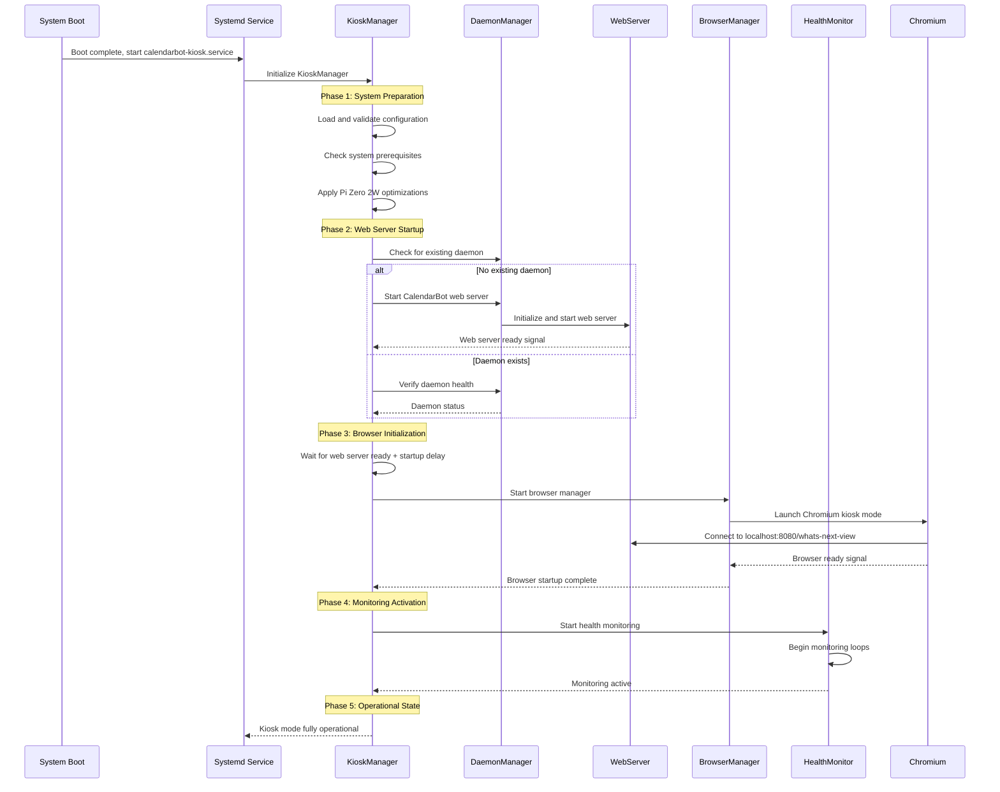

# Kiosk Mode Startup Orchestration Workflow

## Overview

This document defines the comprehensive startup orchestration workflow for CalendarBot kiosk mode, leveraging existing daemon infrastructure while adding kiosk-specific coordination for reliable Pi Zero 2W operation.

## Startup Architecture



## Startup Phases

### Phase 1: System Preparation

**Duration**: 5-15 seconds  
**Purpose**: Prepare system environment and validate prerequisites

```python
async def phase_1_system_preparation(kiosk_manager: KioskManager) -> bool:
    """System preparation and validation phase.
    
    Returns:
        True if preparation successful, False otherwise
    """
    try:
        logger.info("Phase 1: System preparation")
        
        # 1.1: Load and validate configuration
        config_valid = kiosk_manager.validate_configuration()
        if not config_valid:
            raise StartupError("Configuration validation failed")
        
        # 1.2: Check system prerequisites
        await check_system_prerequisites(kiosk_manager.settings)
        
        # 1.3: Apply Pi Zero 2W optimizations
        await apply_pi_optimizations(kiosk_manager.settings.kiosk.pi_optimization)
        
        # 1.4: Setup logging and monitoring
        await setup_kiosk_logging(kiosk_manager.settings)
        
        # 1.5: Prepare display environment
        await configure_display_environment(kiosk_manager.settings.kiosk.display)
        
        logger.info("Phase 1 completed successfully")
        return True
        
    except Exception as e:
        logger.error(f"Phase 1 failed: {e}")
        return False


async def check_system_prerequisites(settings: CalendarBotKioskSettings) -> None:
    """Check system prerequisites for kiosk operation."""
    
    # Check available memory
    available_memory = get_available_memory_mb()
    required_memory = (
        settings.kiosk.browser.memory_limit_mb + 
        100 +  # CalendarBot 
        200    # System overhead
    )
    
    if available_memory < required_memory:
        raise StartupError(f"Insufficient memory: {available_memory}MB < {required_memory}MB")
    
    # Check display environment
    if not check_x11_display(settings.kiosk.system.x11_display):
        raise StartupError("X11 display not available")
    
    # Check network connectivity if required
    if settings.kiosk.system.wait_for_network:
        await wait_for_network_connectivity(settings.kiosk.system.network_timeout)
    
    # Check browser executable
    if not check_browser_executable(settings.kiosk.browser.executable_path):
        raise StartupError("Browser executable not found")
        
    # Verify calendar configuration
    if not settings.ics_url:
        raise StartupError("Calendar ICS URL not configured")


async def apply_pi_optimizations(pi_config: PiOptimizationConfig) -> None:
    """Apply Pi Zero 2W specific optimizations."""
    
    if not pi_config.enable_memory_optimization:
        return
        
    logger.info("Applying Pi Zero 2W optimizations")
    
    # Configure CPU governor
    await set_cpu_governor(pi_config.cpu_governor)
    
    # Setup swap if configured
    if pi_config.swap_size_mb > 0:
        await configure_swap(pi_config.swap_size_mb)
    
    # Configure memory split
    await set_gpu_memory_split(pi_config.memory_split_mb)
    
    # Setup tmpfs for logs if enabled
    if pi_config.enable_tmpfs_logs:
        await setup_tmpfs_logging(pi_config.tmpfs_size_mb)
    
    # Apply network optimizations
    if pi_config.enable_network_optimization:
        await optimize_network_stack(pi_config.tcp_window_size_kb)
```

### Phase 2: Web Server Startup

**Duration**: 10-20 seconds  
**Purpose**: Start CalendarBot web server using existing daemon infrastructure

```python
async def phase_2_web_server_startup(kiosk_manager: KioskManager) -> bool:
    """Web server startup phase leveraging existing daemon infrastructure.
    
    Returns:
        True if web server started successfully, False otherwise
    """
    try:
        logger.info("Phase 2: Web server startup")
        
        # 2.1: Check for existing daemon
        if kiosk_manager.daemon_manager.is_daemon_running():
            logger.info("Existing CalendarBot daemon found")
            
            # Verify daemon health
            if await verify_daemon_health(kiosk_manager):
                logger.info("Existing daemon is healthy, reusing")
                return True
            else:
                logger.warning("Existing daemon unhealthy, restarting")
                await kiosk_manager.daemon_manager.stop_daemon()
                await asyncio.sleep(2)
        
        # 2.2: Start new web server daemon
        logger.info("Starting CalendarBot web server daemon")
        
        # Initialize CalendarBot application
        app = await initialize_calendarbot_app(kiosk_manager.settings)
        
        # Create shared web server with kiosk optimizations
        shared_webserver = SharedWebServer(
            settings=kiosk_manager.settings,
            display_manager=app.display_manager,
            cache_manager=app.cache_manager
        )
        
        # Start web server with port conflict resolution
        success = await shared_webserver.start()
        if not success:
            raise StartupError("Failed to start web server")
        
        # Store reference for lifecycle management
        kiosk_manager.shared_webserver = shared_webserver
        
        # Create PID file for daemon tracking
        kiosk_manager.daemon_manager.create_pid_file()
        
        # 2.3: Wait for web server to be ready
        if not await wait_for_web_server_ready(kiosk_manager.settings, timeout=30):
            raise StartupError("Web server failed to become ready")
        
        logger.info("Phase 2 completed successfully")
        return True
        
    except Exception as e:
        logger.error(f"Phase 2 failed: {e}")
        await cleanup_failed_web_server(kiosk_manager)
        return False


async def verify_daemon_health(kiosk_manager: KioskManager) -> bool:
    """Verify existing daemon is healthy and serving requests."""
    try:
        import aiohttp
        
        url = f"http://localhost:{kiosk_manager.settings.web_port}/whats-next-view"
        async with aiohttp.ClientSession() as session:
            async with session.get(url, timeout=5) as response:
                return response.status == 200
                
    except Exception:
        return False


async def wait_for_web_server_ready(settings: CalendarBotKioskSettings, timeout: int) -> bool:
    """Wait for web server to be ready to serve kiosk content."""
    import aiohttp
    
    url = f"http://localhost:{settings.web_port}/{settings.kiosk.target_layout}"
    
    for attempt in range(timeout):
        try:
            async with aiohttp.ClientSession() as session:
                async with session.get(url, timeout=2) as response:
                    if response.status == 200:
                        # Verify content contains expected elements
                        content = await response.text()
                        if "whats-next" in content.lower():
                            logger.info("Web server ready and serving kiosk content")
                            return True
                            
        except Exception:
            pass  # Expected during startup
            
        await asyncio.sleep(1)
        
    return False
```

### Phase 3: Browser Initialization

**Duration**: 10-30 seconds  
**Purpose**: Launch and configure Chromium browser for kiosk display

```python
async def phase_3_browser_initialization(kiosk_manager: KioskManager) -> bool:
    """Browser initialization phase with Pi Zero 2W optimizations.
    
    Returns:
        True if browser started successfully, False otherwise
    """
    try:
        logger.info("Phase 3: Browser initialization")
        
        # 3.1: Apply startup delay for Pi Zero 2W
        startup_delay = kiosk_manager.settings.kiosk.browser.startup_delay
        if startup_delay > 0:
            logger.info(f"Applying browser startup delay: {startup_delay}s")
            await asyncio.sleep(startup_delay)
        
        # 3.2: Prepare browser environment
        await prepare_browser_environment(kiosk_manager.settings.kiosk)
        
        # 3.3: Start browser manager
        browser_manager = kiosk_manager.browser_manager
        
        # Build target URL
        target_url = (
            f"http://localhost:{kiosk_manager.settings.web_port}/"
            f"{kiosk_manager.settings.kiosk.target_layout}"
        )
        
        # 3.4: Launch browser in kiosk mode
        success = await browser_manager.start_browser(target_url)
        if not success:
            raise StartupError("Failed to start browser")
        
        # 3.5: Wait for browser to be responsive
        if not await wait_for_browser_responsive(browser_manager, timeout=30):
            raise StartupError("Browser failed to become responsive")
        
        logger.info("Phase 3 completed successfully")
        return True
        
    except Exception as e:
        logger.error(f"Phase 3 failed: {e}")
        await cleanup_failed_browser(kiosk_manager)
        return False


async def prepare_browser_environment(kiosk_config: KioskSettings) -> None:
    """Prepare environment for browser launch."""
    
    # Configure display settings
    await configure_display_rotation(kiosk_config.display.orientation)
    
    # Set display resolution if needed
    if kiosk_config.display.width != 480 or kiosk_config.display.height != 800:
        await set_display_resolution(
            kiosk_config.display.width, 
            kiosk_config.display.height
        )
    
    # Configure touch calibration if provided
    if kiosk_config.display.touch_calibration:
        await apply_touch_calibration(kiosk_config.display.touch_calibration)
    
    # Hide cursor if configured
    if kiosk_config.display.hide_cursor:
        await hide_mouse_cursor()
    
    # Disable screen blanking
    if kiosk_config.system.disable_screen_blanking:
        await disable_screen_blanking()


async def wait_for_browser_responsive(browser_manager: BrowserManager, timeout: int) -> bool:
    """Wait for browser to be responsive and displaying content."""
    
    for attempt in range(timeout):
        # Check if browser process is healthy
        if browser_manager.is_browser_healthy():
            # Additional check: verify browser is actually displaying content
            # This could be enhanced with screenshot analysis or DOM checks
            logger.info("Browser is responsive and healthy")
            return True
            
        await asyncio.sleep(1)
        
    return False
```

### Phase 4: Monitoring Activation

**Duration**: 2-5 seconds  
**Purpose**: Activate health monitoring and alerting systems

```python
async def phase_4_monitoring_activation(kiosk_manager: KioskManager) -> bool:
    """Monitoring activation phase.
    
    Returns:
        True if monitoring started successfully, False otherwise
    """
    try:
        logger.info("Phase 4: Monitoring activation")
        
        # 4.1: Start health monitor
        health_monitor = kiosk_manager.health_monitor
        await health_monitor.start_monitoring()
        
        # 4.2: Configure watchdog if enabled
        if kiosk_manager.settings.kiosk.system.enable_watchdog:
            await configure_hardware_watchdog(
                kiosk_manager.settings.kiosk.system.watchdog_timeout
            )
        
        # 4.3: Start remote monitoring if enabled
        if kiosk_manager.settings.kiosk.monitoring.remote_monitoring_enabled:
            await start_remote_monitoring_api(kiosk_manager)
        
        # 4.4: Initialize error tracking
        await initialize_error_tracking(kiosk_manager.settings.kiosk.monitoring)
        
        # 4.5: Send startup completion notification
        await send_startup_notification(kiosk_manager, success=True)
        
        logger.info("Phase 4 completed successfully")
        return True
        
    except Exception as e:
        logger.error(f"Phase 4 failed: {e}")
        # Continue even if monitoring fails - kiosk can operate without it
        await send_startup_notification(kiosk_manager, success=False, error=str(e))
        return True  # Non-critical failure


async def configure_hardware_watchdog(timeout: int) -> None:
    """Configure hardware watchdog for automatic recovery."""
    try:
        # Enable hardware watchdog on Pi Zero 2W
        await run_command(f"echo {timeout} > /sys/class/watchdog/watchdog0/timeout")
        await run_command("echo 1 > /sys/class/watchdog/watchdog0/nowayout")
        
        # Start watchdog daemon
        await run_command("systemctl start watchdog")
        
        logger.info(f"Hardware watchdog configured with {timeout}s timeout")
        
    except Exception as e:
        logger.warning(f"Failed to configure watchdog: {e}")
```

## Error Handling and Recovery

### Startup Failure Recovery

```python
class StartupError(Exception):
    """Exception raised during kiosk startup phases."""
    pass


class StartupRecovery:
    """Handles startup failure recovery with exponential backoff."""
    
    def __init__(self, max_attempts: int = 3, base_delay: int = 10):
        self.max_attempts = max_attempts
        self.base_delay = base_delay
        self.attempt_count = 0
        
    async def attempt_startup(self, kiosk_manager: KioskManager) -> bool:
        """Attempt kiosk startup with retry logic."""
        
        while self.attempt_count < self.max_attempts:
            self.attempt_count += 1
            
            try:
                logger.info(f"Startup attempt {self.attempt_count}/{self.max_attempts}")
                
                # Execute startup phases
                if not await phase_1_system_preparation(kiosk_manager):
                    raise StartupError("System preparation failed")
                    
                if not await phase_2_web_server_startup(kiosk_manager):
                    raise StartupError("Web server startup failed")
                    
                if not await phase_3_browser_initialization(kiosk_manager):
                    raise StartupError("Browser initialization failed")
                    
                await phase_4_monitoring_activation(kiosk_manager)
                
                logger.info("Kiosk startup completed successfully")
                return True
                
            except StartupError as e:
                logger.error(f"Startup attempt {self.attempt_count} failed: {e}")
                
                # Cleanup failed state
                await cleanup_failed_startup(kiosk_manager)
                
                # Apply exponential backoff before retry
                if self.attempt_count < self.max_attempts:
                    delay = self.base_delay * (2 ** (self.attempt_count - 1))
                    logger.info(f"Retrying in {delay} seconds...")
                    await asyncio.sleep(delay)
                    
        logger.error("All startup attempts failed")
        return False


async def cleanup_failed_startup(kiosk_manager: KioskManager) -> None:
    """Clean up resources after failed startup attempt."""
    try:
        # Stop browser if started
        if kiosk_manager.browser_manager:
            await kiosk_manager.browser_manager.stop_browser()
        
        # Stop web server if started
        if hasattr(kiosk_manager, 'shared_webserver') and kiosk_manager.shared_webserver:
            await kiosk_manager.shared_webserver.stop()
            
        # Clean up daemon PID file
        kiosk_manager.daemon_manager.cleanup_pid_file()
        
        # Stop monitoring
        if kiosk_manager.health_monitor:
            await kiosk_manager.health_monitor.stop_monitoring()
            
    except Exception as e:
        logger.error(f"Error during startup cleanup: {e}")
```

## Boot Integration

### Systemd Service Configuration

```ini
# /etc/systemd/system/calendarbot-kiosk.service
[Unit]
Description=CalendarBot Kiosk Mode
Documentation=https://github.com/your-org/calendarbot
After=network-online.target graphical-session.target
Wants=network-online.target
Requires=graphical-session.target

[Service]
Type=simple
User=pi
Group=pi
Environment=DISPLAY=:0
Environment=HOME=/home/pi
Environment=XDG_RUNTIME_DIR=/run/user/1000
WorkingDirectory=/home/pi/calendarbot

# Startup configuration
ExecStartPre=/bin/sleep 30
ExecStart=/home/pi/calendarbot/venv/bin/python -m calendarbot --kiosk
ExecStop=/bin/kill -TERM $MAINPID

# Restart configuration  
Restart=always
RestartSec=15
StartLimitInterval=300
StartLimitBurst=3

# Resource limits for Pi Zero 2W
MemoryLimit=400M
CPUQuota=80%

# Security
NoNewPrivileges=true
PrivateTmp=true
ProtectSystem=strict
ProtectHome=read-only
ReadWritePaths=/home/pi/.config/calendarbot /tmp

[Install]
WantedBy=graphical.target
```

### Boot Sequence Timing

```mermaid
gantt
    title Kiosk Boot Sequence Timing
    dateFormat X
    axisFormat %s
    
    section System Boot
    Boot Process          :0, 30
    Network Available     :15, 45
    X11 Session Ready     :25, 55
    
    section Kiosk Startup
    Service Start Delay   :30, 60
    Phase 1 Preparation   :60, 75
    Phase 2 Web Server    :75, 95
    Phase 3 Browser       :95, 125
    Phase 4 Monitoring    :125, 130
    
    section Operational
    Kiosk Ready          :130, 200
```



## Performance Monitoring

### Startup Metrics Collection

```python
class StartupMetrics:
    """Collect and report startup performance metrics."""
    
    def __init__(self):
        self.phase_times: Dict[str, float] = {}
        self.start_time = time.time()
        
    def start_phase(self, phase_name: str) -> None:
        """Mark the start of a startup phase."""
        self.phase_times[f"{phase_name}_start"] = time.time()
        
    def end_phase(self, phase_name: str) -> None:
        """Mark the end of a startup phase."""
        self.phase_times[f"{phase_name}_end"] = time.time()
        
    def get_phase_duration(self, phase_name: str) -> float:
        """Get duration of a specific phase."""
        start_key = f"{phase_name}_start"
        end_key = f"{phase_name}_end"
        
        if start_key in self.phase_times and end_key in self.phase_times:
            return self.phase_times[end_key] - self.phase_times[start_key]
        return 0.0
        
    def get_total_startup_time(self) -> float:
        """Get total startup time."""
        return time.time() - self.start_time
        
    def report_metrics(self) -> Dict[str, float]:
        """Generate startup metrics report."""
        return {
            "total_startup_time": self.get_total_startup_time(),
            "phase_1_duration": self.get_phase_duration("preparation"),
            "phase_2_duration": self.get_phase_duration("web_server"),
            "phase_3_duration": self.get_phase_duration("browser"),
            "phase_4_duration": self.get_phase_duration("monitoring"),
            "memory_usage_mb": get_current_memory_usage(),
            "timestamp": datetime.now().isoformat()
        }
```

## Integration Example

### Complete Startup Orchestration

```python
async def run_kiosk_startup_orchestration(args) -> int:
    """Complete kiosk startup orchestration."""
    
    metrics = StartupMetrics()
    
    try:
        # Load configuration
        settings = load_and_validate_kiosk_config()
        
        # Create kiosk manager
        kiosk_manager = KioskManager(
            settings=settings.base_settings,
            kiosk_settings=settings.kiosk
        )
        
        # Setup startup recovery
        recovery = StartupRecovery(max_attempts=3, base_delay=10)
        
        # Attempt startup with recovery
        metrics.start_phase("total")
        success = await recovery.attempt_startup(kiosk_manager)
        metrics.end_phase("total")
        
        if success:
            # Report successful startup
            startup_metrics = metrics.report_metrics()
            logger.info(f"Kiosk startup completed in {startup_metrics['total_startup_time']:.1f}s")
            
            # Keep kiosk running
            try:
                while True:
                    await asyncio.sleep(1)
                    
                    # Check if shutdown requested
                    status = kiosk_manager.get_kiosk_status()
                    if not status.is_running:
                        break
                        
            except KeyboardInterrupt:
                logger.info("Shutdown requested")
                
            # Graceful shutdown
            await kiosk_manager.stop_kiosk()
            return 0
            
        else:
            logger.error("Kiosk startup failed after all retry attempts")
            return 1
            
    except Exception as e:
        logger.error(f"Critical startup error: {e}")
        return 1
```

This startup orchestration workflow provides a robust, fault-tolerant system that leverages existing CalendarBot infrastructure while adding the specialized coordination needed for reliable Pi Zero 2W kiosk operation.