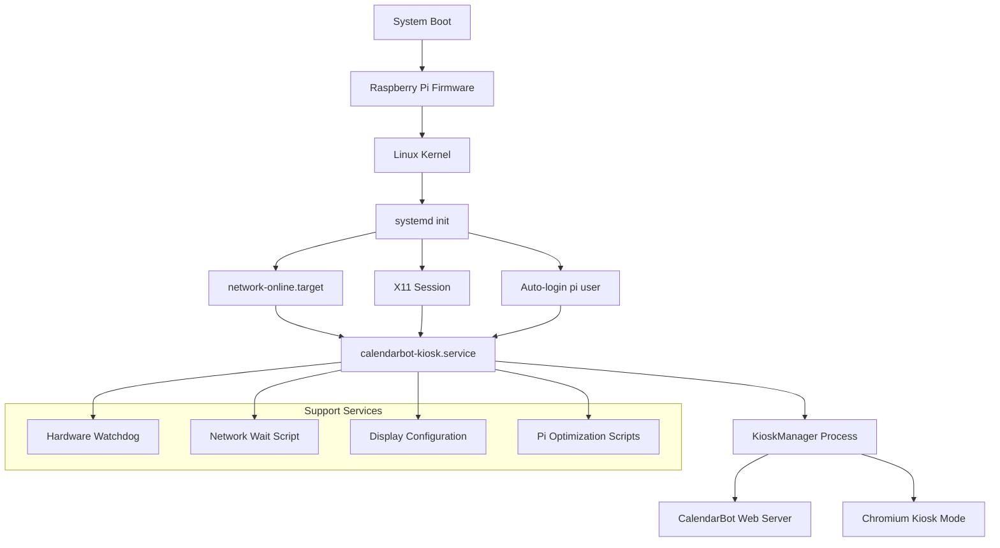

# System Integration Specification for CalendarBot Kiosk Mode

## Overview

This document provides comprehensive system integration specifications for deploying CalendarBot kiosk mode on Raspberry Pi Zero 2W, including systemd services, boot scripts, display configuration, and system optimization.

## System Integration Architecture



## Systemd Service Configuration

### Primary Kiosk Service

**File**: `/etc/systemd/system/calendarbot-kiosk.service`

```ini
[Unit]
Description=CalendarBot Kiosk Mode Display
Documentation=https://github.com/your-org/calendarbot
After=graphical-session.target network-online.target calendarbot-kiosk-setup.service
Wants=network-online.target
Requires=graphical-session.target calendarbot-kiosk-setup.service

# Conflict with other display managers to prevent conflicts
Conflicts=gdm.service lightdm.service sddm.service

[Service]
Type=simple
User=pi
Group=pi

# Environment setup
Environment=DISPLAY=:0
Environment=HOME=/home/pi
Environment=XDG_RUNTIME_DIR=/run/user/1000
Environment=XDG_SESSION_TYPE=x11
Environment=QT_QPA_PLATFORM=xcb
Environment=XAUTHORITY=/home/pi/.Xauthority

# Working directory
WorkingDirectory=/home/pi/calendarbot

# Startup delay to ensure system readiness
ExecStartPre=/bin/sleep 30
ExecStartPre=/usr/local/bin/calendarbot-kiosk-prestart.sh

# Main kiosk process
ExecStart=/home/pi/calendarbot/venv/bin/python -m calendarbot --kiosk
ExecStop=/bin/kill -TERM $MAINPID
ExecStopPost=/usr/local/bin/calendarbot-kiosk-cleanup.sh

# Process management
KillMode=mixed
KillSignal=SIGTERM
TimeoutStartSec=120
TimeoutStopSec=30

# Restart configuration for reliability
Restart=always
RestartSec=15
StartLimitInterval=300
StartLimitBurst=5

# Resource limits for Pi Zero 2W (512MB RAM)
MemoryLimit=400M
CPUQuota=80%
IOSchedulingClass=2
IOSchedulingPriority=4

# Security hardening
NoNewPrivileges=true
PrivateTmp=true
ProtectSystem=strict
ProtectHome=read-only
ReadWritePaths=/home/pi/.config/calendarbot /tmp /var/log/calendarbot

# Additional security
ProtectKernelTunables=true
ProtectKernelModules=true
ProtectControlGroups=true
RestrictSUIDSGID=true
RestrictRealtime=true

[Install]
WantedBy=graphical.target
```

### Kiosk Setup Service

**File**: `/etc/systemd/system/calendarbot-kiosk-setup.service`

```ini
[Unit]
Description=CalendarBot Kiosk System Setup
Documentation=https://github.com/your-org/calendarbot
DefaultDependencies=false
After=local-fs.target
Before=basic.target

[Service]
Type=oneshot
RemainAfterExit=true
ExecStart=/usr/local/bin/calendarbot-kiosk-system-setup.sh
User=root

# No restart needed - this is a one-time setup
Restart=no

# Timeout for system setup
TimeoutStartSec=60

[Install]
WantedBy=basic.target
```

### Network Wait Service

**File**: `/etc/systemd/system/calendarbot-network-wait.service`

```ini
[Unit]
Description=Wait for network connectivity before starting kiosk
After=network-online.target
Wants=network-online.target

[Service]
Type=oneshot
RemainAfterExit=true
ExecStart=/usr/local/bin/calendarbot-wait-for-network.sh
TimeoutStartSec=180
User=pi

[Install]
WantedBy=network-online.target
```

## Boot Scripts

### Pre-Start Script

**File**: `/usr/local/bin/calendarbot-kiosk-prestart.sh`

```bash
#!/bin/bash
# CalendarBot Kiosk Pre-Start Script
# Ensures system is ready for kiosk operation

set -euo pipefail

# Logging
LOG_FILE="/var/log/calendarbot/kiosk-prestart.log"
mkdir -p "$(dirname "$LOG_FILE")"

log() {
    echo "[$(date '+%Y-%m-%d %H:%M:%S')] $*" | tee -a "$LOG_FILE"
}

log "Starting CalendarBot kiosk pre-start checks"

# 1. Verify X11 display is available
if ! xdpyinfo -display :0 >/dev/null 2>&1; then
    log "ERROR: X11 display :0 not available"
    exit 1
fi
log "X11 display :0 verified"

# 2. Check available memory
AVAILABLE_MEM=$(free -m | awk '/^Mem:/{print $7}')
REQUIRED_MEM=300

if [ "$AVAILABLE_MEM" -lt "$REQUIRED_MEM" ]; then
    log "WARNING: Low memory available: ${AVAILABLE_MEM}MB < ${REQUIRED_MEM}MB"
    # Attempt to free memory
    sync
    echo 3 > /proc/sys/vm/drop_caches 2>/dev/null || true
    log "Memory cleanup attempted"
fi

# 3. Verify network connectivity
if ! /usr/local/bin/calendarbot-wait-for-network.sh --quick; then
    log "WARNING: Network connectivity check failed"
fi

# 4. Check calendar configuration
CALENDAR_CONFIG="/home/pi/.config/calendarbot/config.yaml"
if [ ! -f "$CALENDAR_CONFIG" ]; then
    log "ERROR: Calendar configuration not found at $CALENDAR_CONFIG"
    exit 1
fi

# 5. Verify browser is available
if ! command -v chromium-browser >/dev/null 2>&1; then
    log "ERROR: Chromium browser not installed"
    exit 1
fi

# 6. Setup display for kiosk mode
log "Configuring display for kiosk mode"

# Disable screen blanking
xset -display :0 s off 2>/dev/null || true
xset -display :0 -dpms 2>/dev/null || true
xset -display :0 s noblank 2>/dev/null || true

# Hide cursor
unclutter -display :0 -idle 0.1 -root &

# Set display orientation for 480x800 portrait
xrandr --output HDMI-1 --rotate left 2>/dev/null || true

log "Pre-start checks completed successfully"
```

### System Setup Script

**File**: `/usr/local/bin/calendarbot-kiosk-system-setup.sh`

```bash
#!/bin/bash
# CalendarBot Kiosk System Setup Script
# One-time system configuration for optimal kiosk operation

set -euo pipefail

LOG_FILE="/var/log/calendarbot/system-setup.log"
mkdir -p "$(dirname "$LOG_FILE")"

log() {
    echo "[$(date '+%Y-%m-%d %H:%M:%S')] $*" | tee -a "$LOG_FILE"
}

log "Starting CalendarBot kiosk system setup"

# 1. Configure GPU memory split for Pi Zero 2W
log "Configuring GPU memory split"
if ! grep -q "gpu_mem=64" /boot/config.txt; then
    echo "gpu_mem=64" >> /boot/config.txt
    log "GPU memory split set to 64MB"
fi

# 2. Configure swap for memory management
log "Configuring swap"
SWAP_SIZE=512
SWAP_FILE="/swapfile"

if [ ! -f "$SWAP_FILE" ]; then
    fallocate -l ${SWAP_SIZE}M "$SWAP_FILE"
    chmod 600 "$SWAP_FILE"
    mkswap "$SWAP_FILE"
    echo "$SWAP_FILE none swap sw 0 0" >> /etc/fstab
    log "Swap file created: ${SWAP_SIZE}MB"
fi

# Enable swap
swapon "$SWAP_FILE" 2>/dev/null || true

# 3. Configure tmpfs for logs to reduce SD card wear
log "Configuring tmpfs for logs"
if ! grep -q "/var/log/calendarbot" /etc/fstab; then
    echo "tmpfs /var/log/calendarbot tmpfs defaults,size=64M,uid=1000,gid=1000 0 0" >> /etc/fstab
    log "tmpfs configured for CalendarBot logs"
fi

# 4. Set CPU governor for consistent performance
log "Setting CPU governor to performance"
echo "performance" > /sys/devices/system/cpu/cpu0/cpufreq/scaling_governor 2>/dev/null || true

# 5. Configure network optimizations
log "Applying network optimizations"
cat > /etc/sysctl.d/99-calendarbot-kiosk.conf << EOF
# CalendarBot Kiosk Network Optimizations
net.core.rmem_default = 65536
net.core.rmem_max = 131072
net.core.wmem_default = 65536
net.core.wmem_max = 131072
net.ipv4.tcp_rmem = 4096 65536 131072
net.ipv4.tcp_wmem = 4096 65536 131072
EOF

# 6. Configure hardware watchdog
log "Configuring hardware watchdog"
if [ -c /dev/watchdog ]; then
    modprobe bcm2835_wdt 2>/dev/null || true
    
    cat > /etc/watchdog.conf << EOF
# CalendarBot Kiosk Watchdog Configuration
watchdog-device = /dev/watchdog
watchdog-timeout = 60
interval = 10
logtick = 1

# Monitor system resources
max-load-1 = 8
max-load-5 = 6
max-load-15 = 4
min-memory = 32768

# Monitor kiosk process
pidfile = /home/pi/.calendarbot/daemon.pid
EOF

    systemctl enable watchdog
    log "Hardware watchdog configured"
fi

# 7. Disable unnecessary services to save memory
log "Disabling unnecessary services"
SERVICES_TO_DISABLE=(
    "bluetooth.service"
    "hciuart.service"
    "triggerhappy.service"
    "avahi-daemon.service"
    "cups.service"
    "cups-browsed.service"
)

for service in "${SERVICES_TO_DISABLE[@]}"; do
    if systemctl is-enabled "$service" >/dev/null 2>&1; then
        systemctl disable "$service"
        log "Disabled service: $service"
    fi
done

# 8. Configure auto-login for pi user
log "Configuring auto-login"
systemctl set-default graphical.target

# Configure auto-login through systemd
mkdir -p /etc/systemd/system/getty@tty1.service.d
cat > /etc/systemd/system/getty@tty1.service.d/autologin.conf << EOF
[Service]
ExecStart=
ExecStart=-/sbin/agetty --autologin pi --noclear %I \$TERM
EOF

log "System setup completed successfully"
```

### Network Wait Script

**File**: `/usr/local/bin/calendarbot-wait-for-network.sh`

```bash
#!/bin/bash
# Wait for network connectivity with configurable timeout

set -euo pipefail

# Default configuration
TIMEOUT=120
QUICK_MODE=false
TEST_HOSTS=("8.8.8.8" "1.1.1.1" "google.com")

# Parse arguments
while [[ $# -gt 0 ]]; do
    case $1 in
        --timeout)
            TIMEOUT="$2"
            shift 2
            ;;
        --quick)
            QUICK_MODE=true
            TIMEOUT=10
            shift
            ;;
        *)
            echo "Usage: $0 [--timeout SECONDS] [--quick]"
            exit 1
            ;;
    esac
done

log() {
    echo "[$(date '+%Y-%m-%d %H:%M:%S')] $*"
}

log "Waiting for network connectivity (timeout: ${TIMEOUT}s)"

# Wait for network interface to be up
for ((i=0; i<TIMEOUT; i++)); do
    if ip route | grep -q default; then
        log "Default route available"
        break
    fi
    
    if [ $i -eq $((TIMEOUT-1)) ]; then
        log "ERROR: No default route after ${TIMEOUT}s"
        exit 1
    fi
    
    sleep 1
done

# Test actual connectivity
for ((i=0; i<TIMEOUT; i++)); do
    for host in "${TEST_HOSTS[@]}"; do
        if ping -c 1 -W 2 "$host" >/dev/null 2>&1; then
            log "Network connectivity verified (reached $host)"
            exit 0
        fi
    done
    
    if [ $QUICK_MODE ] && [ $i -ge 5 ]; then
        log "Quick mode: giving up after 5 attempts"
        exit 1
    fi
    
    if [ $i -eq $((TIMEOUT-1)) ]; then
        log "ERROR: No network connectivity after ${TIMEOUT}s"
        exit 1
    fi
    
    sleep 1
done
```

### Cleanup Script

**File**: `/usr/local/bin/calendarbot-kiosk-cleanup.sh`

```bash
#!/bin/bash
# CalendarBot Kiosk Cleanup Script
# Cleanup tasks when kiosk service stops

set -euo pipefail

LOG_FILE="/var/log/calendarbot/kiosk-cleanup.log"
mkdir -p "$(dirname "$LOG_FILE")"

log() {
    echo "[$(date '+%Y-%m-%d %H:%M:%S')] $*" | tee -a "$LOG_FILE"
}

log "Starting CalendarBot kiosk cleanup"

# 1. Kill any remaining Chromium processes
pkill -f chromium-browser 2>/dev/null || true
pkill -f chrome 2>/dev/null || true
log "Browser processes terminated"

# 2. Kill cursor hiding utility
pkill -f unclutter 2>/dev/null || true

# 3. Clean up temporary files
rm -rf /tmp/calendarbot-kiosk-* 2>/dev/null || true
rm -rf /home/pi/.cache/chromium/Default/GPUCache/* 2>/dev/null || true

# 4. Reset display settings
xset -display :0 s default 2>/dev/null || true
xset -display :0 +dpms 2>/dev/null || true

# 5. Sync filesystem to ensure writes are flushed
sync

log "Cleanup completed"
```

## X11 and Display Configuration

### X11 Session Setup

**File**: `/home/pi/.xsession`

```bash
#!/bin/bash
# CalendarBot Kiosk X11 Session

# Set up environment
export DISPLAY=:0
export XDG_SESSION_TYPE=x11

# Configure X11 for kiosk mode
xset s off         # Disable screensaver
xset -dpms         # Disable DPMS power management
xset s noblank     # Prevent screen blanking

# Set 480x800 portrait orientation
xrandr --output HDMI-1 --rotate left

# Hide cursor after 0.1 seconds of inactivity
unclutter -idle 0.1 -root &

# Configure touch input if available
xinput set-prop "touchscreen" "Coordinate Transformation Matrix" 0 1 0 -1 0 1 0 0 1 2>/dev/null || true

# Start window manager (lightweight)
openbox-session &

# Keep X11 session alive
while true; do
    sleep 3600
done
```

### Boot Configuration

**File**: `/boot/config.txt` (additions)

```ini
# CalendarBot Kiosk Display Configuration

# GPU memory split for 512MB Pi Zero 2W
gpu_mem=64

# HDMI configuration for 480x800 display
hdmi_force_hotplug=1
hdmi_group=2
hdmi_mode=87
hdmi_cvt=480 800 60 6 0 0 0

# Disable unnecessary hardware to save power/memory
dtparam=audio=off
dtoverlay=disable-bt

# Hardware watchdog
dtparam=watchdog=on

# Performance settings
arm_freq=1000
core_freq=500
over_voltage=2
force_turbo=1
```

## Auto-Login Configuration

### LightDM Configuration

**File**: `/etc/lightdm/lightdm.conf`

```ini
[Seat:*]
autologin-user=pi
autologin-user-timeout=0
user-session=calendarbot-kiosk
autologin-session=calendarbot-kiosk
greeter-session=lightdm-greeter
```

### Kiosk Session Definition

**File**: `/usr/share/xsessions/calendarbot-kiosk.desktop`

```ini
[Desktop Entry]
Name=CalendarBot Kiosk
Comment=CalendarBot Kiosk Mode Display
Exec=/home/pi/.xsession
Type=Application
DesktopNames=Kiosk
```

## Installation Script

**File**: `/usr/local/bin/install-calendarbot-kiosk.sh`

```bash
#!/bin/bash
# CalendarBot Kiosk Installation Script

set -euo pipefail

if [ "$EUID" -ne 0 ]; then
    echo "Please run as root (use sudo)"
    exit 1
fi

echo "Installing CalendarBot Kiosk Mode..."

# 1. Install required packages
apt-get update
apt-get install -y \
    chromium-browser \
    unclutter \
    xinput \
    xserver-xorg \
    openbox \
    lightdm \
    watchdog \
    python3-venv \
    python3-pip

# 2. Copy systemd service files
cp /home/pi/calendarbot/scripts/calendarbot-kiosk.service /etc/systemd/system/
cp /home/pi/calendarbot/scripts/calendarbot-kiosk-setup.service /etc/systemd/system/
cp /home/pi/calendarbot/scripts/calendarbot-network-wait.service /etc/systemd/system/

# 3. Copy scripts
cp /home/pi/calendarbot/scripts/calendarbot-kiosk-prestart.sh /usr/local/bin/
cp /home/pi/calendarbot/scripts/calendarbot-kiosk-system-setup.sh /usr/local/bin/
cp /home/pi/calendarbot/scripts/calendarbot-wait-for-network.sh /usr/local/bin/
cp /home/pi/calendarbot/scripts/calendarbot-kiosk-cleanup.sh /usr/local/bin/

# 4. Make scripts executable
chmod +x /usr/local/bin/calendarbot-*

# 5. Create log directory
mkdir -p /var/log/calendarbot
chown pi:pi /var/log/calendarbot

# 6. Set up X11 session
cp /home/pi/calendarbot/scripts/calendarbot-kiosk.desktop /usr/share/xsessions/
cp /home/pi/calendarbot/scripts/.xsession /home/pi/
chown pi:pi /home/pi/.xsession
chmod +x /home/pi/.xsession

# 7. Configure auto-login
cat > /etc/lightdm/lightdm.conf << EOF
[Seat:*]
autologin-user=pi
autologin-user-timeout=0
user-session=calendarbot-kiosk
autologin-session=calendarbot-kiosk
greeter-session=lightdm-greeter
EOF

# 8. Enable services
systemctl daemon-reload
systemctl enable calendarbot-kiosk-setup.service
systemctl enable calendarbot-network-wait.service
systemctl enable calendarbot-kiosk.service
systemctl enable lightdm.service
systemctl set-default graphical.target

echo "CalendarBot Kiosk installation completed!"
echo "Reboot the system to start kiosk mode: sudo reboot"
```

## Service Management Commands

### Enable Kiosk Mode

```bash
# Install and enable all kiosk services
sudo /usr/local/bin/install-calendarbot-kiosk.sh

# Enable services manually
sudo systemctl enable calendarbot-kiosk-setup.service
sudo systemctl enable calendarbot-network-wait.service
sudo systemctl enable calendarbot-kiosk.service

# Start services
sudo systemctl start calendarbot-kiosk.service
```

### Monitor Kiosk Status

```bash
# Check service status
sudo systemctl status calendarbot-kiosk.service

# View logs
sudo journalctl -u calendarbot-kiosk.service -f

# Check system logs
tail -f /var/log/calendarbot/kiosk-prestart.log
tail -f /var/log/calendarbot/system-setup.log
```

### Disable Kiosk Mode

```bash
# Stop and disable kiosk service
sudo systemctl stop calendarbot-kiosk.service
sudo systemctl disable calendarbot-kiosk.service

# Restore normal desktop mode
sudo systemctl set-default graphical.target
sudo systemctl enable gdm.service  # or lightdm with normal config
```

## Boot Sequence Timing

```mermaid
gantt
    title Kiosk Boot Sequence
    dateFormat X
    axisFormat %s
    
    section Hardware
    Pi Boot               :0, 10
    Kernel Init           :10, 20
    
    section System Services
    Network Setup         :20, 40
    X11 Session           :25, 50
    Auto-login            :45, 55
    
    section Kiosk Services
    System Setup          :30, 40
    Network Wait          :40, 80
    Pre-start Checks      :80, 110
    Kiosk Service Start   :110, 140
    
    section Application
    CalendarBot Init      :140, 160
    Browser Launch        :160, 190
    Kiosk Ready          :190, 200
```



## Troubleshooting

### Common Issues

1. **Display not showing**: Check HDMI connection and `/boot/config.txt`
2. **Service fails to start**: Check logs with `journalctl -u calendarbot-kiosk.service`
3. **Network timeout**: Adjust timeout in network wait script
4. **Memory issues**: Verify swap is enabled and configured
5. **Browser crashes**: Check Chromium memory limits and flags

### Debug Commands

```bash
# Check system resources
free -h
df -h
top

# Test display
DISPLAY=:0 xdpyinfo

# Test browser manually
DISPLAY=:0 chromium-browser --kiosk http://localhost:8080

# Check network
ping -c 3 8.8.8.8
```

This system integration specification provides a complete framework for deploying CalendarBot kiosk mode on Raspberry Pi Zero 2W with reliable boot-time initialization, proper resource management, and comprehensive monitoring.