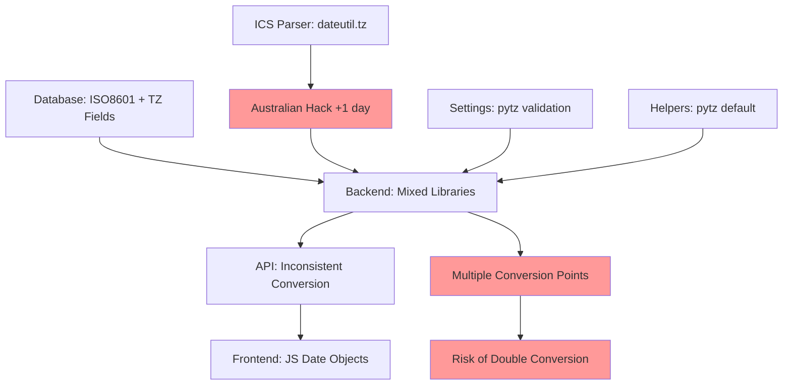
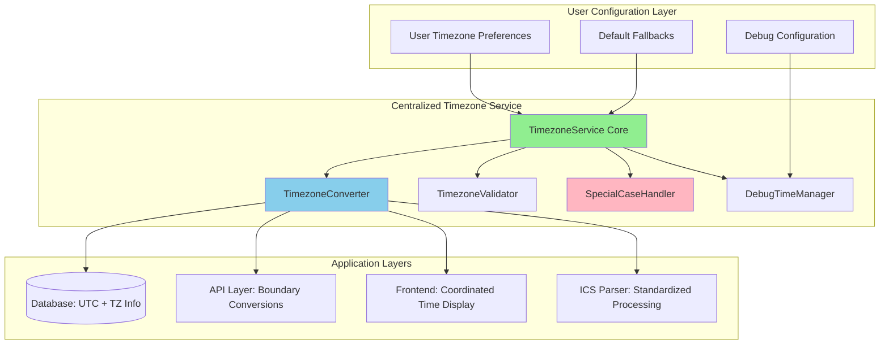
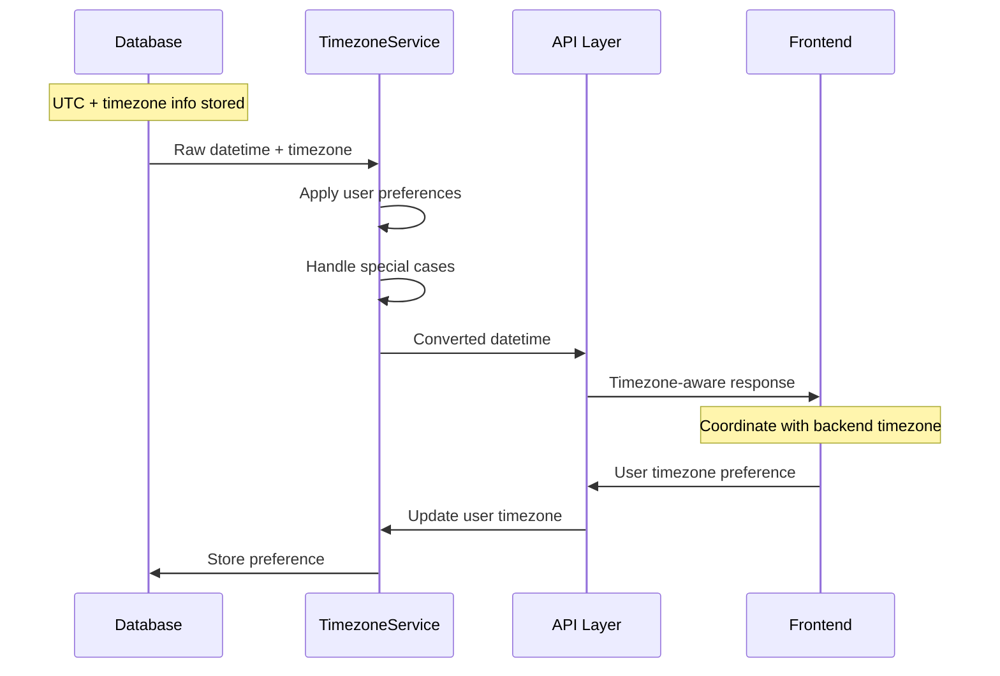

# CalendarBot Centralized Timezone Architecture

## Executive Summary

CalendarBot currently has scattered timezone handling across multiple components, leading to hardcoded defaults, inconsistent library usage, and special workarounds (like the Australian timezone hack). This document outlines a centralized timezone service architecture to solve these issues systematically.

## Current State Analysis

### Issues Identified

1. **Hardcoded Timezone Defaults**: `get_timezone_aware_now()` defaults to "America/Los_Angeles" in [`calendarbot/utils/helpers.py`](calendarbot/utils/helpers.py:207)

2. **Australian Timezone Hack**: ICS parser adds +1 day to Australian timezone events as workaround in [`calendarbot/ics/parser.py`](calendarbot/ics/parser.py:304-314)

3. **Library Inconsistency**: Multiple timezone libraries used:
   - `pytz` in helpers and settings validation
   - `dateutil.tz` in ICS parser
   - `datetime.timezone` in various components

4. **Scattered Conversions**: Timezone operations happen across:
   - Database layer (ISO 8601 strings + timezone fields)
   - Backend (timezone-aware Python datetime objects)
   - Frontend (JavaScript Date objects)
   - ICS parser (dateutil + special corrections)

5. **Limited Debug Support**: Debug time override only works with whats-next-view layout

6. **Double Conversion Risk**: Multiple conversion points create potential for incorrect time display

### Current Architecture Problems



## Proposed Centralized Architecture

### Core Design Principles

1. **Single Source of Truth**: All timezone operations through centralized service
2. **Library Standardization**: Consistent use of `zoneinfo` (Python 3.9+) with `pytz` fallback
3. **Clear Boundaries**: Designated conversion points between layers
4. **Extensible Special Cases**: Plugin-based system for timezone edge cases
5. **System-wide Debug**: Unified debug time override capability
6. **Configuration-Driven**: User preferences with intelligent fallbacks

### Architectural Overview



### Component Specifications

#### 1. TimezoneService Core

**Location**: `calendarbot/timezone/service.py`

**Responsibilities**:
- Central timezone configuration management
- Coordinate all timezone operations
- Provide unified API for timezone conversions
- Manage user preferences and fallbacks

**Interface**:
```python
class TimezoneService:
    def get_user_timezone(self, user_id: Optional[str] = None) -> str
    def get_system_timezone(self) -> str
    def convert_to_user_timezone(self, dt: datetime, user_timezone: Optional[str] = None) -> datetime
    def convert_to_utc(self, dt: datetime, source_timezone: Optional[str] = None) -> datetime
    def get_current_time(self, timezone: Optional[str] = None) -> datetime
    def validate_timezone(self, timezone_str: str) -> bool
```

#### 2. TimezoneConverter

**Location**: `calendarbot/timezone/converter.py`

**Responsibilities**:
- Handle all timezone conversions
- Standardize library usage
- Provide boundary conversion methods
- Ensure conversion consistency

**Interface**:
```python
class TimezoneConverter:
    def to_timezone(self, dt: datetime, target_tz: str) -> datetime
    def to_utc(self, dt: datetime, source_tz: Optional[str] = None) -> datetime
    def parse_iso_with_timezone(self, iso_string: str, default_tz: Optional[str] = None) -> datetime
    def format_for_database(self, dt: datetime) -> tuple[str, str]  # ISO string, timezone
    def format_for_api(self, dt: datetime, target_tz: str) -> dict
```

#### 3. SpecialCaseHandler

**Location**: `calendarbot/timezone/special_cases.py`

**Responsibilities**:
- Handle timezone edge cases through plugin system
- Replace hardcoded workarounds (Australian hack)
- Provide extensible correction mechanisms
- Log special case applications

**Interface**:
```python
class SpecialCaseHandler:
    def register_case(self, case_id: str, handler: Callable) -> None
    def apply_special_cases(self, dt: datetime, timezone_str: str, context: dict) -> datetime
    def get_registered_cases(self) -> list[str]
```

#### 4. DebugTimeManager

**Location**: `calendarbot/timezone/debug.py`

**Responsibilities**:
- System-wide debug time override
- Coordinate debug time across all components
- Provide testing utilities

**Interface**:
```python
class DebugTimeManager:
    def set_debug_time(self, dt: datetime, timezone: Optional[str] = None) -> None
    def clear_debug_time(self) -> None
    def get_current_time(self, timezone: Optional[str] = None) -> datetime
    def is_debug_active(self) -> bool
```

### Data Flow Architecture



### Configuration System

#### User Preferences

```yaml
timezone:
  user_preference: "America/New_York"
  fallback_strategy: "auto_detect"  # auto_detect, system, utc
  special_cases:
    enable_corrections: true
    australian_fix: true  # Temporary until source calendars fixed
  
debug:
  enable_time_override: false
  override_time: null
  override_timezone: null
```

#### System Defaults

```python
TIMEZONE_DEFAULTS = {
    "system_timezone": "UTC",
    "fallback_timezone": "UTC", 
    "auto_detect_browser": True,
    "special_case_logging": True,
    "conversion_boundary_logging": False
}
```

### Migration Strategy

#### Phase 1: Core Service Creation
1. Create `calendarbot/timezone/` module structure
2. Implement `TimezoneService` and `TimezoneConverter`
3. Add comprehensive unit tests

#### Phase 2: Component Integration
1. Replace `get_timezone_aware_now()` with `TimezoneService.get_current_time()`
2. Update ICS parser to use centralized converter
3. Migrate settings validation to use service

#### Phase 3: Special Cases & Debug
1. Implement `SpecialCaseHandler` with Australian timezone fix
2. Add system-wide `DebugTimeManager`
3. Update frontend to coordinate with backend timezone

#### Phase 4: Configuration & Cleanup
1. Add user timezone preference system
2. Remove hardcoded defaults throughout codebase
3. Implement boundary conversion validation

### API Contracts

#### Database Layer
```python
# Input: Raw datetime with timezone info
# Output: UTC datetime + timezone string
def store_event_time(dt: datetime, timezone: str) -> None
def retrieve_event_time() -> tuple[datetime, str]  # UTC datetime, timezone
```

#### API Layer
```python
# Input: UTC datetime + timezone
# Output: User-timezone-aware response
def get_events_api(user_timezone: Optional[str] = None) -> dict[str, Any]
def format_datetime_response(dt: datetime, target_tz: str) -> dict[str, str]
```

#### Frontend Coordination
```javascript
// Frontend receives timezone-aware data from backend
// Displays in user's preferred timezone
// Sends timezone preference to backend
class TimezoneCoordinator {
    getUserTimezone()
    setUserTimezone(timezone)
    formatTimeForDisplay(utcTime, userTimezone)
}
```

### Testing Strategy

#### Unit Tests
- Individual component functionality
- Timezone conversion accuracy
- Special case handler behavior
- Debug time override mechanics

#### Integration Tests  
- End-to-end timezone flow
- Database boundary conversions
- API response timezone consistency
- Frontend-backend coordination

#### Edge Case Tests
- Invalid timezone handling
- Daylight saving transitions
- Historical timezone changes
- Special case validations

### Performance Considerations

1. **Timezone Object Caching**: Cache frequently used timezone objects
2. **Conversion Optimization**: Avoid unnecessary conversions
3. **Lazy Loading**: Load timezone data on-demand
4. **Memory Management**: Efficient timezone object lifecycle

### Security Considerations

1. **Input Validation**: Strict timezone string validation
2. **Injection Prevention**: Sanitize timezone inputs
3. **Access Control**: User timezone preference protection
4. **Audit Logging**: Track timezone configuration changes

## Implementation Roadmap

### Immediate Actions
1. Create centralized timezone service module
2. Implement core conversion functionality
3. Replace hardcoded defaults systematically

### Short-term Goals
1. Eliminate Australian timezone hack through proper handling
2. Standardize timezone library usage
3. Add system-wide debug time capability

### Long-term Vision
1. User-configurable timezone preferences
2. Intelligent timezone auto-detection
3. Comprehensive timezone edge case handling
4. Advanced debugging and testing tools

## Success Metrics

1. **Elimination of Hardcoded Defaults**: Zero hardcoded timezone strings
2. **Library Standardization**: Single timezone library usage pattern
3. **Special Case Reduction**: Removal of workaround hacks
4. **Test Coverage**: >95% timezone functionality coverage
5. **Performance**: No degradation in timezone operations
6. **User Experience**: Consistent timezone behavior across application

---

This architecture provides a robust foundation for centralized timezone handling while maintaining backward compatibility and enabling future extensibility.