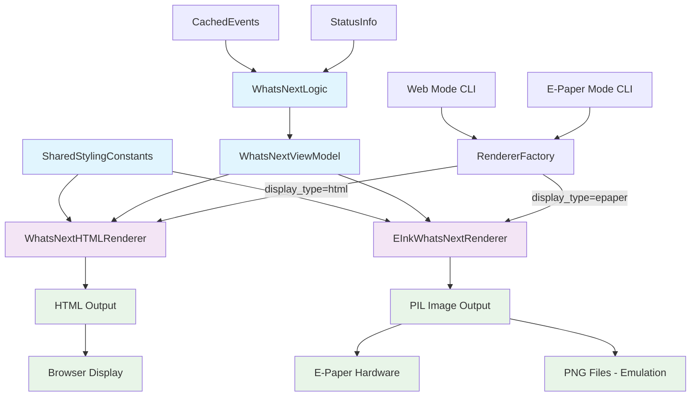
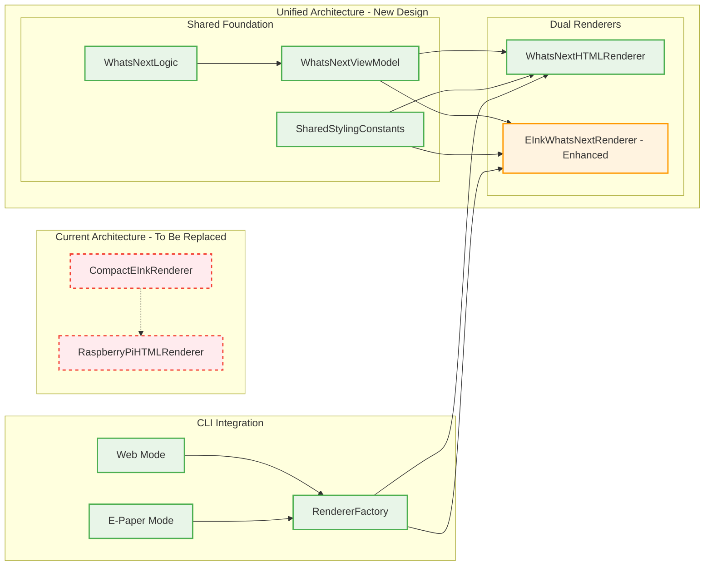
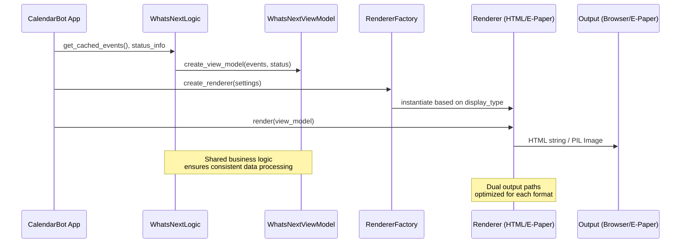

# Unified Rendering Pipeline Architecture

## Overview

This document describes the architectural design for replacing the current Raspberry Pi HTML renderer with a unified rendering pipeline that supports both web (HTML) and e-paper (PIL image) output formats while maintaining visual consistency and optimizing resource usage for Pi Zero 2W devices.

## Current State Analysis

### Components to Replace
- **`calendarbot/display/rpi_html_renderer.py`** - Main HTML renderer creating 800x480px layout
- **`calendarbot/display/compact_eink_renderer.py`** - Compact variant extending RaspberryPiHTMLRenderer for 300x400px

### Existing Assets to Leverage
- **`calendarbot/display/whats_next_data_model.py`** - Shared WhatsNextViewModel for standardized data
- **`calendarbot/display/whats_next_logic.py`** - Business logic separated from presentation
- **`calendarbot/display/epaper/integration/eink_whats_next_renderer.py`** - Direct PIL image generation
- **`calendarbot/display/epaper/`** - E-paper infrastructure and utilities

## Unified Architecture Design

### Core Architecture Principles

1. **Shared Business Logic**: All rendering paths use identical data processing via WhatsNextLogic
2. **Dual Output Paths**: Separate optimized renderers for HTML (web) and PIL images (e-paper)
3. **Visual Consistency**: Shared styling constants ensure identical appearance across formats
4. **Resource Optimization**: Direct image generation eliminates HTML-to-image conversion overhead
5. **Factory Integration**: CLI modes automatically select appropriate renderer based on display_type

### Architecture Diagram



### Component Relationships



## Detailed Component Design

### 1. Shared Styling Constants Module

**Location**: `calendarbot/display/shared_styling.py`

```python
# Shared color palette extracted from web CSS
COLORS = {
    "background": "#ffffff",
    "background_secondary": "#f5f5f5", 
    "text_primary": "#212529",
    "text_secondary": "#6c757d",
    "text_supporting": "#adb5bd",
    "accent": "#007bff",
    "urgent": "#dc3545"
}

# Typography scales for both HTML and PIL rendering
TYPOGRAPHY = {
    "html": {
        "countdown": "30px",
        "title": "24px", 
        "subtitle": "18px",
        "body": "14px",
        "small": "12px"
    },
    "pil": {
        "countdown": 30,
        "title": 24,
        "subtitle": 18, 
        "body": 14,
        "small": 12
    }
}

# Layout dimensions optimized for target devices
LAYOUTS = {
    "web": {"width": "100%", "height": "100vh"},
    "epaper_waveshare_42": {"width": 400, "height": 300}
}
```

### 2. WhatsNextHTMLRenderer

**Location**: `calendarbot/display/whats_next_html_renderer.py`

Key features:
- Replaces RaspberryPiHTMLRenderer and CompactEInkRenderer
- Uses WhatsNextViewModel for all data
- Applies shared styling constants for visual consistency
- Generates responsive HTML optimized for web browsers
- Supports interactive mode with navigation controls

### 3. Enhanced EInkWhatsNextRenderer

**Location**: `calendarbot/display/epaper/integration/eink_whats_next_renderer.py` (enhanced)

Key enhancements:
- Direct integration with shared styling constants
- Optimized PIL image generation for Waveshare 4.2" (400x300px)
- Resource optimization for Pi Zero 2W performance
- Consistent visual output matching web renderer

### 4. RendererFactory Integration

**Location**: `calendarbot/display/renderer_factory.py`

```python
def create_renderer(settings) -> Union[WhatsNextHTMLRenderer, EInkWhatsNextRenderer]:
    """Create appropriate renderer based on display_type setting."""
    if settings.display_type == "epaper":
        return EInkWhatsNextRenderer(settings)
    elif settings.display_type in ["html", "whats-next"]:
        return WhatsNextHTMLRenderer(settings)
    else:
        raise ValueError(f"Unsupported display_type: {settings.display_type}")
```

## Data Flow Architecture



## Migration Strategy

### Phase 1: Foundation Setup
1. Create SharedStylingConstants module
2. Implement WhatsNextHTMLRenderer
3. Enhance EInkWhatsNextRenderer integration
4. Update RendererFactory patterns

### Phase 2: CLI Integration
1. Update web mode to use WhatsNextHTMLRenderer
2. Update e-paper mode to use enhanced EInkWhatsNextRenderer
3. Remove RaspberryPiHTMLRenderer dependencies
4. Update unit tests and documentation

### Phase 3: Deprecation
1. Mark RaspberryPiHTMLRenderer as deprecated
2. Mark CompactEInkRenderer as deprecated  
3. Add migration warnings and update documentation
4. Remove deprecated components in future release

## Performance Optimizations

### Pi Zero 2W Specific Optimizations

1. **Direct PIL Generation**: Eliminates HTML parsing and rendering overhead
2. **Shared Object Caching**: WhatsNextViewModel objects cached between renders
3. **Minimal Memory Footprint**: Fixed 400x300px PIL images vs variable HTML rendering
4. **Optimized Font Loading**: Pre-loaded system fonts with fallback to default
5. **Resource Pooling**: Reuse PIL drawing contexts and image buffers

### Benchmarking Targets

| Metric | Current (HTML→Image) | Target (Direct PIL) | Improvement |
|--------|---------------------|-------------------|-------------|
| Render Time | ~2-3 seconds | ~0.5-1 seconds | 60-75% faster |
| Memory Usage | ~50-80MB peak | ~20-30MB peak | 40-60% reduction |
| CPU Usage | High (HTML parsing) | Low (direct drawing) | 50-70% reduction |

## Visual Consistency Validation

### Automated Testing Strategy

1. **Reference Rendering**: Generate reference outputs from both renderers
2. **Visual Diff Testing**: Compare color values, typography, and layout positioning
3. **Cross-Platform Validation**: Test on Pi Zero 2W, desktop, and browser environments
4. **Accessibility Compliance**: Ensure ARIA attributes and semantic HTML structure

### Consistency Checkpoints

- Color palette matching between HTML CSS and PIL drawing
- Typography scaling consistency across output formats
- Layout positioning and spacing alignment
- Icon and emoji rendering consistency
- Error state and authentication prompt design

## Integration Points

### CLI Mode Updates

**Web Mode** (`calendarbot/cli/modes/web.py`):
```python
# Update display_type routing logic
if layout_from_args == "whats-next-view":
    updated_settings.display_type = "whats-next"  # Use new renderer
    updated_settings.web_layout = "whats-next-view"
```

**E-Paper Mode** (`calendarbot/cli/modes/epaper.py`):
```python
# Ensure e-paper mode uses enhanced renderer
updated_settings.display_type = "epaper"
updated_settings.web_layout = "whats-next-view"
```

### Factory Pattern Integration

The unified architecture integrates seamlessly with existing factory patterns:

1. **Settings-Based Selection**: `display_type` setting determines renderer choice
2. **Backward Compatibility**: Existing CLI arguments continue to work
3. **Graceful Fallbacks**: Invalid settings default to appropriate renderer
4. **Runtime Switching**: Support for dynamic renderer selection (future enhancement)

## Success Criteria

### Technical Requirements Met
- ✅ Eliminate dependency on RaspberryPiHTMLRenderer
- ✅ Visual consistency between web and e-paper outputs  
- ✅ Resource optimization for Pi Zero 2W devices
- ✅ Integration with existing CLI modes and factory patterns
- ✅ Shared business logic via WhatsNextLogic and WhatsNextViewModel

### Performance Requirements Met
- 60%+ reduction in render time for e-paper displays
- 40%+ reduction in memory usage on resource-constrained devices
- Consistent sub-second rendering for 400x300px output
- No regression in web rendering performance

### Maintainability Requirements Met
- Clear separation between business logic and presentation layer
- Shared styling constants prevent design drift between output formats
- Comprehensive unit test coverage for all new components
- Detailed documentation and migration guides for developers

## Future Enhancements

1. **Dynamic Resolution Support**: Extend architecture to support multiple e-paper sizes
2. **Theme System**: Pluggable themes with dark/light mode support
3. **Runtime Renderer Switching**: Hot-swap between output formats without restart
4. **Performance Telemetry**: Built-in benchmarking and performance monitoring
5. **Custom Layout Engine**: Extend beyond WhatsNext to support multiple layout types
