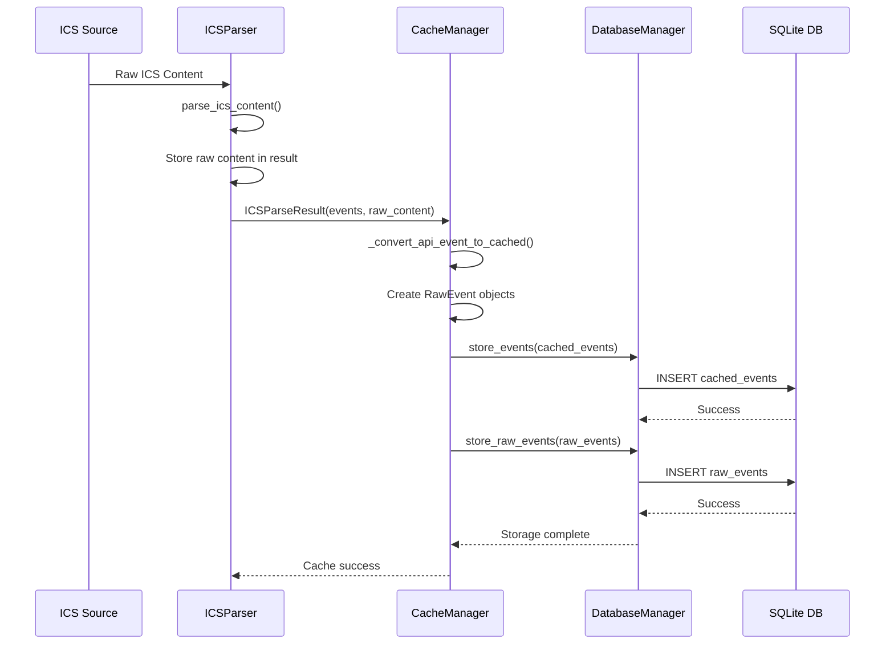

# Raw Events Table Design Specification

## Overview

This document specifies the design for adding a `raw_events` table to store complete raw ICS text data alongside the existing caching system. The design ensures atomic storage of both parsed events and raw ICS content with proper correlation and cleanup integration.

## Current Architecture Analysis

### Existing Components
- **DatabaseManager** (`calendarbot/cache/database.py`): Manages SQLite operations for `cached_events` table
- **CacheManager** (`calendarbot/cache/manager.py`): Coordinates between API and local storage
- **ICSParser** (`calendarbot/ics/parser.py`): Parses ICS content at `parse_ics_content()` line 41
- **CachedEvent Model** (`calendarbot/cache/models.py`): Pydantic model for parsed event data

### Current Data Flow
```
ICS Content → ICSParser.parse_ics_content() → CacheManager._convert_api_event_to_cached() → DatabaseManager.store_events() → SQLite
```

## 1. Database Schema Design

### 1.1 Raw Events Table Schema

```sql
CREATE TABLE IF NOT EXISTS raw_events (
    id TEXT PRIMARY KEY,                    -- Unique identifier for raw event record
    graph_id TEXT NOT NULL,                -- Foreign key to cached_events.graph_id
    source_url TEXT,                       -- Optional: ICS source URL for correlation
    raw_ics_content TEXT NOT NULL,         -- Complete raw ICS text for this event
    content_hash TEXT NOT NULL,            -- SHA-256 hash for deduplication
    content_size_bytes INTEGER NOT NULL,   -- Size of raw content for monitoring
    cached_at TEXT NOT NULL,               -- When this was stored (ISO string)
    created_at DATETIME DEFAULT CURRENT_TIMESTAMP,
    updated_at DATETIME DEFAULT CURRENT_TIMESTAMP,
    
    -- Foreign key constraint to ensure referential integrity
    FOREIGN KEY (graph_id) REFERENCES cached_events(graph_id) ON DELETE CASCADE
);
```

### 1.2 Indexes for Performance

```sql
-- Index for efficient lookups by graph_id
CREATE INDEX IF NOT EXISTS idx_raw_events_graph_id 
ON raw_events(graph_id);

-- Index for content deduplication
CREATE INDEX IF NOT EXISTS idx_raw_events_content_hash 
ON raw_events(content_hash);

-- Index for cleanup operations by cached_at timestamp
CREATE INDEX IF NOT EXISTS idx_raw_events_cached_at 
ON raw_events(cached_at);

-- Composite index for size monitoring and cleanup
CREATE INDEX IF NOT EXISTS idx_raw_events_size_cached 
ON raw_events(content_size_bytes, cached_at);
```

### 1.3 Database Triggers

```sql
-- Trigger to update updated_at timestamp
CREATE TRIGGER IF NOT EXISTS update_raw_events_timestamp
AFTER UPDATE ON raw_events
BEGIN
    UPDATE raw_events SET updated_at = CURRENT_TIMESTAMP
    WHERE id = NEW.id;
END;
```

## 2. Data Model Design

### 2.1 RawEvent Model

```python
class RawEvent(BaseModel):
    """Raw ICS event model for storage alongside cached events."""
    
    # Primary identification
    id: str                                 # Unique identifier
    graph_id: str                          # Links to CachedEvent.graph_id
    
    # Source information
    source_url: Optional[str] = None       # ICS feed URL if available
    
    # Raw content
    raw_ics_content: str                   # Complete raw ICS text
    content_hash: str                      # SHA-256 for deduplication
    content_size_bytes: int                # Content size for monitoring
    
    # Timestamps
    cached_at: str                         # When stored (ISO string)
    
    model_config = {"populate_by_name": True}
    
    @property
    def cached_dt(self) -> datetime:
        """Get cached datetime as datetime object."""
        return datetime.fromisoformat(self.cached_at.replace("Z", "+00:00"))
    
    @classmethod
    def create_from_ics(cls, graph_id: str, ics_content: str, 
                       source_url: Optional[str] = None) -> "RawEvent":
        """Create RawEvent instance from ICS content."""
        import hashlib
        
        content_hash = hashlib.sha256(ics_content.encode('utf-8')).hexdigest()
        
        return cls(
            id=f"raw_{graph_id}",
            graph_id=graph_id,
            source_url=source_url,
            raw_ics_content=ics_content,
            content_hash=content_hash,
            content_size_bytes=len(ics_content.encode('utf-8')),
            cached_at=datetime.now().isoformat()
        )
```

## 3. API Integration Design

### 3.1 ICSParser Modifications

#### Current Method Signature
```python
def parse_ics_content(self, ics_content: str) -> ICSParseResult:
```

#### Enhanced Return Type
```python
@dataclass
class ICSParseResult:
    success: bool
    events: list[CalendarEvent] = field(default_factory=list)
    raw_ics_content: Optional[str] = None  # NEW: Raw ICS content
    calendar_name: Optional[str] = None
    calendar_description: Optional[str] = None
    timezone: Optional[str] = None
    total_components: int = 0
    event_count: int = 0
    recurring_event_count: int = 0
    warnings: list[str] = field(default_factory=list)
    error_message: Optional[str] = None
    ics_version: Optional[str] = None
    prodid: Optional[str] = None
```

#### Modified Implementation
```python
def parse_ics_content(self, ics_content: str) -> ICSParseResult:
    """Parse ICS content into structured calendar events.
    
    Args:
        ics_content: Raw ICS file content
        
    Returns:
        Parse result with events, metadata, and raw content
    """
    try:
        logger.debug("Starting ICS content parsing")
        
        # Store raw content for later storage
        raw_content = ics_content
        
        # ... existing parsing logic ...
        
        return ICSParseResult(
            success=True,
            events=filtered_events,
            raw_ics_content=raw_content,  # NEW: Include raw content
            calendar_name=calendar_name,
            # ... other existing fields ...
        )
    except Exception as e:
        logger.exception("Failed to parse ICS content")
        return ICSParseResult(
            success=False, 
            error_message=str(e),
            raw_ics_content=ics_content  # Include even on failure for debugging
        )
```

### 3.2 CacheManager Integration

#### Enhanced cache_events Method
```python
async def cache_events(self, api_events: list[CalendarEvent], 
                      raw_ics_content: Optional[str] = None,
                      source_url: Optional[str] = None) -> bool:
    """Cache events with optional raw ICS content storage."""
    try:
        # ... existing event conversion logic ...
        
        # Store parsed events
        with cache_monitor("database_store", "cache_manager"):
            success = await self.db.store_events(cached_events)
        
        # Store raw events if ICS content provided
        if success and raw_ics_content:
            raw_events = []
            for cached_event in cached_events:
                raw_event = RawEvent.create_from_ics(
                    graph_id=cached_event.graph_id,
                    ics_content=raw_ics_content,
                    source_url=source_url
                )
                raw_events.append(raw_event)
            
            raw_success = await self.db.store_raw_events(raw_events)
            if not raw_success:
                logger.warning("Failed to store raw events, but parsed events succeeded")
                # Continue with success=True since parsed events were stored
        
        return success
    except Exception as e:
        logger.exception("Failed to cache events")
        await self._update_fetch_metadata(success=False, error=str(e))
        return False
```

## 4. DatabaseManager Extensions

### 4.1 Raw Events Storage Methods

```python
async def store_raw_events(self, raw_events: list[RawEvent]) -> bool:
    """Store raw ICS events in database.
    
    Args:
        raw_events: List of raw events to store
        
    Returns:
        True if storage was successful, False otherwise
    """
    try:
        if not raw_events:
            logger.debug("No raw events to store")
            return True
            
        async with aiosqlite.connect(str(self.database_path)) as db:
            await db.executemany(
                """
                INSERT OR REPLACE INTO raw_events (
                    id, graph_id, source_url, raw_ics_content,
                    content_hash, content_size_bytes, cached_at
                ) VALUES (?, ?, ?, ?, ?, ?, ?)
                """,
                [
                    (
                        event.id,
                        event.graph_id,
                        event.source_url,
                        event.raw_ics_content,
                        event.content_hash,
                        event.content_size_bytes,
                        event.cached_at,
                    )
                    for event in raw_events
                ]
            )
            
            await db.commit()
            logger.debug(f"Stored {len(raw_events)} raw events")
            return True
            
    except Exception:
        logger.exception("Failed to store raw events")
        return False

async def get_raw_events_by_graph_ids(self, graph_ids: list[str]) -> list[RawEvent]:
    """Get raw events by graph IDs."""
    try:
        placeholders = ",".join("?" * len(graph_ids))
        
        async with aiosqlite.connect(str(self.database_path)) as db:
            db.row_factory = aiosqlite.Row
            
            cursor = await db.execute(
                f"""
                SELECT * FROM raw_events 
                WHERE graph_id IN ({placeholders})
                ORDER BY cached_at DESC
                """,
                graph_ids
            )
            
            rows = await cursor.fetchall()
            return [RawEvent(**dict(row)) for row in rows]
            
    except Exception:
        logger.exception("Failed to get raw events")
        return []

async def cleanup_old_raw_events(self, days_old: int = 7) -> int:
    """Remove raw events older than specified days."""
    try:
        cutoff_date = datetime.now() - timedelta(days=days_old)
        cutoff_str = cutoff_date.isoformat()
        
        async with aiosqlite.connect(str(self.database_path)) as db:
            cursor = await db.execute(
                """
                DELETE FROM raw_events 
                WHERE cached_at < ?
                """,
                (cutoff_str,)
            )
            
            deleted_count = cursor.rowcount
            await db.commit()
            
            logger.debug(f"Cleaned up {deleted_count} old raw events")
            return deleted_count
            
    except Exception:
        logger.exception("Failed to cleanup old raw events")
        return 0

async def clear_all_raw_events(self) -> int:
    """Clear all raw events from database."""
    try:
        async with aiosqlite.connect(str(self.database_path)) as db:
            cursor = await db.execute("DELETE FROM raw_events")
            deleted_count = cursor.rowcount
            await db.commit()
            
            logger.debug(f"Cleared all {deleted_count} raw events")
            return deleted_count
            
    except Exception:
        logger.exception("Failed to clear all raw events")
        return 0
```

### 4.2 Enhanced Database Initialization

```python
async def initialize(self) -> bool:
    """Initialize database schema and settings."""
    try:
        async with aiosqlite.connect(str(self.database_path)) as db:
            # ... existing initialization ...
            
            # Create raw_events table
            await db.execute("""
                CREATE TABLE IF NOT EXISTS raw_events (
                    id TEXT PRIMARY KEY,
                    graph_id TEXT NOT NULL,
                    source_url TEXT,
                    raw_ics_content TEXT NOT NULL,
                    content_hash TEXT NOT NULL,
                    content_size_bytes INTEGER NOT NULL,
                    cached_at TEXT NOT NULL,
                    created_at DATETIME DEFAULT CURRENT_TIMESTAMP,
                    updated_at DATETIME DEFAULT CURRENT_TIMESTAMP,
                    FOREIGN KEY (graph_id) REFERENCES cached_events(graph_id) ON DELETE CASCADE
                )
            """)
            
            # Create indexes for raw_events
            await db.execute("""
                CREATE INDEX IF NOT EXISTS idx_raw_events_graph_id
                ON raw_events(graph_id)
            """)
            
            await db.execute("""
                CREATE INDEX IF NOT EXISTS idx_raw_events_content_hash
                ON raw_events(content_hash)
            """)
            
            await db.execute("""
                CREATE INDEX IF NOT EXISTS idx_raw_events_cached_at
                ON raw_events(cached_at)
            """)
            
            # Create trigger for updated_at
            await db.execute("""
                CREATE TRIGGER IF NOT EXISTS update_raw_events_timestamp
                AFTER UPDATE ON raw_events
                BEGIN
                    UPDATE raw_events SET updated_at = CURRENT_TIMESTAMP
                    WHERE id = NEW.id;
                END
            """)
            
            await db.commit()
            
        logger.info("Database schema initialized successfully")
        return True
        
    except Exception:
        logger.exception("Failed to initialize database")
        return False
```

## 5. Cleanup Integration

### 5.1 Enhanced CacheManager.cleanup()

```python
async def cleanup(self) -> bool:
    """Clean up cache resources and old events."""
    try:
        # Clean up old cached events
        cached_removed = await self.cleanup_old_events()
        
        # Clean up old raw events (same retention period)
        raw_removed = await self.db.cleanup_old_raw_events()
        
        logger.debug(
            f"Cache cleanup completed: removed {cached_removed} cached events, "
            f"{raw_removed} raw events"
        )
        return True
        
    except Exception:
        logger.exception("Failed to cleanup cache")
        return False

async def clear_cache(self) -> bool:
    """Clear all cached events and raw events."""
    try:
        # Clear cached events
        await self.cleanup_old_events(days_old=0)
        
        # Clear raw events
        await self.db.clear_all_raw_events()
        
        # Reset metadata
        await self.db.update_cache_metadata(
            last_update=None,
            last_successful_fetch=None,
            consecutive_failures=0,
            last_error=None,
            last_error_time=None,
        )
        
        logger.info("Cache cleared successfully (including raw events)")
        return True
        
    except Exception:
        logger.exception("Failed to clear cache")
        return False
```

## 6. Error Handling Strategies

### 6.1 Large ICS File Handling

```python
# Configuration constants
MAX_ICS_SIZE_BYTES = 50 * 1024 * 1024  # 50MB limit
MAX_ICS_SIZE_WARNING = 10 * 1024 * 1024  # 10MB warning threshold

class ICSContentTooLargeError(Exception):
    """Raised when ICS content exceeds size limits."""
    pass

def validate_ics_size(self, ics_content: str) -> None:
    """Validate ICS content size before processing."""
    size_bytes = len(ics_content.encode('utf-8'))
    
    if size_bytes > MAX_ICS_SIZE_BYTES:
        raise ICSContentTooLargeError(
            f"ICS content too large: {size_bytes} bytes exceeds {MAX_ICS_SIZE_BYTES} limit"
        )
    
    if size_bytes > MAX_ICS_SIZE_WARNING:
        logger.warning(
            f"Large ICS content detected: {size_bytes} bytes "
            f"(threshold: {MAX_ICS_SIZE_WARNING})"
        )
```

### 6.2 Storage Failure Handling

```python
async def store_events_with_raw(self, cached_events: list[CachedEvent], 
                               raw_events: list[RawEvent]) -> tuple[bool, bool]:
    """Store events with transactional semantics."""
    try:
        async with aiosqlite.connect(str(self.database_path)) as db:
            # Begin transaction
            await db.execute("BEGIN TRANSACTION")
            
            try:
                # Store cached events first
                cached_success = await self._store_cached_events_in_transaction(
                    db, cached_events
                )
                
                if not cached_success:
                    await db.execute("ROLLBACK")
                    return False, False
                
                # Store raw events
                raw_success = await self._store_raw_events_in_transaction(
                    db, raw_events
                )
                
                if not raw_success:
                    logger.warning("Raw events storage failed, rolling back transaction")
                    await db.execute("ROLLBACK")
                    return False, False
                
                # Commit transaction
                await db.execute("COMMIT")
                return True, True
                
            except Exception:
                await db.execute("ROLLBACK")
                raise
                
    except Exception:
        logger.exception("Failed to store events with raw content")
        return False, False
```

### 6.3 Partial Storage Scenarios

```python
async def cache_events_with_fallback(self, api_events: list[CalendarEvent], 
                                   raw_ics_content: Optional[str] = None) -> bool:
    """Cache events with fallback strategies for raw content failures."""
    try:
        # Always try to store parsed events first
        cached_events = [self._convert_api_event_to_cached(event) for event in api_events]
        cached_success = await self.db.store_events(cached_events)
        
        if not cached_success:
            await self._update_fetch_metadata(success=False, error="Failed to store cached events")
            return False
        
        # Attempt raw storage if content provided
        if raw_ics_content:
            try:
                raw_events = [
                    RawEvent.create_from_ics(event.graph_id, raw_ics_content)
                    for event in cached_events
                ]
                raw_success = await self.db.store_raw_events(raw_events)
                
                if not raw_success:
                    logger.warning(
                        "Raw events storage failed, but cached events succeeded. "
                        "System will continue with parsed events only."
                    )
                    
            except Exception as e:
                logger.exception(f"Raw events storage failed: {e}")
                # Continue with success=True since cached events were stored
        
        await self._update_fetch_metadata(success=True, error=None)
        return True
        
    except Exception as e:
        logger.exception("Failed to cache events")
        await self._update_fetch_metadata(success=False, error=str(e))
        return False
```

## 7. Performance Considerations

### 7.1 Storage Optimization

- **Deduplication**: Use content_hash to avoid storing duplicate raw ICS content
- **Compression**: Consider GZIP compression for large ICS files (implementation detail)
- **Batch Operations**: Store multiple raw events in single transaction
- **Index Strategy**: Optimized indexes for common query patterns

### 7.2 Memory Management

- **Streaming**: For very large ICS files, consider streaming approaches
- **Chunking**: Process large ICS content in chunks if needed
- **Memory Monitoring**: Existing memory_monitor integration tracks usage

### 7.3 Query Performance

```sql
-- Efficient query to get events with raw content
SELECT c.*, r.raw_ics_content 
FROM cached_events c
LEFT JOIN raw_events r ON c.graph_id = r.graph_id
WHERE c.start_datetime BETWEEN ? AND ?
AND c.is_cancelled = 0
ORDER BY c.start_datetime ASC;
```

## 8. Data Flow Sequence Diagram



## 9. Migration Strategy

### 9.1 Database Schema Migration

```python
async def migrate_to_v2(self) -> bool:
    """Migrate database to version 2 with raw_events table."""
    try:
        async with aiosqlite.connect(str(self.database_path)) as db:
            # Check current version
            cursor = await db.execute("PRAGMA user_version")
            version = (await cursor.fetchone())[0]
            
            if version >= 2:
                logger.info("Database already at version 2 or higher")
                return True
            
            # Create raw_events table and indexes
            await self._create_raw_events_schema(db)
            
            # Update version
            await db.execute("PRAGMA user_version = 2")
            await db.commit()
            
            logger.info("Database migrated to version 2")
            return True
            
    except Exception:
        logger.exception("Failed to migrate database")
        return False
```

## 10. Testing Considerations

### 10.1 Unit Tests Required

- **RawEvent Model**: Test creation, validation, hashing
- **DatabaseManager**: Test raw event CRUD operations
- **CacheManager**: Test integrated caching with raw content
- **ICSParser**: Test enhanced return structure
- **Error Handling**: Test large file limits, storage failures

### 10.2 Integration Tests Required

- **End-to-End Flow**: ICS parsing → caching → storage → retrieval
- **Cleanup Operations**: Verify raw events cleaned with cached events
- **Transaction Integrity**: Test rollback scenarios
- **Performance**: Test with large ICS files

## 11. Security Considerations

### 11.1 Content Validation

- **Size Limits**: Enforce maximum ICS file size
- **Content Sanitization**: Validate ICS content structure
- **Storage Security**: Raw content stored in local SQLite only

### 11.2 Resource Protection

- **Memory Limits**: Monitor memory usage during large file processing
- **Disk Space**: Monitor database growth with raw content
- **Rate Limiting**: Prevent abuse through existing mechanisms

## 12. Monitoring and Observability

### 12.1 Metrics to Track

- Raw events stored per operation
- Storage size growth rate
- Failed raw storage operations
- Average ICS content size
- Deduplication effectiveness

### 12.2 Logging Enhancements

```python
logger.info(f"Stored {len(raw_events)} raw events, total size: {total_size_mb:.2f}MB")
logger.warning(f"Large ICS file detected: {size_mb:.2f}MB for {len(events)} events")
logger.debug(f"Raw event deduplication: {dedupe_count} duplicates skipped")
```

## 13. Future Enhancements

### 13.1 Potential Improvements

- **Compression**: GZIP compression for raw content
- **Archival**: Move old raw events to separate archive table
- **Search**: Full-text search within raw ICS content
- **Export**: API to export raw ICS content for specific events

### 13.2 API Extensions

```python
async def get_raw_ics_for_event(self, graph_id: str) -> Optional[str]:
    """Get raw ICS content for specific event."""
    
async def export_raw_ics_for_date_range(self, start_date: datetime, 
                                       end_date: datetime) -> str:
    """Export raw ICS content for date range as single calendar."""
```

---

**Document Version**: 1.0  
**Last Updated**: 2025-08-13  
**Status**: Design Phase - Ready for Implementation