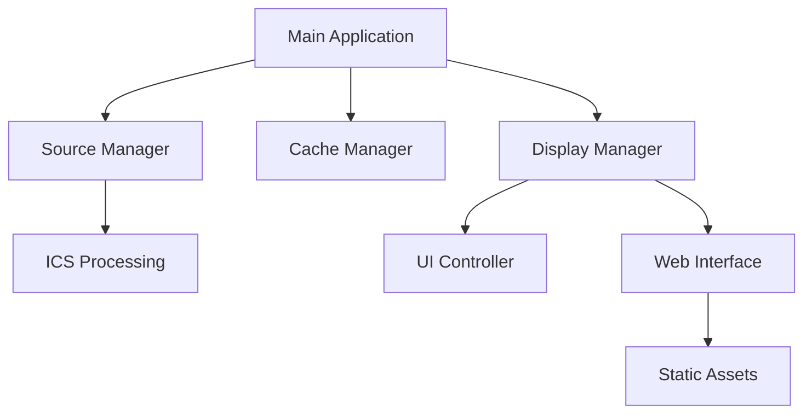

# CalendarBot Developer

This guide serves as a comprehensive reference for CalendarBot's architectural design, development practices, and extension mechanisms.

## Architecture Overview

### High-Level Component Diagram



### Module Organization

- **Source Management:** [`calendarbot/sources/`](calendarbot/sources/)
- **ICS Processing:** [`calendarbot/ics/`](calendarbot/ics/)
- **Cache Management:** [`calendarbot/cache/`](calendarbot/cache/)
- **Display Management:** [`calendarbot/display/`](calendarbot/display/)
- **User Interface:** [`calendarbot/ui/`](calendarbot/ui/)
- **Web Interface:** [`calendarbot/web/`](calendarbot/web/)
- **Utilities:** [`calendarbot/utils/`](calendarbot/utils/)
- **Validation Framework:** [`calendarbot/validation/`](calendarbot/validation/)
- **Configuration System:** [`config/`](config/)

### Data Flow Patterns

- **Event Processing:** Asynchronous pipeline from source fetchers through parsers and cache
- **Configuration Loading:** Multi-layer approach with Pydantic validation

## Code Organization Principles

### Separation of Concerns

- **Modular Design:** Each module handles a specific responsibility
- **Async Patterns:** Use of async/await for non-blocking operations
- **Configuration-Driven:** System behavior controlled externally through YAML and environment variables

### Dependency Injection

- **Pydantic Models:** For configuration settings
- **Abstract Base Classes:** For display and source extensions

### Configuration Management

- **Inheritance Model:** Defaults, YAML, environment variables, CLI overrides

## Development Practices

### Coding Standards

- **PEP8 Compliance:** Enforced by Black formatting
- **Static Typing:** Types hints required for public APIs
- **Error Handling:** Comprehensive logging and graceful degradation

### Testing Strategies

- **Unit Tests:** For isolated components (e.g., [`test_cache_manager.py`](tests/unit/test_cache_manager.py))
- **Integration Tests:** Full pipeline validation (e.g., [`test_full_pipeline.py`](tests/integration/test_full_pipeline.py))
- **End-to-End Tests:** User flow scenarios (planned in v2.0)

### Error Handling Patterns

- **Exponential Backoff:** For network retries [`ics_source.py`](calendarbot/ics/ics_source.py)
- **Fallback Strategies:** Cache usage on network failures

### Logging Conventions

- **Cross-Context Logging:** Same logger instance throughout modules
- **Colorized Output:** For development/interactive modes

### Performance Considerations

- **Async HTTP Client:** [`httpx`](https://pypi.org/project/httpx/) with caching
- **Efficient Data Structures:** SQLite for fast access patterns

## Key Design Patterns

### Renderer Protocol Pattern

- **Protocol Definition:** [`renderer_protocol.py`](calendarbot/display/renderer_protocol.py)
- **Renderer Implementations:** HTML, console, RPI-HTML

### Source Manager Pattern

- **Multi-Source Coordination:** [`source_manager.py`](calendarbot/sources/manager.py)
- **Per-Source Configuration:** Unique settings per feed type

### Configuration Wizard Pattern

- **Interactive Setup:** [`setup_wizard.py`](calendarbot/setup_wizard.py)
- **Environment Checking:** Automatic configuration file generation

### Web Interface Architecture

- **Server Framework:** [`server.py`](calendarbot/web/server.py)
- **Route Management:** REST API endpoints with async handlers

## Developer Workflows

### Setting Up Environment

```bash
git clone https://example.com/calendarbot.git
cd calendarbot
python scripts/dev_setup.py
```

### Adding New Features

1. Fork repository and clone to local
2. Create branch: `git checkout -b feature/new-feature`
3. Implement feature following coding standards
4. Add tests covering new functionality
5. Update documentation in `DEVELOPER_GUIDE.md`
6. Submit PR with clear explanations

### Extending Display Renderers

To create a new display renderer, implement the `RendererProtocol` interface:

```python
from calendarbot.display.renderer_protocol import RendererProtocol
from ..cache.models import CachedEvent
from typing import List, Optional, Dict, Any

class CustomRenderer(RendererProtocol):
    async def render_events(self, events: List[CachedEvent], status_info: Optional[Dict[str, Any]] = None) -> str:
        """Render events in a custom format."""
        return self.custom_render_logic(events, status_info)

    def render_error(self, error_message: str, cached_events: Optional[List[CachedEvent]] = None) -> str:
        """Render an error message."""
        return f"Error: {error_message}"

    def render_authentication_prompt(self, verification_uri: str, user_code: str) -> str:
        """Render authentication prompt."""
        return f"Authenticate at: {verification_uri}, Code: {user_code}"

    def custom_render_logic(self, events: List[CachedEvent], status_info: Optional[Dict[str, Any]]) -> str:
        """Custom rendering logic."""
        rendered_events = [f"\nEvent: {event.summary}" for event in events]
        return "".join(rendered_events)
```

### Adding a New Calendar Source

To add support for a new calendar source, extend the `ICSSourceHandler`:

```python
from calendarbot.sources.ics_source import ICSSourceHandler
from calendarbot.sources.models import SourceConfig
from typing import Optional

class GoogleCalendarSourceHandler(ICSSourceHandler):
    def __init__(
        self,
        config: SourceConfig,
        settings: Any,
        additional_param: Optional[str] = None,
    ):
        super().__init__(config, settings)
        self.additional_param = additional_param

    async def fetch_events(self, use_cache: bool = True) -> list[Event]:
        """Fetch events from Google Calendar source."""
        if not self.config.enabled:
            raise ValueError(f"Source {self.config.name} is disabled")

        return await super().fetch_events(use_cache)
```

## Extension Points

### Example: Adding a New CLI Command

To add a new CLI command, extend the `Command` class:

```python
from typing import List, Optional, Literal, Union
from .base_cli_command import BaseCLICommand

class MyNewCommand(BaseCLICommand):
    help: str = "Run a custom command"
    args: List[str] = ["--example-arg"]
    action: Literal["store", "store_true"] = "store"
    dest: str = "example_flag"
    default: Union[str, bool, None] = None
    required: bool = True

    def execute(self, argv: List[str]) -> None:
        """Execute the command."""
        print("Hello from MyNewCommand!")
```

### Example: Extending the Web Interface

To extend the web interface, add new routes to the existing `WebServer`:

```python
from calendarbot.web.server import WebServer

class MyExtendedWebServer(WebServer):
    def __init__(self, *args, **kwargs):
        super().__init__(*args, **kwargs)
        self.add_custom_routes()

    def add_custom_routes(self):
        @self.app.route("/custom-route", methods=["GET", "POST"])
        def custom_handler():
            """Custom API endpoint."""
            return {"data": "Hello from custom endpoint"}
```

### Documentation Update Examples

When a new CLI command is added, follow these steps to document it:

```markdown
#### `mynewcommand` Command

This command runs a custom command.

**Usage**:

```sh
calendarbot mynewcommand --example-arg <example_arg>
```

**Options**:

- `--example-arg`: (required) A required example argument.
```

**Documentation**:
```

When a CLI command supports a flag without an argument, follow these steps to document it:

```markdown
#### `myflagcommand` Command

This command runs a custom command with a flag.

**Usage**:

```sh
calendarbot myflagcommand --example-flag
```

**Options**:

- `--example-flag`: (optional) A boolean flag indicating a particular behavior.
```

**Documentation**:
```

## Conclusion

This guide provides a comprehensive overview of CalendarBot's architectural foundations, development conventions, and extension mechanisms. For up-to-date information, refer to the official documentation repository and contribute to improvements by following the outlined workflows.
