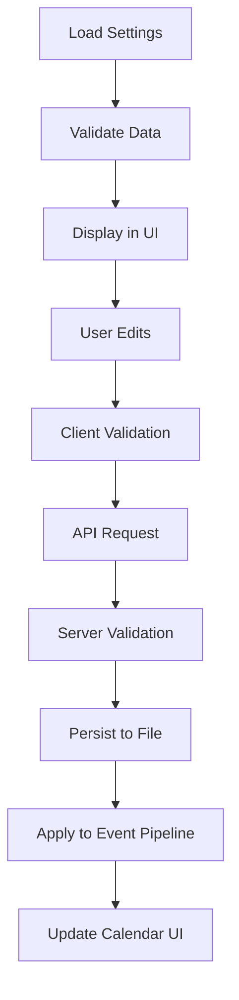
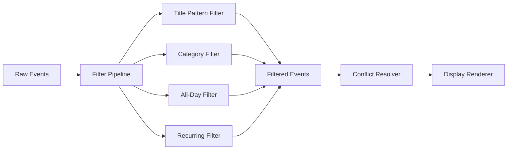

# CalendarBot Settings Panel - Technical Architecture

## Executive Summary

This document defines the complete technical architecture for CalendarBot's web-based settings panel, designed to integrate seamlessly with the existing Flask web server, Pydantic configuration system, and dynamic layout architecture. The system provides gesture-based access to advanced event filtering, conflict resolution, and display customization while maintaining performance and security.

## System Architecture Overview

```
┌─────────────────────────────────────────────────────────────────┐
│                        Frontend Layer                           │
├─────────────────────────────────────────────────────────────────┤
│ Settings Panel UI │ Gesture Interface │ Layout Adapters        │
├─────────────────────────────────────────────────────────────────┤
│                      Web Server Layer                           │
├─────────────────────────────────────────────────────────────────┤
│ Flask Web Server  │ Settings API      │ Security & Validation  │
├─────────────────────────────────────────────────────────────────┤
│                   Settings Management Layer                     │
├─────────────────────────────────────────────────────────────────┤
│ Settings Manager  │ Settings Storage  │ Settings Validation    │
├─────────────────────────────────────────────────────────────────┤
│                   Event Processing Layer                        │
├─────────────────────────────────────────────────────────────────┤
│ Event Filter Pipeline │ Filter Categories │ Event Processor    │
├─────────────────────────────────────────────────────────────────┤
│                      Existing Systems                           │
├─────────────────────────────────────────────────────────────────┤
│ Display Manager │ Layout Registry │ Resource Manager │ Cache Mgr │
└─────────────────────────────────────────────────────────────────┘
```

## Backend Architecture

### 1. Settings Data Models

**Location**: `calendarbot/settings/models.py`

**Core Models**:

```python
from typing import Any, Dict, List, Optional
from datetime import datetime
from pydantic import BaseModel, Field

class FilterPattern(BaseModel):
    """Individual filter pattern configuration."""
    pattern: str = Field(..., description="Filter pattern (text or regex)")
    is_regex: bool = Field(default=False, description="Whether pattern is regex")
    is_active: bool = Field(default=True, description="Whether filter is enabled")
    case_sensitive: bool = Field(default=False, description="Case sensitive matching")
    match_count: int = Field(default=0, description="Number of events matched")
    description: Optional[str] = Field(default=None, description="User description")

class EventFilterSettings(BaseModel):
    """Event filtering configuration."""
    hide_all_day_events: bool = Field(default=False, description="Hide all-day events")
    title_patterns: List[FilterPattern] = Field(default_factory=list, description="Title filter patterns")
    event_categories: Dict[str, bool] = Field(default_factory=dict, description="Category filter settings")
    recurring_filters: Dict[str, bool] = Field(default_factory=dict, description="Recurring event filters")
    attendee_count_filter: Optional[Dict[str, int]] = Field(default=None, description="Filter by attendee count")

class ConflictResolutionSettings(BaseModel):
    """Meeting conflict resolution configuration."""
    priority_by_acceptance: bool = Field(default=True, description="Prioritize accepted meetings")
    priority_by_attendee_count: bool = Field(default=False, description="Prioritize by attendee count")
    priority_by_organizer: bool = Field(default=False, description="Prioritize by organizer")
    show_multiple_conflicts: bool = Field(default=True, description="Show conflict indicators")
    conflict_display_mode: str = Field(default="primary", description="primary|all|indicator")

class DisplaySettings(BaseModel):
    """Display and layout preferences."""
    default_layout: str = Field(default="4x8", description="Default layout name")
    font_sizes: Dict[str, str] = Field(default_factory=dict, description="Font size overrides")
    display_density: str = Field(default="normal", description="compact|normal|spacious")
    color_theme: str = Field(default="default", description="Color theme preference")
    animation_enabled: bool = Field(default=True, description="Enable animations")

class SettingsMetadata(BaseModel):
    """Settings metadata and versioning."""
    version: str = Field(default="1.0.0", description="Settings schema version")
    last_modified: datetime = Field(default_factory=datetime.now, description="Last modification time")
    last_modified_by: str = Field(default="user", description="Last modifier")
    device_id: Optional[str] = Field(default=None, description="Device identifier")

class SettingsData(BaseModel):
    """Complete settings data structure."""
    event_filters: EventFilterSettings = Field(default_factory=EventFilterSettings)
    conflict_resolution: ConflictResolutionSettings = Field(default_factory=ConflictResolutionSettings)
    display: DisplaySettings = Field(default_factory=DisplaySettings)
    metadata: SettingsMetadata = Field(default_factory=SettingsMetadata)
```

### 2. Settings Manager

**Location**: `calendarbot/settings/manager.py`

**Core Class**:

```python
class SettingsManager:
    """Manages settings persistence, validation, and synchronization."""
    
    def __init__(self, settings_path: Path) -> None:
        """Initialize settings manager with file path."""
        
    async def load_settings(self) -> SettingsData:
        """Load settings from persistent storage."""
        
    async def save_settings(self, settings: SettingsData) -> bool:
        """Save settings to persistent storage."""
        
    async def validate_settings(self, settings: SettingsData) -> List[str]:
        """Validate settings and return error list."""
        
    async def export_settings(self) -> Dict[str, Any]:
        """Export settings for backup/sharing."""
        
    async def import_settings(self, data: Dict[str, Any]) -> bool:
        """Import settings from external data."""
        
    async def reset_to_defaults(self) -> SettingsData:
        """Reset all settings to default values."""
```

### 3. Event Filter Pipeline

**Location**: `calendarbot/settings/filters.py`

**Architecture**:

```python
class EventFilterPipeline:
    """Pipeline for filtering events based on user settings."""
    
    def __init__(self, settings: EventFilterSettings) -> None:
        """Initialize filter pipeline with settings."""
        
    async def filter_events(self, events: List[CachedEvent]) -> List[CachedEvent]:
        """Apply all filters to event list."""
        
    async def preview_filter_effects(self, events: List[CachedEvent]) -> Dict[str, int]:
        """Preview how many events each filter would remove."""

class TitlePatternFilter:
    """Filter events by title patterns."""
    
    def apply(self, events: List[CachedEvent], patterns: List[FilterPattern]) -> List[CachedEvent]:
        """Apply title pattern filtering."""

class CategoryFilter:
    """Filter events by category classification."""
    
    def apply(self, events: List[CachedEvent], categories: Dict[str, bool]) -> List[CachedEvent]:
        """Apply category filtering."""

class AllDayEventFilter:
    """Filter all-day events."""
    
    def apply(self, events: List[CachedEvent], hide_all_day: bool) -> List[CachedEvent]:
        """Apply all-day event filtering."""
```

### 4. REST API Endpoints

**Location**: Extensions to `calendarbot/web/server.py`

**API Routes**:

```python
# Settings CRUD Operations
@app.route('/api/settings', methods=['GET'])
def get_settings() -> Dict[str, Any]:
    """Get complete settings data."""

@app.route('/api/settings', methods=['PUT'])
def update_settings() -> Dict[str, Any]:
    """Update complete settings data."""

@app.route('/api/settings/filters', methods=['GET', 'PUT'])
def handle_filter_settings() -> Dict[str, Any]:
    """Get/update filter settings."""

@app.route('/api/settings/display', methods=['GET', 'PUT'])
def handle_display_settings() -> Dict[str, Any]:
    """Get/update display settings."""

@app.route('/api/settings/conflicts', methods=['GET', 'PUT'])
def handle_conflict_settings() -> Dict[str, Any]:
    """Get/update conflict resolution settings."""

# Settings Management Operations
@app.route('/api/settings/validate', methods=['POST'])
def validate_settings() -> Dict[str, Any]:
    """Validate settings data."""

@app.route('/api/settings/preview', methods=['POST'])
def preview_filter_effects() -> Dict[str, Any]:
    """Preview filter effects on current events."""

@app.route('/api/settings/export', methods=['GET'])
def export_settings() -> Dict[str, Any]:
    """Export settings for backup."""

@app.route('/api/settings/import', methods=['POST'])
def import_settings() -> Dict[str, Any]:
    """Import settings from backup."""

@app.route('/api/settings/reset', methods=['POST'])
def reset_settings() -> Dict[str, Any]:
    """Reset settings to defaults."""
```

## Frontend Architecture

### 1. File Structure

```
calendarbot/web/static/
├── layouts/
│   ├── 3x4/
│   │   ├── settings-panel.css
│   │   └── settings-panel.js
│   ├── 4x8/
│   │   ├── settings-panel.css
│   │   └── settings-panel.js
│   └── whats-next-view/
│       ├── settings-panel.css
│       └── settings-panel.js
├── shared/
│   ├── css/
│   │   ├── settings-base.css
│   │   ├── settings-responsive.css
│   │   └── settings-themes.css
│   └── js/
│       ├── SettingsPanel.js
│       ├── GestureHandler.js
│       ├── SettingsAPI.js
│       ├── FilterManager.js
│       └── ValidationEngine.js
```

### 2. JavaScript Architecture

**Core Module**: `SettingsPanel.js`

```javascript
class SettingsPanel {
    constructor(options = {}) {
        this.isOpen = false;
        this.settings = null;
        this.api = new SettingsAPI();
        this.gestureHandler = new GestureHandler(this);
        this.filterManager = new FilterManager();
        this.validator = new ValidationEngine();
    }
    
    async initialize() {
        // Setup gesture recognition
        // Load current settings
        // Initialize UI components
    }
    
    async open() {
        // Animate panel open
        // Load fresh settings data
        // Enable form interactions
    }
    
    async close() {
        // Animate panel close
        // Save pending changes
        // Clean up event listeners
    }
    
    async saveSettings() {
        // Validate settings
        // Send to API
        // Update local state
    }
}
```

**Gesture Recognition**: `GestureHandler.js`

```javascript
class GestureHandler {
    constructor(settingsPanel) {
        this.panel = settingsPanel;
        this.gestureZoneHeight = 50; // pixels
        this.dragThreshold = 20; // pixels
        this.isListening = false;
    }
    
    initialize() {
        // Setup touch/mouse event listeners
        // Configure gesture recognition
    }
    
    onTopZoneClick(event) {
        // Show drag indicator
        // Start gesture tracking
    }
    
    onDragMove(event) {
        // Track drag distance
        // Animate panel reveal
    }
    
    onDragEnd(event) {
        // Complete or cancel gesture
        // Open/close panel as appropriate
    }
}
```

### 3. CSS Architecture

**Base Styles**: `settings-base.css`

```css
:root {
    /* Settings Panel Design Tokens */
    --settings-panel-width-sm: 300px;
    --settings-panel-width-lg: 480px;
    --settings-panel-height-sm: 400px;
    --settings-panel-height-lg: 800px;
    --gesture-zone-height: 50px;
    --drag-threshold: 20px;
    --animation-duration: 300ms;
    --animation-easing: ease-out;
}

.settings-panel {
    position: fixed;
    top: 0;
    left: 0;
    width: var(--settings-panel-width-sm);
    height: var(--settings-panel-height-sm);
    background: var(--background-primary);
    border: 2px solid var(--border-strong);
    z-index: 200;
    transform: translateY(-100%);
    transition: transform var(--animation-duration) var(--animation-easing);
    overflow-y: auto;
}

.settings-panel.open {
    transform: translateY(0);
}

.gesture-zone {
    position: fixed;
    top: 0;
    left: 0;
    width: 100%;
    height: var(--gesture-zone-height);
    z-index: 100;
    cursor: pointer;
}

.drag-indicator {
    position: absolute;
    top: var(--gesture-zone-height);
    left: 50%;
    transform: translateX(-50%);
    width: 60px;
    height: 4px;
    background: var(--border-medium);
    border-radius: 2px;
    opacity: 0;
    transition: opacity 0.2s ease;
}

.drag-indicator.visible {
    opacity: 0.6;
}
```

**Responsive Breakpoints**: `settings-responsive.css`

```css
/* 300×400 Compact Display */
@media (max-width: 320px) and (max-height: 420px) {
    .settings-panel {
        width: var(--settings-panel-width-sm);
        height: var(--settings-panel-height-sm);
    }
    
    .settings-section {
        padding: var(--space-sm);
    }
    
    .settings-control {
        min-height: 44px; /* Touch target compliance */
    }
}

/* 480×800 E-ink Display */
@media (min-width: 460px) and (min-height: 780px) {
    .settings-panel {
        width: var(--settings-panel-width-lg);
        height: var(--settings-panel-height-lg);
    }
    
    .settings-section {
        padding: var(--space-md);
    }
    
    .settings-grid {
        grid-template-columns: 1fr 1fr;
        gap: var(--space-md);
    }
}

/* Web Browser Display */
@media (min-width: 768px) {
    .settings-panel {
        width: 600px;
        height: 80vh;
        max-height: 900px;
    }
}
```

## Data Flow Architecture

### 1. Settings Lifecycle



### 2. Event Filtering Pipeline



## Integration Strategy

### 1. Existing System Integration Points

**Web Server Integration**:
- Extend `WebRequestHandler` class in `calendarbot/web/server.py`
- Add new API routes using existing routing patterns
- Integrate with existing security and logging infrastructure

**Configuration Integration**:
- Extend `CalendarBotSettings` class in `calendarbot/config/settings.py`
- Use existing Pydantic validation patterns
- Store settings in user config directory alongside existing configuration

**Layout System Integration**:
- Extend layout discovery in `calendarbot/layout/registry.py`
- Use `ResourceManager` for CSS/JS injection
- Follow existing layout.json pattern for metadata

**Display Manager Integration**:
- Hook into event processing before `DisplayManager.display_events()`
- Integrate filter pipeline with existing event cache
- Preserve existing renderer interface

### 2. File Structure

```
calendarbot/
├── settings/
│   ├── __init__.py
│   ├── models.py              # Settings data models
│   ├── manager.py             # Settings persistence and management
│   ├── filters.py             # Event filtering pipeline
│   ├── validation.py          # Settings validation logic
│   └── exceptions.py          # Settings-specific exceptions
├── web/
│   ├── server.py              # Extended with settings API routes
│   └── static/
│       ├── shared/
│       │   ├── css/
│       │   │   ├── settings-base.css
│       │   │   ├── settings-responsive.css
│       │   │   └── settings-themes.css
│       │   └── js/
│       │       ├── SettingsPanel.js
│       │       ├── GestureHandler.js
│       │       ├── SettingsAPI.js
│       │       ├── FilterManager.js
│       │       └── ValidationEngine.js
│       └── layouts/
│           ├── 3x4/
│           │   ├── settings-panel.css
│           │   └── settings-panel.js
│           ├── 4x8/
│           │   ├── settings-panel.css
│           │   └── settings-panel.js
│           └── whats-next-view/
│               ├── settings-panel.css
│               └── settings-panel.js
├── config/
│   └── settings.py            # Extended CalendarBotSettings
└── display/
    └── manager.py             # Modified to integrate filtering
```

## Security Architecture

### 1. Input Validation

**Multi-Layer Validation**:
- **Client-Side**: JavaScript validation for immediate feedback
- **API Layer**: Flask request validation with input sanitization
- **Data Model**: Pydantic validation with custom validators
- **Storage Layer**: JSON schema validation before persistence

**Validation Rules**:
- Regex patterns: Validated for syntax and safety
- File paths: Restricted to safe directories
- User input: HTML escaped and length limited
- API payloads: Size limited and structure validated

### 2. Security Controls

**CSRF Protection**:
```python
from flask_wtf.csrf import CSRFProtect

csrf = CSRFProtect(app)

@app.route('/api/settings', methods=['PUT'])
@csrf.exempt  # Handle via custom token validation
def update_settings():
    # Custom CSRF validation for API endpoints
    pass
```

**Input Sanitization**:
```python
def sanitize_pattern(pattern: str) -> str:
    """Sanitize filter patterns for safe execution."""
    # Remove dangerous regex constructs
    # Limit pattern length
    # Escape special characters
    pass

def validate_regex_pattern(pattern: str) -> bool:
    """Validate regex patterns are safe to execute."""
    try:
        re.compile(pattern)
        # Check for catastrophic backtracking patterns
        return True
    except re.error:
        return False
```

**Rate Limiting**:
```python
from flask_limiter import Limiter

limiter = Limiter(
    app,
    key_func=lambda: request.remote_addr,
    default_limits=["200 per day", "50 per hour"]
)

@app.route('/api/settings', methods=['PUT'])
@limiter.limit("10 per minute")
def update_settings():
    pass
```

## Performance Considerations

### 1. Frontend Performance

**Lazy Loading**: Settings panel JavaScript loaded only when gesture detected
**Resource Optimization**: Shared CSS/JS resources cached across layouts
**Animation Performance**: Hardware-accelerated transforms for smooth animations
**Memory Management**: Proper cleanup of event listeners and DOM references

### 2. Backend Performance

**Filter Pipeline Optimization**:
- Early termination when no filters active
- Compiled regex patterns cached in memory
- Parallel filter execution for large event sets
- Filter effectiveness metrics for optimization

**Settings Persistence**:
- Debounced saves to prevent excessive I/O
- JSON file format optimized for quick parsing
- Settings validation cached to avoid recomputation
- Atomic file writes to prevent corruption

### 3. Performance Targets

**Frontend Metrics**:
- Panel open time: <200ms
- Gesture response: <100ms
- Form validation: <50ms
- Animation frame rate: 60fps

**Backend Metrics**:
- Settings load time: <50ms
- Filter pipeline: <100ms for 1000 events
- API response time: <200ms average
- Memory overhead: <5MB additional usage

## Error Handling & Recovery

### 1. Error Categories

**Validation Errors**:
- Invalid regex patterns
- Malformed settings data
- Missing required fields
- Out-of-range values

**System Errors**:
- File system permissions
- Network connectivity issues
- Memory/resource limitations
- Concurrent modification conflicts

**User Errors**:
- Accidental over-filtering
- Gesture recognition failures
- Browser compatibility issues
- Touch target misses

### 2. Recovery Strategies

**Graceful Degradation**:
```python
async def apply_filters_with_fallback(events: List[CachedEvent], settings: EventFilterSettings) -> List[CachedEvent]:
    """Apply filters with fallback to no filtering on errors."""
    try:
        return await apply_event_filters(events, settings)
    except Exception as e:
        logger.error(f"Filter pipeline failed: {e}")
        # Return unfiltered events to maintain functionality
        return events
```

**Auto-Recovery**:
- Settings file corruption: Automatic backup restoration
- Invalid regex: Pattern disabled with user notification
- API failures: Local caching with sync retry
- UI errors: Panel reset with state preservation

## Testing Strategy

### 1. Unit Testing

**Backend Tests**:
```python
# tests/unit/settings/test_models.py
def test_filter_pattern_when_valid_regex_then_validates():
    pattern = FilterPattern(pattern="test.*", is_regex=True)
    assert pattern.is_regex is True
    assert pattern.pattern == "test.*"

# tests/unit/settings/test_filters.py  
def test_title_filter_when_pattern_matches_then_filters_event():
    events = [create_test_event("Daily Standup")]
    patterns = [FilterPattern(pattern="Daily Standup")]
    filtered = TitlePatternFilter().apply(events, patterns)
    assert len(filtered) == 0
```

**Frontend Tests**:
```javascript
// tests/unit/js/SettingsPanel.test.js
describe('SettingsPanel', () => {
    test('opens when gesture threshold reached', async () => {
        const panel = new SettingsPanel();
        await panel.initialize();
        
        // Simulate gesture
        panel.gestureHandler.onDragMove({ clientY: 50 });
        
        expect(panel.isOpen).toBe(true);
    });
});
```

### 2. Integration Testing

**API Integration**:
```python
def test_settings_api_integration():
    # Test complete settings CRUD workflow
    # Verify data persistence
    # Check error handling
    pass

def test_filter_pipeline_integration():
    # Test end-to-end event filtering
    # Verify performance requirements
    # Check error recovery
    pass
```

### 3. Browser Testing

**Cross-Browser Compatibility**:
- Chrome 90+ (primary target)
- Firefox 88+ (secondary target)
- Safari 14+ (tertiary target)

**Touch Device Testing**:
- E-ink displays (300×400, 480×800)
- Mobile browsers (responsive breakpoints)
- Accessibility tools (screen readers, keyboard navigation)

## Deployment Strategy

### 1. Development Phases

**Phase 1: Foundation (Sprints 1-2)**
- Settings data models and persistence
- Basic API endpoints
- Core JavaScript modules
- 300×400 layout support

**Phase 2: Core Features (Sprints 3-4)**
- Event filtering pipeline
- Gesture interface implementation
- All display size support
- Basic validation and error handling

**Phase 3: Polish & Optimization (Sprints 5-6)**
- Advanced filtering features
- Performance optimization
- Comprehensive error handling
- Security hardening

### 2. Feature Flags

```python
class SettingsFeatureFlags:
    GESTURE_INTERFACE_ENABLED = True
    ADVANCED_FILTERING_ENABLED = True
    CONFLICT_RESOLUTION_ENABLED = False  # Phase 2
    SETTINGS_EXPORT_ENABLED = False      # Phase 3
```

### 3. Migration Strategy

**Backward Compatibility**:
- Existing YAML configuration preserved
- Settings panel supplements existing configuration
- Graceful fallback when settings unavailable
- Migration path for existing installations

## Monitoring & Analytics

### 1. Performance Monitoring

**Metrics Collection**:
```python
@performance_monitor
async def apply_event_filters(events: List[CachedEvent], settings: EventFilterSettings) -> List[CachedEvent]:
    """Monitor filter pipeline performance."""
    pass

# Log metrics: execution time, event counts, filter effectiveness
```

**Frontend Analytics**:
```javascript
class PerformanceTracker {
    trackGestureResponse(time) {
        // Track gesture recognition performance
    }
    
    trackPanelOpenTime(time) {
        // Track panel animation performance
    }
    
    trackSettingsSaveTime(time) {
        // Track API response times
    }
}
```

### 2. Usage Analytics

**Feature Usage Tracking**:
- Settings panel access frequency
- Filter configuration patterns
- Error occurrence rates
- Performance bottlenecks

**Privacy-Preserving Analytics**:
- No personal data collection
- Aggregated usage metrics only
- User consent for analytics
- Local storage preference respect

## Conclusion

This technical architecture provides a comprehensive foundation for implementing CalendarBot's settings panel while maintaining integration with existing systems. The modular design allows for incremental development and testing, while the responsive frontend architecture ensures compatibility across all target display sizes.

The architecture prioritizes:
- **Performance**: Optimized filtering pipeline and responsive UI
- **Security**: Multi-layer validation and input sanitization
- **Maintainability**: Clear separation of concerns and modular design
- **Extensibility**: Plugin-like architecture for future enhancements
- **Reliability**: Comprehensive error handling and graceful degradation

Implementation should proceed through the defined phases, with each phase building upon proven foundation components and delivering measurable user value.