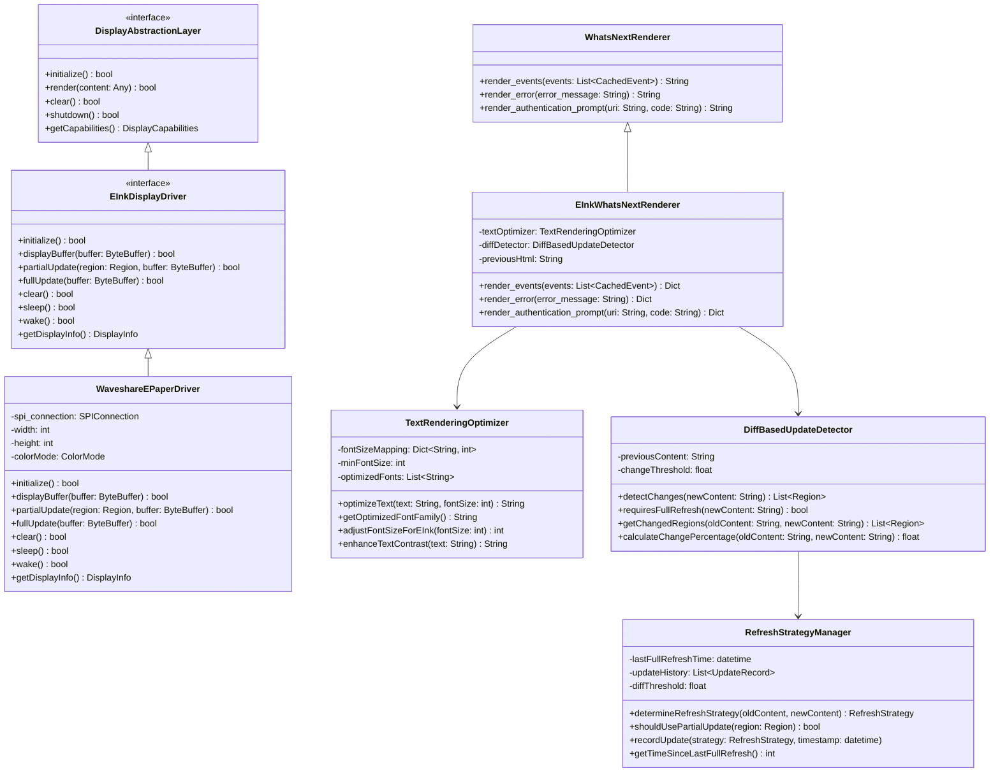
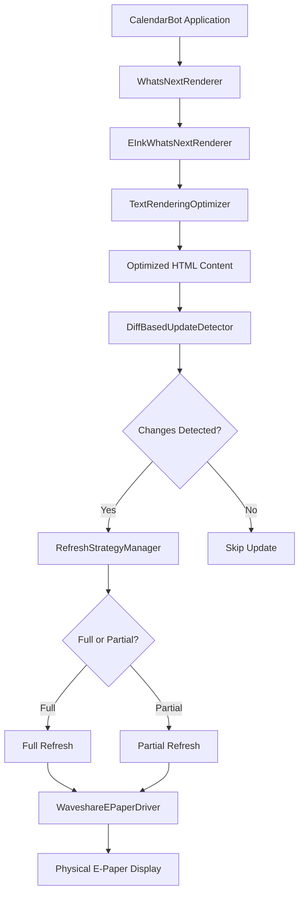

# Detailed Architecture Design: E-Paper Display Integration

This document outlines the detailed architecture for integrating the Waveshare 4.2inch e-Paper Module (B) v2 with CalendarBot's whats-next-view.

## Table of Contents

1. [Overview](#overview)
2. [Architecture Components](#architecture-components)
   - [Display Abstraction Layer](#display-abstraction-layer)
   - [E-Ink Display Driver](#e-ink-display-driver)
   - [Refresh Strategy Manager](#refresh-strategy-manager)
   - [Diff-Based Update Detector](#diff-based-update-detector)
   - [Text Rendering Optimizer](#text-rendering-optimizer)
   - [E-Ink WhatsNext Renderer](#e-ink-whatsnext-renderer)
3. [Component Diagrams](#component-diagrams)
4. [Data Flow Diagrams](#data-flow-diagrams)
5. [Integration Strategy](#integration-strategy)
6. [Extension Points](#extension-points)

## Overview

The architecture is designed to integrate the Waveshare 4.2inch e-Paper Module (B) v2 with CalendarBot's whats-next-view, with a focus on:

1. **Modular Design**: Clean separation of concerns with well-defined interfaces
2. **Rendering Quality**: Ensuring crisp text and UI elements on the e-ink display
3. **Refresh Optimization**: Minimizing the impact of the 4-second refresh time
4. **Extensibility**: Supporting future e-Paper displays and alternative views

The architecture leverages the existing CalendarBot components, particularly the WhatsNextRenderer, and extends them with e-ink specific functionality.

## Architecture Components

### Display Abstraction Layer

The Display Abstraction Layer provides a clean interface that separates hardware specifics from rendering logic:

```python
from typing import Any, Dict, Optional, Protocol, Tuple

class DisplayCapabilities:
    """Represents the capabilities of a display device."""
    
    def __init__(
        self,
        width: int,
        height: int,
        colors: int,
        supports_partial_update: bool,
        supports_grayscale: bool,
        supports_red: bool
    ):
        """Initialize display capabilities.
        
        Args:
            width: Display width in pixels
            height: Display height in pixels
            colors: Number of colors supported
            supports_partial_update: Whether partial updates are supported
            supports_grayscale: Whether grayscale is supported
            supports_red: Whether red color is supported
        """
        self.width = width
        self.height = height
        self.colors = colors
        self.supports_partial_update = supports_partial_update
        self.supports_grayscale = supports_grayscale
        self.supports_red = supports_red
        
    def __repr__(self) -> str:
        return (
            f"DisplayCapabilities(width={self.width}, height={self.height}, "
            f"colors={self.colors}, partial_update={self.supports_partial_update}, "
            f"grayscale={self.supports_grayscale}, red={self.supports_red})"
        )


class DisplayAbstractionLayer(Protocol):
    """Protocol defining the interface for display hardware abstraction."""
    
    def initialize(self) -> bool:
        """Initialize the display hardware.
        
        Returns:
            bool: True if initialization successful, False otherwise
        """
        ...
        
    def render(self, content: Any) -> bool:
        """Render content to the display.
        
        Args:
            content: Content to render (format depends on implementation)
            
        Returns:
            bool: True if rendering successful, False otherwise
        """
        ...
        
    def clear(self) -> bool:
        """Clear the display.
        
        Returns:
            bool: True if clearing successful, False otherwise
        """
        ...
        
    def shutdown(self) -> bool:
        """Shutdown the display hardware.
        
        Returns:
            bool: True if shutdown successful, False otherwise
        """
        ...
        
    def get_capabilities(self) -> DisplayCapabilities:
        """Get display capabilities.
        
        Returns:
            DisplayCapabilities: Object containing display capabilities
        """
        ...
```

### E-Ink Display Driver

The E-Ink Display Driver extends the Display Abstraction Layer with e-ink specific functionality:

```python
class Region:
    """Represents a rectangular region on the display."""
    
    def __init__(self, x: int, y: int, width: int, height: int):
        """Initialize a region.
        
        Args:
            x: X-coordinate of top-left corner
            y: Y-coordinate of top-left corner
            width: Width of region in pixels
            height: Height of region in pixels
        """
        self.x = x
        self.y = y
        self.width = width
        self.height = height
        
    def __repr__(self) -> str:
        return f"Region(x={self.x}, y={self.y}, width={self.width}, height={self.height})"


class EInkDisplayDriver(DisplayAbstractionLayer, Protocol):
    """Protocol defining the interface for e-ink display drivers."""
    
    def partial_update(self, region: Region, buffer: bytes) -> bool:
        """Perform a partial update of the display.
        
        Args:
            region: Region to update
            buffer: Buffer containing pixel data
            
        Returns:
            bool: True if update successful, False otherwise
        """
        ...
        
    def full_update(self, buffer: bytes) -> bool:
        """Perform a full update of the display.
        
        Args:
            buffer: Buffer containing pixel data
            
        Returns:
            bool: True if update successful, False otherwise
        """
        ...
        
    def sleep(self) -> bool:
        """Put the display in sleep mode.
        
        Returns:
            bool: True if sleep mode entered successfully, False otherwise
        """
        ...
        
    def wake(self) -> bool:
        """Wake the display from sleep mode.
        
        Returns:
            bool: True if wake successful, False otherwise
        """
        ...
```

#### Waveshare E-Paper Driver Implementation

```python
import logging
import time
from typing import Any, Dict, List, Optional, Tuple

import RPi.GPIO as GPIO
import spidev

from .display_abstraction import DisplayAbstractionLayer, DisplayCapabilities
from .eink_driver import EInkDisplayDriver, Region

logger = logging.getLogger(__name__)


class WaveshareEPaperDriver(EInkDisplayDriver):
    """Driver for Waveshare 4.2inch e-Paper Module (B) v2."""
    
    # Pin definitions
    RST_PIN = 17
    DC_PIN = 25
    CS_PIN = 8
    BUSY_PIN = 24
    
    # Display constants
    WIDTH = 400
    HEIGHT = 300
    
    # Command constants
    PANEL_SETTING = 0x00
    POWER_SETTING = 0x01
    POWER_OFF = 0x02
    POWER_ON = 0x04
    BOOSTER_SOFT_START = 0x06
    DEEP_SLEEP = 0x07
    DATA_START_TRANSMISSION_1 = 0x10
    DATA_STOP = 0x11
    DISPLAY_REFRESH = 0x12
    DATA_START_TRANSMISSION_2 = 0x13
    PARTIAL_DATA_START_TRANSMISSION_1 = 0x14
    PARTIAL_DATA_START_TRANSMISSION_2 = 0x15
    PARTIAL_DISPLAY_REFRESH = 0x16
    LUT_FOR_VCOM = 0x20
    LUT_WHITE_TO_WHITE = 0x21
    LUT_BLACK_TO_WHITE = 0x22
    LUT_WHITE_TO_BLACK = 0x23
    LUT_BLACK_TO_BLACK = 0x24
    PLL_CONTROL = 0x30
    TEMPERATURE_SENSOR_COMMAND = 0x40
    TEMPERATURE_SENSOR_SELECTION = 0x41
    TEMPERATURE_SENSOR_WRITE = 0x42
    TEMPERATURE_SENSOR_READ = 0x43
    VCOM_AND_DATA_INTERVAL_SETTING = 0x50
    LOW_POWER_DETECTION = 0x51
    TCON_SETTING = 0x60
    RESOLUTION_SETTING = 0x61
    GSST_SETTING = 0x65
    GET_STATUS = 0x71
    AUTO_MEASUREMENT_VCOM = 0x80
    READ_VCOM_VALUE = 0x81
    VCM_DC_SETTING = 0x82
    PARTIAL_WINDOW = 0x90
    PARTIAL_IN = 0x91
    PARTIAL_OUT = 0x92
    PROGRAM_MODE = 0xA0
    ACTIVE_PROGRAM = 0xA1
    READ_OTP_DATA = 0xA2
    POWER_SAVING = 0xE3
    
    def __init__(self):
        """Initialize the Waveshare e-Paper driver."""
        self.width = self.WIDTH
        self.height = self.HEIGHT
        self.spi = None
        self.initialized = False
        
    def _digital_write(self, pin: int, value: int) -> None:
        """Write digital value to GPIO pin.
        
        Args:
            pin: GPIO pin number
            value: Value to write (0 or 1)
        """
        GPIO.output(pin, value)
        
    def _digital_read(self, pin: int) -> int:
        """Read digital value from GPIO pin.
        
        Args:
            pin: GPIO pin number
            
        Returns:
            Value read from pin (0 or 1)
        """
        return GPIO.input(pin)
        
    def _delay_ms(self, delaytime: int) -> None:
        """Delay for specified milliseconds.
        
        Args:
            delaytime: Delay time in milliseconds
        """
        time.sleep(delaytime / 1000.0)
        
    def _spi_transfer(self, data: List[int]) -> None:
        """Transfer data over SPI.
        
        Args:
            data: Data to transfer
        """
        if self.spi:
            self.spi.writebytes(data)
        
    def _send_command(self, command: int) -> None:
        """Send command to display.
        
        Args:
            command: Command byte
        """
        self._digital_write(self.DC_PIN, 0)
        self._digital_write(self.CS_PIN, 0)
        self._spi_transfer([command])
        self._digital_write(self.CS_PIN, 1)
        
    def _send_data(self, data: int) -> None:
        """Send data to display.
        
        Args:
            data: Data byte
        """
        self._digital_write(self.DC_PIN, 1)
        self._digital_write(self.CS_PIN, 0)
        self._spi_transfer([data])
        self._digital_write(self.CS_PIN, 1)
        
    def _send_data_bulk(self, data: List[int]) -> None:
        """Send multiple data bytes to display.
        
        Args:
            data: List of data bytes
        """
        self._digital_write(self.DC_PIN, 1)
        self._digital_write(self.CS_PIN, 0)
        self._spi_transfer(data)
        self._digital_write(self.CS_PIN, 1)
        
    def _init_full(self) -> None:
        """Initialize display for full update mode."""
        self._send_command(self.POWER_SETTING)
        self._send_data(0x03)  # VDS_EN, VDG_EN
        self._send_data(0x00)  # VCOM_HV, VGHL_LV[1], VGHL_LV[0]
        self._send_data(0x2b)  # VDH
        self._send_data(0x2b)  # VDL
        self._send_data(0x09)  # VDHR
        
        self._send_command(self.BOOSTER_SOFT_START)
        self._send_data(0x07)
        self._send_data(0x07)
        self._send_data(0x17)
        
        # Power optimization
        self._send_command(0xF8)
        self._send_data(0x60)
        self._send_data(0xA5)
        
        # Power optimization
        self._send_command(0xF8)
        self._send_data(0x89)
        self._send_data(0xA5)
        
        # Power optimization
        self._send_command(0xF8)
        self._send_data(0x90)
        self._send_data(0x00)
        
        # Power optimization
        self._send_command(0xF8)
        self._send_data(0x93)
        self._send_data(0x2A)
        
        # Power optimization
        self._send_command(0xF8)
        self._send_data(0x73)
        self._send_data(0x41)
        
        self._send_command(self.PARTIAL_DISPLAY_REFRESH)
        self._send_data(0x00)
        
        self._send_command(self.POWER_ON)
        self._wait_until_idle()
        
        self._send_command(self.PANEL_SETTING)
        self._send_data(0xAF)  # KW-BF   KWR-AF    BWROTP 0f
        
        self._send_command(self.PLL_CONTROL)
        self._send_data(0x3A)  # 3A 100HZ   29 150Hz 39 200HZ    31 171HZ
        
        self._send_command(self.RESOLUTION_SETTING)
        self._send_data(0x01)  # width high byte
        self._send_data(0x90)  # width low byte
        self._send_data(0x01)  # height high byte
        self._send_data(0x2C)  # height low byte
        
        self._send_command(self.VCM_DC_SETTING)
        self._send_data(0x12)
        
        self._send_command(self.VCOM_AND_DATA_INTERVAL_SETTING)
        self._send_data(0x97)  # 97 white border 77 black border    97 white border 77 black border
        
    def _wait_until_idle(self) -> None:
        """Wait until display is idle (not busy)."""
        logger.debug("Waiting for display to be idle...")
        while self._digital_read(self.BUSY_PIN) == 0:
            self._delay_ms(100)
        logger.debug("Display is now idle")
        
    def initialize(self) -> bool:
        """Initialize the display hardware.
        
        Returns:
            bool: True if initialization successful, False otherwise
        """
        try:
            # Initialize GPIO
            GPIO.setmode(GPIO.BCM)
            GPIO.setwarnings(False)
            GPIO.setup(self.RST_PIN, GPIO.OUT)
            GPIO.setup(self.DC_PIN, GPIO.OUT)
            GPIO.setup(self.CS_PIN, GPIO.OUT)
            GPIO.setup(self.BUSY_PIN, GPIO.IN)
            
            # Initialize SPI
            self.spi = spidev.SpiDev()
            self.spi.open(0, 0)
            self.spi.max_speed_hz = 4000000
            self.spi.mode = 0b00
            
            # Reset display
            self._digital_write(self.RST_PIN, 1)
            self._delay_ms(200)
            self._digital_write(self.RST_PIN, 0)
            self._delay_ms(10)
            self._digital_write(self.RST_PIN, 1)
            self._delay_ms(200)
            
            # Initialize display
            self._init_full()
            
            # Clear display
            self.clear()
            
            self.initialized = True
            logger.info("Waveshare e-Paper display initialized successfully")
            return True
            
        except Exception as e:
            logger.error(f"Failed to initialize Waveshare e-Paper display: {e}")
            return False
            
    def render(self, content: bytes) -> bool:
        """Render content to the display.
        
        Args:
            content: Buffer containing pixel data
            
        Returns:
            bool: True if rendering successful, False otherwise
        """
        return self.full_update(content)
        
    def clear(self) -> bool:
        """Clear the display.
        
        Returns:
            bool: True if clearing successful, False otherwise
        """
        try:
            buffer_size = self.width * self.height // 8
            buffer = [0xFF] * buffer_size  # White
            
            self._send_command(self.DATA_START_TRANSMISSION_1)
            self._send_data_bulk(buffer)
            
            self._send_command(self.DATA_START_TRANSMISSION_2)
            self._send_data_bulk(buffer)
            
            self._send_command(self.DISPLAY_REFRESH)
            self._wait_until_idle()
            
            logger.info("Display cleared successfully")
            return True
            
        except Exception as e:
            logger.error(f"Failed to clear display: {e}")
            return False
            
    def shutdown(self) -> bool:
        """Shutdown the display hardware.
        
        Returns:
            bool: True if shutdown successful, False otherwise
        """
        try:
            self._send_command(self.POWER_OFF)
            self._wait_until_idle()
            self._send_command(self.DEEP_SLEEP)
            self._send_data(0xA5)
            
            # Clean up GPIO and SPI
            if self.spi:
                self.spi.close()
                self.spi = None
                
            GPIO.cleanup([self.RST_PIN, self.DC_PIN, self.CS_PIN, self.BUSY_PIN])
            
            self.initialized = False
            logger.info("Display shutdown successfully")
            return True
            
        except Exception as e:
            logger.error(f"Failed to shutdown display: {e}")
            return False
            
    def get_capabilities(self) -> DisplayCapabilities:
        """Get display capabilities.
        
        Returns:
            DisplayCapabilities: Object containing display capabilities
        """
        return DisplayCapabilities(
            width=self.width,
            height=self.height,
            colors=3,  # Black, white, red
            supports_partial_update=True,
            supports_grayscale=True,
            supports_red=True
        )
        
    def partial_update(self, region: Region, buffer: bytes) -> bool:
        """Perform a partial update of the display.
        
        Args:
            region: Region to update
            buffer: Buffer containing pixel data
            
        Returns:
            bool: True if update successful, False otherwise
        """
        try:
            # Ensure region is within display bounds
            if (region.x < 0 or region.y < 0 or
                region.x + region.width > self.width or
                region.y + region.height > self.height):
                logger.error("Region out of bounds")
                return False
                
            # Ensure region dimensions are multiples of 8
            if region.width % 8 != 0 or region.height % 8 != 0:
                logger.warning("Region dimensions should be multiples of 8 for optimal results")
                
            # Enter partial update mode
            self._send_command(self.PARTIAL_IN)
            
            # Set partial window
            self._send_command(self.PARTIAL_WINDOW)
            self._send_data(region.x >> 8)  # X start high byte
            self._send_data(region.x & 0xFF)  # X start low byte
            self._send_data((region.x + region.width - 1) >> 8)  # X end high byte
            self._send_data((region.x + region.width - 1) & 0xFF)  # X end low byte
            self._send_data(region.y >> 8)  # Y start high byte
            self._send_data(region.y & 0xFF)  # Y start low byte
            self._send_data((region.y + region.height - 1) >> 8)  # Y end high byte
            self._send_data((region.y + region.height - 1) & 0xFF)  # Y end low byte
            self._send_data(0x01)  # Gates scan both inside and outside of the partial window
            
            # Send data
            self._send_command(self.PARTIAL_DATA_START_TRANSMISSION_1)
            self._send_data_bulk(buffer)
            
            self._send_command(self.PARTIAL_DATA_START_TRANSMISSION_2)
            self._send_data_bulk(buffer)
            
            # Refresh display
            self._send_command(self.PARTIAL_DISPLAY_REFRESH)
            self._wait_until_idle()
            
            # Exit partial update mode
            self._send_command(self.PARTIAL_OUT)
            
            logger.info(f"Partial update completed for region: {region}")
            return True
            
        except Exception as e:
            logger.error(f"Failed to perform partial update: {e}")
            return False
            
    def full_update(self, buffer: bytes) -> bool:
        """Perform a full update of the display.
        
        Args:
            buffer: Buffer containing pixel data
            
        Returns:
            bool: True if update successful, False otherwise
        """
        try:
            # Ensure buffer size is correct
            buffer_size = self.width * self.height // 8
            if len(buffer) != buffer_size * 2:  # Black and red buffers
                logger.error(f"Invalid buffer size: {len(buffer)}, expected {buffer_size * 2}")
                return False
                
            # Split buffer into black and red parts
            black_buffer = buffer[:buffer_size]
            red_buffer = buffer[buffer_size:]
            
            # Send black buffer
            self._send_command(self.DATA_START_TRANSMISSION_1)
            self._send_data_bulk(black_buffer)
            
            # Send red buffer
            self._send_command(self.DATA_START_TRANSMISSION_2)
            self._send_data_bulk(red_buffer)
            
            # Refresh display
            self._send_command(self.DISPLAY_REFRESH)
            self._wait_until_idle()
            
            logger.info("Full update completed")
            return True
            
        except Exception as e:
            logger.error(f"Failed to perform full update: {e}")
            return False
            
    def sleep(self) -> bool:
        """Put the display in sleep mode.
        
        Returns:
            bool: True if sleep mode entered successfully, False otherwise
        """
        try:
            self._send_command(self.POWER_OFF)
            self._wait_until_idle()
            self._send_command(self.DEEP_SLEEP)
            self._send_data(0xA5)
            
            logger.info("Display entered sleep mode")
            return True
            
        except Exception as e:
            logger.error(f"Failed to enter sleep mode: {e}")
            return False
            
    def wake(self) -> bool:
        """Wake the display from sleep mode.
        
        Returns:
            bool: True if wake successful, False otherwise
        """
        try:
            # Reset display
            self._digital_write(self.RST_PIN, 0)
            self._delay_ms(10)
            self._digital_write(self.RST_PIN, 1)
            self._delay_ms(200)
            
            # Re-initialize display
            self._init_full()
            
            logger.info("Display woken from sleep mode")
            return True
            
        except Exception as e:
            logger.error(f"Failed to wake display: {e}")
            return False
```

### Refresh Strategy Manager

The Refresh Strategy Manager is responsible for determining the optimal refresh strategy for the e-ink display:

```python
from enum import Enum, auto
from typing import Dict, List, Optional

from .eink_driver import EInkDisplayDriver, Region


class RefreshStrategy(Enum):
    """Enum representing different refresh strategies."""
    FULL = auto()
    PARTIAL = auto()
    SKIP = auto()


class RefreshStrategyManager:
    """Manages refresh strategies for e-ink displays to minimize refresh frequency."""
    
    def __init__(self, driver: EInkDisplayDriver):
        """Initialize the refresh strategy manager.
        
        Args:
            driver: E-ink display driver
        """
        self.driver = driver
        self.last_full_refresh_time = None
        self.update_history = []
        self.min_full_refresh_interval = 60  # Minimum seconds between full refreshes
        self.max_partial_updates = 5  # Maximum number of partial updates before forcing full refresh
        self.partial_update_count = 0
        
    def determine_refresh_strategy(self, changed_regions: List[Region]) -> RefreshStrategy:
        """Determine the optimal refresh strategy based on changed regions.
        
        Args:
            changed_regions: List of regions that have changed
            
        Returns:
            The optimal refresh strategy
        """
        if not changed_regions:
            return RefreshStrategy.SKIP
            
        # Check if we need a full refresh based on time or update count
        current_time = time.time()
        if (self.last_full_refresh_time is None or
            current_time - self.last_full_refresh_time > self.min_full_refresh_interval or
            self.partial_update_count >= self.max_partial_updates):
            return RefreshStrategy.FULL
            
        # Check if changed regions cover most of the screen
        total_changed_area = sum(region.width * region.height for region in changed_regions)
        display_area = self.driver.width * self.driver.height
        
        if total_changed_area > display_area * 0.5:  # If more than 50% changed
            return RefreshStrategy.FULL
            
        return RefreshStrategy.PARTIAL
        
    def apply_refresh_strategy(self, strategy: RefreshStrategy, buffer: bytes, changed_regions: List[Region]) -> bool:
        """Apply the determined refresh strategy.
        
        Args:
            strategy: Refresh strategy to apply
            buffer: Full display buffer
            changed_regions: List of regions that have changed
            
        Returns:
            True if refresh successful, False otherwise
        """
        current_time = time.time()
        
        if strategy == RefreshStrategy.FULL:
            success = self.driver.full_update(buffer)
            if success:
                self.last_full_refresh_time = current_time
                self.partial_update_count = 0
                self.update_history.append(("full", current_time))
            return success
            
        elif strategy == RefreshStrategy.PARTIAL:
            success = True
            for region in changed_regions:
                # Extract region buffer from full buffer
                region_buffer = self._extract_region_buffer(buffer, region)
                region_success = self.driver.partial_update(region, region_buffer)
                success = success and region_success
                
            if success:
                self.partial_update_count += 1
                self.update_history.append(("partial", current_time))
            return success
            
        else:  # SKIP
            return True
            
    def _extract_region_buffer(self, buffer: bytes, region: Region) -> bytes:
        """Extract a region buffer from the full buffer.
        
        Args:
            buffer: Full display buffer
            region: Region to extract
            
        Returns:
            Buffer for the specified region
        """
        # Calculate buffer size for region
        region_buffer_size = region.width * region.height // 8
        region_buffer = bytearray(region_buffer_size)
        
        # Extract region data from full buffer
        display_width_bytes = self.driver.width // 8
        
        for y in range(region.height):
            for x in range(region.width // 8):
                src_x = region.x // 8 + x
                src_y = region.y + y
                src_idx = src_y * display_width_bytes + src_x
                dst_idx = y * (region.width // 8) + x
                
                if src_idx < len(buffer) and dst_idx < len(region_buffer):
                    region_buffer[dst_idx] = buffer[src_idx]
                    
        return bytes(region_buffer)
```

### Diff-Based Update Detector

The Diff-Based Update Detector is responsible for identifying which regions of the display have changed:

```python
import hashlib
import re
import difflib
from typing import Dict, List, Any, Optional

class Region:
    """Represents a rectangular region on the display."""
    
    def __init__(self, x: int, y: int, width: int, height: int):
        """Initialize a region.
        
        Args:
            x: X-coordinate of top-left corner
            y: Y-coordinate of top-left corner
            width: Width of region in pixels
            height: Height of region in pixels
        """
        self.x = x
        self.y = y
        self.width = width
        self.height = height
        
    def __repr__(self) -> str:
        return f"Region(x={self.x}, y={self.y}, width={self.width}, height={self.height})"
        
    def contains_point(self, x: int, y: int) -> bool:
        """Check if region contains a point.
        
        Args:
            x: X-coordinate
            y: Y-coordinate
            
        Returns:
            True if point is in region, False otherwise
        """
        return (self.x <= x < self.x + self.width and
                self.y <= y < self.y + self.height)
                
    def overlaps(self, other: "Region") -> bool:
        """Check if region overlaps with another region.
        
        Args:
            other: Other region
            
        Returns:
            True if regions overlap, False otherwise
        """
        return not (self.x + self.width <= other.x or
                   other.x + other.width <= self.x or
                   self.y + self.height <= other.y or
                   other.y + other.height <= self.y)


class DiffBasedUpdateDetector:
    """Detects changes between content versions to minimize e-ink refreshes."""
    
    def __init__(self, display_width: int = 300, display_height: int = 400):
        """Initialize the detector with display dimensions.
        
        Args:
            display_width: Width of the display in pixels
            display_height: Height of the display in pixels
        """
        self.display_width = display_width
        self.display_height = display_height
        self.previous_content = None
        self.previous_dom_structure = None
        self.change_threshold = 0.05  # 5% change threshold for full refresh
        self.section_map = self._initialize_section_map()
        
    def _initialize_section_map(self) -> Dict[str, Region]:
        """Initialize the section map based on WhatsNextRenderer's DOM structure.
        
        Returns:
            Dict mapping section IDs to display regions
        """
        # Map DOM sections to physical display regions
        return {
            "header": Region(0, 0, self.display_width, 50),
            "current-event": Region(0, 50, self.display_width, 120),
            "upcoming-event": Region(0, 170, self.display_width, 120),
            "status": Region(0, 360, self.display_width, 40)
        }
        
    def detect_changes(self, new_content: str) -> List[Region]:
        """Detect which regions have changed and need updating.
        
        Args:
            new_content: New HTML content to render
            
        Returns:
            List of regions that need updating
        """
        if self.previous_content is None:
            # First render, return all regions for full refresh
            self.previous_content = new_content
            return [Region(0, 0, self.display_width, self.display_height)]
            
        # Parse DOM structure from HTML content
        new_dom = self._extract_dom_structure(new_content)
        
        # Compare DOM structures to identify changed sections
        changed_sections = self._compare_dom_structures(self.previous_dom_structure, new_dom)
        
        # Map changed sections to display regions
        changed_regions = []
        for section_id in changed_sections:
            if section_id in self.section_map:
                changed_regions.append(self.section_map[section_id])
                
        # Check if changes exceed threshold for full refresh
        if self._calculate_change_percentage(self.previous_content, new_content) > self.change_threshold:
            # Too many changes, do full refresh
            changed_regions = [Region(0, 0, self.display_width, self.display_height)]
            
        # Update previous state
        self.previous_content = new_content
        self.previous_dom_structure = new_dom
        
        return self._optimize_regions(changed_regions)
        
    def _extract_dom_structure(self, html_content: str) -> Dict[str, Any]:
        """Extract DOM structure from HTML content.
        
        Args:
            html_content: HTML content to parse
            
        Returns:
            Dictionary representing DOM structure
        """
        # Use a lightweight HTML parser to extract structure
        # Focus on sections that matter for WhatsNextRenderer:
        # - Header section
        # - Current event section
        # - Upcoming event section
        # - Status section
        
        dom_structure = {}
        
        # Extract header content
        header_match = re.search(r'<header[^>]*>(.*?)</header>', html_content, re.DOTALL)
        if header_match:
            dom_structure['header'] = self._hash_content(header_match.group(1))
            
        # Extract current event content
        current_match = re.search(r'<section class="current-events">(.*?)</section>', html_content, re.DOTALL)
        if current_match:
            dom_structure['current-event'] = self._hash_content(current_match.group(1))
            
        # Extract upcoming event content
        upcoming_match = re.search(r'<section class="upcoming-events">(.*?)</section>', html_content, re.DOTALL)
        if upcoming_match:
            dom_structure['upcoming-event'] = self._hash_content(upcoming_match.group(1))
            
        # Extract status content
        status_match = re.search(r'<div id="status"[^>]*>(.*?)</div>', html_content, re.DOTALL)
        if status_match:
            dom_structure['status'] = self._hash_content(status_match.group(1))
            
        return dom_structure
        
    def _hash_content(self, content: str) -> str:
        """Create a hash of content for efficient comparison.
        
        Args:
            content: Content to hash
            
        Returns:
            Hash string
        """
        # Remove whitespace and create hash
        normalized = re.sub(r'\s+', ' ', content).strip()
        return hashlib.md5(normalized.encode()).hexdigest()
        
    def _compare_dom_structures(self, old_dom: Dict[str, Any], new_dom: Dict[str, Any]) -> List[str]:
        """Compare DOM structures to identify changed sections.
        
        Args:
            old_dom: Previous DOM structure
            new_dom: New DOM structure
            
        Returns:
            List of section IDs that have changed
        """
        if old_dom is None:
            # First render, all sections changed
            return list(new_dom.keys())
            
        changed_sections = []
        
        # Compare each section
        for section_id, new_hash in new_dom.items():
            if section_id not in old_dom or old_dom[section_id] != new_hash:
                changed_sections.append(section_id)
                
        return changed_sections
        
    def _calculate_change_percentage(self, old_content: str, new_content: str) -> float:
        """Calculate the percentage of content that has changed.
        
        Args:
            old_content: Previous content
            new_content: New content
            
        Returns:
            Percentage of content changed (0.0-1.0)
        """
        # Use difflib to calculate difference
        diff = difflib.SequenceMatcher(None, old_content, new_content)
        return 1.0 - diff.ratio()
        
    def _optimize_regions(self, regions: List[Region]) -> List[Region]:
        """Optimize regions by merging overlapping or adjacent regions.
        
        Args:
            regions: List of regions to optimize
            
        Returns:
            Optimized list of regions
        """
        if not regions:
            return []
            
        # Sort regions by y-coordinate
        sorted_regions = sorted(regions, key=lambda r: (r.y, r.x))
        
        # Merge overlapping or adjacent regions
        optimized = [sorted_regions[0]]
        for current in sorted_regions[1:]:
            previous = optimized[-1]
            
            # Check if regions overlap or are adjacent
            if (previous.y <= current.y <= previous.y + previous.height or
                current.y <= previous.y <= current.y + current.height):
                # Merge regions
                min_x = min(previous.x, current.x)
                min_y = min(previous.y, current.y)
                max_x = max(previous.x + previous.width, current.x + current.width)
                max_y = max(previous.y + previous.height, current.y + current.height)
                
                optimized[-1] = Region(
                    min_x,
                    min_y,
                    max_x - min_x,
                    max_y - min_y
                )
            else:
                # Add as separate region
                optimized.append(current)
                
        return optimized
        
    def requires_full_refresh(self, new_content: str) -> bool:
        """Determine if content changes require a full refresh.
        
        Args:
            new_content: New content to render
            
        Returns:
            True if full refresh required, False if partial updates sufficient
        """
        if self.previous_content is None:
            return True
            
        # Calculate change percentage
        change_percentage = self._calculate_change_percentage(self.previous_content, new_content)
        
        # Check against threshold
        return change_percentage > self.change_threshold
```

### Text Rendering Optimizer

The Text Rendering Optimizer is responsible for ensuring that text renders crisply on the e-ink display:

```python
import logging
import re
from typing import Dict, List, Optional, Tuple

logger = logging.getLogger(__name__)


class TextRenderingOptimizer:
    """Optimizes text rendering for e-ink displays."""
    
    def __init__(self):
        """Initialize the text rendering optimizer."""
        self.min_font_size = 12  # Minimum font size for readability on e-ink
        self.optimized_fonts = [
            "Noto Sans",
            "Roboto",
            "Open Sans",
            "Droid Sans",
            "Liberation Sans"
        ]
        self.font_size_mapping = {
            "h1": 24,
            "h2": 20,
            "h3": 18,
            "h4": 16,
            "p": 14,
            "small": 12
        }
        
    def optimize_html_for_eink(self, html_content: str) -> str:
        """Optimize HTML content for e-ink display.
        
        Args:
            html_content: Original HTML content
            
        Returns:
            Optimized HTML content
        """
        # Add e-ink specific CSS
        eink_css = self._generate_eink_text_css()
        css_injection_point = html_content.find("</head>")
        
        if css_injection_point != -1:
            html_content = (
                html_content[:css_injection_point] +
                f"<style id='eink-text-optimization'>\n{eink_css}\n</style>\n" +
                html_content[css_injection_point:]
            )
            
        # Add e-ink specific class to body
        body_tag_pattern = re.compile(r"<body([^>]*)>")
        body_match = body_tag_pattern.search(html_content)
        
        if body_match:
            body_attrs = body_match.group(1)
            if "class=" in body_attrs:
                # Add to existing class attribute
                html_content = re.sub(
                    r'class=(["\'])(.*?)(["\'])',
                    r'class=\1\2 eink-optimized\3',
                    html_content,
                    count=1
                )
            else:
                # Add new class attribute
                html_content = html_content.replace(
                    f"<body{body_attrs}>",
                    f"<body{body_attrs} class=\"eink-optimized\">"
                )
                
        return html_content
        
    def _generate_eink_text_css(self) -> str:
        """Generate e-ink specific CSS for text optimization.
        
        Returns:
            CSS string optimized for e-ink text display
        """
        return f"""
        /* E-ink Text Optimization CSS */
        .eink-optimized {{
            /* Base font settings */
            font-family: {self.get_optimized_font_family()};
            -webkit-font-smoothing: none;
            -moz-osx-font-smoothing: grayscale;
            text-rendering: geometricPrecision;
        }}
        
        /* Ensure minimum font size for readability */
        .eink-optimized * {{
            font-size: {self.min_font_size}px !important;
        }}
        
        /* Optimize heading sizes */
        .eink-optimized h1 {{
            font-size: {self.font_size_mapping['h1']}px !important;
            font-weight: 700 !important;
            margin: 0.5em 0 !important;
        }}
        
        .eink-optimized h2 {{
            font-size: {self.font_size_mapping['h2']}px !important;
            font-weight: 700 !important;
            margin: 0.5em 0 !important;
        }}
        
        .eink-optimized h3 {{
            font-size: {self.font_size_mapping['h3']}px !important;
            font-weight: 600 !important;
            margin: 0.5em 0 !important;
        }}
        
        .eink-optimized h4 {{
            font-size: {self.font_size_mapping['h4']}px !important;
            font-weight: 600 !important;
            margin: 0.5em 0 !important;
        }}
        
        /* Optimize paragraph text */
        .eink-optimized p {{
            font-size: {self.font_size_mapping['p']}px !important;
            line-height: 1.4 !important;
            margin: 0.5em 0 !important;
        }}
        
        /* Optimize small text */
        .eink-optimized small,
        .eink-optimized .small {{
            font-size: {self.font_size_mapping['small']}px !important;
        }}
        
        /* Enhance text contrast */
        .eink-optimized {{
            color: #000 !important;
            background-color: #fff !important;
        }}
        
        /* Optimize links */
        .eink-optimized a {{
            text-decoration: underline !important;
            color: #000 !important;
            font-weight: 600 !important;
        }}
        
        /* Optimize list items */
        .eink-optimized li {{
            margin-bottom: 0.25em !important;
        }}
        
        /* Optimize buttons and interactive elements */
        .eink-optimized button,
        .eink-optimized .button,
        .eink-optimized input,
        .eink-optimized select {{
            border: 1px solid #000 !important;
            padding: 0.5em !important;
        }}
        
        /* Optimize event cards for WhatsNextRenderer */
        .eink-optimized .current-event .event-title,
        .eink-optimized .upcoming-event .event-title {{
            font-weight: 700 !important;
            font-size: {self.font_size_mapping['h3']}px !important;
        }}
        
        .eink-optimized .event-time,
        .eink-optimized .event-location,
        .eink-optimized .event-details {{
            font-size: {self.font_size_mapping['p']}px !important;
        }}
        
        .eink-optimized .time-remaining,
        .eink-optimized .time-until {{
            font-weight: 600 !important;
        }}
        
        /* High contrast for status indicators */
        .eink-optimized .urgent,
        .eink-optimized .status-urgent {{
            background-color: #000 !important;
            color: #fff !important;
            font-weight: 700 !important;
            padding: 0.25em 0.5em !important;
        }}
        """
        
    def get_optimized_font_family(self) -> str:
        """Get the optimal font family for e-ink display.
        
        Returns:
            Font family string
        """
        return ", ".join(self.optimized_fonts) + ", sans-serif"
        
    def adjust_font_size_for_eink(self, element_type: str, original_size: Optional[int] = None) -> int:
        """Adjust font size for optimal e-ink display.
        
        Args:
            element_type: Type of element (h1, h2, p, etc.)
            original_size: Original font size in pixels
            
        Returns:
            Adjusted font size
        """
        if element_type.lower() in self.font_size_mapping:
            return self.font_size_mapping[element_type.lower()]
            
        if original_size is not None:
            # Ensure minimum font size
            if original_size < self.min_font_size:
                return self.min_font_size
                
            # Round to even pixel sizes for better rendering
            return (original_size // 2) * 2
            
        # Default to paragraph size if unknown
        return self.font_size_mapping['p']
        
    def enhance_text_contrast(self, css_properties: Dict[str, str]) -> Dict[str, str]:
        """Enhance text contrast for e-ink display.
        
        Args:
            css_properties: Dictionary of CSS properties
            
        Returns:
            Enhanced CSS properties
        """
        enhanced_properties = css_properties.copy()
        
        # Set text color to black for maximum contrast
        enhanced_properties['color'] = '#000'
        
        # Ensure background is white or transparent
        if 'background-color' in enhanced_properties:
            enhanced_properties['background-color'] = '#fff'
            
        # Increase font weight slightly for better visibility
        if 'font-weight' in enhanced_properties:
            weight = enhanced_properties['font-weight']
            if weight in ['normal', '400']:
                enhanced_properties['font-weight'] = '500'
            elif weight in ['bold', '700']:
                enhanced_properties['font-weight'] = '800'
                
        # Disable text shadows
        if 'text-shadow' in enhanced_properties:
            enhanced_properties.pop('text-shadow')
            
        # Disable font smoothing
        enhanced_properties['-webkit-font-smoothing'] = 'none'
        enhanced_properties['-moz-osx-font-smoothing'] = 'grayscale'
        
        return enhanced_properties
```

### E-Ink WhatsNext Renderer

The E-Ink WhatsNext Renderer extends the WhatsNextRenderer with e-ink specific optimizations:

```python
import logging
from typing import Any, Dict, List, Optional

from ..cache.models import CachedEvent
from .whats_next_renderer import WhatsNextRenderer
from .eink.diff_based_update_detector import DiffBasedUpdateDetector
from .eink.refresh_strategy_manager import RefreshStrategy, RefreshStrategyManager
from .eink.text_rendering_optimizer import TextRenderingOptimizer

logger = logging.getLogger(__name__)


class EInkWhatsNextRenderer(WhatsNextRenderer):
    """Renders calendar events using the What's Next layout optimized for e-ink displays."""
    
    def __init__(self, settings: Any) -> None:
        """Initialize EInkWhatsNextRenderer.
        
        Args:
            settings: Application settings
        """
        super().__init__(settings)
        self.text_optimizer = TextRenderingOptimizer()
        self.diff_detector = DiffBasedUpdateDetector()
        self.previous_html = None
        logger.info("EInkWhatsNextRenderer initialized")
        
    def render_events(
        self,
        events: List[CachedEvent],
        status_info: Optional[Dict[str, Any]] = None,
        refresh_manager: Optional[RefreshStrategyManager] = None
    ) -> Dict[str, Any]:
        """Render events to formatted HTML output for e-ink What's Next view.
        
        Args:
            events: List of cached events to display
            status_info: Additional status information
            refresh_manager: Optional refresh strategy manager
            
        Returns:
            Dictionary containing HTML content and refresh information
        """
        # Use parent implementation to generate HTML
        html_content = super().render_events(events, status_info)
        
        # Optimize HTML for e-ink display
        optimized_html = self.text_optimizer.optimize_html_for_eink(html_content)
        
        # Detect changes if we have previous content
        changed_regions = []
        refresh_strategy = RefreshStrategy.FULL
        
        if self.previous_html is not None and refresh_manager is not None:
            # Detect which regions have changed
            changed_regions = self.diff_detector.detect_changes(optimized_html)
            
            # Determine refresh strategy
            refresh_strategy = refresh_manager.determine_refresh_strategy(changed_regions)
            
        # Store current HTML for next comparison
        self.previous_html = optimized_html
        
        # Return HTML content and refresh information
        return {
            "html": optimized_html,
            "refresh_strategy": refresh_strategy,
            "changed_regions": changed_regions
        }
        
    def render_error(
        self,
        error_message: str,
        cached_events: Optional[List[CachedEvent]] = None
    ) -> Dict[str, Any]:
        """Render an error message with optional cached events.
        
        Args:
            error_message: Error message to display
            cached_events: Optional cached events to show
            
        Returns:
            Dictionary containing HTML content and refresh information
        """
        # Use parent implementation to generate HTML
        html_content = super().render_error(error_message, cached_events)
        
        # Optimize HTML for e-ink display
        optimized_html = self.text_optimizer.optimize_html_for_eink(html_content)
        
        # Always use full refresh for error messages
        return {
            "html": optimized_html,
            "refresh_strategy": RefreshStrategy.FULL,
            "changed_regions": []
        }
        
    def render_authentication_prompt(
        self,
        verification_uri: str,
        user_code: str
    ) -> Dict[str, Any]:
        """Render authentication prompt for device code flow.
        
        Args:
            verification_uri: URL for user to visit
            user_code: Code for user to enter
            
        Returns:
            Dictionary containing HTML content and refresh information
        """
        # Use parent implementation to generate HTML
        html_content = super().render_authentication_prompt(verification_uri, user_code)
        
        # Optimize HTML for e-ink display
        optimized_html = self.text_optimizer.optimize_html_for_eink(html_content)
        
        # Always use full refresh for authentication prompt
        return {
            "html": optimized_html,
            "refresh_strategy": RefreshStrategy.FULL,
            "changed_regions": []
        }
```

## Component Diagrams

### Class Diagram



## Data Flow Diagrams

### Rendering Pipeline



## Integration Strategy

The integration with the existing CalendarBot components will be done through:

1. **RendererFactory Extension**: Add a new renderer type "eink-whats-next" to the RendererFactory

```python
# RendererFactory extension
def _create_renderer_instance(renderer_type: str, settings: Any) -> RendererProtocol:
    """Create renderer instance of specified type."""
    renderer_classes = {
        "html": HTMLRenderer,
        "rpi": RaspberryPiHTMLRenderer,
        "compact": CompactEInkRenderer,
        "console": ConsoleRenderer,
        "whats-next": WhatsNextRenderer,
        "eink-whats-next": EInkWhatsNextRenderer,  # New renderer type
    }
    
    renderer_class = renderer_classes.get(renderer_type)
    if renderer_class is None:
        raise ValueError(f"Unknown renderer type: {renderer_type}")
    
    return cast(RendererProtocol, renderer_class(settings))
```

2. **DisplayManager Integration**: Update the DisplayManager to handle the new renderer type

```python
# In display_manager.py

def render_to_eink_display(self, events: List[CachedEvent], status_info: Optional[Dict[str, Any]] = None) -> bool:
    """Render events to e-ink display.
    
    Args:
        events: List of cached events to display
        status_info: Additional status information
        
    Returns:
        True if rendering successful, False otherwise
    """
    if not isinstance(self.renderer, EInkWhatsNextRenderer):
        logger.error("Cannot render to e-ink display: renderer is not EInkWhatsNextRenderer")
        return False
        
    if not hasattr(self, 'eink_driver') or not self.eink_driver:
        logger.error("Cannot render to e-ink display: no e-ink driver configured")
        return False
        
    if not hasattr(self, 'refresh_manager') or not self.refresh_manager:
        logger.error("Cannot render to e-ink display: no refresh manager configured")
        return False
        
    try:
        # Render events using e-ink optimized renderer
        render_result = self.renderer.render_events(
            events,
            status_info,
            self.refresh_manager
        )
        
        # Convert HTML to display buffer
        buffer = self._html_to_display_buffer(render_result["html"])
        
        # Apply refresh strategy
        refresh_strategy = render_result["refresh_strategy"]
        changed_regions = render_result["changed_regions"]
        
        return self.refresh_manager.apply_refresh_strategy(
            refresh_strategy,
            buffer,
            changed_regions
        )
        
    except Exception as e:
        logger.error(f"Failed to render to e-ink display: {e}")
        return False
```

3. **Configuration Extension**: Add new configuration options for e-ink display settings

```python
# In config/settings.py

class Settings:
    """Application settings."""
    
    def __init__(self):
        """Initialize settings."""
        # Existing settings...
        
        # E-ink display settings
        self.eink_display_enabled = False
        self.eink_display_type = "waveshare-4.2-b-v2"
        self.eink_refresh_interval = 60  # Seconds
        self.eink_max_partial_updates = 5
        self.eink_idle_timeout = 300  # Seconds
```

## Extension Points

The architecture is designed with several extension points:

1. **Additional E-Paper Displays**: New display drivers can implement the EInkDisplayDriver interface

```python
class OtherEPaperDriver(EInkDisplayDriver):
    """Driver for another e-Paper display."""
    
    def __init__(self):
        """Initialize the driver."""
        # Implementation details...
```

2. **Alternative Views**: New renderers can extend the base renderer classes

```python
class EInkAgendaRenderer(HTMLRenderer):
    """Renders calendar events using the Agenda layout optimized for e-ink displays."""
    
    def __init__(self, settings: Any) -> None:
        """Initialize EInkAgendaRenderer."""
        super().__init__(settings)
        self.text_optimizer = TextRenderingOptimizer()
        # Implementation details...
```

3. **Refresh Strategies**: The RefreshStrategyManager can be extended with new strategies

```python
class AdvancedRefreshStrategyManager(RefreshStrategyManager):
    """Advanced refresh strategy manager with additional strategies."""
    
    def __init__(self, driver: EInkDisplayDriver):
        """Initialize the advanced refresh strategy manager."""
        super().__init__(driver)
        # Implementation details...
        
    def determine_refresh_strategy(self, changed_regions: List[Region]) -> RefreshStrategy:
        """Determine the optimal refresh strategy with advanced algorithms."""
        # Implementation details...
```