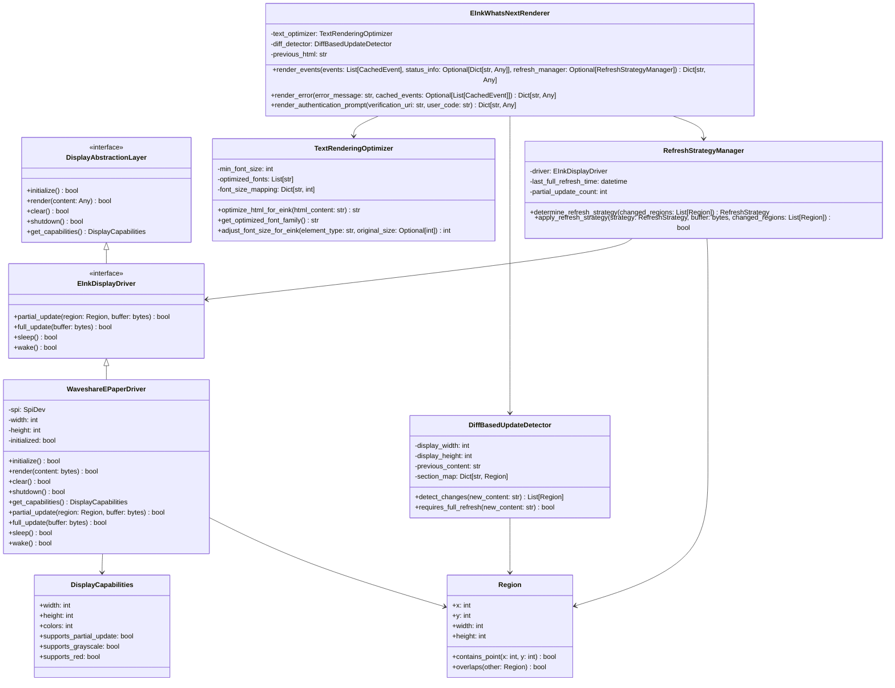
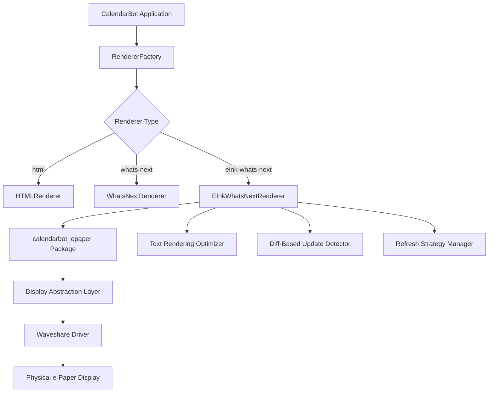

# Package Structure and Integration Diagram

## Package Structure



## Integration with CalendarBot



## Package Installation and Deployment

```mermaid
flowchart TD
    A[Development Environment] --> B[Create Package]
    B --> C[Test in Virtual Environment]
    C --> D{Tests Pass?}
    D -->|No| B
    D -->|Yes| E[Build Package]
    E --> F[Deploy to Raspberry Pi]
    F --> G[Install Package]
    G --> H[Run CalendarBot with e-Paper Support]
    H --> I[Verify Display Output]