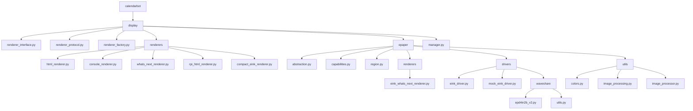

# New Unified Directory Structure

This document outlines the proposed unified directory structure for the calendarbot package that incorporates the e-Paper functionality from calendarbot_epaper.

## Design Principles

1. **Simplicity**: Keep the structure as simple as possible to improve maintainability
2. **Logical Organization**: Group related functionality together
3. **Separation of Concerns**: Keep hardware-specific code isolated from generic code
4. **Consistent Naming**: Use consistent naming conventions throughout
5. **Minimize Import Complexity**: Eliminate complex import fallbacks

## Proposed Directory Structure

```
calendarbot/
├── __init__.py
├── main.py
├── setup_wizard.py
├── display/                    # Display abstraction and renderers
│   ├── __init__.py
│   ├── renderer_interface.py   # Abstract base class for renderers
│   ├── renderer_protocol.py    # Protocol definition for renderers
│   ├── renderer_factory.py     # Factory for creating renderers
│   ├── renderers/              # All renderer implementations
│   │   ├── __init__.py
│   │   ├── html_renderer.py    # HTML renderer
│   │   ├── console_renderer.py # Console renderer
│   │   ├── whats_next_renderer.py # Web-based WhatsNext renderer
│   │   ├── rpi_html_renderer.py # Raspberry Pi HTML renderer
│   │   └── compact_eink_renderer.py # Compact e-ink renderer
│   ├── epaper/                 # E-Paper specific functionality
│   │   ├── __init__.py
│   │   ├── abstraction.py      # Display abstraction layer interfaces
│   │   ├── capabilities.py     # Display capabilities model
│   │   ├── region.py           # Region model for partial updates
│   │   ├── renderers/          # E-Paper specific renderers
│   │   │   ├── __init__.py
│   │   │   └── eink_whats_next_renderer.py # E-ink renderer for WhatsNext view
│   │   ├── drivers/            # Display drivers
│   │   │   ├── __init__.py
│   │   │   ├── eink_driver.py  # Base e-ink driver interface
│   │   │   ├── mock_eink_driver.py # Mock driver for testing
│   │   │   └── waveshare/      # Waveshare-specific drivers
│   │   │       ├── __init__.py
│   │   │       ├── epd4in2b_v2.py # Waveshare 4.2inch e-Paper Module (B) v2 driver
│   │   │       └── utils.py    # Utility functions for Waveshare drivers
│   │   └── utils/              # E-Paper specific utilities
│   │       ├── __init__.py
│   │       ├── colors.py       # Color mapping utilities
│   │       ├── image_processing.py # Image processing utilities
│   │       └── image_processor.py # Image processor
│   └── manager.py              # Display manager
├── utils/                      # General utilities
│   ├── __init__.py
│   ├── logging.py              # Logging utilities
│   └── ...
└── ...
```

## Key Changes

1. **Consolidated Renderers**: All renderer implementations are now in `calendarbot/display/renderers/` for better organization.

2. **E-Paper as a Submodule**: All e-Paper specific functionality is now in `calendarbot/display/epaper/` to maintain separation of concerns while being part of the main package.

3. **Simplified Imports**: With this structure, imports become simpler:
   - From: `from calendarbot_epaper.integration.eink_whats_next_renderer import EInkWhatsNextRenderer`
   - To: `from calendarbot.display.epaper.renderers.eink_whats_next_renderer import EInkWhatsNextRenderer`

4. **Logical Grouping**: Related functionality is grouped together:
   - All display-related code is in `calendarbot/display/`
   - All renderer implementations are in `calendarbot/display/renderers/`
   - All e-Paper specific code is in `calendarbot/display/epaper/`

## Mermaid Diagram



## Benefits of New Structure

1. **Simplified Installation**: Only one package to install, with optional dependencies for e-Paper hardware.

2. **Cleaner Imports**: No more complex try/except blocks for imports between packages.

3. **Better Organization**: Related functionality is grouped together logically.

4. **Improved Maintainability**: Easier to understand and maintain with a single package structure.

5. **Clearer Separation**: Hardware-specific code is still isolated in the epaper submodule.

6. **Extensibility**: The structure allows for easy addition of new display types or renderers in the future.