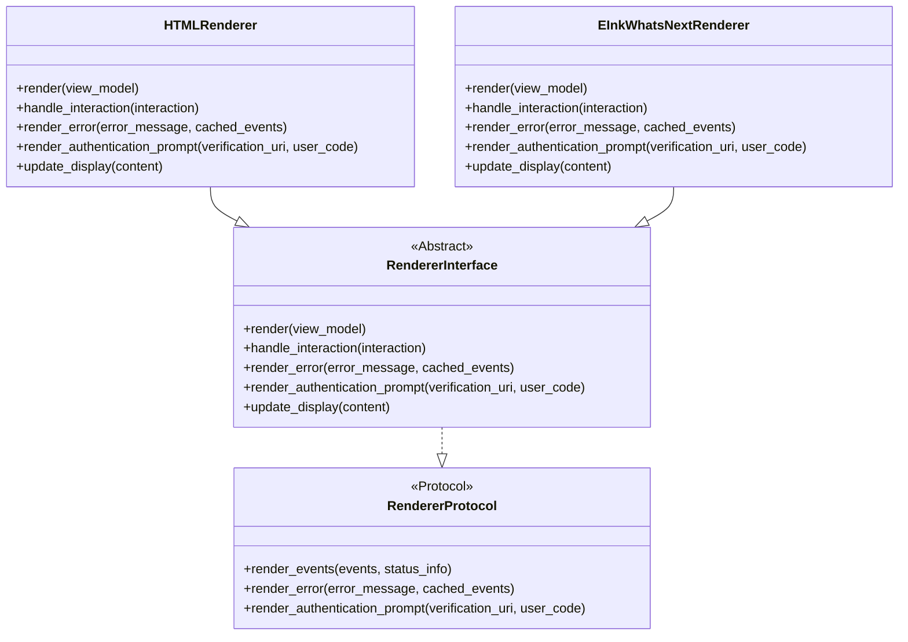
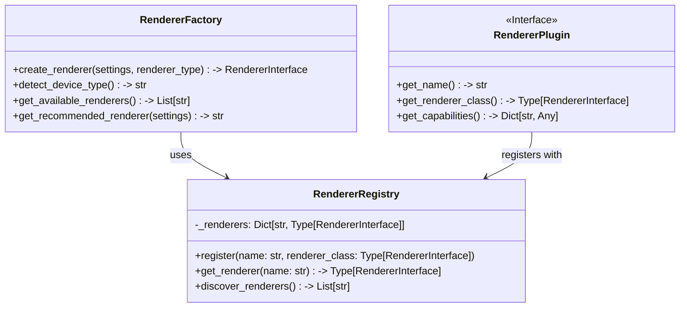
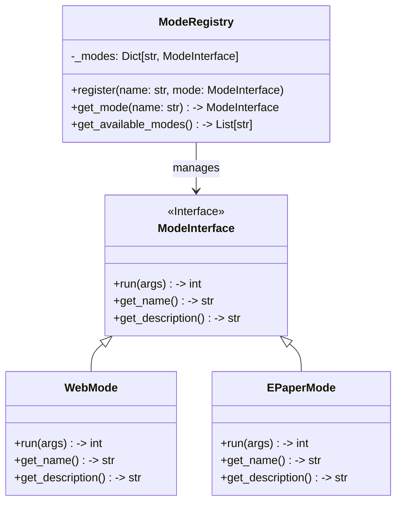

# CalendarBot Package Integration Plan

## Overview

This document outlines the integration plan for merging the `calendarbot` and `calendarbot_epaper` packages into a unified codebase. The integration will maintain the existing protocol-based architecture while simplifying installation, configuration, and usage.

## 1. Unified Project Structure

### Current Structure

```
calendarbot/
├── calendarbot/
│   ├── cli/
│   ├── display/
│   │   ├── renderer_interface.py
│   │   ├── renderer_protocol.py
│   │   └── ...
│   ├── web/
│   └── ...
└── calendarbot_epaper/
    ├── display/
    ├── drivers/
    ├── integration/
    │   └── eink_whats_next_renderer.py
    └── ...
```

### Proposed Structure

```
calendarbot/
├── calendarbot/
│   ├── cli/
│   │   ├── modes/
│   │   │   ├── web.py
│   │   │   ├── epaper.py (new)
│   │   │   └── ...
│   │   └── ...
│   ├── display/
│   │   ├── renderer_interface.py
│   │   ├── renderer_protocol.py
│   │   ├── renderers/
│   │   │   ├── html_renderer.py
│   │   │   ├── console_renderer.py
│   │   │   └── ...
│   │   └── ...
│   ├── epaper/ (moved from calendarbot_epaper)
│   │   ├── display/
│   │   ├── drivers/
│   │   ├── renderers/
│   │   │   └── eink_whats_next_renderer.py
│   │   └── ...
│   ├── web/
│   └── ...
└── ...
```

### Key Changes:

1. **Move E-Paper Modules**: Relocate all e-paper specific modules to `calendarbot/epaper/` directory
2. **Reorganize Renderers**: Group all renderers in a dedicated `renderers/` subdirectory
3. **Add E-Paper Mode**: Create a dedicated CLI mode for e-paper operation
4. **Maintain Separation**: Keep logical separation between web and e-paper components

## 2. CLI Architecture

### Current CLI Structure

The current CLI uses a mode-based approach with flags like `--web`, `--interactive`, and `--rpi` to determine operation mode. The `--rpi` flag is used to configure e-paper display settings.

### Proposed CLI Architecture

```
calendarbot [global options] <mode> [mode-specific options]
```

Where:
- `<mode>` is one of: `web`, `epaper`, `interactive`, `test`, `daemon`
- `[global options]` apply to all modes
- `[mode-specific options]` only apply to the selected mode

### Mode-Specific Arguments

1. **Web Mode**:
   ```
   calendarbot web [--port PORT] [--host HOST] [--auto-open]
   ```

2. **E-Paper Mode**:
   ```
   calendarbot epaper [--display-type TYPE] [--refresh-mode MODE] [--width WIDTH] [--height HEIGHT]
   ```

3. **Shared Options**:
   ```
   calendarbot [--verbose] [--log-level LEVEL] [--config CONFIG]
   ```

### Implementation Strategy

1. **Argument Parser Factory**:
   ```python
   class ArgumentParserFactory:
       @staticmethod
       def create_parser() -> argparse.ArgumentParser:
           # Create base parser with global options
           
       @staticmethod
       def add_web_mode_args(parser: argparse.ArgumentParser) -> None:
           # Add web mode specific arguments
           
       @staticmethod
       def add_epaper_mode_args(parser: argparse.ArgumentParser) -> None:
           # Add e-paper mode specific arguments
   ```

2. **Mode Handler Registry**:
   ```python
   class ModeRegistry:
       _handlers = {
           "web": run_web_mode,
           "epaper": run_epaper_mode,
           "interactive": run_interactive_mode,
           # ...
       }
       
       @classmethod
       def get_handler(cls, mode: str) -> Callable:
           return cls._handlers.get(mode)
   ```

3. **Main Entry Point**:
   ```python
   async def main_entry() -> int:
       parser = ArgumentParserFactory.create_parser()
       args = parser.parse_args()
       
       # Get handler for selected mode
       handler = ModeRegistry.get_handler(args.mode)
       if handler:
           return await handler(args)
       else:
           # Default to web mode
           return await run_web_mode(args)
   ```

## 3. Configuration Management

### Current Configuration

The current system uses a combination of:
- YAML configuration files
- Command-line arguments
- Environment variables
- Pydantic settings models

### Proposed Configuration System

1. **Unified Settings Model**:
   ```python
   class CalendarBotSettings(BaseSettings):
       # Common settings
       log_level: str = "INFO"
       
       # Web mode settings
       web_host: str = "0.0.0.0"
       web_port: int = 8080
       
       # E-Paper mode settings
       epaper_display_type: str = "waveshare_4in2b_v2"
       epaper_width: int = 400
       epaper_height: int = 300
       epaper_refresh_mode: str = "partial"
       
       class Config:
           env_prefix = "CALENDARBOT_"
           env_nested_delimiter = "__"
   ```

2. **Mode-Specific Settings**:
   ```python
   class WebModeSettings(BaseModel):
       host: str
       port: int
       auto_open: bool
   
   class EPaperModeSettings(BaseModel):
       display_type: str
       width: int
       height: int
       refresh_mode: str
   ```

3. **Configuration Loading Sequence**:
   1. Load default settings
   2. Override with config file values
   3. Override with environment variables
   4. Override with command-line arguments

4. **Configuration Validation**:
   - Validate settings based on selected mode
   - Provide clear error messages for invalid configurations

## 4. Module Organization

### Renderer System



### Plugin System



### Mode System



## 5. Dependency Management

### Current Dependencies

1. **Main Package**:
   - Core dependencies (requests, pydantic, etc.)
   - Optional e-paper dependencies

2. **E-Paper Package**:
   - Hardware-specific dependencies (RPi.GPIO, spidev)
   - Image processing dependencies (Pillow, numpy)

### Proposed Dependency Strategy

1. **Core Dependencies**:
   ```toml
   # pyproject.toml
   dependencies = [
       "icalendar>=5.0.0",
       "httpx>=0.25.0",
       "aiosqlite>=0.19.0",
       "pydantic>=2.0.0",
       "pydantic-settings>=2.0.0",
       "PyYAML>=6.0",
       "python-dateutil>=2.8.0",
       "pytz>=2023.3",
       "cryptography>=41.0.0",
       "APScheduler>=3.10.0",
       "psutil>=5.8.0",
   ]
   ```

2. **Optional Dependencies**:
   ```toml
   # pyproject.toml
   [project.optional-dependencies]
   epaper = [
       "RPi.GPIO>=0.7.1",
       "spidev>=3.5",
       "Pillow>=9.0.0",
       "numpy>=1.20.0",
   ]
   rpi = [
       "RPi.GPIO>=0.7.1",
       "spidev>=3.5",
   ]
   ```

3. **Runtime Import Strategy**:
   ```python
   def has_epaper_support() -> bool:
       """Check if e-paper support is available."""
       try:
           import RPi.GPIO
           import spidev
           from PIL import Image
           import numpy
           return True
       except ImportError:
           return False
   
   def create_epaper_renderer(settings: Any) -> Optional[RendererInterface]:
       """Create e-paper renderer if dependencies are available."""
       if not has_epaper_support():
           logger.warning("E-paper support not available. Missing dependencies.")
           return None
       
       try:
           from calendarbot.epaper.renderers.eink_whats_next_renderer import EInkWhatsNextRenderer
           return EInkWhatsNextRenderer(settings)
       except ImportError as e:
           logger.error(f"Failed to import e-paper renderer: {e}")
           return None
   ```

4. **Installation Instructions**:
   ```
   # Basic installation
   pip install calendarbot
   
   # With e-paper support
   pip install calendarbot[epaper]
   
   # With Raspberry Pi support
   pip install calendarbot[rpi]
   ```

## 6. Implementation Roadmap

### Phase 1: Project Structure Reorganization

1. Create new directory structure in main package
2. Move e-paper modules to appropriate locations
3. Update imports and references
4. Ensure tests pass with new structure

### Phase 2: CLI Architecture Implementation

1. Implement argument parser factory
2. Create mode registry system
3. Implement mode-specific argument handlers
4. Update main entry point to use new CLI architecture

### Phase 3: Configuration System Enhancement

1. Create unified settings model
2. Implement mode-specific settings validation
3. Update configuration loading sequence
4. Add configuration documentation

### Phase 4: Plugin System Development

1. Implement renderer registry
2. Create plugin interface
3. Update renderer factory to use registry
4. Implement automatic renderer discovery

### Phase 5: Dependency Management

1. Update pyproject.toml with new dependency structure
2. Implement runtime dependency checking
3. Add graceful fallbacks for missing dependencies
4. Update documentation with installation instructions

### Phase 6: Testing and Documentation

1. Update unit tests for new architecture
2. Add integration tests for e-paper mode
3. Update user documentation
4. Create developer guide for extending the system

## 7. Backward Compatibility

To maintain backward compatibility:

1. **CLI Compatibility**:
   - Support legacy `--rpi` flag by mapping to `epaper` mode
   - Maintain support for existing command-line arguments

2. **Configuration Compatibility**:
   - Support existing configuration file format
   - Provide migration guide for users

3. **API Compatibility**:
   - Maintain existing public APIs
   - Use deprecation warnings for changed APIs

## 8. Conclusion

This integration plan provides a comprehensive approach to merging the calendarbot and calendarbot-epaper packages while maintaining the strengths of the current architecture. The proposed changes will simplify installation, improve configuration, and enhance extensibility through a plugin system.

The implementation roadmap provides a clear path forward, with each phase building on the previous one. By following this plan, the integration can be completed with minimal disruption to existing users while providing a more cohesive and maintainable codebase.