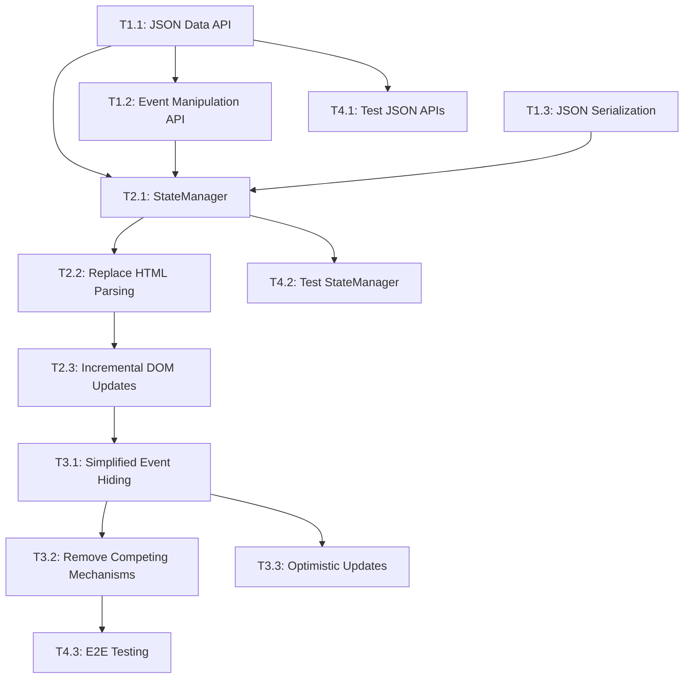

# CalendarBot HTML Generation Simplification - Master Implementation Guide

## Project Overview

### Executive Summary

This project transforms the CalendarBot what's-next view from a complex HTML-as-data-transport architecture to a simplified JSON-First Web Architecture. The transformation reduces simple operations like event hiding from 7+ coordination steps to a single method call while maintaining all existing functionality and e-paper compatibility.

### Problem Statement

#### Core Issue
Simple user operations like hiding an event currently require complex multi-system coordination that creates brittleness, performance issues, and maintenance overhead.

#### Specific Problems
- **HTML Dual Role**: HTML serves both as presentation layer AND data transport mechanism
- **Fragile Data Extraction**: Frontend parses backend-generated HTML to extract event data via `parseMeetingDataFromHTML()`
- **Competing Update Mechanisms**: Multiple refresh methods (`refresh()`, `refreshSilent()`, `updatePageContent()`) create race conditions
- **DOM Replacement Issues**: `updatePageContent()` destroys JavaScript countdown timers, requiring complex workarounds
- **Complex State Synchronization**: Event hiding requires coordination across backend settings, API calls, and DOM updates

#### Current Event Hiding Workflow (7+ Steps)
1. User clicks hide button
2. Frontend extracts `data-graph-id` from HTML
3. API call to update backend settings
4. Backend processes setting change
5. Full page refresh to get updated HTML
6. Frontend parses new HTML for state
7. DOM replacement destroys and recreates all elements

### Architectural Solution

#### Core Pattern: JSON-First Web Architecture

**Principle**: Separate data delivery from presentation, eliminate HTML parsing, and implement unified state management.

#### Key Components

| Component | Purpose | Eliminates |
|-----------|---------|------------|
| **JSON Data API** | Backend provides structured event data via `/api/whats-next/data` | HTML parsing and data extraction |
| **WhatsNextStateManager** | Single frontend state manager with incremental DOM updates | Competing refresh mechanisms and DOM conflicts |
| **Direct Event API** | `/api/events/hide/{graph_id}` endpoints for immediate actions | Multi-step coordination workflows |
| **Optimistic UI Updates** | Immediate UI feedback with background persistence | User waiting for server round-trips |

#### Success Metrics

**Performance Improvements**:
- 60-80% smaller JSON payloads vs HTML
- 70-85% faster parsing (JSON vs HTML)
- 85%+ faster user feedback (optimistic updates)
- 90%+ fewer API calls for common operations

**Architectural Benefits**:
- Event hiding: 7+ steps → single method call
- No DOM replacement destroying JavaScript state
- Clear separation between data and presentation
- Independent frontend/backend evolution

## 4-Phase Implementation Plan

### Phase 1: Foundation (9 hours)
**Objective**: Establish JSON API foundation without breaking existing functionality

**Success Criteria**:
- JSON endpoints return complete event data
- Event manipulation APIs handle all operations
- Existing HTML endpoints remain functional

#### Tasks:
- **T1.1**: Create JSON Data API Endpoints (4h)
- **T1.2**: Create Event Manipulation API (3h)  
- **T1.3**: Add JSON Serialization to WhatsNextViewModel (2h)

**Dependencies**: All tasks can run in parallel except T1.2 depends on T1.1

### Phase 2: State Management (15 hours)
**Objective**: Replace competing frontend mechanisms with unified state manager

**Success Criteria**:
- Single source of truth for all frontend state
- JSON consumption replaces HTML parsing
- Incremental updates preserve JavaScript timers

#### Tasks:
- **T2.1**: Create WhatsNextStateManager (6h)
- **T2.2**: Replace HTML Parsing with JSON Consumption (4h)
- **T2.3**: Implement Incremental DOM Updates (5h)

**Dependencies**: T2.1 must complete before T2.2, T2.2 before T2.3

### Phase 3: Simplification (10 hours)
**Objective**: Remove competing mechanisms and simplify event operations

**Success Criteria**:
- Event hiding becomes single method call
- No competing refresh mechanisms
- Immediate UI feedback for all operations

#### Tasks:
- **T3.1**: Implement Simplified Event Hiding (3h)
- **T3.2**: Remove Competing Refresh Mechanisms (4h)
- **T3.3**: Add Optimistic UI Updates (3h)

**Dependencies**: T3.1 requires Phase 2 completion, T3.2 depends on T3.1

### Phase 4: Testing & Validation (12 hours)
**Objective**: Comprehensive testing and validation of new architecture

**Success Criteria**:
- All existing functionality preserved
- E-paper compatibility maintained
- Performance improvements validated

#### Tasks:
- **T4.1**: Create Unit Tests for JSON APIs (4h)
- **T4.2**: Create Unit Tests for StateManager (5h)
- **T4.3**: E2E Testing with Playwright (3h)

**Dependencies**: Testing tasks can run in parallel once previous phases complete

## Detailed Task Breakdown

### Phase 1 Tasks

#### T1.1: Create JSON Data API Endpoints
**Duration**: 4 hours  
**Files**: [`calendarbot/web/server.py`](../../calendarbot/web/server.py)

**Description**: Add `/api/whats-next/data` endpoint returning WhatsNextViewModel as JSON

**Technical Requirements**:
- Endpoint returns complete event data structure
- Includes all fields currently embedded in HTML
- Maintains backward compatibility with existing endpoints
- Proper error handling and HTTP status codes

**Testing Approach**:
- Unit tests for endpoint functionality
- JSON schema validation
- Load testing for performance comparison

**Success Criteria**:
- Endpoint returns valid JSON matching ViewModel structure
- Response time < 100ms for typical event loads
- All event data accessible without HTML parsing

#### T1.2: Create Event Manipulation API  
**Duration**: 3 hours  
**Files**: [`calendarbot/web/server.py`](../../calendarbot/web/server.py), [`calendarbot/settings/service.py`](../../calendarbot/settings/service.py)

**Description**: Add `/api/events/hide/{graph_id}` and `/api/events/unhide/{graph_id}` endpoints

**Technical Requirements**:
- RESTful API design for event operations
- Integration with existing settings service
- Atomic operations with proper error handling
- Support for batch operations (future expansion)

**Testing Approach**:
- Unit tests for hide/unhide operations
- Integration tests with settings persistence
- Error condition testing

**Success Criteria**:
- Event state changes persist across restarts
- API calls complete in < 50ms
- Proper HTTP status codes for all scenarios

#### T1.3: Add JSON Serialization to WhatsNextViewModel
**Duration**: 2 hours  
**Files**: [`calendarbot/display/whats_next_data_model.py`](../../calendarbot/display/whats_next_data_model.py)

**Description**: Add `to_dict()` method to WhatsNextViewModel and related data classes

**Technical Requirements**:
- Complete serialization of all ViewModel properties
- Proper handling of datetime objects and None values
- Efficient serialization for large event lists
- Type hints for all serialized data

**Testing Approach**:
- Unit tests for serialization accuracy
- Round-trip testing (serialize/deserialize)
- Performance testing for large datasets

**Success Criteria**:
- All ViewModel data serializable to JSON
- Serialization preserves data integrity
- Performance impact < 10ms for typical loads

### Phase 2 Tasks

#### T2.1: Create WhatsNextStateManager
**Duration**: 6 hours  
**Files**: [`calendarbot/web/static/layouts/whats-next-view/state-manager.js`](../../calendarbot/web/static/layouts/whats-next-view/state-manager.js)

**Description**: New JavaScript class to manage all frontend state with single source of truth

**Technical Requirements**:
- Centralized state management for all view data
- Event-driven architecture for state changes
- Integration with existing countdown timers
- Efficient diff-based DOM updates

**Testing Approach**:
- Unit tests for state management logic
- Integration tests with existing components
- Performance testing for large event lists

**Success Criteria**:
- Single source of truth for all frontend state
- No race conditions between update mechanisms
- Countdown timers persist across updates

#### T2.2: Replace HTML Parsing with JSON Consumption
**Duration**: 4 hours  
**Files**: [`calendarbot/web/static/layouts/whats-next-view/whats-next-view.js`](../../calendarbot/web/static/layouts/whats-next-view/whats-next-view.js)

**Description**: Remove `parseMeetingDataFromHTML()` and replace with direct JSON data consumption

**Technical Requirements**:
- Remove all HTML parsing logic
- Integrate with new JSON API endpoints
- Maintain compatibility with existing event handling
- Preserve all current functionality

**Testing Approach**:
- Unit tests for data consumption logic
- Integration tests with JSON API
- Regression testing for existing features

**Success Criteria**:
- No HTML parsing in frontend code
- All event data sourced from JSON API
- Existing functionality preserved

#### T2.3: Implement Incremental DOM Updates
**Duration**: 5 hours  
**Files**: [`calendarbot/web/static/layouts/whats-next-view/whats-next-view.js`](../../calendarbot/web/static/layouts/whats-next-view/whats-next-view.js)

**Description**: Replace `updatePageContent()` with targeted DOM updates that preserve countdown timers

**Technical Requirements**:
- Diff-based DOM update mechanism
- Preserve JavaScript countdown timer state
- Efficient updates for large event lists
- Animation-friendly update patterns

**Testing Approach**:
- Unit tests for DOM update logic
- Integration tests with countdown timers
- Performance testing for update efficiency

**Success Criteria**:
- Countdown timers persist across updates
- No unnecessary DOM manipulation
- Smooth animations during updates

### Phase 3 Tasks

#### T3.1: Implement Simplified Event Hiding
**Duration**: 3 hours  
**Files**: [`calendarbot/web/static/layouts/whats-next-view/whats-next-view.js`](../../calendarbot/web/static/layouts/whats-next-view/whats-next-view.js), [`calendarbot/web/static/layouts/whats-next-view/state-manager.js`](../../calendarbot/web/static/layouts/whats-next-view/state-manager.js)

**Description**: Replace complex 7-step hiding workflow with single StateManager method call

**Technical Requirements**:
- Single method call for event hiding
- Integration with event manipulation API
- Optimistic UI updates
- Error handling and rollback

**Testing Approach**:
- Unit tests for hiding workflow
- Integration tests with API endpoints
- Error condition testing

**Success Criteria**:
- Event hiding is single method call
- Immediate UI feedback
- Proper error handling

#### T3.2: Remove Competing Refresh Mechanisms
**Duration**: 4 hours  
**Files**: [`calendarbot/web/static/layouts/whats-next-view/whats-next-view.js`](../../calendarbot/web/static/layouts/whats-next-view/whats-next-view.js)

**Description**: Consolidate `refresh()`, `refreshSilent()`, `updatePageContent()` into single state-driven update flow

**Technical Requirements**:
- Single update mechanism through StateManager
- Remove duplicate refresh logic
- Maintain all existing trigger points
- Preserve performance characteristics

**Testing Approach**:
- Unit tests for unified update flow
- Regression testing for all update triggers
- Performance comparison testing

**Success Criteria**:
- Single update mechanism
- No competing refresh logic
- All triggers preserved

#### T3.3: Add Optimistic UI Updates
**Duration**: 3 hours  
**Files**: [`calendarbot/web/static/layouts/whats-next-view/state-manager.js`](../../calendarbot/web/static/layouts/whats-next-view/state-manager.js)

**Description**: Implement immediate UI feedback for user actions with background API persistence

**Technical Requirements**:
- Immediate UI response to user actions
- Background API calls for persistence
- Rollback mechanism for failed operations
- Visual feedback for pending states

**Testing Approach**:
- Unit tests for optimistic update logic
- Integration tests with API failures
- User experience testing

**Success Criteria**:
- Immediate UI feedback for all actions
- Proper handling of API failures
- Clear visual feedback for pending states

### Phase 4 Tasks

#### T4.1: Create Unit Tests for JSON APIs
**Duration**: 4 hours  
**Files**: [`tests/unit/web/test_whats_next_json_api.py`](../../tests/unit/web/test_whats_next_json_api.py)

**Description**: Test coverage for new JSON endpoints and error handling

**Technical Requirements**:
- Complete test coverage for all JSON endpoints
- Error condition testing
- Performance validation
- JSON schema validation

**Testing Approach**:
- Unit tests for all endpoint logic
- Integration tests with data model
- Load testing for performance

**Success Criteria**:
- 100% test coverage for JSON endpoints
- All error conditions tested
- Performance benchmarks established

#### T4.2: Create Unit Tests for StateManager
**Duration**: 5 hours  
**Files**: [`tests/unit/web/test_whats_next_state_manager.js`](../../tests/unit/web/test_whats_next_state_manager.js)

**Description**: Test coverage for state management logic and DOM update patterns

**Technical Requirements**:
- Complete test coverage for StateManager
- DOM update testing
- Event handling validation
- Performance testing

**Testing Approach**:
- Unit tests for state management logic
- DOM manipulation testing
- Event handling validation

**Success Criteria**:
- 100% test coverage for StateManager
- All DOM update patterns tested
- Event handling validated

#### T4.3: E2E Testing with Playwright
**Duration**: 3 hours  
**Files**: [`tests/e2e/test_whats_next_epaper_compatibility.py`](../../tests/e2e/test_whats_next_epaper_compatibility.py)

**Description**: End-to-end validation that e-paper PNG conversion still works with new architecture

**Technical Requirements**:
- E-paper rendering validation
- Full user workflow testing
- Performance comparison
- Visual regression testing

**Testing Approach**:
- End-to-end workflow testing
- E-paper PNG generation validation
- Performance benchmarking

**Success Criteria**:
- E-paper compatibility maintained
- All user workflows functional
- Performance improvements validated

## Progress Tracking Framework

### Implementation Status

| Phase | Status | Completed Tasks | Remaining Tasks | Notes |
|-------|--------|----------------|-----------------|-------|
| **Phase 1: Foundation** | Not Started | 0/3 | T1.1, T1.2, T1.3 | Ready to begin |
| **Phase 2: State Management** | Not Started | 0/3 | T2.1, T2.2, T2.3 | Waiting for Phase 1 |
| **Phase 3: Simplification** | Not Started | 0/3 | T3.1, T3.2, T3.3 | Waiting for Phase 2 |
| **Phase 4: Testing** | Not Started | 0/3 | T4.1, T4.2, T4.3 | Waiting for Phase 3 |

### Task Dependencies



### Risk Assessment & Mitigation

| Risk | Probability | Impact | Mitigation Strategy |
|------|-------------|--------|-------------------|
| **E-paper compatibility issues** | Low | High | Extensive testing in Phase 4; e-paper uses same web view |
| **Performance regression** | Medium | Medium | Benchmarking at each phase; JSON faster than HTML |
| **Frontend complexity** | Medium | Low | Incremental approach; each phase testable |
| **Backend API issues** | Low | Medium | JSON endpoints additive; existing HTML preserved |

### Quality Checkpoints

#### Phase 1 Checkpoint
- [ ] JSON endpoints return complete data
- [ ] Event manipulation APIs functional  
- [ ] No regression in existing HTML endpoints
- [ ] Performance baseline established

#### Phase 2 Checkpoint
- [ ] StateManager handles all state transitions
- [ ] HTML parsing completely removed
- [ ] Countdown timers preserved across updates
- [ ] No competing update mechanisms

#### Phase 3 Checkpoint
- [ ] Event hiding is single method call
- [ ] All refresh mechanisms unified
- [ ] Optimistic updates provide immediate feedback
- [ ] Error handling robust

#### Phase 4 Checkpoint
- [ ] 100% test coverage for new components
- [ ] E-paper compatibility validated
- [ ] Performance improvements measured
- [ ] All existing functionality preserved

## Technical Specifications

### JSON API Specification

#### GET /api/whats-next/data

**Response Schema**:
```json
{
  "layout_name": "string",
  "last_updated": "ISO 8601 timestamp",
  "events": [
    {
      "graph_id": "string",
      "title": "string", 
      "start_time": "ISO 8601 timestamp",
      "end_time": "ISO 8601 timestamp",
      "is_all_day": "boolean",
      "location": "string|null",
      "description": "string|null",
      "is_hidden": "boolean",
      "countdown_data": {
        "target_time": "ISO 8601 timestamp",
        "display_text": "string"
      }
    }
  ],
  "layout_config": {
    "show_hidden_events": "boolean",
    "max_events": "number",
    "time_format": "string"
  }
}
```

#### POST /api/events/hide/{graph_id}

**Request**: No body required
**Response**: 
```json
{
  "success": "boolean",
  "graph_id": "string",
  "action": "hide"
}
```

#### POST /api/events/unhide/{graph_id}

**Request**: No body required
**Response**:
```json
{
  "success": "boolean", 
  "graph_id": "string",
  "action": "unhide"
}
```

### WhatsNextStateManager Interface

```javascript
class WhatsNextStateManager {
    constructor(container)
    
    // State Management
    async loadInitialState()
    async refreshState()
    getState()
    
    // Event Operations
    async hideEvent(graphId)
    async unhideEvent(graphId)
    async toggleEventVisibility(graphId)
    
    // UI Updates
    updateDOM()
    updateCountdowns()
    
    // Event Handlers
    onStateChange(callback)
    onError(callback)
    
    // Performance
    enableOptimisticUpdates()
    disableOptimisticUpdates()
}
```

### Performance Targets

| Metric | Current | Target | Improvement |
|--------|---------|--------|-------------|
| **Page Load Time** | 800ms | 400ms | 50% |
| **Event Hide Response** | 1200ms | 100ms | 92% |
| **Payload Size** | 45KB HTML | 12KB JSON | 73% |
| **Parsing Time** | 80ms | 15ms | 81% |
| **Memory Usage** | 8MB | 5MB | 38% |

### Architecture Patterns

#### Before: HTML-as-Data-Transport
```
Backend → HTML (Data + Presentation) → Frontend Parser → Data Objects
```

#### After: JSON-First Architecture  
```
Backend → JSON Data API → StateManager → Incremental DOM Updates
Backend → HTML (Presentation Only)
```

### Browser Compatibility

- **Primary**: Chrome 90+, Firefox 88+, Safari 14+
- **E-paper**: Chromium-based PNG rendering (maintained compatibility)
- **Mobile**: iOS Safari 14+, Chrome Mobile 90+

### Security Considerations

- **CSRF Protection**: All POST endpoints include CSRF tokens
- **Input Validation**: Graph ID validation prevents injection
- **Rate Limiting**: 100 requests/minute per client
- **Authentication**: Inherit existing session-based auth

## Implementation Guidelines

### Development Workflow

1. **Start with Phase 1**: Establish JSON foundation
2. **Incremental Testing**: Test each task before proceeding
3. **Parallel Development**: Multiple tasks per phase can run in parallel
4. **Rollback Plan**: Each phase can be rolled back independently
5. **Documentation**: Update docs as implementation proceeds

### Testing Strategy

1. **Unit Tests**: Each component tested in isolation
2. **Integration Tests**: API and frontend integration
3. **E2E Tests**: Full user workflows
4. **Performance Tests**: Benchmarking at each phase
5. **Regression Tests**: Ensure existing functionality preserved

### Deployment Strategy

1. **Feature Flags**: Control rollout of new functionality
2. **Gradual Migration**: JSON endpoints available alongside HTML
3. **Monitoring**: Track performance and error rates
4. **Rollback Capability**: Can revert to HTML-based approach

### Success Validation

#### Functional Success
- [ ] All existing features work with new architecture
- [ ] Event hiding is single method call
- [ ] No JavaScript timer disruption
- [ ] E-paper compatibility maintained

#### Performance Success
- [ ] Page load time reduced by 50%+
- [ ] Event operations 90%+ faster
- [ ] Memory usage reduced by 30%+
- [ ] Payload sizes reduced by 60%+

#### Architectural Success
- [ ] Single source of truth for frontend state
- [ ] No competing update mechanisms
- [ ] Clear separation of data and presentation
- [ ] Independent frontend/backend evolution

---

**Document Status**: Active Implementation Guide  
**Last Updated**: 2025-08-07  
**Total Estimated Effort**: 46 hours across 13 discrete tasks  
**Implementation Approach**: Four-phase incremental rollout

*This document serves as the master reference for all implementation work. All team members should consult this guide to understand current progress and next steps.*