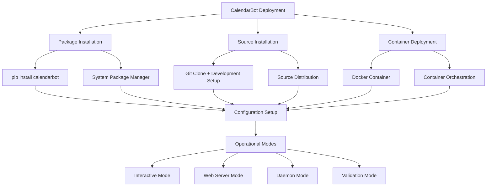

# Deployment Guide

**Document Version:** 2.0
**Last Updated:** January 7, 2025
**System Version:** CalendarBot v1.0.0 - ICS Calendar System
**Target Audience:** System Administrators, DevOps Engineers, End Users

This guide covers deployment methods for CalendarBot, including package installation, containerization, and service configuration. All deployment methods focus on application-level setup without hardware-specific requirements.

## Table of Contents

- [Deployment Overview](#deployment-overview)
- [Package Installation](#package-installation)
- [Configuration Management](#configuration-management)
- [Service Deployment](#service-deployment)
- [Web Server Deployment](#web-server-deployment)
- [Container Deployment](#container-deployment)
- [Monitoring and Maintenance](#monitoring-and-maintenance)
- [Performance Optimization](#performance-optimization)
- [Troubleshooting](#troubleshooting)

## Deployment Overview

### Deployment Methods

CalendarBot supports multiple deployment approaches:



### System Requirements

**Minimum Requirements**:
- Python 3.8+
- 100MB available storage
- 64MB RAM
- Network connectivity for ICS feeds

**Recommended Requirements**:
- Python 3.10+
- 500MB available storage
- 256MB RAM
- Stable internet connection

**Supported Platforms**:
- Linux (Ubuntu 20.04+, Debian 10+, CentOS 8+)
- macOS 10.15+
- Windows 10+ (WSL2 recommended)
- Container platforms (Docker, Podman)

## Package Installation

### Method 1: pip Installation (Recommended)

```bash
# Install from PyPI (when available)
pip install calendarbot

# Verify installation
calendarbot --version
calendarbot --help

# Run setup wizard
calendarbot --setup
```

### Method 2: Source Installation

```bash
# Clone repository
git clone https://github.com/calendarbot/calendarbot.git
cd calendarbot

# Install dependencies
pip install -r requirements.txt

# Install in development mode
pip install -e .

# Run setup wizard
calendarbot --setup
```

### Method 3: Wheel Installation

```bash
# Build wheel package
python -m build

# Install built wheel
pip install dist/calendarbot-*.whl

# Configure and test
calendarbot --setup
calendarbot --test-mode
```

### Virtual Environment (Recommended)

```bash
# Create isolated environment
python -m venv calendarbot-env
. calendarbot-env/bin/activate  # Windows: calendarbot-env\Scripts\activate

# Install CalendarBot
pip install calendarbot

# Configuration
calendarbot --setup
```

### System-wide Installation

```bash
# Install globally (requires sudo/admin)
sudo pip install calendarbot

# Create system user for service
sudo useradd --system --shell /bin/false calendarbot

# Setup configuration directory
sudo mkdir -p /etc/calendarbot
sudo chown calendarbot:calendarbot /etc/calendarbot
```

## Configuration Management

### Configuration Hierarchy

CalendarBot uses a hierarchical configuration system:

1. **Default Values**: Built into application code
2. **Configuration Files**: YAML files in standard locations
3. **Environment Variables**: `CALENDARBOT_*` prefixed variables
4. **Command Line Arguments**: Runtime overrides

### Configuration Locations

```bash
# Project directory (development)
./config/config.yaml

# User home directory
~/.config/calendarbot/config.yaml

# System directory (system-wide installations)
/etc/calendarbot/config.yaml

# Environment variables
export CALENDARBOT_ICS_URL="https://calendar.example.com/calendar.ics"
export CALENDARBOT_LOG_LEVEL="INFO"
export CALENDARBOT_WEB_PORT="8080"
```

### Initial Configuration

```bash
# Interactive setup wizard
calendarbot --setup

# Quick configuration
cat > ~/.config/calendarbot/config.yaml << EOF
# ICS Calendar Configuration
ics:
  url: "https://your-calendar-url.ics"
  auth_type: "none"
  verify_ssl: true
  timeout: 30

# Application Settings
app_name: "CalendarBot"
refresh_interval: 300
cache_ttl: 3600

# Logging Configuration
log_level: "WARNING"

# Display Settings
display_enabled: true
display_type: "html"

# Web Interface Settings
web:
  enabled: true
  port: 8080
  host: "0.0.0.0"
  web_layout: "4x8"
  auto_refresh: 60
EOF
```

### Configuration Validation

```bash
# Test configuration
calendarbot --test-mode --verbose

# Validate specific components
calendarbot --test-mode --components ics,cache

# Configuration backup and restore
calendarbot --backup
calendarbot --list-backups
calendarbot --restore backup_20250107_120000.yaml
```

## Service Deployment

### Systemd Service (Linux)

Create a systemd service for automatic startup and management:

```bash
# Create service file
sudo tee /etc/systemd/system/calendarbot.service << EOF
[Unit]
Description=CalendarBot ICS Calendar Display
Documentation=https://github.com/calendarbot/calendarbot
After=network-online.target
Wants=network-online.target
StartLimitIntervalSec=30
StartLimitBurst=3

[Service]
Type=simple
User=calendarbot
Group=calendarbot
WorkingDirectory=/opt/calendarbot
Environment=PATH=/opt/calendarbot/venv/bin:/usr/local/bin:/usr/bin:/bin
ExecStart=/opt/calendarbot/venv/bin/calendarbot --interactive
ExecReload=/bin/kill -HUP \$MAINPID
KillMode=mixed
KillSignal=SIGTERM
TimeoutStopSec=30

# Restart configuration
Restart=always
RestartSec=10

# Resource limits
MemoryMax=200M
CPUQuota=50%

# Security settings
NoNewPrivileges=true
PrivateTmp=true
ProtectSystem=strict
ProtectHome=true
ReadWritePaths=/opt/calendarbot /var/log/calendarbot

# Logging
StandardOutput=journal
StandardError=journal
SyslogIdentifier=calendarbot

[Install]
WantedBy=multi-user.target
EOF

# Enable and start service
sudo systemctl daemon-reload
sudo systemctl enable calendarbot.service
sudo systemctl start calendarbot.service

# Check service status
sudo systemctl status calendarbot.service
```

### Service Management Commands

```bash
# Start service
sudo systemctl start calendarbot.service

# Stop service
sudo systemctl stop calendarbot.service

# Restart service
sudo systemctl restart calendarbot.service

# Check status
sudo systemctl status calendarbot.service

# View logs
sudo journalctl -u calendarbot.service -f
sudo journalctl -u calendarbot.service --since="1 hour ago"
```

### Alternative Service Managers

**Supervisor (Process Control)**:

```ini
# /etc/supervisor/conf.d/calendarbot.conf
[program:calendarbot]
command=/opt/calendarbot/venv/bin/calendarbot --interactive
directory=/opt/calendarbot
user=calendarbot
autostart=true
autorestart=true
redirect_stderr=true
stdout_logfile=/var/log/calendarbot/calendarbot.log
environment=PATH="/opt/calendarbot/venv/bin:/usr/local/bin:/usr/bin:/bin"
```

**PM2 (Node.js Process Manager)**:

```bash
# Install PM2
npm install -g pm2

# Start CalendarBot with PM2
pm2 start calendarbot --name "calendar-display" --interpreter python3

# Save PM2 configuration
pm2 save
pm2 startup
```

## Web Server Deployment

### Standalone Web Server

```bash
# Run web server mode
calendarbot --web --port 8080 --host 0.0.0.0

# Background execution
nohup calendarbot --web --port 8080 > /var/log/calendarbot/web.log 2>&1 &

# Auto-open browser
calendarbot --web --port 3000 --auto-open
```

### Reverse Proxy Setup (nginx)

```nginx
# /etc/nginx/sites-available/calendarbot
server {
    listen 80;
    server_name calendar.yourdomain.com;

    location / {
        proxy_pass http://127.0.0.1:8080;
        proxy_set_header Host $host;
        proxy_set_header X-Real-IP $remote_addr;
        proxy_set_header X-Forwarded-For $proxy_add_x_forwarded_for;
        proxy_set_header X-Forwarded-Proto $scheme;

        # WebSocket support (if needed for future features)
        proxy_http_version 1.1;
        proxy_set_header Upgrade $http_upgrade;
        proxy_set_header Connection "upgrade";
    }

    # Static assets
    location /static/ {
        alias /opt/calendarbot/venv/lib/python3.*/site-packages/calendarbot/web/static/;
        expires 1d;
        add_header Cache-Control "public, immutable";
    }
}
```

### SSL/TLS Setup

```bash
# Install Certbot
sudo apt-get install certbot python3-certbot-nginx

# Obtain SSL certificate
sudo certbot --nginx -d calendar.yourdomain.com

# Auto-renewal
sudo crontab -e
# Add: 0 12 * * * /usr/bin/certbot renew --quiet
```

### Load Balancing (Multiple Instances)

```nginx
# nginx load balancer configuration
upstream calendarbot_backends {
    server 127.0.0.1:8080;
    server 127.0.0.1:8081;
    server 127.0.0.1:8082;
}

server {
    listen 80;
    server_name calendar.yourdomain.com;

    location / {
        proxy_pass http://calendarbot_backends;
        # ... proxy headers as above
    }
}
```

## Container Deployment

### Docker Deployment

**Dockerfile**:

```dockerfile
# Dockerfile
FROM python:3.10-slim

# Set working directory
WORKDIR /app

# Install system dependencies
RUN apt-get update && apt-get install -y \
    git \
    && rm -rf /var/lib/apt/lists/*

# Copy requirements and install Python dependencies
COPY requirements.txt .
RUN pip install --no-cache-dir -r requirements.txt

# Copy application code
COPY . .

# Install CalendarBot
RUN pip install -e .

# Create non-root user
RUN useradd --create-home --shell /bin/bash calendarbot
USER calendarbot

# Set environment variables
ENV CALENDARBOT_LOG_LEVEL=INFO
ENV CALENDARBOT_WEB_HOST=0.0.0.0
ENV CALENDARBOT_WEB_PORT=8080

# Expose port
EXPOSE 8080

# Health check
HEALTHCHECK --interval=30s --timeout=10s --start-period=5s --retries=3 \
    CMD calendarbot --test-mode --components ics || exit 1

# Default command
CMD ["calendarbot", "--web"]
```

**Build and Run**:

```bash
# Build Docker image
docker build -t calendarbot:latest .

# Run container
docker run -d \
    --name calendarbot \
    -p 8080:8080 \
    -e CALENDARBOT_ICS_URL="https://your-calendar.ics" \
    -v calendarbot-data:/home/calendarbot/.local/share/calendarbot \
    calendarbot:latest

# Check logs
docker logs calendarbot

# Interactive shell
docker exec -it calendarbot bash
```

### Docker Compose

```yaml
# docker-compose.yml
version: '3.8'

services:
  calendarbot:
    build: .
    ports:
      - "8080:8080"
    environment:
      - CALENDARBOT_ICS_URL=https://your-calendar.ics
      - CALENDARBOT_LOG_LEVEL=INFO
      - CALENDARBOT_WEB_LAYOUT=4x8
    volumes:
      - calendarbot-data:/home/calendarbot/.local/share/calendarbot
      - calendarbot-config:/home/calendarbot/.config/calendarbot
    restart: unless-stopped
    healthcheck:
      test: ["CMD", "calendarbot", "--test-mode", "--components", "ics"]
      interval: 30s
      timeout: 10s
      retries: 3
      start_period: 5s

  nginx:
    image: nginx:alpine
    ports:
      - "80:80"
      - "443:443"
    volumes:
      - ./nginx.conf:/etc/nginx/nginx.conf
      - ./ssl:/etc/nginx/ssl
    depends_on:
      - calendarbot
    restart: unless-stopped

volumes:
  calendarbot-data:
  calendarbot-config:
```

**Deployment Commands**:

```bash
# Start services
docker-compose up -d

# Scale CalendarBot instances
docker-compose up -d --scale calendarbot=3

# View logs
docker-compose logs -f calendarbot

# Update deployment
docker-compose pull
docker-compose up -d
```

### Kubernetes Deployment

```yaml
# kubernetes/deployment.yaml
apiVersion: apps/v1
kind: Deployment
metadata:
  name: calendarbot
  labels:
    app: calendarbot
spec:
  replicas: 2
  selector:
    matchLabels:
      app: calendarbot
  template:
    metadata:
      labels:
        app: calendarbot
    spec:
      containers:
      - name: calendarbot
        image: calendarbot:latest
        ports:
        - containerPort: 8080
        env:
        - name: CALENDARBOT_ICS_URL
          valueFrom:
            secretKeyRef:
              name: calendarbot-secrets
              key: ics-url
        - name: CALENDARBOT_LOG_LEVEL
          value: "INFO"
        volumeMounts:
        - name: calendarbot-data
          mountPath: /home/calendarbot/.local/share/calendarbot
        livenessProbe:
          exec:
            command:
            - calendarbot
            - --test-mode
            - --components
            - ics
          initialDelaySeconds: 30
          periodSeconds: 60
        readinessProbe:
          httpGet:
            path: /
            port: 8080
          initialDelaySeconds: 5
          periodSeconds: 10
      volumes:
      - name: calendarbot-data
        persistentVolumeClaim:
          claimName: calendarbot-pvc

---
apiVersion: v1
kind: Service
metadata:
  name: calendarbot-service
spec:
  selector:
    app: calendarbot
  ports:
  - protocol: TCP
    port: 80
    targetPort: 8080
  type: LoadBalancer
```

## Monitoring and Maintenance

### Application Monitoring

**Health Checks**:

```bash
# Built-in health check
calendarbot --test-mode --components ics,cache,display

# Custom health check script
#!/bin/bash
# health-check.sh
HEALTH_URL="http://<host-ip>:8080"
TIMEOUT=10

if curl -f -s --max-time $TIMEOUT $HEALTH_URL > /dev/null; then
    echo "CalendarBot is healthy"
    exit 0
else
    echo "CalendarBot health check failed"
    exit 1
fi
```

**Log Management**:

```bash
# Configure log rotation
sudo tee /etc/logrotate.d/calendarbot << EOF
/var/log/calendarbot/*.log {
    daily
    rotate 14
    compress
    delaycompress
    missingok
    notifempty
    create 644 calendarbot calendarbot
    postrotate
        systemctl reload calendarbot.service > /dev/null 2>&1 || true
    endscript
}
EOF
```

**Performance Monitoring**:

```bash
# System resource monitoring
htop
iotop
nethogs

# Application-specific monitoring
calendarbot --test-mode --verbose --output-format json > metrics.json

# Memory usage tracking
ps aux | grep calendarbot
pmap $(pgrep calendarbot)
```

### Automated Maintenance

**Backup Script**:

```bash
#!/bin/bash
# backup-calendarbot.sh
BACKUP_DIR="/opt/backups/calendarbot"
DATE=$(date +%Y%m%d_%H%M%S)

mkdir -p $BACKUP_DIR

# Backup configuration
cp -r ~/.config/calendarbot "$BACKUP_DIR/config_$DATE"

# Backup cache database
cp ~/.local/share/calendarbot/calendar_cache.db "$BACKUP_DIR/cache_$DATE.db"

# Clean old backups (keep last 7 days)
find $BACKUP_DIR -name "config_*" -mtime +7 -delete
find $BACKUP_DIR -name "cache_*.db" -mtime +7 -delete

echo "Backup completed: $DATE"
```

**Update Script**:

```bash
#!/bin/bash
# update-calendarbot.sh
echo "Updating CalendarBot..."

# Backup current configuration
calendarbot --backup

# Update package
pip install --upgrade calendarbot

# Test new version
if calendarbot --test-mode --quiet; then
    echo "Update successful"
    systemctl restart calendarbot.service
else
    echo "Update failed, manual intervention required"
    exit 1
fi
```

### Cron Jobs

```bash
# Add to crontab (crontab -e)

# Daily health check
0 6 * * * /usr/local/bin/health-check.sh

# Weekly backup
0 2 * * 0 /usr/local/bin/backup-calendarbot.sh

# Monthly updates (if desired)
0 3 1 * * /usr/local/bin/update-calendarbot.sh
```

## Performance Optimization

### Configuration Tuning

```yaml
# Optimized configuration for production
ics:
  url: "your-calendar-url"
  timeout: 15  # Reduced timeout

refresh_interval: 600  # 10 minutes (less frequent updates)
cache_ttl: 7200       # 2 hours (longer cache)

logging:
  console_level: "WARNING"  # Reduced console logging
  file_level: "INFO"        # Essential file logging
  max_log_files: 3          # Fewer log files

web:
  auto_refresh: 300  # 5 minutes auto-refresh
```

### System Optimization

```bash
# Optimize Python for production
export PYTHONOPTIMIZE=1
export PYTHONDONTWRITEBYTECODE=1

# Reduce memory usage
ulimit -v 200000  # Limit virtual memory to ~200MB

# Set CPU affinity (single core systems)
taskset -c 0 calendarbot --web
```

### Network Optimization

```bash
# Configure HTTP keep-alive and connection pooling
# (handled automatically by httpx client in CalendarBot)

# DNS caching
echo "nameserver 8.8.8.8" > /etc/resolv.conf
echo "nameserver 1.1.1.1" >> /etc/resolv.conf
```

## Troubleshooting

### Common Deployment Issues

**Issue**: CalendarBot won't start
```bash
# Check configuration
calendarbot --test-mode --verbose

# Check permissions
ls -la ~/.config/calendarbot/
ls -la ~/.local/share/calendarbot/

# Check dependencies
pip check
python -c "import calendarbot; print('Import successful')"
```

**Issue**: ICS feed connection failures
```bash
# Test URL directly
curl -I "your-ics-url"

# Check network connectivity
ping calendar-server.com
nslookup calendar-server.com

# Test with verbose logging
calendarbot --test-mode --components ics --verbose
```

**Issue**: Web server not accessible
```bash
# Check if port is open
netstat -tlnp | grep :8080
ss -tlnp | grep :8080

# Check firewall
sudo ufw status
sudo iptables -L

# Test local connection
curl http://<host-ip>:8080
```

**Issue**: High memory usage
```bash
# Monitor memory usage
ps aux | grep calendarbot
cat /proc/$(pgrep calendarbot)/status | grep VmRSS

# Check for memory leaks
valgrind --tool=memcheck calendarbot --test-mode
```

### Log Analysis

```bash
# View recent logs
journalctl -u calendarbot.service --since "1 hour ago"

# Search for specific errors
journalctl -u calendarbot.service | grep ERROR

# Export logs for analysis
journalctl -u calendarbot.service --since "1 day ago" > calendarbot.log
```

### Performance Issues

```bash
# Profile application performance
python -m cProfile -o profile.out -m calendarbot --test-mode
python -c "import pstats; pstats.Stats('profile.out').sort_stats('time').print_stats(10)"

# Monitor I/O operations
iostat -x 1

# Check database operations
sqlite3 ~/.local/share/calendarbot/calendar_cache.db ".timer on" "VACUUM;" ".timer off"
```

---

## Getting Help

For deployment issues:

1. **Check Logs**: Review systemd logs or application logs for error messages
2. **Test Configuration**: Run `calendarbot --test-mode --verbose`
3. **Verify Network**: Ensure ICS URLs are accessible
4. **Check Resources**: Monitor memory, CPU, and disk usage
5. **Review Documentation**: Check [ARCHITECTURE.md](ARCHITECTURE.md) for system design
6. **Community Support**: Create an issue with deployment details and logs

---

**Deployment Guide v2.0** - Application-focused deployment without hardware dependencies, supporting multiple deployment methods and operational modes.
