# Edge Case Handling for Meeting Selection Logic

## Overview

Comprehensive strategy for handling edge cases in the new next meeting priority logic. This document defines deterministic rules and graceful degradation patterns to ensure robust meeting selection across all scenarios.

## Edge Case Categories

```mermaid
graph TD
    A[Edge Cases] --> B[Temporal Edge Cases]
    A --> C[Data Quality Issues]
    A --> D[Timezone Complexities]
    A --> E[Meeting State Transitions]
    
    B --> B1[Consecutive Meetings]
    B --> B2[Simultaneous Start Times]
    B --> B3[Zero Duration Meetings]
    B --> B4[Long Running Meetings]
    
    C --> C1[Missing Required Fields]
    C --> C2[Invalid Time Ranges]
    C --> C3[Malformed Event Data]
    C --> C4[Calendar Source Failures]
    
    D --> D1[DST Transitions]
    D --> D2[Timezone Boundary Crossings]
    D --> D3[UTC Conversion Issues]
    D --> D4[All-Day Event Handling]
    
    E --> E1[Meeting End Transitions]
    E --> E2[Meeting Start Transitions]
    E --> E3[Real-time Updates]
    E --> E4[Hidden Event Changes]
```



## Temporal Edge Cases

### 1. Consecutive Meetings

**Scenario**: Multiple meetings where one ends exactly when the next begins
```
Meeting A: 2:00 PM - 3:00 PM
Meeting B: 3:00 PM - 4:00 PM
Meeting C: 4:00 PM - 5:00 PM
Current Time: 2:30 PM
```

**Priority Rules**:
1. **Earliest Start Time**: Among upcoming meetings, select the one with the earliest start time
2. **Deterministic Tie-Breaking**: If start times are identical, use meeting title alphabetical order
3. **Current Meeting Consideration**: Only consider current meetings if no upcoming meetings exist

**Backend Implementation**:
```python
def _handle_consecutive_meetings(self, events: list[CachedEvent], current_time: datetime) -> CachedEvent:
    """Handle consecutive meetings with deterministic ordering."""
    upcoming_events = [e for e in events if e.start_dt > current_time]
    
    if upcoming_events:
        # Sort by start time, then by title for deterministic ordering
        upcoming_events.sort(key=lambda e: (e.start_dt, e.title or ''))
        return upcoming_events[0]
    
    # Fallback to current meetings
    current_events = [e for e in events if e.is_current_at(current_time)]
    if current_events:
        current_events.sort(key=lambda e: (e.start_dt, e.title or ''))
        return current_events[0]
    
    return None
```

**Frontend Implementation**:
```javascript
function handleConsecutiveMeetings(meetings, currentTime) {
    // Filter upcoming meetings
    const upcomingMeetings = meetings
        .filter(m => !m.is_hidden && new Date(m.start_time) > currentTime)
        .sort((a, b) => {
            const timeCompare = new Date(a.start_time) - new Date(b.start_time);
            return timeCompare !== 0 ? timeCompare : a.title.localeCompare(b.title);
        });
    
    if (upcomingMeetings.length > 0) {
        return upcomingMeetings[0];
    }
    
    // Fallback to current meetings
    const currentMeetings = meetings
        .filter(m => !m.is_hidden && isCurrentMeeting(m, currentTime))
        .sort((a, b) => {
            const timeCompare = new Date(a.start_time) - new Date(b.start_time);
            return timeCompare !== 0 ? timeCompare : a.title.localeCompare(b.title);
        });
    
    return currentMeetings[0] || null;
}
```

### 2. Simultaneous Start Times

**Scenario**: Multiple meetings starting at exactly the same time
```
Meeting A: 3:00 PM - 4:00 PM (Conference Room A)
Meeting B: 3:00 PM - 3:30 PM (Conference Room B) 
Current Time: 2:50 PM
```

**Resolution Strategy**:
1. **Primary Sort**: Start time (identical in this case)
2. **Secondary Sort**: Duration (shorter meetings first)
3. **Tertiary Sort**: Title alphabetical order
4. **Logging**: Log occurrence for monitoring

**Implementation**:
```python
def _resolve_simultaneous_meetings(self, events: list[CachedEvent]) -> CachedEvent:
    """Resolve meetings with identical start times using deterministic rules."""
    if not events:
        return None
    
    # Sort by start time, duration, then title
    events.sort(key=lambda e: (
        e.start_dt,
        e.end_dt - e.start_dt,  # Duration (shorter first)
        e.title or ''
    ))
    
    # Log if multiple meetings have identical start times
    if len(events) > 1 and events[0].start_dt == events[1].start_dt:
        logger.info(f"Resolved simultaneous meetings: selected '{events[0].title}' over {len(events)-1} alternatives")
    
    return events[0]
```

### 3. Zero Duration Meetings

**Scenario**: Meetings with start_time == end_time
```
Meeting: 3:00 PM - 3:00 PM (Status update)
```

**Handling Strategy**:
1. **Validation**: Treat as valid meetings (some systems create instant events)
2. **Display**: Show as current meeting only at exact time match
3. **Priority**: Lower priority than meetings with duration
4. **Logging**: Log for monitoring unusual calendar data

### 4. Long Running Meetings

**Scenario**: Meetings spanning multiple days or extremely long durations
```
Meeting: Monday 9:00 AM - Friday 5:00 PM (Conference)
Current Time: Wednesday 2:00 PM
```

**Handling Strategy**:
1. **Current Meeting Logic**: Treat as current meeting throughout duration
2. **Next Meeting Priority**: Still prioritize upcoming meetings over long current meetings
3. **Performance**: No special handling needed (existing logic handles correctly)
4. **Display**: May need UI consideration for very long durations

## Data Quality Issues

### 1. Missing Required Fields

**Scenarios**:
- Missing `start_time` or `end_time`
- Missing `title` (null or undefined)
- Missing `graph_id`

**Fallback Strategy**:
```python
def _validate_event_data(self, event: CachedEvent) -> bool:
    """Validate event has required fields for meeting selection."""
    try:
        # Required fields validation
        if not event.start_dt or not event.end_dt:
            logger.warning(f"Event {event.graph_id} missing start/end time")
            return False
        
        if event.start_dt >= event.end_dt:
            logger.warning(f"Event {event.graph_id} has invalid time range")
            return False
        
        return True
    except Exception as e:
        logger.error(f"Event validation failed: {e}")
        return False

def _group_events(self, events: list[CachedEvent]) -> tuple[list[CachedEvent], list[CachedEvent], list[CachedEvent]]:
    # Filter out invalid events early
    valid_events = [e for e in events if self._validate_event_data(e)]
    
    if len(valid_events) != len(events):
        logger.info(f"Filtered out {len(events) - len(valid_events)} invalid events")
    
    # Continue with normal logic using valid_events...
```

### 2. Invalid Time Ranges

**Scenarios**:
- `start_time > end_time`
- Dates in far future or past
- Invalid datetime formats

**Resolution**:
1. **Validation**: Reject events with invalid time ranges
2. **Logging**: Log invalid events for debugging
3. **Graceful Degradation**: Continue processing valid events
4. **Fallback**: Return empty results if no valid events

### 3. Calendar Source Failures

**Scenarios**:
- Network timeouts
- API rate limiting
- Authentication failures
- Partial data responses

**Handling Strategy**:
```python
def _handle_calendar_source_failure(self, source_name: str, error: Exception) -> list[CachedEvent]:
    """Handle failures from individual calendar sources."""
    logger.error(f"Calendar source {source_name} failed: {error}")
    
    # Return cached events if available
    cached_events = self._get_cached_events(source_name)
    if cached_events:
        logger.info(f"Using cached events for {source_name}")
        return cached_events
    
    # Return empty list - other sources may still work
    return []
```

## Timezone Complexities

### 1. DST Transitions

**Scenarios**:
- Spring forward: 2:00 AM becomes 3:00 AM
- Fall back: 3:00 AM becomes 2:00 AM
- Meetings scheduled during transition periods

**Handling Strategy**:
1. **UTC Normalization**: Convert all times to UTC for comparison
2. **Local Display**: Convert back to user timezone for display
3. **Transition Logic**: Handle ambiguous times with explicit rules

```python
def _normalize_to_utc(self, dt: datetime, user_timezone: str) -> datetime:
    """Convert datetime to UTC, handling DST transitions."""
    try:
        user_tz = pytz.timezone(user_timezone)
        if dt.tzinfo is None:
            # Assume local timezone
            localized_dt = user_tz.localize(dt, is_dst=None)
        else:
            localized_dt = dt.astimezone(user_tz)
        
        return localized_dt.astimezone(pytz.UTC)
    except pytz.AmbiguousTimeError:
        # During fall-back, assume the first occurrence
        localized_dt = user_tz.localize(dt, is_dst=False)
        return localized_dt.astimezone(pytz.UTC)
    except pytz.NonExistentTimeError:
        # During spring-forward, skip to next valid time
        localized_dt = user_tz.localize(dt + timedelta(hours=1), is_dst=True)
        return localized_dt.astimezone(pytz.UTC)
```

### 2. All-Day Events

**Scenarios**:
- Events without specific times
- Events spanning multiple days
- Mixed all-day and timed events

**Priority Rules**:
1. **Timed Events Priority**: Timed events always take priority over all-day events
2. **All-Day Handling**: Treat all-day events as current throughout the day
3. **Sorting**: All-day events sort after timed events at same date

## Meeting State Transitions

### 1. Real-time Meeting Transitions

**Scenario**: Meeting ends while user is viewing the interface
```
Time: 2:59:55 PM - Meeting ends at 3:00 PM
Time: 3:00:05 PM - Next meeting should appear
```

**Handling Strategy**:
1. **Frequent Updates**: Auto-refresh every 30 seconds
2. **Transition Detection**: Detect when current meeting becomes past meeting
3. **Immediate Update**: Trigger immediate re-detection on transitions
4. **Smooth UX**: Minimize jarring updates

```javascript
function handleMeetingTransition() {
    const now = getCurrentTime();
    
    // Check if current meeting has ended
    if (currentMeeting && new Date(currentMeeting.end_time) <= now) {
        logger.info('Current meeting ended, re-detecting meetings');
        detectCurrentMeeting();
        updateCountdown();
        
        // Trigger data refresh to get updated meeting states
        whatsNextStateManager.loadData();
    }
}

// Check for transitions every 10 seconds
setInterval(handleMeetingTransition, 10000);
```

### 2. Hidden Event State Changes

**Scenario**: User hides/unhides events affecting meeting selection
```
Before: Meeting A (visible), Meeting B (hidden) - A is selected
Action: Hide Meeting A, Unhide Meeting B  
After: Meeting B should be selected
```

**Handling Strategy**:
1. **Optimistic Updates**: Update UI immediately
2. **Backend Sync**: Sync with backend for persistence
3. **Rollback**: Revert on backend failure
4. **Consistency**: Ensure frontend and backend agree on hidden state

## Error Recovery Patterns

### 1. Graceful Degradation

**Fallback Hierarchy**:
1. Use cached meeting data if API fails
2. Show last known meeting state if cache fails
3. Show "No meetings" if all data sources fail
4. Maintain basic UI functionality

### 2. Error Logging Strategy

```python
def _log_edge_case(self, case_type: str, details: dict):
    """Log edge cases for monitoring and debugging."""
    logger.info(f"Edge case encountered: {case_type}", extra={
        'case_type': case_type,
        'details': details,
        'timestamp': datetime.utcnow().isoformat(),
        'user_timezone': self.user_timezone
    })
```

**Monitoring Points**:
- Consecutive meeting detection
- Invalid event data filtering
- Timezone conversion failures
- Meeting transition edge cases
- API failure recovery

### 3. Health Checks

```python
def _validate_meeting_selection_health(self) -> bool:
    """Validate that meeting selection logic is working correctly."""
    try:
        # Test basic functionality
        test_events = self._get_test_events()
        result = self._group_events(test_events)
        
        # Verify result structure
        if not isinstance(result, tuple) or len(result) != 3:
            return False
        
        return True
    except Exception as e:
        logger.error(f"Meeting selection health check failed: {e}")
        return False
```

## Testing Edge Cases

### Unit Test Categories

1. **Temporal Edge Cases**:
   - Consecutive meetings with various gaps
   - Simultaneous start times
   - Zero duration meetings
   - DST transition periods

2. **Data Quality Tests**:
   - Missing required fields
   - Invalid time ranges
   - Malformed event data
   - Empty datasets

3. **Timezone Tests**:
   - Multiple timezone conversions
   - DST transition handling
   - All-day event processing
   - UTC normalization accuracy

4. **State Transition Tests**:
   - Meeting end transitions
   - Hidden event state changes
   - Real-time update scenarios
   - Cache invalidation

### Integration Test Scenarios

1. **End-to-End Edge Case Flows**:
   - Backend selects meeting → Frontend displays consistently
   - Edge case in backend → Frontend handles gracefully
   - API failure → System degrades gracefully
   - Data corruption → System recovers correctly

## Success Criteria

✅ **Deterministic Behavior**: Same inputs always produce same outputs  
✅ **Graceful Degradation**: System remains functional with partial failures  
✅ **Consistent State**: Backend and frontend always agree on selected meeting  
✅ **Error Recovery**: System recovers from edge cases automatically  
✅ **Performance**: Edge case handling doesn't impact system performance  
✅ **Observability**: All edge cases are logged for monitoring and debugging  