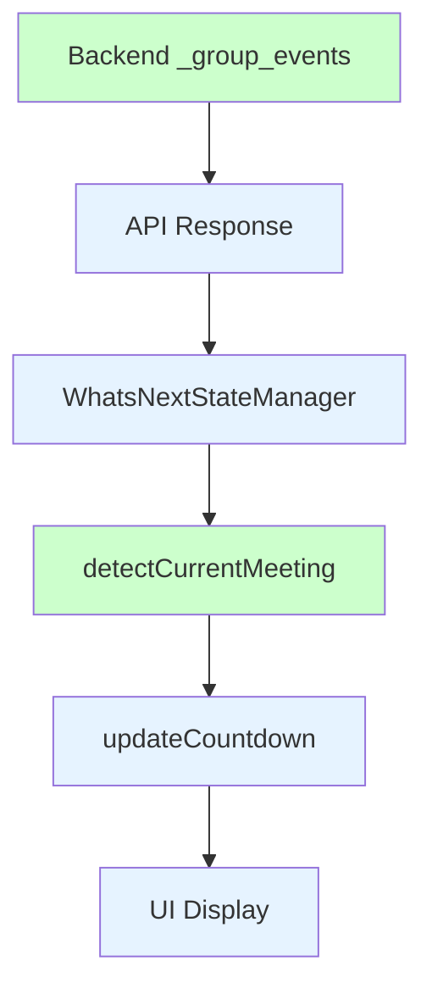

# Frontend Meeting Selection Algorithm Changes

## Target: `detectCurrentMeeting()` Function (Lines 419-442)

### Current Issue
```javascript
// Check if meeting is currently happening
if (now >= meetingStart && now <= meetingEnd) {
    currentMeeting = meeting;
    break;  // WRONG: exits early, prioritizes current over next
}

// Check if meeting is upcoming
if (meetingStart > now) {
    currentMeeting = meeting;
    break;
}
```
**Problem**: Prioritizes current meetings over next meetings, contradicting requirements

### Solution Strategy

#### 1. Replace Priority Logic
**Current Logic**:
- Check each meeting in order
- If current meeting found, select it and exit
- If upcoming meeting found, select it and exit

**New Logic**:
- Collect all upcoming meetings (not started yet)
- If upcoming meetings exist, select earliest one
- Only fallback to current meeting if no upcoming meetings

#### 2. New Algorithm Implementation

**Step 1: Create Next-Priority Meeting Detection**
```javascript
function detectCurrentMeeting() {
    const now = getCurrentTime();
    currentMeeting = null;
    
    // PHASE 1: Find all upcoming meetings (chronologically next priority)
    const upcomingMeetings = [];
    const currentMeetings = [];
    
    for (const meeting of upcomingMeetings) {
        if (meeting.is_hidden) continue; // Skip hidden events
        
        const meetingStart = new Date(meeting.start_time);
        const meetingEnd = new Date(meeting.end_time);
        
        if (meetingStart > now) {
            // Meeting is upcoming (not started yet)
            upcomingMeetings.push({
                meeting: meeting,
                start: meetingStart
            });
        } else if (now >= meetingStart && now <= meetingEnd) {
            // Meeting is currently happening
            currentMeetings.push({
                meeting: meeting,
                start: meetingStart
            });
        }
    }
    
    // PHASE 2: Select meeting with correct priority
    if (upcomingMeetings.length > 0) {
        // Priority 1: Next upcoming meeting (chronologically earliest)
        upcomingMeetings.sort((a, b) => a.start - b.start);
        currentMeeting = upcomingMeetings[0].meeting;
    } else if (currentMeetings.length > 0) {
        // Priority 2: Current meeting (only if no upcoming meetings)
        currentMeetings.sort((a, b) => a.start - b.start);
        currentMeeting = currentMeetings[0].meeting;
    }
    // Priority 3: No meetings (currentMeeting remains null)
    
    updateMeetingDisplayOptimized();
}
```

#### 3. Integration with WhatsNextStateManager

**Update State Manager Integration** (Lines 1794-1807):
The WhatsNextStateManager already implements similar logic in `_updateLegacyGlobalState()`, but we need to ensure consistency:

```javascript
// In WhatsNextStateManager._updateLegacyGlobalState() 
// Update to match new frontend priority logic
for (const meeting of upcomingMeetings) {
    const meetingStart = new Date(meeting.start_time);
    const meetingEnd = new Date(meeting.end_time);

    // Priority 1: Check if meeting is upcoming (not started yet)
    if (meetingStart > now) {
        currentMeeting = meeting;
        break; // Select first (earliest) upcoming meeting
    }
}

// Priority 2: Fallback to current meeting if no upcoming meetings
if (!currentMeeting) {
    for (const meeting of upcomingMeetings) {
        const meetingStart = new Date(meeting.start_time);
        const meetingEnd = new Date(meeting.end_time);
        
        if (now >= meetingStart && now <= meetingEnd) {
            currentMeeting = meeting;
            break;
        }
    }
}
```

#### 4. Countdown Timer Integration

**Update Countdown Logic** (Lines 565-578):
```javascript
// In updateCountdown() function
if (now >= meetingStart && now <= meetingEnd) {
    // Meeting is happening now - show time until end
    timeRemaining = meetingEnd - now;
    labelText = 'Current Meeting Ends';
} else if (meetingStart > now) {
    // Meeting is upcoming - show time until start  
    timeRemaining = meetingStart - now;
    labelText = 'Next Meeting Starts';
} else {
    // Meeting has passed - trigger re-detection
    detectCurrentMeeting();
    return;
}
```

#### 5. Preserve Existing Features

**Hidden Events Filtering**:
- Maintain `meeting.is_hidden` checks
- Preserve WhatsNextStateManager's optimistic updates for hidden events

**Performance Optimizations**:
- Keep existing DOM caching (`DOMCache`)
- Maintain incremental DOM updates
- Preserve countdown optimization patterns

**Timezone Handling**:
- Use existing `getCurrentTime()` function
- Maintain timezone-aware time calculations
- Preserve hybrid time calculation logic

#### 6. Data Flow Consistency

**Ensure Backend-Frontend Alignment**:


**Key Alignment Points**:
1. Backend returns primary meeting (next or current) in first position
2. Frontend detectCurrentMeeting() applies same priority logic  
3. State manager keeps backend and frontend in sync
4. Countdown timer works with selected meeting

### Implementation Benefits

1. **Consistent Logic**: Frontend matches backend priority algorithm
2. **Maintains Performance**: Preserves existing optimization patterns
3. **Preserves Features**: Hidden events, timezone handling, DOM caching
4. **Clear Separation**: Meeting selection vs display logic separation
5. **Testable**: Isolated meeting detection for unit testing

### Risk Mitigation

1. **State Synchronization**: Ensure WhatsNextStateManager consistency
2. **Countdown Issues**: Verify countdown works with next meeting start times
3. **UI Updates**: Maintain incremental DOM update patterns
4. **Global Variables**: Preserve backward compatibility for `currentMeeting`

### Testing Requirements

1. **Unit Tests for `detectCurrentMeeting()`**:
   - Next meeting available: selects next meeting
   - No upcoming meetings: selects current meeting
   - No meetings: sets currentMeeting to null
   - Hidden events properly filtered

2. **Integration Tests**:
   - State manager and detectCurrentMeeting() consistency
   - Countdown timer integration with new logic
   - DOM updates work with new meeting selection

3. **Browser Tests**:
   - Meeting transitions handle priority correctly
   - UI displays next meeting information
   - Countdown shows time to next meeting start

### Dependencies

**Must Complete Before**:
- Backend `_group_events()` changes
- Unit tests for new frontend logic

**Must Complete After**:
- Integration testing between backend and frontend
- Browser testing for countdown functionality
- End-to-end testing for meeting transitions