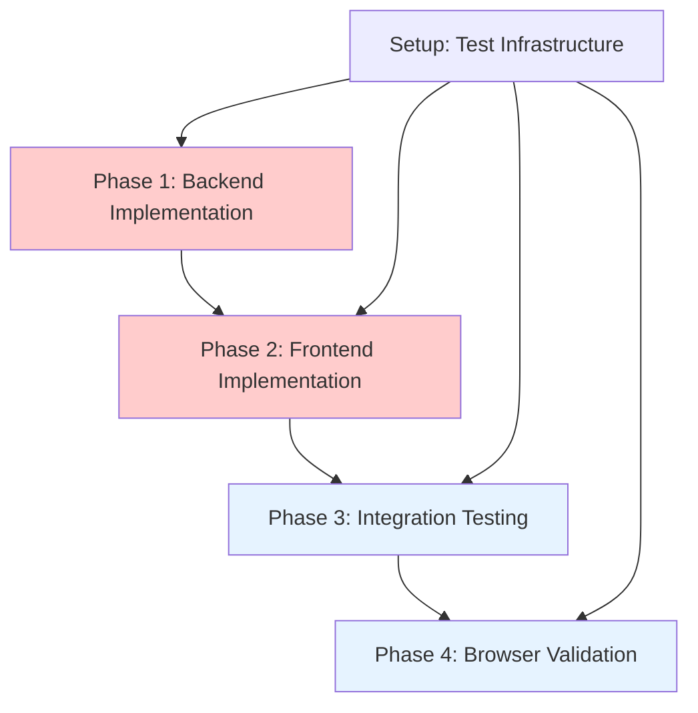

# Implementation Task Breakdown with Dependencies

## Overview

Detailed implementation plan for transitioning WhatsnextView from current meeting priority to next meeting priority logic. Tasks organized by phase with clear dependencies and deliverables.

## Implementation Phases

## Task Breakdown

### Setup Phase

#### Task S1: Test Infrastructure Setup
**Effort**: 2 hours  
**Dependencies**: None  
**Owner**: Development Team  

**Deliverables**:
- Configure test fixtures for meeting scenarios (upcoming, current, hidden)
- Set up mock services for calendar and settings
- Configure Playwright MCP for browser testing
- Prepare test data sets for various edge cases

**Acceptance Criteria**:
- [ ] Test fixtures cover all meeting priority scenarios
- [ ] Mock services provide consistent test data
- [ ] Playwright MCP browser testing ready
- [ ] Test environment isolated and repeatable

### Phase 1: Backend Implementation

#### Task 1.1: Replace _group_events() Method Logic
**Effort**: 3-4 hours  
**Dependencies**: Task S1  
**Owner**: Backend Developer  
**File**: `calendarbot/display/whats_next_logic.py` (lines 90-137)

**Deliverables**:
- Replace current meeting priority with next meeting priority
- Leverage existing `find_next_upcoming_event()` method for consistency
- Maintain all existing method signatures and return types
- Add comprehensive type annotations and docstrings

**Implementation Steps**:
1. Extract meeting selection logic into private `_find_primary_meeting()` method
2. Update `_group_events()` to prioritize next meetings over current meetings
3. Verify hidden events filtering integration works correctly
4. Add error handling and logging for edge cases
5. Update method docstrings with new behavior

**Acceptance Criteria**:
- [ ] Next meetings prioritized over current meetings in return tuple
- [ ] Hidden events filtering works correctly
- [ ] Method signature unchanged: `tuple[list[CachedEvent], list[CachedEvent], list[CachedEvent]]`
- [ ] All type annotations complete and correct
- [ ] Performance equal or better than current implementation

#### Task 1.2: Backend Unit Tests
**Effort**: 3 hours  
**Dependencies**: Task 1.1  
**Owner**: Backend Developer  
**File**: `tests/test_whats_next_logic.py`

**Deliverables**:
- Comprehensive unit tests for new `_group_events()` logic
- Test coverage for all meeting priority scenarios
- Edge case testing (no meetings, all hidden, timezone boundaries)
- Performance regression tests

**Test Categories**:
- Priority logic tests (next > current meeting selection)
- Hidden events filtering tests
- Edge cases (empty datasets, malformed data)
- Error handling tests
- Performance benchmarks

**Acceptance Criteria**:
- [ ] 100% code coverage for modified methods
- [ ] All priority scenarios tested (next > current)
- [ ] Edge case tests pass
- [ ] Performance tests show no degradation
- [ ] All tests use consistent fixtures

### Phase 2: Frontend Implementation

#### Task 2.1: Replace detectCurrentMeeting() Function Logic
**Effort**: 2-3 hours  
**Dependencies**: Task 1.1 (can run parallel)  
**Owner**: Frontend Developer  
**File**: `calendarbot/web/static/layouts/whats-next-view/whats-next-view.js` (lines 1794-1807)

**Deliverables**:
- Replace current meeting detection with next meeting priority logic
- Update countdown timer logic for both next and current meetings
- Ensure consistency with backend priority algorithm
- Maintain all existing global variable interfaces

**Implementation Steps**:
1. Rewrite `detectCurrentMeeting()` with next meeting priority
2. Update `updateCountdown()` to handle next meetings (time until start) and current meetings (time until end)
3. Ensure `WhatsNextStateManager._updateLegacyGlobalState()` consistency
4. Add error handling for edge cases
5. Verify real-time update compatibility

**Acceptance Criteria**:
- [ ] Next meetings prioritized over current meetings
- [ ] Hidden events (`is_hidden` flag) properly filtered
- [ ] Countdown timer shows correct time for both meeting types
- [ ] No breaking changes to global variables
- [ ] WhatsNextStateManager integration functional

#### Task 2.2: Frontend Unit Tests
**Effort**: 2 hours  
**Dependencies**: Task 2.1  
**Owner**: Frontend Developer  
**File**: `tests/test_whats_next_view.py`

**Deliverables**:
- Unit tests for new `detectCurrentMeeting()` function
- Countdown timer behavior tests for both meeting types
- State manager integration tests
- Mock data scenarios for various meeting configurations

**Acceptance Criteria**:
- [ ] 100% code coverage for modified functions
- [ ] Frontend matches backend priority logic verification
- [ ] Countdown timer tests for next and current meetings
- [ ] State manager consistency tests
- [ ] Error handling and edge case tests

### Phase 3: Integration Testing

#### Task 3.1: Backend-Frontend Consistency Validation
**Effort**: 2 hours  
**Dependencies**: Task 1.2, Task 2.2  
**Owner**: QA Engineer  
**File**: `tests/test_integration_meeting_selection.py`

**Deliverables**:
- Backend-frontend consistency validation tests
- API contract compliance testing
- Real-time update coordination testing
- Error recovery testing across components

**Acceptance Criteria**:
- [ ] Backend and frontend select identical meetings in all scenarios
- [ ] API responses match frontend expectations
- [ ] Real-time updates maintain consistency
- [ ] Error recovery works across components
- [ ] Hidden events handled consistently across layers

### Phase 4: Browser Validation

#### Task 4.1: End-to-End Browser Testing
**Effort**: 3 hours  
**Dependencies**: Task 3.1  
**Owner**: QA Engineer  
**Tools**: Playwright MCP

**Deliverables**:
- Playwright MCP browser automation tests
- Visual regression testing
- User interaction scenario testing
- Cross-browser compatibility validation

**Test Scenarios**:
- Next meeting display when available
- Current meeting fallback when no next meetings
- Countdown timer accuracy for both meeting types
- Hide/unhide meeting functionality
- Auto-refresh behavior validation
- Meeting transition testing

**Acceptance Criteria**:
- [ ] UI correctly displays next meetings when available
- [ ] UI falls back to current meetings appropriately
- [ ] Countdown timer displays accurate times
- [ ] Hide/unhide meeting functionality works
- [ ] Auto-refresh maintains correct selection
- [ ] Visual layout consistent (480×800 display)
- [ ] No console errors or JavaScript exceptions

## Timeline & Resource Allocation

### Estimated Timeline
- **Setup Phase**: 0.5 day
- **Phase 1**: 1 day (Backend implementation + tests)
- **Phase 2**: 1 day (Frontend implementation + tests)  
- **Phase 3**: 0.5 day (Integration testing)
- **Phase 4**: 0.5 day (Browser validation)
- **Total**: 3.5 business days

### Resource Requirements
- **Backend Developer**: 1 person, 6-7 hours
- **Frontend Developer**: 1 person, 4-5 hours
- **QA Engineer**: 1 person, 5 hours
- **Total Team Effort**: 15-17 hours

## Risk Mitigation

### Technical Risks
- **Backend Logic Complexity**: Mitigated by leveraging existing `find_next_upcoming_event()` method
- **Frontend State Synchronization**: Mitigated by maintaining existing global variable contracts
- **Testing Coverage Gaps**: Mitigated by comprehensive test strategy and fixtures
- **Performance Impact**: Mitigated by reusing proven algorithms and performance testing

### Timeline Risks
- **Dependencies**: Backend implementation can run parallel with frontend to reduce timeline
- **Testing Delays**: Automated testing with clear acceptance criteria reduces manual testing time
- **Integration Issues**: Early integration testing catches issues before browser validation

### Rollback Strategy
- Keep current implementation as backup branch
- All changes are direct replacements (no migration logic)
- Immediate rollback capability within minutes
- No database state changes (stateless application)

## Success Metrics

### Functional Success
✅ **Next meeting priority working**: System prioritizes next meetings over current meetings  
✅ **UI consistency maintained**: No visual regressions or layout issues  
✅ **Real-time updates functional**: Auto-refresh and manual refresh work correctly  
✅ **Hidden events handled**: Hide/unhide functionality works as expected  

### Technical Success
✅ **Test coverage achieved**: 100% coverage for new code  
✅ **Performance maintained**: No degradation from current implementation  
✅ **Integration verified**: Backend-frontend consistency confirmed  
✅ **Browser validation passed**: All user interaction scenarios work  

### Business Success
✅ **User requirements met**: Next meetings are consistently displayed  
✅ **Zero regressions**: No functionality lost during implementation  
✅ **Quality maintained**: Code quality standards met  
✅ **Documentation complete**: All changes documented and reviewed

## Implementation Notes

### Code Quality Requirements
- All new code must include comprehensive type annotations
- Docstrings required for all modified methods
- Error handling for all edge cases
- Logging for debugging and monitoring
- Code review approval required before merge

### Testing Standards
- Unit tests must achieve 100% coverage for modified code
- Integration tests must verify backend-frontend consistency
- Browser tests must cover all user interaction scenarios
- Performance tests must establish baseline and prevent regression

### Deployment Approach
- Direct replacement strategy (no feature flags needed)
- Comprehensive testing before deployment
- Health check validation post-deployment
- Immediate rollback capability if issues detected