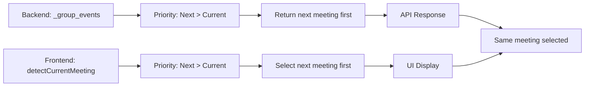

# Integration Points Between Backend and Frontend Changes

## Overview

Since this is a stateless application with no backward compatibility requirements, we can directly replace the existing meeting selection logic in both backend and frontend components. The integration focuses on ensuring both layers implement identical "next meeting priority" logic.

## Simple Integration Strategy

### 1. Direct Logic Replacement



**Implementation Approach**:
- Replace backend `_group_events()` logic completely
- Replace frontend `detectCurrentMeeting()` logic completely  
- Both implement identical priority: upcoming meetings before current meetings
- No compatibility layers needed

### 2. Backend Changes

**File**: `calendarbot/display/whats_next_logic.py`

**Current Problem** (line 137):
```python
return current_events[:1], upcoming_events, later_events
```

**New Logic**:
```python
def _group_events(self, events: list[CachedEvent]) -> tuple[list[CachedEvent], list[CachedEvent], list[CachedEvent]]:
    # Filter hidden events
    visible_events = [e for e in events if e.graph_id not in self.hidden_events]
    
    # Find next meeting using existing logic
    next_meeting = self.find_next_upcoming_event(visible_events)
    
    # Group events with next meeting priority
    if next_meeting:
        primary_events = [next_meeting]
        remaining_events = [e for e in visible_events if e != next_meeting]
        upcoming_events = [e for e in remaining_events if e.start_dt > self.current_time]
        later_events = [e for e in remaining_events if e.start_dt <= self.current_time]
    else:
        primary_events = []
        upcoming_events = [e for e in visible_events if e.start_dt > self.current_time]
        later_events = [e for e in visible_events if e.start_dt <= self.current_time]
    
    return primary_events, upcoming_events, later_events
```

### 3. Frontend Changes

**File**: `calendarbot/web/static/layouts/whats-next-view/whats-next-view.js`

**Current Problem** (lines 1794-1807):
- Prioritizes current meetings over next meetings

**New Logic**:
```javascript
function detectCurrentMeeting() {
    if (!upcomingMeetings || upcomingMeetings.length === 0) {
        currentMeeting = null;
        return;
    }

    const now = getCurrentTime();
    let nextMeeting = null;
    let fallbackCurrentMeeting = null;

    // Priority 1: Find next upcoming meeting
    for (const meeting of upcomingMeetings) {
        if (meeting.is_hidden) continue;
        
        const meetingStart = new Date(meeting.start_time);
        const meetingEnd = new Date(meeting.end_time);
        
        if (meetingStart > now) {
            if (!nextMeeting || meetingStart < new Date(nextMeeting.start_time)) {
                nextMeeting = meeting;
            }
        } else if (now >= meetingStart && now <= meetingEnd) {
            if (!fallbackCurrentMeeting) {
                fallbackCurrentMeeting = meeting;
            }
        }
    }

    // Select next meeting if available, otherwise current meeting
    currentMeeting = nextMeeting || fallbackCurrentMeeting;
}
```

### 4. Countdown Timer Integration

**Current Issue**: Timer logic needs to handle both next and current meetings correctly

**Updated Logic**:
```javascript
function updateCountdown() {
    if (!currentMeeting) {
        // No meeting to countdown to
        return;
    }

    const now = getCurrentTime();
    const meetingStart = new Date(currentMeeting.start_time);
    const meetingEnd = new Date(currentMeeting.end_time);

    if (meetingStart > now) {
        // Next meeting - countdown to start
        const timeUntilStart = meetingStart - now;
        displayCountdown(timeUntilStart, 'until next meeting');
    } else if (now >= meetingStart && now <= meetingEnd) {
        // Current meeting - countdown to end
        const timeUntilEnd = meetingEnd - now;
        displayCountdown(timeUntilEnd, 'until meeting ends');
    } else {
        // Meeting has ended - trigger refresh
        detectCurrentMeeting();
    }
}
```

### 5. State Management Simplification

**WhatsNextStateManager Integration**:
- Receives data from backend via `/api/whats-next/data`
- Updates global `upcomingMeetings` array
- Calls `detectCurrentMeeting()` to apply frontend logic
- No compatibility concerns - direct replacement

```javascript
async loadData() {
    const response = await fetch('/api/whats-next/data');
    const data = await response.json();
    
    // Direct assignment - no compatibility needed
    upcomingMeetings = data.events || [];
    
    // Apply new meeting selection logic
    detectCurrentMeeting();
    updateCountdown();
}
```

## Implementation Order

### Phase 1: Backend Implementation
1. **Replace `_group_events()` method completely**
2. **Test with existing frontend** (should work since data structures remain the same)
3. **Verify next meetings are prioritized in API responses**

### Phase 2: Frontend Implementation  
1. **Replace `detectCurrentMeeting()` function completely**
2. **Update countdown timer logic**
3. **Test frontend logic independently**

### Phase 3: Integration Validation
1. **End-to-end testing of complete system**
2. **Verify consistent meeting selection across layers**
3. **Test real-time updates and transitions**

## Key Simplifications

### No Data Structure Preservation
- Can modify API response format if needed
- Can change internal data structures freely
- No backward compatibility requirements

### No Migration Logic
- Direct replacement of existing logic
- No transitional states needed
- No version handling required

### Stateless Operation
- No persistence concerns
- No state migration between versions
- Fresh data on every request

## Testing Requirements

### Backend Tests
- New `_group_events()` logic
- Meeting priority ordering
- Hidden events filtering
- Edge cases (no meetings, all hidden, etc.)

### Frontend Tests
- New `detectCurrentMeeting()` logic
- Countdown timer integration
- State manager updates
- UI responsiveness

### Integration Tests
- Backend + frontend consistency
- Real-time update coordination
- Error handling across layers
- Browser UI validation

## Success Criteria

✅ **Next Meeting Priority**: System always shows next meeting when available
✅ **Logic Consistency**: Backend and frontend select identical meetings
✅ **Countdown Accuracy**: Timer shows correct time for selected meeting type
✅ **Real-time Updates**: System updates correctly as meetings transition
✅ **Error Resilience**: System handles edge cases gracefully