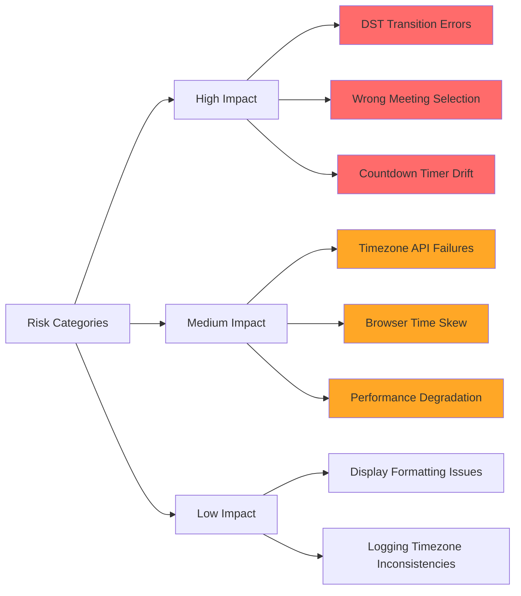

# Risk Mitigation: Timezone and Countdown Functionality

## Overview

Comprehensive risk mitigation strategy for timezone handling and countdown timer functionality in the meeting selection logic. This document identifies potential failure points, defines mitigation strategies, and establishes monitoring mechanisms.

## Risk Assessment Matrix



## High Impact Risks

### Risk 1: DST Transition Errors

**Description**: Meeting selection fails during Daylight Saving Time transitions
**Impact**: Incorrect meetings displayed, countdown timers show wrong values
**Probability**: Medium (occurs 2x per year)

**Scenarios**:
- Spring forward: 2:00 AM → 3:00 AM (lost hour)
- Fall back: 3:00 AM → 2:00 AM (repeated hour)
- Meetings scheduled during transition periods

**Mitigation Strategy**:
```python
# Backend: UTC Normalization with DST Handling
def _safe_timezone_conversion(self, dt: datetime, user_timezone: str) -> datetime:
    """Convert datetime to UTC with explicit DST handling."""
    try:
        user_tz = pytz.timezone(user_timezone)
        
        if dt.tzinfo is None:
            # Handle ambiguous/non-existent times during DST transitions
            try:
                localized_dt = user_tz.localize(dt, is_dst=None)
            except pytz.AmbiguousTimeError:
                # Fall-back: assume first occurrence (standard time)
                localized_dt = user_tz.localize(dt, is_dst=False)
                logger.warning(f"Ambiguous time during DST transition: {dt}, using standard time")
            except pytz.NonExistentTimeError:
                # Spring-forward: advance to next valid hour
                adjusted_dt = dt + timedelta(hours=1)
                localized_dt = user_tz.localize(adjusted_dt, is_dst=True)
                logger.warning(f"Non-existent time during DST transition: {dt}, adjusted to {adjusted_dt}")
        else:
            localized_dt = dt.astimezone(user_tz)
        
        return localized_dt.astimezone(pytz.UTC)
    
    except Exception as e:
        logger.error(f"Timezone conversion failed: {e}, falling back to UTC")
        return dt.replace(tzinfo=pytz.UTC) if dt.tzinfo is None else dt.astimezone(pytz.UTC)
```

**Frontend Mitigation**:
```javascript
function safeDateConversion(dateString, userTimezone) {
    try {
        // Use Intl.DateTimeFormat for robust timezone handling
        const date = new Date(dateString);
        
        // Validate the conversion was successful
        if (isNaN(date.getTime())) {
            throw new Error('Invalid date string');
        }
        
        return date;
    } catch (error) {
        logger.error('Date conversion failed:', error);
        // Fallback to current time
        return new Date();
    }
}
```

**Testing Requirements**:
- Simulate DST transition dates in multiple timezones
- Test meeting selection before, during, and after transitions
- Verify countdown timer accuracy across transitions

### Risk 2: Wrong Meeting Selection Due to Timezone Errors

**Description**: Backend and frontend calculate different "current time" leading to inconsistent meeting selection
**Impact**: User sees wrong meeting, countdown timer for wrong meeting
**Probability**: Low-Medium

**Root Causes**:
- Server and client system clocks out of sync
- Timezone data inconsistencies
- Race conditions during time calculations

**Mitigation Strategy**:
```python
# Backend: Centralized Time Authority
class TimeService:
    def __init__(self, user_timezone: str):
        self.user_timezone = user_timezone
        self._timezone_cache = {}
    
    def get_current_time_utc(self) -> datetime:
        """Get authoritative current time in UTC."""
        return datetime.now(pytz.UTC)
    
    def get_current_time_user(self) -> datetime:
        """Get current time in user's timezone."""
        utc_time = self.get_current_time_utc()
        return self._convert_to_user_timezone(utc_time)
    
    def normalize_event_time(self, event_time: datetime) -> datetime:
        """Normalize event time to UTC for comparison."""
        return self._safe_timezone_conversion(event_time, self.user_timezone)
```

**Frontend Time Synchronization**:
```javascript
class TimeSynchronizer {
    constructor() {
        this.serverTimeOffset = 0;
        this.lastSyncTime = null;
        this.syncInterval = 5 * 60 * 1000; // 5 minutes
    }
    
    async synchronizeWithServer() {
        try {
            const syncStart = Date.now();
            const response = await fetch('/api/time/current');
            const syncEnd = Date.now();
            
            const serverTime = new Date(await response.text());
            const networkDelay = (syncEnd - syncStart) / 2;
            const adjustedServerTime = serverTime.getTime() + networkDelay;
            
            this.serverTimeOffset = adjustedServerTime - syncEnd;
            this.lastSyncTime = syncEnd;
            
            logger.info(`Time synchronized: offset=${this.serverTimeOffset}ms`);
        } catch (error) {
            logger.error('Time synchronization failed:', error);
        }
    }
    
    getCurrentTime() {
        const clientTime = Date.now();
        return new Date(clientTime + this.serverTimeOffset);
    }
}
```

### Risk 3: Countdown Timer Drift and Inaccuracy

**Description**: Countdown timer becomes inaccurate over time, shows wrong values
**Impact**: User confusion, loss of trust in system accuracy
**Probability**: Medium

**Causes**:
- JavaScript timer drift
- Browser throttling background tabs
- System clock adjustments
- Network latency affecting updates

**Mitigation Strategy**:
```javascript
class AccurateCountdownTimer {
    constructor(targetTime, onUpdate, onComplete) {
        this.targetTime = targetTime;
        this.onUpdate = onUpdate;
        this.onComplete = onComplete;
        this.intervalId = null;
        this.lastUpdateTime = null;
        this.driftCorrection = 0;
    }
    
    start() {
        this.lastUpdateTime = Date.now();
        this.update();
        
        // Use 100ms intervals for smooth updates with drift correction
        this.intervalId = setInterval(() => this.update(), 100);
    }
    
    update() {
        const now = getCurrentTime(); // From TimeSynchronizer
        const currentTime = now.getTime();
        
        // Calculate drift and apply correction
        if (this.lastUpdateTime) {
            const expectedInterval = 100; // 100ms
            const actualInterval = currentTime - this.lastUpdateTime;
            this.driftCorrection += (expectedInterval - actualInterval);
        }
        
        const adjustedTime = currentTime + this.driftCorrection;
        const timeRemaining = this.targetTime.getTime() - adjustedTime;
        
        if (timeRemaining <= 0) {
            this.stop();
            this.onComplete();
            return;
        }
        
        this.onUpdate(timeRemaining);
        this.lastUpdateTime = currentTime;
        
        // Reset drift correction if it gets too large
        if (Math.abs(this.driftCorrection) > 1000) {
            this.driftCorrection = 0;
        }
    }
    
    stop() {
        if (this.intervalId) {
            clearInterval(this.intervalId);
            this.intervalId = null;
        }
    }
}
```

## Medium Impact Risks

### Risk 4: Timezone API Failures

**Description**: External timezone services become unavailable
**Impact**: Fallback to less accurate timezone handling
**Probability**: Low

**Mitigation Strategy**:
- **Primary**: Use browser's built-in `Intl.DateTimeFormat` API
- **Secondary**: Maintain cached timezone data
- **Fallback**: Use UTC with user-configured offset

```javascript
class TimezoneService {
    constructor() {
        this.timezoneCache = new Map();
        this.fallbackOffset = null;
    }
    
    async getTimezone() {
        try {
            // Primary: Browser API
            return Intl.DateTimeFormat().resolvedOptions().timeZone;
        } catch (error) {
            logger.warn('Browser timezone API failed, using fallback');
            
            // Secondary: Cached timezone
            const cached = this.timezoneCache.get('user_timezone');
            if (cached) return cached;
            
            // Tertiary: UTC offset calculation
            const offset = new Date().getTimezoneOffset();
            return this.offsetToTimezone(offset);
        }
    }
}
```

### Risk 5: Browser Time Skew

**Description**: User's system clock is significantly wrong
**Impact**: All time calculations become incorrect
**Probability**: Medium

**Detection and Mitigation**:
```javascript
async function detectTimeSkew() {
    try {
        const clientTime = Date.now();
        const response = await fetch('/api/time/current');
        const serverTime = new Date(await response.text()).getTime();
        
        const skew = Math.abs(clientTime - serverTime);
        const skewThreshold = 5 * 60 * 1000; // 5 minutes
        
        if (skew > skewThreshold) {
            logger.warn(`Significant time skew detected: ${skew}ms`);
            
            // Display warning to user
            showTimeSkewWarning(skew);
            
            // Use server time for all calculations
            return serverTime - clientTime;
        }
        
        return 0;
    } catch (error) {
        logger.error('Time skew detection failed:', error);
        return 0;
    }
}
```

## Low Impact Risks

### Risk 6: Display Formatting Issues

**Description**: Time displays in unexpected formats
**Impact**: User confusion but no functional impact
**Probability**: Low

**Mitigation**:
- Standardize on ISO 8601 formats for internal use
- Use consistent display formatting across UI
- Provide fallback formatting functions

## Monitoring and Alerting

### Key Metrics to Monitor

1. **Timezone Conversion Errors**
   - Rate of DST transition handling
   - Timezone API failure rates
   - Time synchronization drift

2. **Countdown Timer Accuracy**
   - Timer drift measurements
   - Update frequency degradation
   - User-reported time discrepancies

3. **Meeting Selection Consistency**
   - Backend vs frontend meeting selection mismatches
   - Time-based selection errors
   - Edge case occurrences

### Monitoring Implementation

```python
# Backend Monitoring
class TimezoneMetrics:
    def __init__(self):
        self.dst_transitions_handled = 0
        self.timezone_conversion_errors = 0
        self.time_sync_requests = 0
        
    def log_dst_transition(self, user_timezone: str, original_time: datetime, adjusted_time: datetime):
        self.dst_transitions_handled += 1
        logger.info(f"DST transition handled: {user_timezone}, {original_time} -> {adjusted_time}")
        
    def log_timezone_error(self, error: Exception, timezone: str):
        self.timezone_conversion_errors += 1
        logger.error(f"Timezone conversion error: {timezone}, {error}")
        
    def get_metrics(self) -> dict:
        return {
            'dst_transitions_handled': self.dst_transitions_handled,
            'timezone_conversion_errors': self.timezone_conversion_errors,
            'error_rate': self.timezone_conversion_errors / max(1, self.time_sync_requests)
        }
```

```javascript
// Frontend Monitoring
class TimingMetrics {
    constructor() {
        this.countdownDriftEvents = 0;
        this.timeSyncFailures = 0;
        this.meetingSelectionMismatches = 0;
    }
    
    logCountdownDrift(driftMs) {
        if (Math.abs(driftMs) > 1000) { // >1 second drift
            this.countdownDriftEvents++;
            logger.warn(`Countdown drift detected: ${driftMs}ms`);
        }
    }
    
    logTimeSyncFailure(error) {
        this.timeSyncFailures++;
        logger.error('Time sync failure:', error);
    }
    
    logMeetingMismatch(backendMeeting, frontendMeeting) {
        this.meetingSelectionMismatches++;
        logger.warn('Meeting selection mismatch:', {
            backend: backendMeeting?.id,
            frontend: frontendMeeting?.id
        });
    }
}
```

### Health Checks

```python
def timezone_health_check() -> dict:
    """Validate timezone functionality is working correctly."""
    try:
        # Test basic timezone conversion
        test_time = datetime.now()
        converted_time = safe_timezone_conversion(test_time, 'America/New_York')
        
        # Test DST transition handling
        dst_test_time = datetime(2024, 3, 10, 2, 30)  # Spring forward
        dst_converted = safe_timezone_conversion(dst_test_time, 'America/New_York')
        
        return {
            'status': 'healthy',
            'timezone_conversion': 'working',
            'dst_handling': 'working',
            'last_check': datetime.utcnow().isoformat()
        }
    except Exception as e:
        return {
            'status': 'unhealthy',
            'error': str(e),
            'last_check': datetime.utcnow().isoformat()
        }
```

## Testing Strategy for Risk Mitigation

### Unit Tests for Timezone Risks
- DST transition boundary conditions
- Invalid timezone handling
- Time conversion accuracy
- Countdown timer drift simulation

### Integration Tests
- Backend-frontend time synchronization
- Meeting selection consistency across timezones
- Real-time countdown accuracy
- Error recovery scenarios

### Stress Tests
- High-frequency time updates
- Multiple timezone conversions
- Long-running countdown timers
- Network interruption recovery

## Deployment Safeguards

### Pre-deployment Validation
1. **Timezone Database Updates**: Verify latest timezone data
2. **DST Rule Validation**: Test upcoming DST transitions
3. **Time Sync Verification**: Confirm server time accuracy
4. **Browser Compatibility**: Test across major browsers

### Gradual Rollout Strategy
1. **Canary Deployment**: Deploy to 5% of users first
2. **Monitor Key Metrics**: Watch for timezone-related errors
3. **Automatic Rollback**: Trigger if error rates exceed thresholds
4. **Full Deployment**: Only after 24-hour validation period

## Recovery Procedures

### Incident Response for Timezone Issues

1. **Detection**: Monitoring alerts on timezone conversion errors
2. **Immediate Response**: Switch to fallback UTC-based calculations
3. **Investigation**: Identify root cause (DST, API failure, etc.)
4. **Resolution**: Apply appropriate fix based on cause
5. **Validation**: Verify fix across affected timezones
6. **Post-incident**: Update monitoring and testing for prevention

### User Communication During Issues
- Clear messaging about temporary time display issues
- Fallback to UTC display with timezone notation
- Estimated resolution timeframes
- Alternative ways to verify meeting times

## Success Metrics

✅ **Timezone Conversion Accuracy**: >99.9% successful conversions  
✅ **DST Transition Handling**: Zero failed transitions during DST periods  
✅ **Countdown Timer Accuracy**: <1 second drift over 1-hour periods  
✅ **Time Synchronization**: <5 second skew between backend and frontend  
✅ **Error Recovery**: <30 second recovery time from timezone API failures  
✅ **User Impact**: Zero user-reported time-related issues  

This comprehensive risk mitigation strategy ensures reliable timezone handling and countdown functionality across all edge cases and failure scenarios.